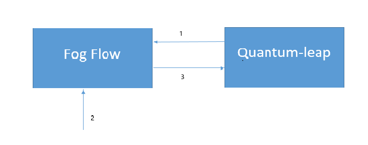

*****************************************
Integrate FogFlow with Quantum-leap
*****************************************

`QuantumLeap`_ is a REST service for storing, querying and retrieving NGSI v2 spatial-temporal data . QuantumLeap converts NGSI semi-structured data into tabular format and stores it in a time-series database.

.. _`QuantumLeap`: https://quantumleap.readthedocs.io/en/latest/

The figure below shows the integration of fogflow with QUANTUMLEAP

1. User sends a subscription request to the FogFlow-Broker in ngsiv2.
2. User will send the update request to the FogFlowlow-Broker in ngsiv1.
3. FogFlow Broker will notify to the Quantum-leap IN ngsiv2 .

Integration steps
===============================================

**Pre-Requisites:**

* Fogflow should be up and running with atleast one node.
* Quantumleap should be up and running with atleast one node.

**Send subscription request** to Fogflow Broker for Quantum-leap 

.. code-block:: console

	curl -iX POST \
	'http://<FogFlow Broker>:8070/v2/subscriptions' \
	 -H 'Content-Type: application/json' \
	 -d '
 	{
	"description": "A subscription to get info about Room1",
	"subject": {
		"entities": [{
			"id": "Room1",
			"type": "Room1",
			"isPattern": false
		}],
		"condition": {
			"attrs": [
				"temperature"
			]
		}
	},
	"notification": {
		"http": {
			"url": "http://<Quantum-leap-Host-IP>:8668/v2/notify"
		},
		"attrs": [
			"temperature"
		]
	},
	"expires": "2040-01-01T14:00:00.00Z",
	"throttling": 5
    }'

**Send update request** to Fogflow Broker with an entity of type and attributes defined in the above subscription. 
An example request is given below:

.. code-block:: console

	curl -iX POST \
  	'http://<Fogflow broker>:8070/ngsi10/updateContext' \
 	 -H 'Content-Type: application/json' \
  	-d '
      {
	"contextElements": [{
		"entityId": {
			"id": "Room1",
			"type": "Room1",
			"isPattern": false
		},
		"attributes": [{
			"name": "temperature",
			"type": "Integer",
			"value": 155
		}],
		"domainMetadata": [{
			"name": "location",
			"type": "point",
			"value": {
				"latitude": 49.406393,
				"longitude": 8.684208
			}
		}]
	}],
	"updateAction": "UPDATE"
     }'

**Fogflow Broker** will sends the notification to the Quantum-leap. verify result by below command

.. code-block:: console

	http://<QuantuLeap-Host-Ip>:8668/v2/entities/Room1/attrs/temperature

* result:

.. figure:: figures/QuantuleapOutput.png
