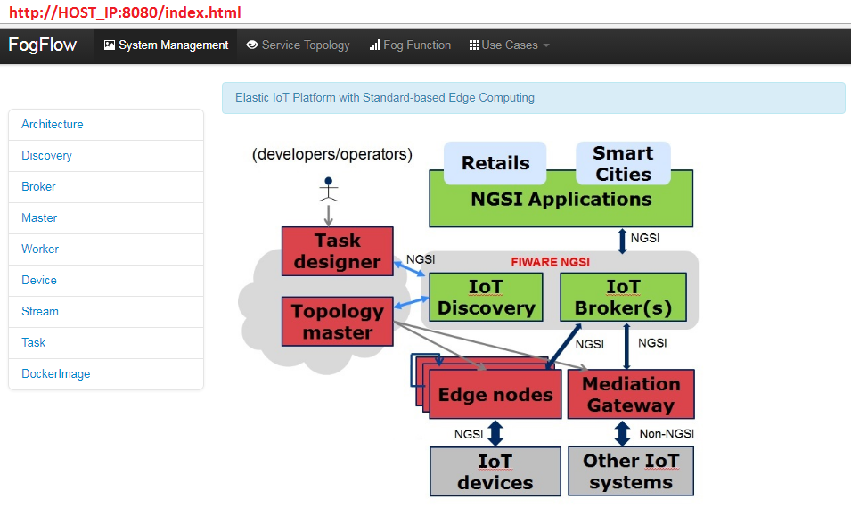
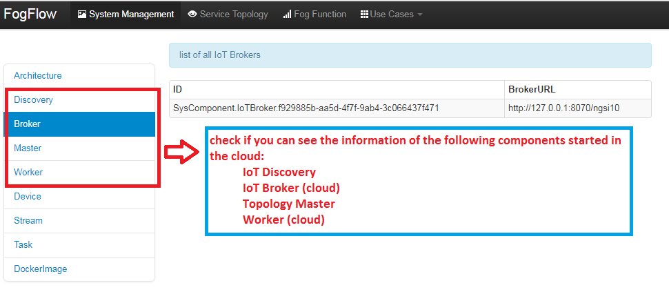

Start core components in the cloud
===========================================

Once the following docker images are generated at the local host, 
we can start all FogFlow core components in the cloud using docker-compose:

* **IoT Discovery**: fogflow/discovery
* **IoT Broker(cloud)**: fogflow/broker
* **Toplogy Master**: fogflow/master
* **Worker**: fogflow/worker
* **Task Designer**: fogflow/designer

Start the cloud part of FogFlow
-----------------------------------------------

please install Docker CE according to the information at https://www.digitalocean.com/community/tutorials/how-to-install-and-use-docker-on-ubuntu-16-04
and also Docker Compose according to the information at https://www.digitalocean.com/community/tutorials/how-to-install-docker-compose-on-ubuntu-16-04

	.. code-block:: bash
	
		# set the environment variable HOST_IP, which is the external IP address of your current machine
		export HOST_IP=AAA.BBB.CCC.DDD

		# go to the folder where the docker-compose.ymal is located
		cd fogflow/deployment/core 
  		docker-compose up

.. note:: HOST_IP needs to be accessible from any fog node where workers are running

Check the status of the FogFlow services in the cloud
------------------------------------------------------

Open the link http://HOST_IP:8080 in your browser to check the status of all FogFlow running components in the cloud. 

If everything goes well, you can see the following page from this link. 

Further more, you should be able to see the status of all core components running in the cloud, 
from the menu items on the left side of the System Management page. 

