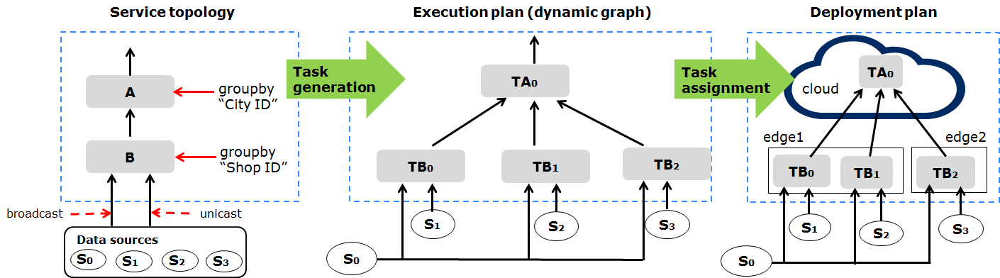

In this part of the document a conceptual overview of FogFlow and how to use FogFlow in developing any instance is being covered.
FogFlow is a cloud and edge environment to orchestrate dynamic `NGSI`_-based (Next Generation Service Interface - based) data processing
flows on-demand between producers and consumers for providing timely results to make fast actions. A context producer will be a sensor 
based device whereas a consumer is an Actuator device that will recieve command to perform some action.

.. _`NGSI`: https://knowage.readthedocs.io/en/6.1.1/user/NGSI/README/index.html

FogFlow can carry out IoT service orchestration decisions in a decentralized and autonomous manner. This means each FogFlow edge node can make its own decisions only based on a local context view. This way the majority of workloads can be directly handled at edges without always relying on the central cloud. With this "cloudless" approach, FogFlow can not only provide fast response time, but also achieve high scalability and reliability.

To define and trigger FogFlow based instances refer `Intent based programming model`_ part of this document.

.. _`Intent based programming model`: https://fogflow.readthedocs.io/en/latest/intent_based_program.html

Core concepts
======================

Operator
----------------------

In FogFlow an operator presents a type of data processing unit, 
which receives certain input streams as NGSI10 notify messages via a listening port,
processes the received data, generates certain results, and publishes the generated results as NGSI10 updates.   

The implementation of an operator is associated with at least one docker images. 
To support various hardware architectures (e.g., X86 and ARM for 64bits or 32 bits), 
the same operator can be associated with multiple docker images.  

Task
------------------

A task is a data structure to represent a logic data processing unit within a service topology. 
Each task is associated with an operator. 
A task is defined with the following properties:

- name: a unique name to present this task
- operator: the name of its associated operator
- groupBy: the granularity to control the unit of its task instances, which is used by service orchestrator to determine how many task instances must be created
- input_streams: the list of its selected input streams, each of which is identified by an entity type
- output_streams: the list of its generated output streams, each of which is identified by an entity type

In FogFlow, each input/output stream is represented as a type of NGSI context entities, 
which are usually generated and updated by either an endpoint device or a data processing task. 

During the runtime, multiple task instances can be created for the same task, 
according to its granularity defined by the *groupBy* property. 
In order to determine which input stream goes to which task instances, 
the following two properties are introduced to specify the input streams of tasks: 

- Shuffling: associated with each type of input stream for a task; its value can be either *broadcast* or *unicast*. 	

	- broadcast: the selected input streams should be repeatedly assigned to every task instance of this operator
	- unicast: each of the selected input streams should be assigned to a specific task instance only once
	
- Scoped: determines whether the geo-scope in the requirement should be applied to select the input streams; its value can be either *true* or *false*.

Task Instance
-----------------------

During the runtime, a task is configured by FogFlow with its input data and specified output type 
and then the configured task will be launched as a task instance, running in a docker container. 
Currently, each task instance is deployed in a dedicated docker container, either in the cloud or at an edge node. 

Service Template
-------------------------

Each IoT service is described by a service template, which can be a service topology with a set of linked operators
or a fog function with a single operator. For example, when a service topology is used to specify the service template, 
the following information will be included. 

- topology name: the unique name of the topology
- service description: some text to describe what this service is about
- priority: define the priority level of all tasks in the topology, which will be utilized by edge nodes to decide how resource should be assigned to tasks 
- resource usage: define if the tasks in this topology can use the resources on edge nodes in an exclusive way, meaning that not sharing resources with any task from the other topologies

Currently, FogFlow provides a graphical editor to allow developers to easily define and annotate their service topology or fog function during the design phrase.

Dynamic data flow 
-----------------------

On receiving a requirement, Topology Master creates a dataflow execution graph and then deploys them over the cloud and edges. 
The main procedure is illustrated by the following figure, including two major steps. 

- from *service topology* to *execution plan*: done by the task generation algorithm of Topology Master. 
	The generated execution plan includes:
	1) which part of service topology is triggered; 
	2) how many instances need to be created for each triggered task;
	3) and how each task instance should be configured with its input streams and output streams. 

- from *execution plan* to *deployment plan*: done by the task assignment algorithm of Topology Master.
	The generated deployment plan determines which task instance should be assigned to which worker (in the cloud or at edges),  
	according to certain optimization objectives. Currently, the task assignment in FogFlow is optimized to reduce across-node data traffic
	without overloading any edge node. 

