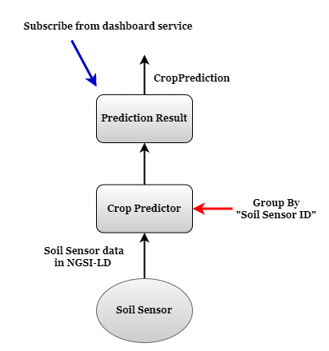
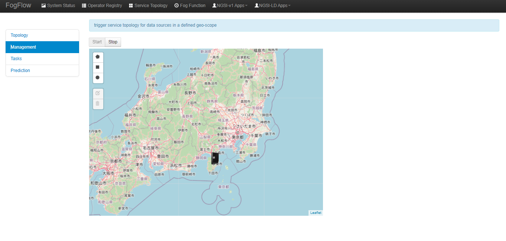
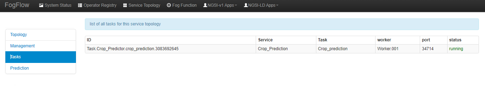
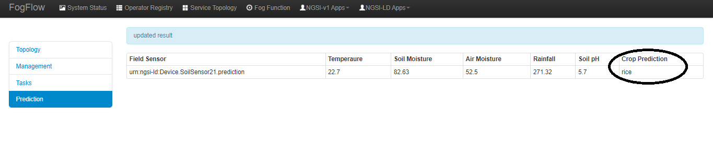
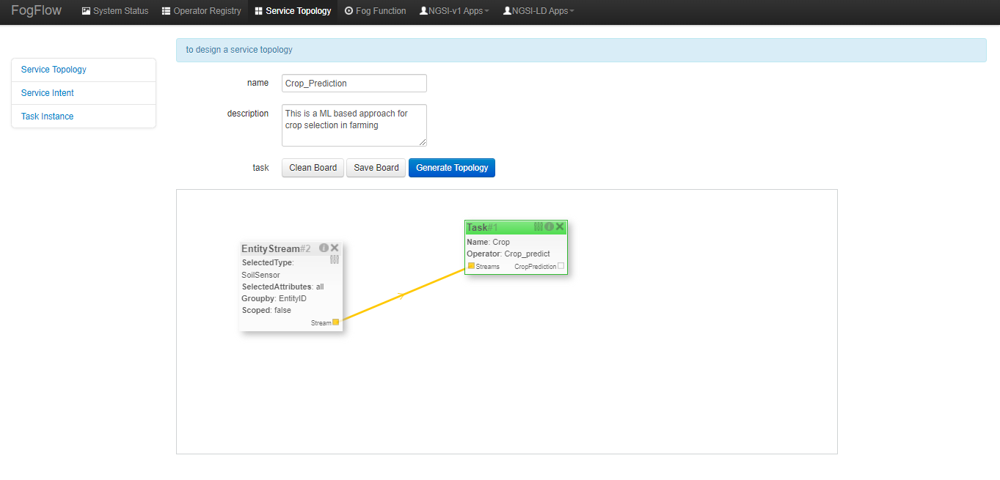

**************************************************************
'Crop Prediction' example of NGSI-LD based operator
**************************************************************

Use case on Crop Prediction
========================================

This use case study is designed to predict and recommend crop for cultivation based upon the various parameters. Precision agirculture is in trend nowadays. 
Precision agriculture is a modern farming technique that uses the data of soil charachteristics, soil types, crop yield data, weather conditions and suggests the farmers with the most optimal crop to grow in their farms for maximum yield and profit. 
This technique can reduce the crop failures and will help the farmers to take informed decision about their farming strategy. In order to mitigate the agrarian crisis in the current status quo, there is a need for better recommendation systems to alleviate the crisis by helping the farmers to make an informed decision before starting the cultivation of crops.

* Crop Predictor: this operator is used to predict crop based on soil and climate conditions from the collected data from soil sensor associated with the soil. Soil sensor provides following data to Heart Health Predictor:

	* Temperature
   	* Soil Humidity
	* Soil pH
   	* Rainfall
	* Air Moisture  

* Dashboard service in the cloud, which subscribes to the final prediction generated the crop predictor operator for the global scope. 

Crop Predictor Menu 
-----------------------------------------------------------------------
As shown in the figure menu of this use case, we have 5 tabs namely: Topology, Management, Tasks, Alert and Prediction.

(1) Topology, includes
    * The brief pictorial representation of the use-case.
    * It can be used to used the flow and the working of the use-case.

(2) Mangement, includes
    * Start/Stop Button.
    * This Start/Stop Button is to used to start the service intent. Without firing service intent, no tasks will run. 	

(3) Tasks, includes
     * Task lists down the ID of the soil sensor, the service they are performing, the task they are assigned to do and there live status.

(4) Prediction, includes
    * The decision on which crop should be cultivated. The prediction is sent to the subscriber.

Implement your operator functions required in your service topology
-----------------------------------------------------------------------

Before you can define the designed service topology, 
all operators used in your service topology must be provided by you or the other provider in the FogFlow system.
As shown in the figure below, for  this specific use case, we need to implement operators: crop_predict. 
Please refer to the examples provided in our code repository. 

* `Crop_predictor_operator`_ 

.. _`Crop_predictor_operator`: https://github.com/smartfog/fogflow/tree/Catalogue_Tutorial/application/operator/NGSI-LD-operator/CropPredictor

Specify a service topology
-----------------------------------
Assume that the tasks to be used in your service topology have been implemented and registered,
you can have two ways to specify your service topology. 

Using FogFlow Topology Editor
--------------------------------

The first way is to use the FogFlow editor to specify a service topology.  

As seen in the picture, the following important information must be provided. 

#. define topology profile, including
    * topology name: In this use-case, topology name is 'Crop_Predictor'.
    * service description: In this use-case, description provided is 'ML based health prediction of Human Heart'.

#. draw the graph of data processing flows within the service topology
    With a right click at some place of the design board, you will see a menu pops up 
    and then you can start to choose either task or Entity streams or shuffle
    to define your data processing flows according to the design you had in mind. 
	In this particular use case we have one Entity Stream, two Operators and one Shuffle. 
	
#. define the profile for each element in the data flow, including
    As shown in the above picture, you can start to specify the profile of each element in the data processing flow
    by clicking the configuration button.
    
    The following information is required to specify a task profile.
	
    * name: the name of the task 
    * operator: the name of the operator that implements the data processing logic of this task; please register your operator beforehand so that it can be shown from the list
    * entity type of output streams: to specify the entity type of the produced output stream.
    
    The following information is required to specify an EntityStream Profile.

    * SelectedType: is used to define what Entity Type will be chosen by the task as its Input Stream
    * SelectedAttributes: is used to define what attribute (or attributes) of the Selected Entity Type will be considered for changing the state of a task.
    * Groupby: to determine how many instances of this task should be created on the fly; currently including the following cases
	
        *  if there is only one instance to be created for this task, please use "groupby" = "all"
        *  if you need to create one instance for each entity ID of the input streams, please user "groupby" = "entityID"
        *  if you need to create one instance for each unique value of some specific context metadata, please use the name of this registered context metadata
    
    * Scoped: tells if the Entity data are location-specific or not. True indicates that location-specific data are recorded in the Entity and False is used in case of broadcasted data, for example, some rule or threshold data that holds true for all locations, not for a specific location.

    Shuffling element serves as a connector between two tasks such that output of a task is the input for the shuffle element and same is forwarded by Shuffle to another task (or tasks) as input.

How to run Heart Health Prediction use case
------------------------------------------

#. Step. 1: Go to Management tab, press on start button. This will send the service intent. 

#. Step. 2: Send Payload to create a new predictor task (Payload is provided below)

#. Step. 3: Check Task Tab, to see a new task is launched.

#. Step. 4: Check Prediction tab to find the results.

Using NGSI Update to create it
-------------------------------------

Another way is to register a service topology by sending a constructed NGSI update message to the IoT Broker deployed in the cloud. 

.. note:: The Curl case assumes that the cloud IoT Broker is running on 192.168.21.232 on port 8070.

   .. group-tab:: curl

        .. code-block:: console 

		curl -iX --location --request POST 'http://172.30.48.24:8070/ngsi-ld/v1/entityOperations/upsert' \
            --header 'Content-Type: application/json' \
            --header 'Accept: application/ld+json' \
            --header 'Link: <{{link}}>; rel="http://www.w3.org/ns/json-ld#context"; type="application/ld+json"' \
            --data-raw '[
                {
                    "id": "urn:ngsi-ld:Device.SoilSensor54",
                    "type": "SoilSensor",
                    "airmoisture": {
                        "type": "Property",
                        "value": 15
                    },
                    "airTemp": {
                        "type": "Property",
                        "value": 50
                    },
                    "soilmoisture": {
                        "type": "Property",
                        "value": 23
                    },
                    "soilpH": {
                        "type": "Property",
                        "value": 3
                    },
                    "rainfall": {
                        "type": "Property",
                        "value": 32
                    },
                    "location": {
                        "type": "GeoProperty",
                        "value": {
                            "type": "Point",
                            "coordinates": [
                                35.7,
                                138
                            ]
                        }
                    }
                }
            ]'

                .. note:: you can change the value in the above payload to test the prediction operator.				
              
