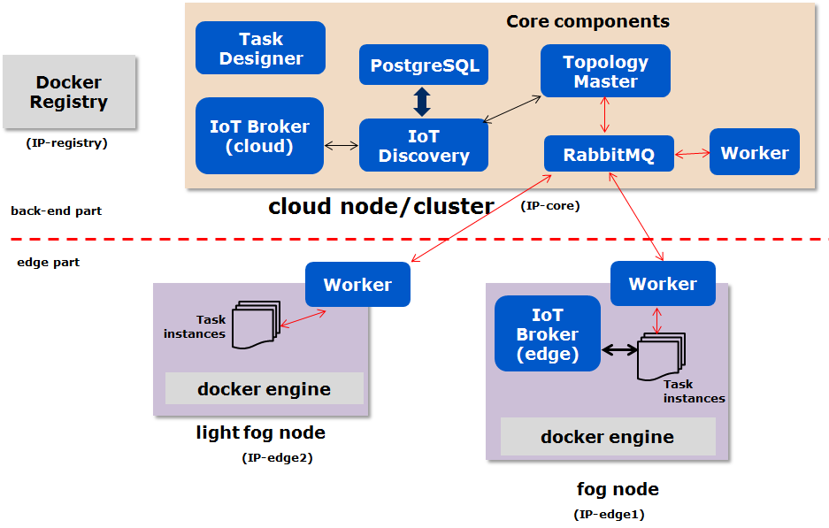

Deployment view
===========================================

The following feature shows the overall deployment view of the FogFlow system, including three parts: 

Cloud node
-----------
All core service components are deployed on a single cloud node or in a cloud cluster. 
As illustrated by the deployment view figure below, the following components are started 
in the cloud: 

* **IoT Discovery**: the centralized IoT Discovery to manage the availability of context entities and their metadata
* **IoT Broker(cloud)**: the IoT Broker in the cloud
* **Topology Master**: be responsible for service orchestration and global task generation, configuration, and management 
* **Worker(cloud)**: to launch or terminate the tasks assigned by Topology Master
* **RabbitMQ**: AMQP-based message bus for exchanging the control commands between Topology Master and Workers
* **Task Designer**: noodejs-based web server to provide the web-based interfaces for system management and showing demo use cases 
 
The following components are made accessible from the outside, via their listening ports under the same public IP (IP-core): 

* **IoT Discovery**: 8071
* **IoT Broker(cloud)**: 8070
* **RabbitMQ**: 5672
* **Task Designer**: 8080

Edge node
-----------
An edge node must provide the docker execution environment. Each edge node needs to run a worker and an IoT broker. 
Physically, an edge node could be an IoT gateway, a virtual machine, or even an end-point device that supports docker.  

Registry service
-----------------
FogFlow relies on an external docker registry service to manage all registry docker images for each operator. 
We can either use the public docker registry service or set up our own private docker registry service. 

