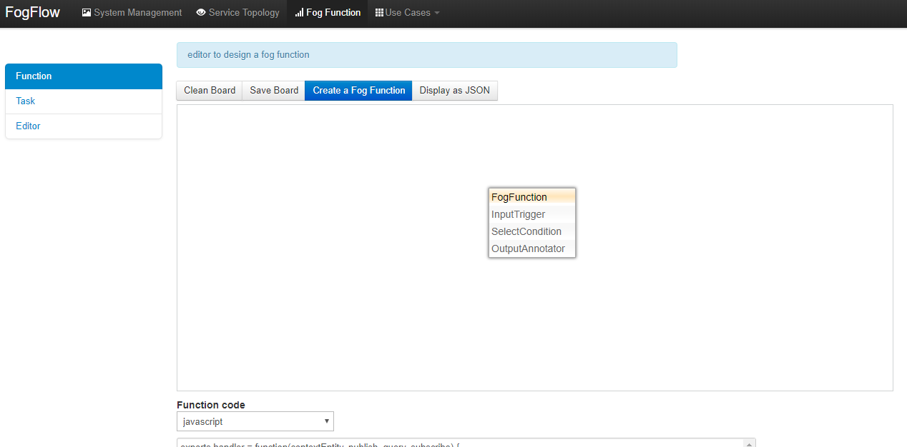
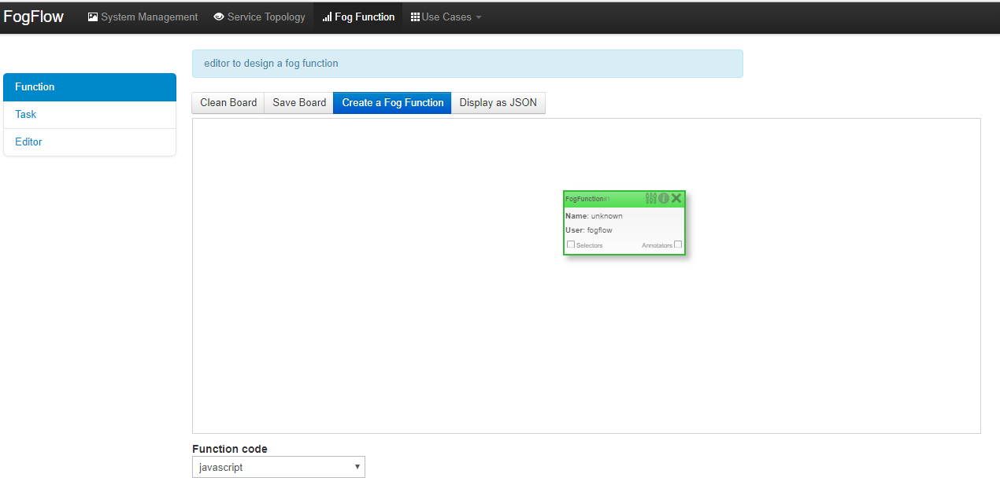
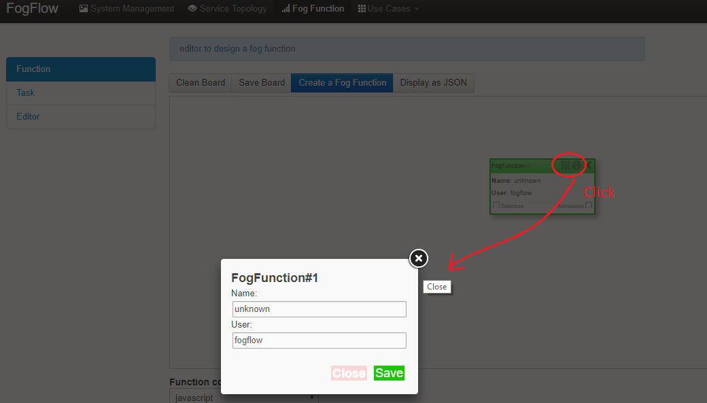
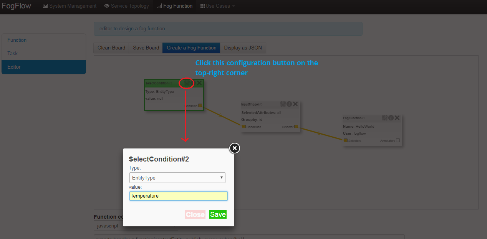
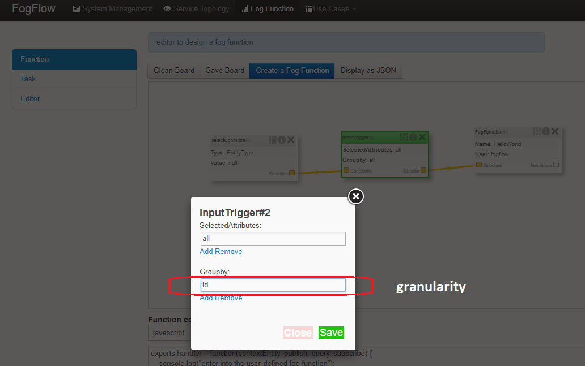
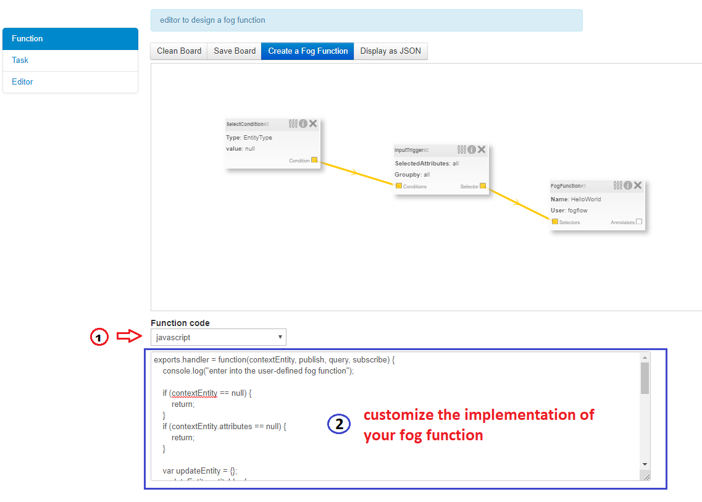
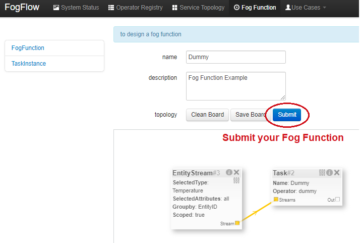
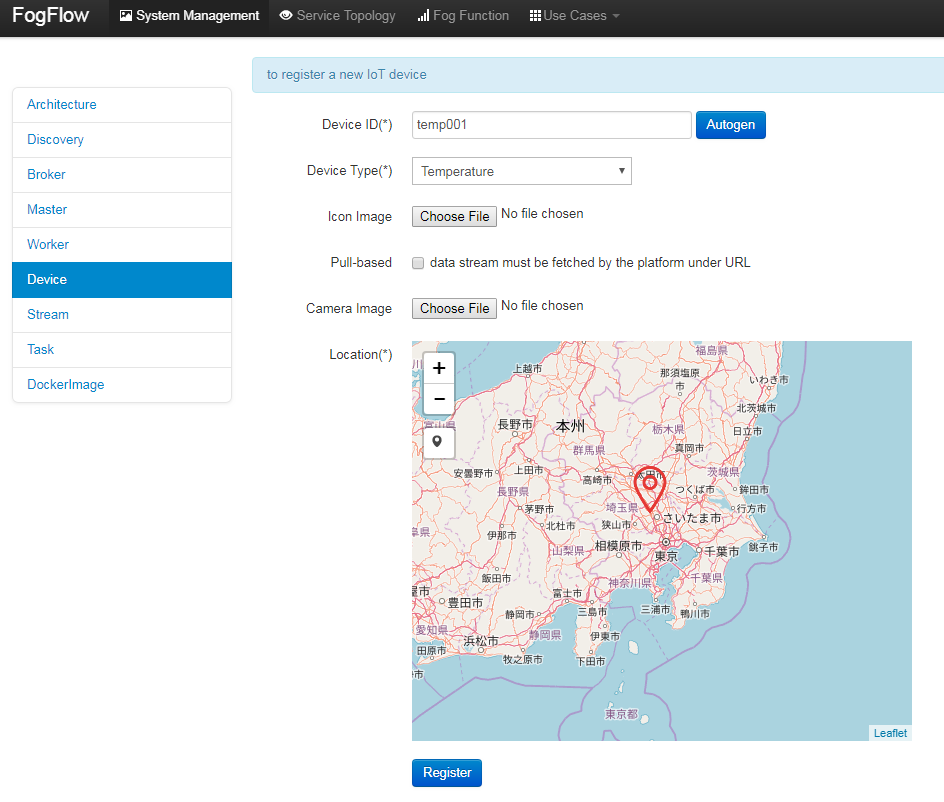

*****************************************
Define and trigger a fog function
*****************************************

FogFlow enables serverless edge computing, meaning that developers can define and submit a so-called fog function and then 
the rest will be done by FogFlow automatically, including:

-  triggering the submitted fog function when its input data are available
-  deciding how many instances to be created according to its defined granularity
-  deciding where to deploy the created instances

The following steps show how to define and test a simple 'hello world' function using the web portal provided by FogFlow Task Designer. 

Define a "hello world" fog function 
-----------------------------------------------

create a fog function from the FogFlow editor 
^^^^^^^^^^^^^^^^^^^^^^^^^^^^^^^^^^^^^^^^^^^^^^^^

A menu will pop up when you do a right mouse click on the task design board. 
The displayed menu includes the following items: 

-  **FogFunction**: to place a fog function element on the design board
-  **InputTrigger**: to place a trigger element, which can be linked with a fog function as its input data selector
-  **SelectCondition**: to place a filter element, which can be linked with an input trigger in order to specify your input data

Once you click "FogFunction" from the popup menu, a fog function element will be placed on the design board, as shown below. 

You can start to configure a fog function once you click the configuration button on the top-right corner, as illustrated by the following figure. 
Please specify the name of your fog function.

select its input based on entity type
^^^^^^^^^^^^^^^^^^^^^^^^^^^^^^^^^^^^^^^^^^^^^^^^^^^^^^^

Please click "SelectCondition" from the popup menu to place a "SelectCondition" element on the design board. 
Configure this element to specify the entity type of your input data. 
In the following example, we choose "Temperature" as the entity type of input data for the "HelloWorld" fog function. 

define a granularity for the creation of its function instances
^^^^^^^^^^^^^^^^^^^^^^^^^^^^^^^^^^^^^^^^^^^^^^^^^^^^^^^^^^^^^^^^^^^^^^^^^^

Please click "InputTrigger" from the popup menu to place a "InputTrigger" element on the design board. 
Configure it by specifying the following items: 

-  **SelectedAttributes**: for the selected entity type, which entity attributes are required by your fog function; "all" means to get all entity attributes. 
-  **Groupby**: this should be one of the selected entity attributes, which defines the granularity of this fog function. 
 
.. note:: granularity determines the number of instances for this fog function.
        In principle, the number of task instances for the defined fog function 
        will be equal to the total number of unique values of the selected entity attributes, 
        for the available input data. It also means, each instance will be assigned to handle all input entities
        with a specific attribute value. 

In the following example, the granularity is defined by "id", meaning that FogFlow will create on task instance
for each individual entity ID. 

.. note:: please link the InputTrigger element to the input of your fog function element; then link your SelectCondition element to the input of your InputTrigger element. 

provide the code of your own function
^^^^^^^^^^^^^^^^^^^^^^^^^^^^^^^^^^^^^^^^^^^^^^^^
    
Currently FogFlow allows developers to specify the function code, either by directly overwritting the following handler function (in Javascript or Python)
or by selecting a registered operator. 
    
.. code-block:: javascript

    exports.handler = function(contextEntity, publish, query, subscribe) {
        console.log("enter into the user-defined fog function");
        
        var entityID = contextEntity.entityId.id;
    
        if (contextEntity == null) {
            return;
        }
        if (contextEntity.attributes == null) {
            return;
        }
    
        var updateEntity = {};
        updateEntity.entityId = {
            id: "Stream.result." + entityID,
            type: 'result',
            isPattern: false
        };
        updateEntity.attributes = {};
        updateEntity.attributes.city = {
            type: 'string',
            value: 'Heidelberg'
        };
    
        updateEntity.metadata = {};
        updateEntity.metadata.location = {
            type: 'point',
            value: {
                'latitude': 33.0,
                'longitude': -1.0
            }
        };

        console.log("publish: ", updateEntity);        
        publish(updateEntity);        
    };

You can take the example Javascript code above as the implementation of your "HelloWorld" fog function. 
This example fog function simple writes a fixed entity by calling the "publish" callback function. 

The input parameters of a fog function are predefined and fixed, including: 

-  **contextEntity**: representing the received entity data
-  **publish**: the callback function to publish your generated result back to the FogFlow system
-  **query**: optional, this is used only when your own internal function logic needs to query some extra entity data from the FogFlow context management system. 
-  **subscribe**: optional, this is used only when your own internal function logic needs to subscribe some extra entity data from the FogFlow context management system.         

.. important::

    for the callback functions *query* and *subscribe*, "extra" means any entity data that are not defined as the inputs in the annotation of your fog function. 

    a Javascript-based template of the implementation of fog functions is provided in the FogFlow repository as well. Please refer to `Javascript-based template for fog function`_

.. _`Javascript-based template for fog function`: https://github.com/smartfog/fogflow/tree/master/application/template/javascript

Here are some examples to show how you can use these three call back functions. 

- example usage of *publish*: 
	.. code-block:: javascript
	
	    var updateEntity = {};
	    updateEntity.entityId = {
	           id: "Stream.Temperature.0001",
	           type: 'Temperature',
	           isPattern: false
	    };            
	    updateEntity.attributes = {};     
	    updateEntity.attributes.city = {type: 'string', value: 'Heidelberg'};                
	    
	    updateEntity.metadata = {};    
	    updateEntity.metadata.location = {
	        type: 'point',
	        value: {'latitude': 33.0, 'longitude': -1.0}
	    };        
	       
	    publish(updateEntity);    
    
- example usage of *query*: 
	.. code-block:: javascript
	
	    var queryReq = {}
	    queryReq.entities = [{type:'Temperature', isPattern: true}];    
	    var handleQueryResult = function(entityList) {
	        for(var i=0; i<entityList.length; i++) {
	            var entity = entityList[i];
	            console.log(entity);   
	        }
	    }  
	    
	    query(queryReq, handleQueryResult);

- example usage of *subscribe*: 
	.. code-block:: javascript
	
	    var subscribeCtxReq = {};    
	    subscribeCtxReq.entities = [{type: 'Temperature', isPattern: true}];
	    subscribeCtxReq.attributes = ['avg'];        
	    
	    subscribe(subscribeCtxReq);     
    

submit your fog function
^^^^^^^^^^^^^^^^^^^^^^^^^^^^^^^^^^^^^^^^^^^^^^^^
    
Once you create the button "Create a Fog Function", the annotated fog function will be submitted to FogFlow. 

Trigger your "hello world" fog function 
--------------------------------------------

The defined "hello world" fog function is triggered only when its required input data are available. 
With the following command, you can create a "Temperature" sensor entity to trigger the function. 
Please fill out the following required information: 

-  **Device ID**: to specify a unique entity ID
-  **Device Type**: use "Temperature" as the entity type
-  **Location**: to place a location on the map
            

Once the device profile is registered, a new "Temperature" sensor entity will be created and it will trigger the "HelloWorld" fog function automatically. 

The other way to trigger the "HelloWorld" fog function is to send a NGSI entity update to create the "Temperature" sensor entity. 
You can run the following command to issue a POST request to the FogFlow broker. 

.. code-block:: console 

    curl -iX POST \
      'http://localhost:8080/ngsi10/updateContext' \
      -H 'Content-Type: application/json' \
      -d '
    {
        "contextElements": [
            {
                "entityId": {
                    "id": "Device.temp001",
                    "type": "Temperature",
                    "isPattern": false
                },
                "attributes": [
                {
                  "name": "temp",
                  "type": "integer",
                  "contextValue": 10
                }
                ],
                "domainMetadata": [
                {
                    "name": "location",
                    "type": "point",
                    "value": {
                        "latitude": 49.406393,
                        "longitude": 8.684208
                    }
                }
                ]
            }
        ],
        "updateAction": "UPDATE"
    }'

You can check whether the fog function is triggered or not in the following way. 

- check the task instance of this fog function, as shown in the following picture
	.. figure:: figures/fog-function-task-instance.png
	   :width: 100 %

- check the result generated by its running task instance, as shown in the following picture 
	.. figure:: figures/fog-function-result.png
	   :width: 100 %

