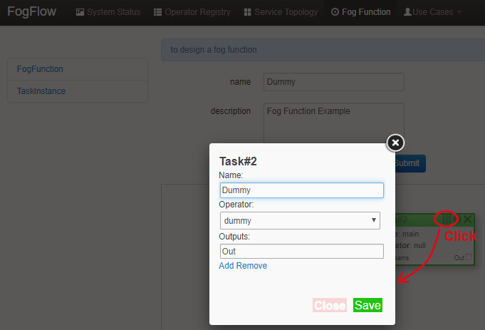
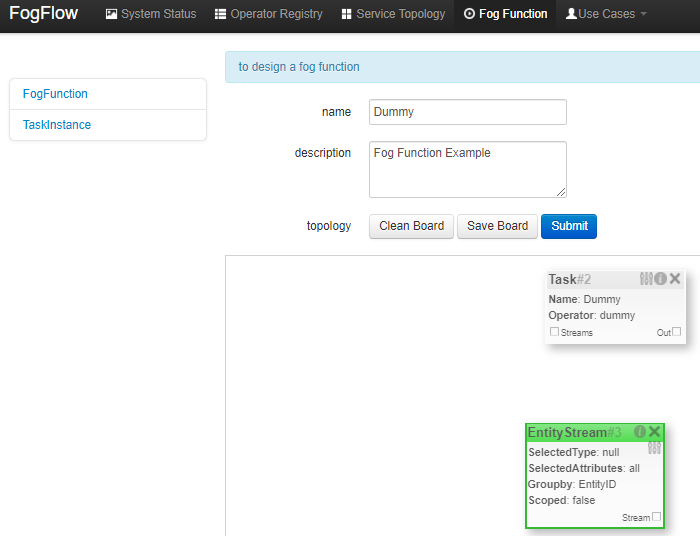
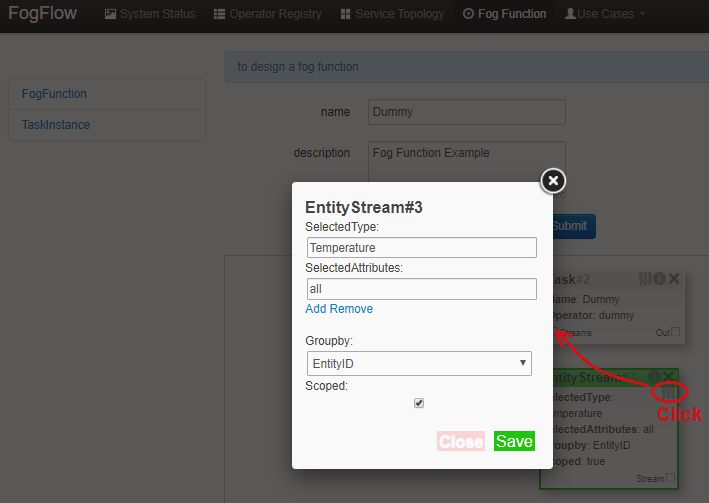
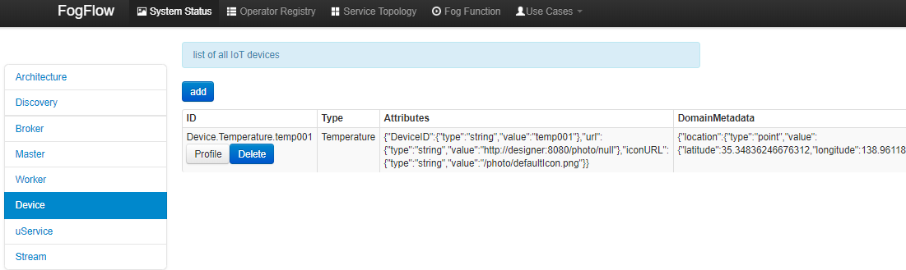

*****************************************
Define and trigger a fog function
*****************************************

FogFlow enables serverless edge computing, meaning that developers can define and submit a so-called fog function and then 
the rest will be done by FogFlow automatically, including:

-  triggering the submitted fog function when its input data are available
-  deciding how many instances to be created according to its defined granularity
-  deciding where to deploy the created instances

The instances in the above text refer to the task instances which run a processing logic within them and this processing logic is given by operators in fogflow. They must be registered beforehand by the users. Implementation of an example operator is given in the next sections.

Register your task operators
--------------------------------------------------------

Operator code must be in the form of a docker image and must be available on docker hub. 
Registration of an operator in FogFlow can be done in one of the following two ways. 

.. note:: Please notice that each operator must have a unique name but the same operator can be associated with multiple docker images, 
            each of which is for one specific hardware or operating system but for implementing the same data processing logic. 
            During the runtime, FogFlow will select a proper docker image to run a scheduled task on an edge node, 
            based on the execution environment of the edge node. 

Register it via FogFlow Task Designer
==========================================================

There are two steps to register an operator in Fogflow.

**Register an Operator** to define what would be the name of Operator and what input parameters it would need. Here in this context, an operator is nothing but a named element having some parameters.
The following picture shows the list of all registered operators and their parameter count.

.. image:: figures/operator-list.png
   
After clicking the "register" button, you can see a design area shown below and you can create an operator and add parameters to it. To define the port for the operator application, use "service_port" and give a valid port number as its value. The application would be accessible to the outer world through this port.

.. image:: figures/operator-registry.png

**Register a Docker Image and choose Operator** to define the docker image and associate an already registered Operator with it. 

The following picture shows the list of all registered docker images and the key information of each image. 

.. image:: figures/dockerimage-registry-list.png

After clicking the "register" button, you can see a form as below. 
Please fill out the required information and click the "register" button to finish the registration. 
The form is explained as the following. 

* Image: the name of your operator docker image
* Tag: the tag you used to publish your operator docker image; by default it is "latest"
* Hardware Type: the hardware type that your docker image supports, including X86 or ARM (e.g. Raspberry Pi)
* OS Type: the operating system type that your docker image supports; currently this is only limited to Linux
* Operator: the operator name, which must be unique and will be used when defining a service topology
* Prefetched: if this is checked, that means all edge nodes will start to fetch this docker image in advance; otherwise, the operator docker image is fetched on demand, only when edge nodes need to run a scheduled task associated with this operator. 

.. important::
    
    Please notice that the name of your docker image must be consistent with the one you publish to `Docker Hub`_.
    By default, FogFlow will fetch the required docker images from Docker Hub using the name you register here for your operator. 

.. _`Docker Hub`: https://github.com/smartfog/fogflow/tree/master/application/operator/anomaly

.. image:: figures/dockerimage-registry.png

Register it programmatically by sending a NGSI update 
==========================================================

You can also register an operator docker image by sending a constructed NGSI update message to the IoT Broker deployed in the cloud. 

Here are the Curl and the Javascript-based code examples to register an operator and a docker image for that operator. 

.. note:: In the Javascript code example, we use the Javascript-based library to interact with FogFlow IoT Broker. You can find out the library from the github code repository (designer/public/lib/ngsi). You must include ngsiclient.js into your web page. 

.. note:: The Curl case assumes that the cloud IoT Broker is running on localhost on port 8070.

.. tabs::

   .. group-tab:: Curl

        .. code-block:: console 

		curl -iX POST \
		  'http://localhost:8070/ngsi10/updateContext' \
	  	-H 'Content-Type: application/json' \
	  	-d '		
	     	{
			"contextElements": [
			{ 
				"entityId":{ 
					"id":"counter",
					"type":"Operator"
				},
				"attributes":[ 
				{
					"name":"designboard",
					"type":"object",
					"value":{ 
				 	}
				},
				{ 
					"name":"operator",
					"type":"object",
					"value":{ 
						"description":"",
						"name":"counter",
						"parameters":[ 
				
						]
				 	}
				}
				],
				"domainMetadata":[ 
				{ 
					"name":"location",
					"type":"global",
					"value":"global"
				}
				]
			},
			{ 
				   "entityId":{ 
					  "id":"fogflow/counter.latest",
					  "type":"DockerImage"
				   },
				   "attributes":[ 
					  { 
						 "name":"image",
						 "type":"string",
						 "value":"fogflow/counter"
					  },
					  { 
						 "name":"tag",
						 "type":"string",
						 "value":"latest"
					  },
					  { 
						 "name":"hwType",
						 "type":"string",
						 "value":"X86"
					  },
					  { 
						 "name":"osType",
						 "type":"string",
						 "value":"Linux"
					  },
					  { 
						 "name":"operator",
						 "type":"string",
						 "value":"counter"
					  },
					  { 
						 "name":"prefetched",
						 "type":"boolean",
						 "value":false
					  }
				   ],
				   "domainMetadata":[ 
					  { 
						 "name":"operator",
						 "type":"string",
						 "value":"counter"
					  },
					  { 
						 "name":"location",
						 "type":"global",
						 "value":"global"
					  }
				   ]
				}
			],
	        "updateAction": "UPDATE"
		}'

   .. group-tab:: Javascript

        .. code-block:: Javascript 

		name = "counter"

		//register a new operator
		var newOperatorObject = {};

		newOperatorObject.entityId = {
			id : name,
			type: 'Operator',
			isPattern: false
		};

		newOperatorObject.attributes = [];

		newOperatorObject.attributes.designboard = {type: 'object', value: {}};

		var operatorValue = {}
		operatorValue = {description: "Description here...", name: name, parameters: []};
		newOperatorObject.attributes.operator = {type: 'object', value: operatorValue};

		newOperatorObject.metadata = [];
		newOperatorObject.metadata.location = {type: 'global', value: 'global'};

		// assume the config.brokerURL is the IP of cloud IoT Broker
		var client = new NGSI10Client(config.brokerURL);
		client.updateContext(newOperatorObject).then( function(data) {
			console.log(data);
		}).catch( function(error) {
			console.log('failed to register the new Operator object');
		});

		image = {}

		image = {
			name: "fogflow/counter",
			tag: "latest",
			hwType: "X86",
			osType: "Linux",
			operator: "counter",
			prefetched: false
		};

		newImageObject = {};

		newImageObject.entityId = {
			id : image.name + '.' + image.tag,
			type: 'DockerImage',
			isPattern: false
		};

		newImageObject.attributes = [];
		newImageObject.attributes.image = {type: 'string', value: image.name};
		newImageObject.attributes.tag = {type: 'string', value: image.tag};
		newImageObject.attributes.hwType = {type: 'string', value: image.hwType};
		newImageObject.attributes.osType = {type: 'string', value: image.osType};
		newImageObject.attributes.operator = {type: 'string', value: image.operator};
		newImageObject.attributes.prefetched = {type: 'boolean', value: image.prefetched};

		newImageObject.metadata = [];
		newImageObject.metadata.operator = {type: 'string', value: image.operator};
		newImageObject.metadata.location = {type: 'global', value: 'global'};

		client.updateContext(newImageObject).then( function(data) {
			console.log(data);
		}).catch( function(error) {
			console.log('failed to register the new Docker Image object');
		});

It is recommended to use fogflow dashboard to create an operator with parameters. However, if the users wish to use curl, then they can refer the following for the example operator registration with parameters shown in the above image. Afterwards, users can register a docker image that uses this operator. 

The x and y variables here are simply the coordinates of designer board. If they are not given by user, by default, all the element blocks will be placed at origin of the plane.

.. code-block:: curl

	curl -iX POST \
		  'http://localhost:8070/ngsi10/updateContext' \
	  	-H 'Content-Type: application/json' \
	  	-d '		
	     	{
			"contextElements": [
				{ 
				   "entityId":{ 
				      "id":"iota",
				      "type":"Operator"
				   },
				   "attributes":[ 
				      { 
				         "name":"designboard",
				         "type":"object",
				         "value":{ 
				            "blocks":[ 
				               { 
				                  "id":1,
				                  "module":null,
				                  "type":"Parameter",
				                  "values":{ 
				                     "name":"service_port",
				                     "values":[ 
				                        "4041"
				                     ]
				                  },
				                  "x":-425,
				                  "y":-158
				               },
				               { 
				                  "id":2,
				                  "module":null,
				                  "type":"Parameter",
				                  "values":{ 
				                    "name":"service_port",
 				                    "values":[ 
				                        "7896"
				                     ]
				                  },
				                  "x":-393,
				                  "y":-51
				               },
				               { 
				                  "id":3,
				                  "module":null,
				                  "type":"Operator",
				                  "values":{ 
				                     "description":"",
				                     "name":"iota"
				                  },
				                  "x":-186,
				                  "y":-69
				               }
				            ],
				            "edges":[ 
				               { 
				                  "block1":2,
				                  "block2":3,
				                  "connector1":[ 
				                     "parameter",
				                     "output"
				                  ],
				                  "connector2":[ 
				                     "parameters",
				                     "input"
				                  ],
				                  "id":1
				               },
				               { 
				                  "block1":1,
				                  "block2":3,
				                  "connector1":[ 
				                     "parameter",
				                     "output"
				                  ],
				                  "connector2":[ 
				                     "parameters",
				                     "input"
				                  ],
				                  "id":2
				               }
				            ]
				         }
				      },
				      { 
				         "name":"operator",
				         "type":"object",
				         "value":{ 
				            "description":"",
				            "name":"iota",
				            "parameters":[ 
				               { 
				                  "name":"service_port",
				                  "values":[ 
				                     "7896"
				                  ]
				               },
				               { 
				                  "name":"service_port",
				                  "values":[ 
				                     "4041"
 				                 ]
				               }
				            ]
				         }
				      }
				   ],
				   "domainMetadata":[ 
				      { 
				         "name":"location",
				         "type":"global",
				         "value":"global"
				      }
				   ]
				}
			],
	        "updateAction": "UPDATE"
		}'

Define a "Dummy" fog function 
-----------------------------------------------

The following steps show how to define and test a simple 'dummy' fog function using the web portal provided by FogFlow Task Designer. 
The "dummy" operator is already registered in Fogflow by default.

create a fog function from the FogFlow editor 
==========================================================

A menu will pop up when you do a right mouse click on the task design board.

.. image:: figures/fog-function-1.png
   
The displayed menu includes the following items: 

-  **Task**: is used to define the fog function name and the processing logic (or operator). A task has input and output streams.
-  **EntityStream**: is the input data element which can be linked with a fog function Task as its input data stream. 

Once you click "Task" from the popup menu, a Task element will be placed on the design board, as shown below.

.. image:: figures/fog-function-2.png
  
You can start to configure a Task once you click the configuration button on the top-right corner, as illustrated in the following figure. 
Please specify the name of the Task and choose an operator out of a list of some pre-registered operators.

   
Please click "EntityStream" from the popup menu to place an "EntityStream" element on the design board. 

It contains the following things:

	* Selected Type: is used to define the entity type of input stream whose availability will trigger the fog function. 
	* Selected Attributes: for the selected entity type, which entity attributes are required by your fog function; "all" means to get all entity attributes.
	* Group By: should be one of the selected entity attributes, which defines the granularity of this fog function.
	* Scoped: tells if the Entity data are location-specific or not. True indicates that location-specific data are recorded in the Entity and False is used in case of broadcasted data, for example, some rule or threshold data that holds true for all locations, not for a specific location.
 
.. note:: granularity determines the number of instances for this fog function.
        In principle, the number of task instances for the defined fog function 
        will be equal to the total number of unique values of the selected entity attributes, 
        for the available input data. It also means, each instance will be assigned to handle all input entities
        with a specific attribute value. 

In this example, the granularity is defined by "id", meaning that FogFlow will create a new task instance
for each individual entity ID.

Configure the EntityStream by clicking on its configuration button as shown below. In this example, we choose "Temperature" as the entity type of input data for the "dummy" fog function.

There can be multiple EntityStreams for a Task and they must be connected to the Task as shown here.

.. image:: figures/fog-function-6.png
 

provide the code of your own function
==========================================================
    
Currently FogFlow allows developers to specify their own function code inside a registered operator. For a sample operator, refer the |dummy operator code|.

.. |dummy operator code| raw:: html

    <a href="https://github.com/smartfog/fogflow/tree/master/application/operator/dummy" target="_blank">dummy operator code</a>

   
.. code-block:: javascript

    exports.handler = function(contextEntity, publish, query, subscribe) {
        console.log("enter into the user-defined fog function");
        
        var entityID = contextEntity.entityId.id;
    
        if (contextEntity == null) {
            return;
        }
        if (contextEntity.attributes == null) {
            return;
        }
    
        var updateEntity = {};
        updateEntity.entityId = {
            id: "Stream.result." + entityID,
            type: 'result',
            isPattern: false
        };
        updateEntity.attributes = {};
        updateEntity.attributes.city = {
            type: 'string',
            value: 'Heidelberg'
        };
    
        updateEntity.metadata = {};
        updateEntity.metadata.location = {
            type: 'point',
            value: {
                'latitude': 33.0,
                'longitude': -1.0
            }
        };

        console.log("publish: ", updateEntity);        
        publish(updateEntity);        
    };

You can take the example Javascript code above as the implementation of your own fog function. 
This example fog function simple writes a fixed entity by calling the "publish" callback function. 

The input parameters of a fog function are predefined and fixed, including: 

-  **contextEntity**: representing the received entity data
-  **publish**: the callback function to publish your generated result back to the FogFlow system
-  **query**: optional, this is used only when your own internal function logic needs to query some extra entity data from the FogFlow context management system. 
-  **subscribe**: optional, this is used only when your own internal function logic needs to subscribe some extra entity data from the FogFlow context management system.         

.. important::

    For the callback functions *query* and *subscribe*, "extra" means any entity data that are not defined as the inputs in the annotation of your fog function. 

    A Javascript-based template of the implementation of fog functions is provided in the FogFlow repository as well. Please refer to `Javascript-based template for fog function`_

.. _`Javascript-based template for fog function`: https://github.com/smartfog/fogflow/tree/master/application/template/javascript

Templates for Java and python are also given in the repository.

Here are some examples to show how you can use these three call back functions. 

- example usage of *publish*: 
	.. code-block:: javascript
	
	    var updateEntity = {};
	    updateEntity.entityId = {
	           id: "Stream.Temperature.0001",
	           type: 'Temperature',
	           isPattern: false
	    };            
	    updateEntity.attributes = {};     
	    updateEntity.attributes.city = {type: 'string', value: 'Heidelberg'};                
	    
	    updateEntity.metadata = {};    
	    updateEntity.metadata.location = {
	        type: 'point',
	        value: {'latitude': 33.0, 'longitude': -1.0}
	    };        
	       
	    publish(updateEntity);    
    
- example usage of *query*: 
	.. code-block:: javascript
	
	    var queryReq = {}
	    queryReq.entities = [{type:'Temperature', isPattern: true}];    
	    var handleQueryResult = function(entityList) {
	        for(var i=0; i<entityList.length; i++) {
	            var entity = entityList[i];
	            console.log(entity);   
	        }
	    }  
	    
	    query(queryReq, handleQueryResult);

- example usage of *subscribe*: 
	.. code-block:: javascript
	
	    var subscribeCtxReq = {};    
	    subscribeCtxReq.entities = [{type: 'Temperature', isPattern: true}];
	    subscribeCtxReq.attributes = ['avg'];        
	    
	    subscribe(subscribeCtxReq);     
    

submit your fog function
==========================================================
    
When you click on the "Submit" button, the annotated fog function will be submitted to FogFlow. 

.. image:: figures/fog-function-7.png

Trigger your "dummy" fog function 
--------------------------------------------

The defined "dummy" fog function is triggered only when its required input data are available. 
With the following command, you can create a "Temperature" sensor entity to trigger the function. 
Please fill out the following required information: 

-  **Device ID**: to specify a unique entity ID
-  **Device Type**: use "Temperature" as the entity type
-  **Location**: to place a location on the map
            
.. image:: figures/device-registration.png

Once the device profile is registered, a new "Temperature" sensor entity will be created and it will trigger the "dummy" fog function automatically.

The other way to trigger the your fog function is to send a NGSI entity update to create the "Temperature" sensor entity. 
You can run the following command to issue a POST request to the FogFlow broker. 

.. code-block:: console 

    curl -iX POST \
      'http://localhost:8080/ngsi10/updateContext' \
      -H 'Content-Type: application/json' \
      -d '
    {
        "contextElements": [
            {
                "entityId": {
                    "id": "Device.temp001",
                    "type": "Temperature",
                    "isPattern": false
                },
                "attributes": [
                {
                  "name": "temp",
                  "type": "integer",
                  "value": 10
                }
                ],
                "domainMetadata": [
                {
                    "name": "location",
                    "type": "point",
                    "value": {
                        "latitude": 49.406393,
                        "longitude": 8.684208
                    }
                }
                ]
            }
        ],
        "updateAction": "UPDATE"
    }'

You can check whether the fog function is triggered or not in the following way. 

- check the task instance of this fog function, as shown in the following picture
	.. image:: figures/fog-function-task-running.png

- check the result generated by its running task instance, as shown in the following picture 
	.. image:: figures/fog-function-streams.png

