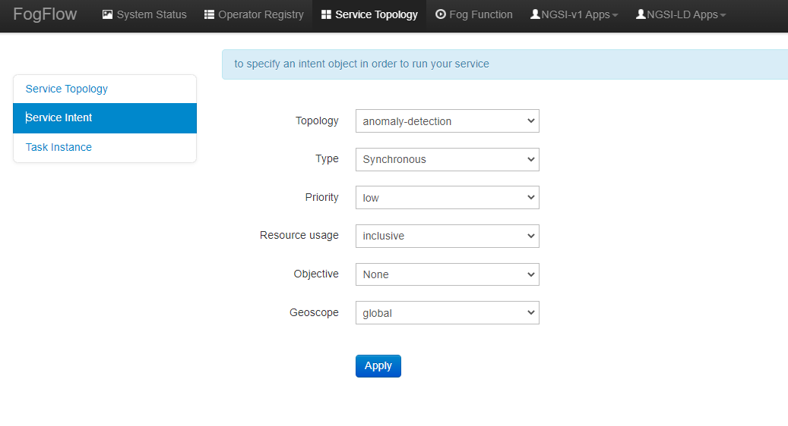

*****************************************
Define and trigger a service topology
*****************************************

In FogFlow a service topology is defined as a graph of several operators. 
Each operator in the service topology is annotated with its inputs and outputs, 
which indicate their dependency to the other tasks in the same topology. 
**Different from fog functions, a service topology is triggerred on demand by a customized "requirement" object.**

With a simple example we explain how developers can define and test a service topology in the following section. 

Use case on anomaly detection
---------------------------------------

This use case study is for retail stores to detect abnormal energy consumption in real-time.
As illustrated in the following picture, a retail company has a large number of shops distributed in different locations. 
For each shop, a Raspberry Pi device (edge node) is deployed to monitor the power consumption from all PowerPanels 
in the shop. Once an abnormal power usage is detected on the edge, 
the alarm mechanism in the shop is triggered to inform the shop owner. 
Moreover, the detected event is reported to the cloud for information aggregation. 
The aggregated information is then presented to the system operator via a dashboard service. 
In addition, the system operator can dynamically update the rule for anomaly detection.

.. figure:: figures/retails.png
   :width: 100 %

* Anomaly Detector: this operator is to detect anomaly events based on the collected data from power panels in a retail store. It has two types of inputs:    

	* detection rules, which are provided and updated by the operator; The detection rules input stream type is associated with ``broadcast``, meaning that the rules are needed by all task instances of this operator. The granularity of this operator is based on ``shopID``, meaning that a dedicated task instance will be created and configured for each shop
   	* sensor data from power panel

* Counter: this operator is to count the total number of anomaly events for all shops in each city. 
	Therefore, its task granularity is by ``city``. Its input stream type is the output stream type of the previous operator (Anomaly Detector). 

There are two types of result consumers: (1) a dashboard service in the cloud, which subscribes to the final aggregation results generated by the counter operator for the global scope; (2) the alarm in each shop, which subscribes to the anomaly events generated by the Anomaly Detector task on the local edge node in the retail store. 

.. figure:: figures/retail-flow.png
   :width: 70 %

Implement your operator functions required in your service topology
-----------------------------------------------------------------------

Before you can define the designed service topology, 
all operators used in your service topology must be provided by you or the other provider in the FogFlow system.
For  this specific use case, we need to implement two operators: anomaly_detector and counter. 
Please refer to the examples provided in our code repository. 

* `anomaly_detector`_ 

* `counter`_ 

.. _`anomaly_detector`: https://github.com/smartfog/fogflow/tree/master/application/operator/anomaly
.. _`counter`: https://github.com/smartfog/fogflow/tree/master/application/operator/counter

Register your task operators
--------------------------------------------------------

For each operator, once we create its docker image and push it to the FogFlow docker registry, 
we must register the operator in FogFlow. 
This can be done in one of the following two ways. 

.. note:: Please notice that each operator must have a unique name but the same operator can be associated with multiple docker images, 
            each of which is for one specific hardware or operating system but for implementing the same data processing logic. 
            During the runtime, FogFlow will select a proper docker image to run a scheduled task on an edge node, 
            based on the execution environment of the edge node. 

Register it via FogFlow Task Designer
==========================================================

There are two steps to register an operator in Fogflow.

**Register an Operator** to define what would the name of Operator be and what input parameters it needs. Here in this context, an operator is nothing but a named element having some parameters.
The following picture shows the list of all registered operators and their parameter count.

.. figure:: figures/operator-list.png
   :scale: 70 %
   :alt: map to buried treasure
   
After clicking the "register" button, you can see a design area shown below and you can create an operator and add parameters to it. To define the port for the operator application, use "service_port" and give a valid port number as its value. The application would be accessible to the outer world through this port.

.. figure:: figures/operator-registry.png
   :scale: 100 %
   :alt: map to buried treasure

**Register a Docker Image and choose Operator** to define the docker image and associate an already registered Operator with it. 

The following picture shows the list of all registered docker images and the key information of each image. 

.. figure:: figures/dockerimage-registry-list.png
   :scale: 100 %
   :alt: map to buried treasure

After clicking the "register" button, you can see a form as below. 
Please fill out the required information and click the "register" button to finish the registration. 
The form is explained as the following. 

* Image: the name of your operator docker image
* Tag: the tag you used to publish your operator docker image; by default it is "latest"
* Hardware Type: the hardware type that your docker image supports, including X86 or ARM (e.g. Raspberry Pi)
* OS Type: the operating system type that your docker image supports; currently this is only limited to Linux
* Operator: the operator name, which must be unique and will be used when defining a service topology
* Prefetched: if this is checked, that means all edge nodes will start to fetch this docker image in advance; otherwise, the operator docker image is fetched on demand, only when edge nodes need to run a scheduled task associated with this operator. 

.. important::
    
    Please notice that the name of your docker image must be consistent with the one you publish to `Docker Hub`_.
    By default, FogFlow will fetch the required docker images from Docker Hub using the name you register here for your operator. 

.. _`Docker Hub`: https://github.com/smartfog/fogflow/tree/master/application/operator/anomaly

.. figure:: figures/dockerimage-registry.png
   :scale: 100 %
   :alt: map to buried treasure

Register it programmatically by sending a NGSI update 
==========================================================

You can also register an operator docker image by sending a constructed NGSI update message to the IoT Broker deployed in the cloud. 

Here are the Curl and the Javascript-based code examples to register an operator docker image. 

.. note:: In the Javascript code example, we use the Javascript-based library to interact with FogFlow IoT Broker. You can find out the library from the github code repository (designer/public/lib/ngsi). You must include ngsiclient.js into your web page. 

.. note:: The Curl case assumes that the cloud IoT Broker is running on localhost on port 8070.

.. tabs::

   .. group-tab:: curl

        .. code-block:: console 

		curl -iX POST \
		  'http://localhost:8070/ngsi10/updateContext' \
	  	-H 'Content-Type: application/json' \
	  	-d '		
	     	{
			"contextElements": [
	            		{
	                	"entityId": {
	                    		"id": "counter:latest",
	                    		"type": "DockerImage",
	                    		"isPattern": false
	                	},
	                	"attributes": [
	               		{
	                  		"name": "image",
	                  		"type": "string",
	                  		"value": "counter"
				},
	               		{
	                  		"name": "tag",
	                  		"type": "string",
	                  		"value": "latest"
				},
	               		{
	                  		"name": "hwType",
	                  		"type": "string",
	                  		"value": "X86"
				},
	               		{
	                  		"name": "osType",
	                  		"type": "string",
	                  		"value": "Linux"
				},
	               		{
	                  		"name": "operatorName",
	                  		"type": "string",
	                  		"value": "counter"
				},
	               		{
	                  		"name": "prefetched",
	                  		"type": "string",
	                  		"value": false
				}],		
	                	"domainMetadata": [
	                	{
	                    		"name": "operator",
	                    		"type": "string",
			                "value": "counter"
	                	}
	                	]
	            	} ],
	        	"updateAction": "UPDATE"
		}			

   .. code-tab:: javascript

    	var image = {
        	name: "counter",
	        tag: "latest",
	        hwType: "X86",
	        osType: "Linux",
	        operatorName: "counter",
	        prefetched: false
    	};

    	//register a new docker image
    	var newImageObject = {};
	
    	newImageObject.entityId = {
	        id : image.name + ':' + image.tag, 
	        type: 'DockerImage',
	        isPattern: false
    	};
	
    	newImageObject.attributes = {};   
    	newImageObject.attributes.image = {type: 'string', value: image.name};        
    	newImageObject.attributes.tag = {type: 'string', value: image.tag};    
    	newImageObject.attributes.hwType = {type: 'string', value: image.hwType};      
    	newImageObject.attributes.osType = {type: 'string', value: image.osType};          
    	newImageObject.attributes.operator = {type: 'string', value: image.operatorName};      
    	newImageObject.attributes.prefetched = {type: 'boolean', value: image.prefetched};                      
	    
    	newImageObject.metadata = {};    
    	newImageObject.metadata.operator = {
	        type: 'string',
	        value: image.operatorName
    	};               
    
	    // assume the config.brokerURL is the IP of cloud IoT Broker
    	var client = new NGSI10Client(config.brokerURL);    
    	client.updateContext(newImageObject).then( function(data) {
	        console.log(data);
    	}).catch( function(error) {
	        console.log('failed to register the new device object');
    	});        
	

Specify a service topology
-----------------------------------
Assume that the tasks to be used in your service topology have been implemented and registered,
you can have two ways to specify your service topology. 

using FogFlow Topology Editor
=======================================

The first way is to use the FogFlow editor to specify a service topology.  

.. figure:: figures/retail-topology-1.png
   :width: 100 %

As seen in the picture, the following important information must be provided. 

#. define topology profile, including
    * topology name: the unique name of your topology
    * service description: some text to describe what this service is about

#. draw the graph of data processing flows within the service topology
    With a right click at some place of the design board, you will see a menu pops up 
    and then you can start to choose either task or input streams or shuffle
    to define your data processing flows according to the design you had in mind. 

#. define the profile for each element in the data flow, including
    As shown in the above picture, you can start to specify the profile of each element in the data processing flow
    by clicking the configuration button.
    
    The following information is required to specify a task profile.
	
    * name: the name of the task 
    * operator: the name of the operator that implements the data processing logic of this task; please register your operator beforehand so that it can be shown from the list
    * entity type of output streams: to specify the entity type of the produced output stream.
    
    The following information is required to specify an EntityStream Profile.

    * SelectedType: is used to define what Entity Type will be chosen by the task as its Input Stream
    * SelectedAttributes: is used to define what attribute (or attributes) of the Selected Entity Type will be considered for changing the state of a task.
    * Groupby: to determine how many instances of this task should be created on the fly; currently including the following cases
	
        *  if there is only one instance to be created for this task, please use "groupby" = "all"
        *  if you need to create one instance for each entity ID of the input streams, please user "groupby" = "entityID"
        *  if you need to create one instance for each unique value of some specific context metadata, please use the name of this registered context metadata
    
    * Scoped: tells if the Entity data are location-specific or not. True indicates that location-specific data are recorded in the Entity and False is used in case of broadcasted data, for example, some rule or threshold data that holds true for all locations, not for a specific location.

    Shuffling element serves as a connector between two tasks such that output of a task is the input for the shuffle element and same is forwarded by Shuffle to another task (or tasks) as input.

using NGSI Update to create it
=======================================

Another way is to register a service topology by sending a constructed NGSI update message to the IoT Broker deployed in the cloud. 

Here are the Curl and the Javascript-based code examples to register an operator docker image. 

.. note:: In the Javascript code example, we use the Javascript-based library to interact with FogFlow IoT Broker. You can find out the library from the github code repository (designer/public/lib/ngsi). You must include ngsiclient.js into your web page. 

.. note:: The Curl case assumes that the cloud IoT Broker is running on localhost on port 8070.

.. tabs::

   .. group-tab:: curl

        .. code-block:: console 

		curl -iX POST \
		  'http://localhost:8070/ngsi10/updateContext' \
	  	-H 'Content-Type: application/json' \
	  	-d '		
	     	{
			"contextElements": [
	            		{
	                	"entityId": {
	                    		"id": "Topology.anomaly-detection",
	                    		"type": "anomaly-detection",
	                    		"isPattern": false
	                	},
	                	"attributes": [
	               		{
	                  		"name": "status",
	                  		"type": "string",
	                  		"value": "enabled"
				}, {
	                  		"name": "template",
	                  		"type": "object",
	                  		"value": { 
				       		"description":"detect anomaly events from time series data points",
				       		"name":"anomaly-detection",
				       		"priority": {
				            		"exclusive": false,
	            			       		"trigger": "on-demand",   
       							"tasks":[  
				        			{  
             							"name":"AnomalyDetector",
             							"operator":"anomaly",
             							"groupBy":"shop",
             							"input_streams":[  
                							{  
                     								"type": "PowerPanel",
                    								"shuffling": "unicast",
                      								"scoped": true
                							},
                							{  
                      								"type": "Rule",
                    								"shuffling": "broadcast",
                      								"scoped": false               
                							}                       
             							],
             							"output_streams":[  
                							{  
                   								"type":"Anomaly"
                							}
	             						]
        			  				},
			          				{  
             							"name":"Counter",
             							"operator":"counter",
             							"groupBy":"*",
             							"input_streams":[  
                							{  
                   								"type":"Anomaly",
                   								"shuffling": "unicast",
                   								"scoped": true               
                							}           
             							],
             							"output_streams":[  
                							{  
                   								"type":"Stat"
                							}
             							]
          							}          
       							]
    						}
					}
				}]
			}]
		}
		

   .. code-tab:: javascript

	// the json object that represent the structure of your service topology
    	// when using the FogFlow topology editor, this is generated by the editor
	var topology = {  
       		"description":"detect anomaly events from time series data points",
       		"name":"anomaly-detection",
       		"priority": {
            		"exclusive": false,
            		"level": 100
       		},
       		"trigger": "on-demand",   
       		"tasks":[  
          			{  
             				"name":"AnomalyDetector",
             				"operator":"anomaly",
             				"groupBy":"shop",
             				"input_streams":[  
                				{  
                     					"type": "PowerPanel",
                    					"shuffling": "unicast",
                      					"scoped": true
                				},
                				{  
                      					"type": "Rule",
                    					"shuffling": "broadcast",
                      					"scoped": false               
                				}                       
             				],
             				"output_streams":[  
                				{  
                   					"type":"Anomaly"
                				}
	             				]
        			  },
			          {  
             				"name":"Counter",
             				"operator":"counter",
             				"groupBy":"*",
             				"input_streams":[  
                				{  
                   					"type":"Anomaly",
                   					"shuffling": "unicast",
                   					"scoped": true               
                				}           
             				],
             				"output_streams":[  
                				{  
                   					"type":"Stat"
                				}
             				]
          			}
       		]
    	}
    
	//submit it to FogFlow via NGSI Update
    	var topologyCtxObj = {};
    
    	topologyCtxObj.entityId = {
        	id : 'Topology.' + topology.name, 
        	type: topology.name,
        	isPattern: false
    	};
	    
    	topologyCtxObj.attributes = {};   
    	topologyCtxObj.attributes.status = {type: 'string', value: 'enabled'};
    	topologyCtxObj.attributes.template = {type: 'object', value: topology};    
    
    	// assume the config.brokerURL is the IP of cloud IoT Broker
    	var client = new NGSI10Client(config.brokerURL);    

    	// send NGSI10 update    
    	client.updateContext(topologyCtxObj).then( function(data) {
	        console.log(data);                
    	}).catch( function(error) {
	        console.log('failed to submit the topology');
    	});    
	

Trigger the service topology by sending an Intent
------------------------------------------------------------------------------

Once developers submit a specified service topology and the implemented operators, 
the service data processing logic can be triggered by following two steps:

* Sending a high level intent object which breaks the service topology into separate tasks
* Providing Input Streams to the tasks of that service topology.

The intent object is sent using the fogflow dashboard with the following properties: 

* Topology: specifies which topology the intent object is meant for.
* Priority: defines the priority level of all tasks in your topology, which will be utilized by edge nodes to decide how resources should be assigned to the tasks.
* Resource Usage: defines how a topology can use resources on edge nodes. Sharing in an exclusive way means the topology will not share the resources with any task from other topologies. The other way is inclusive one.
* Objective: of maximum throughput, minimum latency and minimum cost can be set for task assignment at workers. However, this feature is not fully supported yet, so it can be set as "None" for now.
* Geoscope: is a defined geographical area where input streams should be selected. Global as well as custom geoscopes can be set.

Fogflow topology master will now be waiting for input streams for the tasks contained in the service topology. As soon as context data are received, which fall within the scope of the intent object, tasks are launched on the nearest workers.

Here are curl examples to send Input streams for Anomaly-Detector use case. It requires PowerPanel as well as Rule data.

.. note:: Users can also use |Simulated Powerpanel Devices| to send PowerPanel data.

.. |Simulated Powerpanel Devices| raw:: html

    <a href="https://github.com/smartfog/fogflow/tree/544ebe782467dd81d5565e35e2827589b90e9601/application/device/powerpanel" target="_blank">Simulated Powerpanel Devices</a>

.. note:: The Curl case assumes that the cloud IoT Broker is running on localhost on port 8070.

.. code-block:: console

		curl -iX POST \
		  'http://localhost:8070/ngsi10/updateContext' \
	  	-H 'Content-Type: application/json' \
	  	-d '		
	     	{
			"contextElements": [
	            	{ 
			   "entityId":{ 
			      "id":"Device.PowerPanel.01",
			      "type":"PowerPanel"
			   },
			   "attributes":[ 
			      { 
				 "name":"usage",
				 "type":"integer",
				 "value":4
			      },
			      { 
				 "name":"shop",
				 "type":"string",
				 "value":"01"
			      },
			      { 
				 "name":"iconURL",
				 "type":"string",
				 "value":"/img/shop.png"
			      }
			   ],
			   "domainMetadata":[ 
			      { 
				 "name":"location",
				 "type":"point",
				 "value":{ 
				    "latitude":35.7,
				    "longitude":138
				 }
			      },
			      { 
				 "name":"shop",
				 "type":"string",
				 "value":"01"
			      }
			   ]
			} ],
	        	"updateAction": "UPDATE"
		}'
		
		
.. code-block:: console

		curl -iX POST \
		  'http://localhost:8070/ngsi10/updateContext' \
	  	-H 'Content-Type: application/json' \
	  	-d '		
	     	{
			"contextElements": [
	            	{ 
			   "entityId":{ 
			      "id":"Stream.Rule.01",
			      "type":"Rule"
			   },
			   "attributes":[ 
			      { 
				 "name":"threshold",
				 "type":"integer",
				 "value":30
			      }
			   ]
			}],
	        	"updateAction": "UPDATE"
		}'
