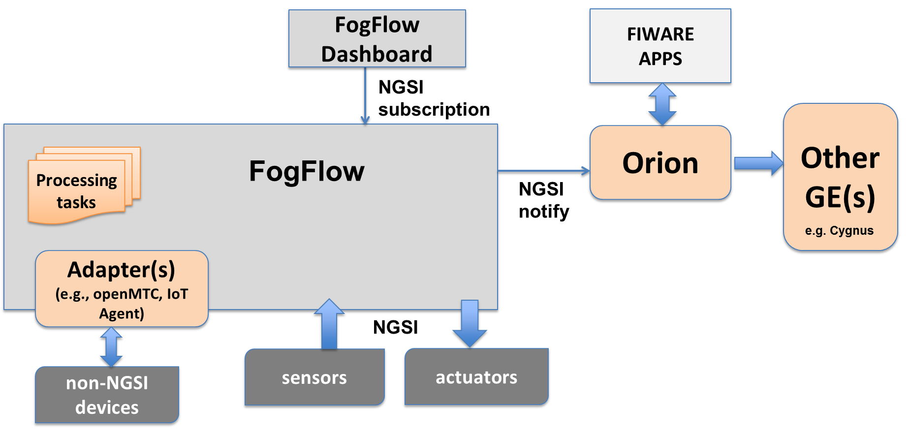
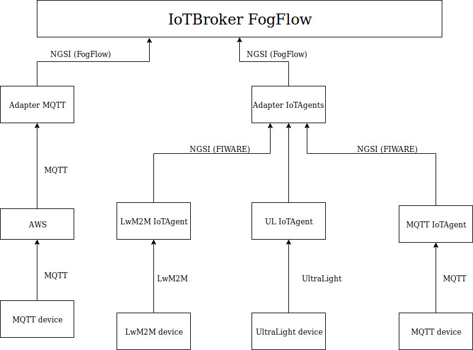

*****************************************
Integrate FogFlow with FIWARE
*****************************************

Since November 2017 FogFlow has been promoted as an incubated open source Generic Enabler (GE) in the FIWARE community. 
Within this community, FogFlow holds a unique position as Cloud-Edge Orchestrator 
to launch and manage dynamic data processing flows seamlessly over cloud and edges for data ingestion, 
transformation, and also advanced analytics. 

As illustrated by the following picture, FogFlow can interwork with other FIWARE GEs 
to power FIWARE-based IoT Platforms at the following two layers.
At the upper layer, FogFlow can interwork with Orion Broker 
via the standardized NGSI interface in the following two ways. 

Orion Broker as the Destination
---------------------------------------

The first way is to consider Orion Broker as the destination of any context information generated by a FogFlow IoT service. 
In this case a NGSI subscription must be issued by an external application or FogFlow Dashboard 
to ask FogFlow to forward the requested context updates to a specified Orion Broker. 

Here is the Javascript-based code example to show how your application can issue a subscription to FogFlow Broker,
using the URL of an existing Orion Broker as the destination. 
Notice that the integration is using the NGSI V2 interface of Orion Broker. 

.. code-block:: javascript

    // please refer to the JavaScript library, located at  https://github.com/smartfog/fogflow/tree/master/designer/public/lib/ngsi

    //  entityType: the type of context entities to be pushed to Orion Broker
    //  orionBroker: the URL of your running Orion Broker
    function subscribeFogFlow(entityType, orionBroker)
    {
        var subscribeCtxReq = {};    
        subscribeCtxReq.entities = [{type: entityType, isPattern: true}];
        subscribeCtxReq.reference =  'http://' + orionBroker + '/v2';
        
        client.subscribeContext4Orion(subscribeCtxReq).then( function(subscriptionId) {
            console.log(subscriptionId);   
            ngsiproxy.reportSubID(subscriptionId);		
        }).catch(function(error) {
            console.log('failed to subscribe context');
        });	
    }
    
    
    // client to interact with IoT Broker
    var client = new NGSI10Client(config.brokerURL);
    
    subscribeFogFlow('PowerPanel', 'cpaasio-fogflow.inf.um.es:1026');

To verify if the requested data has been pushed to your Orion Broker, 
you can send the following NGSI v2 query to check it. 

.. code-block:: console 

    curl localhost:1026/v2/entities?type=PowerPanel -s -S -H 'Accept: application/json'
    

Orion Broker as a Data Source
---------------------------------------

The second way is to consider Orion Broker as a data source to provide additional information. 
In this case we can implement a simple fog function to fetch any necessary information into the FogFlow system. 
In either way there is no need to make any change to the existing Orion-based FIWARE system. 
Therefore, this type of integration can be done fast with nearly zero effort.
At the low layer, for the integration with any Non-NGSI supported devices 
like MQTT, COAP, OneM2M, OPC-UA, LoRaWAN, 
FogFlow can reuse the modules of existing IoT agents and transform them into FogFlow adapters 
based on the fog function programming model. 
With these adapters FogFlow can dynamically launch necessary adapters for device integration directly at edges. 
This way FogFlow is able to talk with a wide range of IoT devices.

Currently, the MQTT based adapter has been provided and it is also open source in a seperated repository.
Please refer to https://github.com/smartfog/adapter 

In the future, we consider to provide an adapter to IoT-agents. As illustrated by the following figure, 
this adapter could be reused to integrate with all types of FIWARE IoT agents. 

