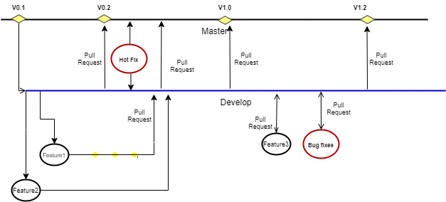

************************************
Contribution and Coding Guideline
************************************

FogFlow Contribution Guide
===========================

This document describes the guidelines to contribute to FogFlow. If you are
planning to contribute to the code you should read this document and get familiar with its content.

General principles
---------------------

* FogFlow uses GO programing language (although other  tools like test tools and other script can be written in python , java, bash ).
* Efficient code (i.e. the one that achieves better performance) is preferred upon inefficient code. Simple code
  (i.e. cleaner and shorter) is preferred upon complex code. Big savings in efficiency with small penalty in
  simplicity are allowed. Big savings in simplicity with small penalty in efficiency are also allowed.
* Code contributed to FogFlow must follow the `code style guidelines`_, in order to set a common programming style for all developers working in the code.

.. _`code style guidelines`: https://github.com/smartfog/fogflow/blob/fogflow_document_reconstruct/doc/en/source/guideline.rst#code-style-guidelines

Note that contribution workflows themselves (e.g. pull requests, etc.) are described in another document `FIWARE Development Guidelines`_, 

.. _`FIWARE Development Guidelines`: https://forge.fiware.org/plugins/mediawiki/wiki/fiware/index.php/Developer_Guidelines

Branch Management Guidelines 
-------------------------------

Community can have two main branches with an infinite lifetime:

1. **Master branch**:This is a highly stable branch that is always production-ready and contains the last release version of source code in production.
2. **Development branch**: Derived from the master branch, the development branch serves as a branch for integrating different features planned for an upcoming release. This branch may or may not be as stable as the master branch. It is where developers collaborate and merge feature branches.All of the changes should be merged back into master somehow and then tagged with a release number.

Apart from those two primary branches, there are other branches in the workflow:

- **Feature Branch**:Forked from the development branch for feature development i.e.enhancement or documnetation. Merged back to the development branch after feature development or enhacement implementation.

- **Bug Branch**:Ramify from the development branch.Merged back to the development branch after bug fixing.

- **Hotfix branch**:Hotfix branches are created from the master branch. It is the current production release running live and causing troubles due to a severe bug.But changes on development are yet unstable. We may then branch off a hotfix branch and start fixing the problem. It should be rarest occasion, in case only critical bugs.

**Note**:Only NLE and NECTI members have privilege to create and merge Hotfix branch.

.. list-table::  **Branch naming convention** 
   :widths: 20 40 40
   :header-rows: 1

   * - Branch				
     - Branches naming guideline	 		 
     - Remarks
     
   * - Feature branches
     - Must branch from: *development*. Must merge back into: *development* .Branch naming convention: *feature-feature_id*						
     - *feature_id* is the Github issue id from **https://github.com/smartfog/fogflow/issues**

   * - Bug Branches
     - Must branch from: *development*. Must merge back into: *development* .Branch naming convention: *bug-bug_id*						
     - *bug_id* is the Github issue id from **https://github.com/smartfog/fogflow/issues**

   * - Hotfix Branches
     - Must branch from: *master branch*.Must merge back into: *master branch*.Branch naming convention: *hotfix-bug number*.						
     - *Bug number* is the Github issue id from **https://github.com/smartfog/fogflow/issues**

Permissions to the branches:
*******************************

- **Master** - We tend to very strict that only NLE members and privileged members of NECTI can merge on Master branch and accept the pull requests. Pull requests to master can be raised by only NECTI OR NLE members. 

- **Development** - Any community member can raise the pull request to the development branch but it should be reviewed by NLE or NECTI members.Development branches commits will be moved to master branch only when all the test cases written under NGSI-LD test suites, will run successfully.

Code style guidelines
------------------------

Note that, currently not all FogFlow's existing code base conforms to these rules. There are some parts of the code that were
written before the guidelines were established. However, all new code contributions MUST follow these rules and, eventually, old code will be modified to conform to the guidelines.

**‘MUST follow’ rules**

**M1 (Headers Files Inclusion):**

*Rule*: All header or source files MUST include all the header files it needs AND NO OTHER header files. They MUST
NOT depend on inclusions of other header files. Also, all header and source files MUST NOT include any header files it
does not need itself.

*Rationale*: each file should not depend on the inclusions other files have/don’t have. Also, if a header file
includes more files than it needs, its ‘clients’ has no other choice than to include those ‘extra’ files as
well. This sometimes leads to conflicts and must be avoided. In addition, it increases the compilation time.

*How to check*: manually

**M2 (Copyright header)**

*Rule*: Every file, source code or not, MUST have a copyright header:

For Golang files:

.. code-block:: console  
        /*
        *
        * Copyright 20xx The FogFlow Authors.
        *
        * This file is part of FogFlow.
        *
        * Licensed under the Apache License, Version 2.0 (the "License");
        * you may not use this file except in compliance with the License.
        *
        * You may obtain a copy of the License at
        *
        *      http://www.apache.org/licenses/LICENSE-2.0
        *
        * Unless required by applicable law or agreed to in writing, software,
        * distributed under the License is distributed on an "AS IS" BASIS,
        * WITHOUT WARRANTIES OR CONDITIONS OF ANY KIND, either express or implied.
        * See the License for the specific language governing permissions and
        * limitations under the License.
        */

For Python, bash script etc.:

.. code-block:: console

        # Copyright 20XX FogFlow Authors.

        # This file is part of FogFlow.
        #
        # Licensed under the Apache License, Version 2.0 (the "License");
        # you may not use this file except in compliance with the License.
        # You may obtain a copy of the License at
        #
        #    http://www.apache.org/licenses/LICENSE-2.0
        #
        # Unless required by applicable law or agreed to in writing, software
        # distributed under the License is distributed on an "AS IS" BASIS,
        # WITHOUT WARRANTIES OR CONDITIONS OF ANY KIND, either express or
        # implied.
        # See the License for the specific language governing permissions and
        # limitations under the License.
        # For Python, bash script  etc.:

        # Author: <the author>

*Rationale*: to have a homogenous copyright header for all files.

*How to check*: manually

**M3 (Function header)**

*Rule*: All functions MUST have a header, which SHOULD have a short description of what the function does, a
descriptive list of its parameters, and its return values.

Example:

.. code-block:: console  

        /* ****************************************************************************
        *
        * parseUrl - parse a URL and return its pieces
        *
        *  [ Short description if necessary ]
        *
        * PARAMETERS
        *   - url         The URL to be examined
        *   - host        To output the HOST of the URL
        *   - port        To output the PORT of the URL
        *   - path        To output the PATH of the URL
        *   - protocol    To output the PROTOCOL of the URL
        *
        * RETURN VALUE
        *   parseUrl returns TRUE on successful operation, FALSE otherwise
        *
        * NOTE
        *   About the components in a URL: according to
        *   https://tools.ietf.org/html/rfc3986#section-3,
        *   the scheme component is mandatory, i.e. the 'http://' or 'https://' must
        *   be present, otherwise the URL is invalid.
        */

*Rationale*: the code is simply easier to read when prepared like this

*How to check*: manually

**M4 (Indent)**

*Rule*: Use only spaces (i.e. no tabs), and indent TWO spaces at a time.

*Rationale*: two whitespaces are enough. It does not makes the lines too long

*How to check*: manually

**M5 (Variable declaration):**

*Rule*: Each declared variable MUST go on a separate line:

.. code-block:: console

        var  i  int;
        var  j  int;

The following usage MUST be avoided:

.. code-block:: console  

        var  i, j, k int;

*Rationale*: easier to read.

*How to check*: manually

**M6 (Naming conventions):**

*Rule*: the following naming conventions apply:

* A name must begin with a letter, and can have any number of additional letters and numbers.
* A function name cannot start with a number.
* A function name cannot contain spaces.
* If the functions with names that start with an uppercase letter will be exported to other packages. If the function name starts with a lowercase letter, it won't be exported to other packages, but you can call this function within the same package.
* If a function name consists of multiple words, use camel case to represent such names, for example: empName, empAddress, etc.
* function names are case-sensitive (car, Car and CAR are three different variables).

*Rationale*: this rule makes it easy to understand.

*How to check*: manually

**M7 (Use gofmt before commit for indentation and other formatting):**

*Rule*: gofmt -r '(a) -> a' -w FileName

* Code before applying gofmt

.. code-block:: console  

        package main
                  import "fmt"
        // this is demo to format code
                   // with gofmt command
        var a int=2;
                   var b int=5;
                            var c string= `hello world`;
                   func print(){
                                fmt.Println("Value for a,b and c is : ");
                                  fmt.Println(a);
                                       fmt.Println((b));
                                             fmt.Println(c);
                               }

* Code after applying rule

.. code-block:: console

        package main
 
        import "fmt"
 
        // this is demo to format code
        // with gofmt command
        var a int = 2
        var b int = 5
        var c string = `hello world`
 
        func print() {
                fmt.Println("Value for a,b and c is : ")
                fmt.Println(a)
                fmt.Println((b))
                fmt.Println(c)
                     }

*Note use gofmt /path/to/package for package formating.

*Rationale*: This will reformat the code and updates the file.

*How to check*: manually

**M8 (Command & operators separation):**

*Rule*: operators (+, *, =, == etc) are followed and preceded by ONE space. Commas are followed by ONE space.

.. code-block:: console

        FogFunction(va`r1, var2, var3) {
	        if (var1 == var2) {
  		         var2 = var3;
	         }
        }

not

.. code-block:: console

        FogFunction(var1,var2,var3) {
	        if (var1==var2) {
  		        var1=var3;
	         }
        }

*Rationale*: easier on the eye.

*How to check*: manually

**‘MUST follow’ rules**

**S1 (Error management):**

*Rule*: Error returned in the second argument should be managed.

* Bad implementation

.. code-block:: console

        FogContextElement, _ := preprocess(UpdateContextElement)

* Good implementation

.. code-block:: console

        preprocessed, err := preprocess(bytes)
        if err != nil {
          return Message{}, err
         }

**S2 (Error printing message):**

*Rule*: An error string shall neither be capitalized nor end with a punctuation according to Golang standards.

* Bad implementation

.. code-block:: console

        if len(in) == 0 {
         return "", fmt.Errorf("Input is empty")
         }

* Good implementation

.. code-block:: console

        if len(in) == 0 {
	        return nil, errors.New("input is empty")
         }

**S3 (Avoid nesting):**

*Rule*: avoid nesting while writing the code.

* Bad implementation

.. code-block:: console

        func FogLine(msg *Message, in string, ch chan string) {
            if !startWith(in, stringComment) {
                token, value := parseLine(in)
                  if token != "" {
                      f, contains := factory[string(token)]
                        if !contains {
                            ch <- "ok"
                        } else {
                           data := f(token, value)
                           enrichMessage(msg, data)
                           ch <- "ok"
                        }
                        } else {
                            ch <- "ok"
                            return
                         }
                         } else {
                            ch <- "ok"
                            return
                   }
          }

* Good implemetation

.. code-block:: console

        func FogLine(in []byte, ch chan interface{}) {
            // Filter empty lines and comment lines
            if len(in) == 0 || startWith(in, bytesComment) {
               ch <- nil
               return
            }
 
            token, value := parseLine(in)
            if token == nil {
                  ch <- nil
                  log.Warnf("Token name is empty on line %v", string(in))
                  return
            }

            sToken := string(token)
            if f, contains := factory[sToken]; contains {
                  ch <- f(sToken, value)
                  return
            }

            log.Warnf("Token %v is not managed by the parser", string(in))
            ch <- nil
        }

**S4 (Preconditions)**

*Rule*: we strongly recommend for functions to evaluate the parameters and if necessary return error, before starting to process. 

* Bad implementation

.. code-block:: console

        a, err := f1()
        if err == nil {
        b, err := f2()
            if err == nil {
                return b, nil
            } else {
                return nil, err
          }
        } else {
            return nil, err
         }

* Good implementation

.. code-block:: console

        a, err := f1()
        if err != nil {
            return nil, err
        }
        b, err := f2()
        if err != nil {
            return nil, err
        }
        return b, nil

**S5 (If condition)**

*Rule*: Go have some improved version in if condition 

* Bad implementation in Golang

.. code-block:: console

        f, contains := array[index]
        if contains {
            // Do something
        }

* Good implementation

.. code-block:: console

        if f, contains := array[index]; contains {
            // Do something
        }

**S5 (Switch)**

*Rule*: always use default with switch condition.

* Bad implementation

.. code-block:: console

        switch simpleToken.token {
        case tokenTitle:
            msg.Title = value
        case tokenAdep:
            msg.Adep = value
        case tokenAltnz:
            msg.Alternate = value 
         // Other cases
        }

* Good implementation 

.. code-block:: console

        switch simpleToken.token {
        case tokenTitle:
            msg.Title = value
        case tokenAdep:
            msg.Adep = value
        case tokenAltnz:
            msg.Alternate = value
        // Other cases    
        default:
            log.Errorf("unexpected token type %v", simpleToken.token)
            return Message{}, fmt.Errorf("unexpected token type %v", simpleToken.token)
        }

**S5 (Constants management)**

*Rule*:Constant value should be managed by ADEXP and ICAO message

* Bad implementation

.. code-block:: console

        const (
            AdexpType = 0 // TODO constant
            IcaoType  = 1
        )

* Good implementation 

.. code-block:: console

        const (
            AdexpType = iota
            IcaoType 
        )

