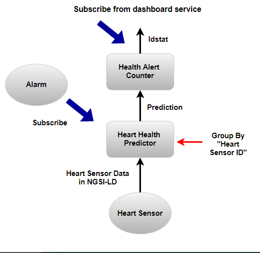
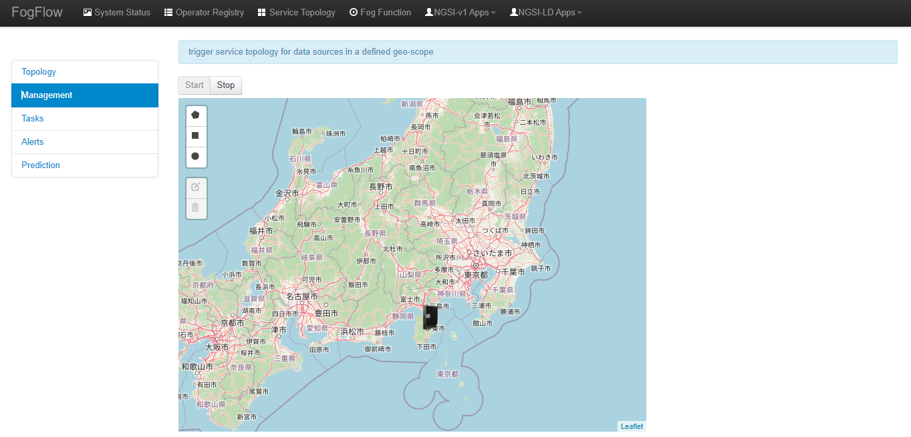
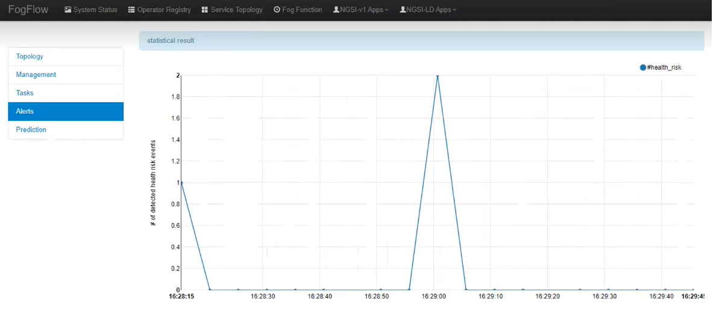
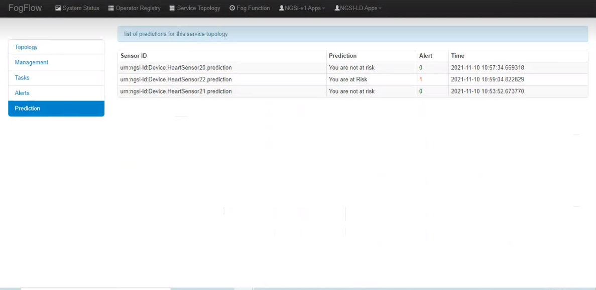
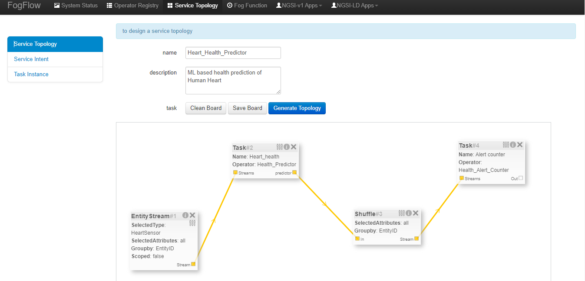

**************************************************************
Heart Health Prediction' example of NGSI-LD based operator
**************************************************************

Use case on Heart Health Prediction
========================================

This use case study is designed for prediction of heart health and generate alert based on the unhealthy heart condition. This use-case can be deployed for both individual as well as organisational (such as hospitals) purpose.
As illustrated in the following picture, there is a heart sensor that will send all the heart-related data to Fogflow. 
The data which will be received from heart sensor will be of NGSI-LD format. 
Each Health sensor is associated with a patient. The sole purpose of the Heart Sensor is to monitor  and send data in NGSI-LD format to Fogflow.
Heart Health Predictor is a task which tells whether the heart condition is at risk or not. 
If the state of heart is at risk then Heart Health Predictor will become 1 and it will generate an alert. Otherwise if the state of heart is healthy and not at risk then in that case Heart Health Predictor will become 0. 
As shown in the figure below, the information is passed from Heart Health Prediction to Health Alert Counter in case the output(Prediction) from Heart Health Predictor shows that the heart is at risk. Once an abnormal heart condition is detected, 
the alert mechanism is triggered to inform the health officials. 
The aggregated information can also be subscribed via a dashboard service. 

* Heart Health Predictor: this operator is used to detect abnormal heart conditions on the collected data from heart sensor associated with the patient. Heart sensor provides following data to Heart Health Predictor:

	* Age: age of the patient [years]
   	* Sex: Gender of the patient [0: Male, 1: Female]
	* ChestPainType: chest pain type [0: Typical Angina, 1: Atypical Angina, 2: Non-Anginal Pain, 3: Asymptomatic]
   	* RestingBP: resting blood pressure [mm Hg]
	* Cholesterol: serum cholesterol [mm/dl]
   	* FastingBS: fasting blood sugar [1: if FastingBS > 120 mg/dl, 0: otherwise]
	* RestingECG: resting electrocardiogram results [0: Normal, 1: having ST-T wave abnormality (T wave inversions and/or ST elevation or depression of > 0.05 mV), 2: showing probable or definite left ventricular hypertrophy by Estes' criteria]
   	* MaxHR: maximum heart rate achieved [Numeric value between 60 and 202]
	* ExerciseAngina: exercise-induced angina [0: Yes, 1: No]
   	* Oldpeak: oldpeak = ST [Numeric value measured in depression]
	* ST_Slope: the slope of the peak exercise ST segment [0: upsloping, 1: flat, 2: downsloping]
   	* CirculatorySystemVessels: The number of major vessels (0-3)
	* Thalassemia: A blood disorder called thalassemia (1 = normal; 2 = fixed defect; 3 = reversable defect)
	* Target: Heart disease (0 = no, 1 = yes)
	
* Heart Alert Counter: this operator is to generate alert whenever the Heart health Predictor detects patient with risk of heart failure.  

There are two types of result consumers: 

(1)  a dashboard service in the cloud, which subscribes to the final alerts generated by the Heart Alert Counter operator for the global scope; 
(2)  the alarm which subscribes to the heart failure risk events generated by the Heart Health Predictor task on the local edge node associated with the patient. 

Heart Health Predictor Menu 
-----------------------------------------------------------------------
As shown in the figure menu of this use case, we have 5 tabs namely: Topology, Management, Tasks, Alert and Prediction.
.. figure:: figures/Heart_menu.png

#. Topology, includes
    * The brief pictorial representation of the use-case.
    * It can be used to used the flow and the working of the use-case.

#. Mangement, includes
    * Start/Stop Button.
    * This Start/Stop Button is to used to start the service intent. Without firing service intent, no tasks will run. 	

#. Alert, includes
    * The graphical representation of alerts generated whenever predictor predicts that the state of heart is at risk based upon the data that is coming from heart sensor.

#. Prediction, includes
    * The decision whether the patient's heart is at risk or not. The prediction is sent to the Heart Alert Counter operator which sends the alert in case the heart is at risk. 

Implement your operator functions required in your service topology
-----------------------------------------------------------------------

Before you can define the designed service topology, 
all operators used in your service topology must be provided by you or the other provider in the FogFlow system.
As shown in the figure below, for  this specific use case, we need to implement two operators: Health_predictor and Health_alert_operator. 
Please refer to the examples provided in our code repository. 

* `Heart_Health_NGSI-LD_Operator`_ 

* `Heart_Health_Predictor`_ 

.. _`Health_alert_operator`: https://github.com/smartfog/fogflow/tree/Catalogue_Creation/application/operator/NGSI-LD-operator/HeartPredictor2
.. _`Health_predictor`: https://github.com/smartfog/fogflow/tree/Catalogue_Creation/application/operator/NGSI-LD-operator/HeartPredictor2

Specify a service topology
-----------------------------------
Assume that the tasks to be used in your service topology have been implemented and registered,
you can have two ways to specify your service topology. 

using FogFlow Topology Editor
--------------------------------

The first way is to use the FogFlow editor to specify a service topology.  

As seen in the picture, the following important information must be provided. 

#. define topology profile, including
    * topology name: In this use-case, topology name is 'Heart_Health_Predictor'.
    * service description: In this use-case, description provided is 'ML based health prediction of Human Heart'.

#. draw the graph of data processing flows within the service topology
    With a right click at some place of the design board, you will see a menu pops up 
    and then you can start to choose either task or Entity streams or shuffle
    to define your data processing flows according to the design you had in mind. 
	In this particular use case we have one Entity Stream, two Operators and one Shuffle. 
	
#. define the profile for each element in the data flow, including
    As shown in the above picture, you can start to specify the profile of each element in the data processing flow
    by clicking the configuration button.
    
    The following information is required to specify a task profile.
	
    * name: the name of the task 
    * operator: the name of the operator that implements the data processing logic of this task; please register your operator beforehand so that it can be shown from the list
    * entity type of output streams: to specify the entity type of the produced output stream.
    
    The following information is required to specify an EntityStream Profile.

    * SelectedType: is used to define what Entity Type will be chosen by the task as its Input Stream
    * SelectedAttributes: is used to define what attribute (or attributes) of the Selected Entity Type will be considered for changing the state of a task.
    * Groupby: to determine how many instances of this task should be created on the fly; currently including the following cases
	
        *  if there is only one instance to be created for this task, please use "groupby" = "all"
        *  if you need to create one instance for each entity ID of the input streams, please user "groupby" = "entityID"
        *  if you need to create one instance for each unique value of some specific context metadata, please use the name of this registered context metadata
    
    * Scoped: tells if the Entity data are location-specific or not. True indicates that location-specific data are recorded in the Entity and False is used in case of broadcasted data, for example, some rule or threshold data that holds true for all locations, not for a specific location.

    Shuffling element serves as a connector between two tasks such that output of a task is the input for the shuffle element and same is forwarded by Shuffle to another task (or tasks) as input.

using NGSI Update to create it
-------------------------------------

Another way is to register a service topology by sending a constructed NGSI update message to the IoT Broker deployed in the cloud. 

.. note:: The Curl case assumes that the cloud IoT Broker is running on localhost on port 8070.

   .. group-tab:: curl

        .. code-block:: console 

		curl -iX --location --request POST '192.168.21.232:8070/ngsi-ld/v1/entityOperations/upsert' \
			--header 'Content-Type: application/json' \
			--header 'Accept: application/ld+json' \
			--header 'Link: <{{link}}>; rel="http://www.w3.org/ns/json-ld#context"; type="application/ld+json"' \
			--data-raw '[
				{
				"id": "urn:ngsi-ld:Device.HeartSensor53",
				"type": "HeartSensor",
				"age": {
					  "type": "Property",
					  "value": 70
					  },
				"sex": {
					  "type": "Property",
					  "value": 1
					  },
				"cp": {
					  "type": "Property",
					  "value": 0
					   },
				"trestbps": {
					  "type": "Property",
					  "value": 145
					   },
				"chol": {
					  "type": "Property",
					  "value": 145
					   },
				"chol": {
					  "type": "Property",
					  "value": 145
					   },
				"fbs": {
					  "type": "Property",
					  "value": 0
					   },
				"restecg": {
					  "type": "Property",
					  "value": 1
					   },
				"thalach": {
					  "type": "Property",
					  "value": 125
					   },
				"exang": {
					  "type": "Property",
					  "value": 1
					   },
				"oldpeak": {
					  "type": "Property",
					  "value": 2.6
					   },
				"slope": {
					  "type": "Property",
					  "value": 0
					  },
				"ca": {
					  "type": "Property",
					  "value": 0
					  },
				"thal": {
					  "type": "Property",
					  "value": 3
					  },
					  "location": {
						"type": "GeoProperty",
						"value": {
						  "type": "Point",
						  "coordinates": [
							35.7,
							138
						  ]
						}
					 }
				   }
				]'
