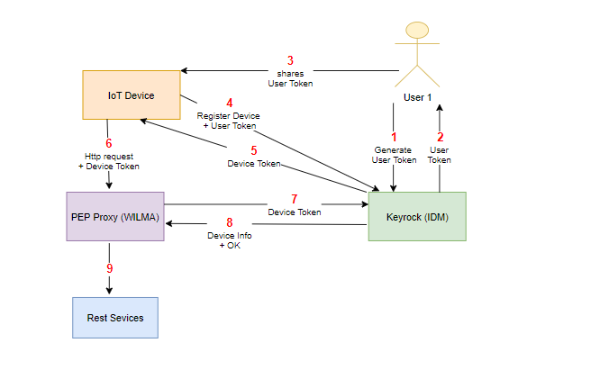
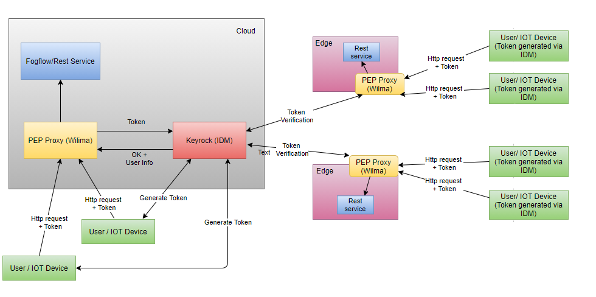
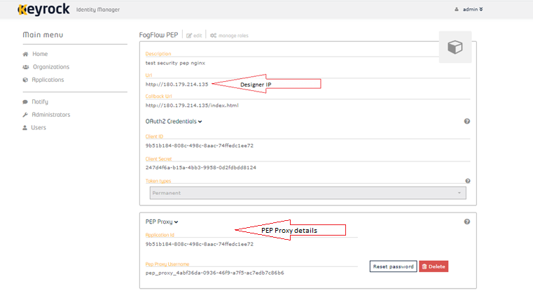
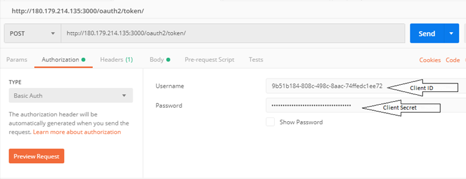
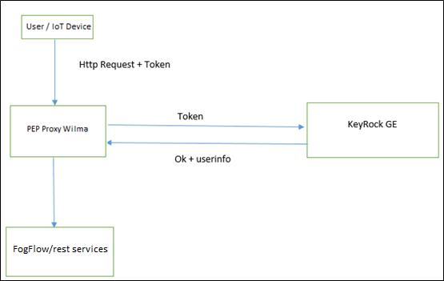
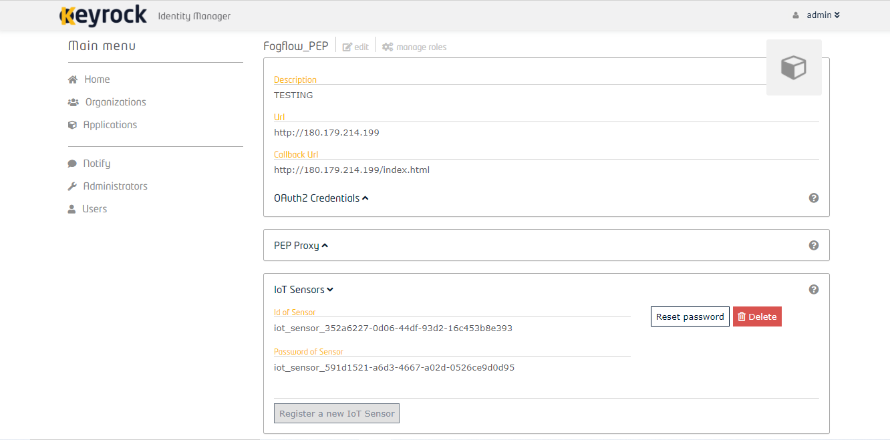
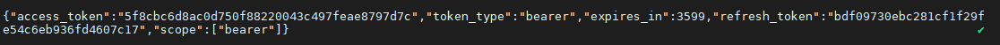

*****************************************************************
Security
*****************************************************************

HTTPs-based communication
=================================

Secure the cloud-edge communication
------------------------------------------
To secure the communication between the FogFlow cloud node and the FogFlow edge nodes, 
FogFlow can be configured to use HTTPs for the NGSI9 and NGSI10 communication, 
which is mainly for data exchange between cloud node and edge nodes, or between two edge nodes. 
Also, the control channel between Topology Master and Worker can be secured by enabling TLS in RabbitMQ. 
The introduction steps to secure the data exchange between one FogFlow cloud node and one FogFlow edge node. 

Configure DNS server
-----------------------------

As illustrated by the following picture, in order to set up FogFlow to support the HTTPs-based communication, 
the FogFlow cloud node and the FogFlow edge node are required to have their own domain names, 
because their signed certificates must be associated with their domain namers.
Therefore, DNS service is needed to be used to resolve the domain names for both the cloud node and the edge node. 
For example, `freeDNS`_ can be used for this purpose. 

.. _`freeDNS`: https://freedns.afraid.org

.. figure:: figures/https-setup.png

.. important:: 

	please make sure that the domain names of the cloud node and the edge node can be properly resolved
	and correct IP address can be seen.  
	

Set up the FogFlow cloud node
------------------------------------

Fetch all required scripts
--------------------------------------------

Download the docker-compose file and the configuration files as below.

.. code-block:: console    

	# download the script that can fetch all required files
	wget https://raw.githubusercontent.com/smartfog/fogflow/master/docker/core/https/fetch.sh
	
	# make this script executable
	chmod +x fetch.sh

	# run this script to fetch all required files
	./fetch.sh

Change the configuration file
--------------------------------------------

.. code-block:: console    
	
	{
	    "coreservice_ip": "cloudnode.fogflow.io",   #change this to the domain name of your own cloud node 
	    "external_hostip": "cloudnode.fogflow.io",  #change this to the domain name of your own cloud node 
		...
	}

Generate the key and certificate files
--------------------------------------------

.. code-block:: console    

	# make this script executable
	chmod +x key4cloudnode.sh

	# run this script to fetch all required files
	./key4cloudnode.sh  cloudnode.fogflow.io

Start the FogFlow components on the cloud node
-----------------------------------------------

.. code-block:: console    

	docker-compose up -d 

Validate setup
--------------------------------------------

.. code-block:: console    

    docker ps 

	CONTAINER ID      IMAGE                       COMMAND                  CREATED             STATUS              PORTS                                                 NAMES
	90868b310608      nginx:latest            "nginx -g 'daemon of…"   5 seconds ago       Up 3 seconds        0.0.0.0:80->80/tcp                                       fogflow_nginx_1
	d4fd1aee2655      fogflow/worker          "/worker"                6 seconds ago       Up 2 seconds                                                                 fogflow_cloud_worker_1
	428e69bf5998      fogflow/master          "/master"                6 seconds ago       Up 4 seconds        0.0.0.0:1060->1060/tcp                               fogflow_master_1
	9da1124a43b4      fogflow/designer        "node main.js"           7 seconds ago       Up 5 seconds        0.0.0.0:1030->1030/tcp, 0.0.0.0:8080->8080/tcp       fogflow_designer_1
	bb8e25e5a75d      fogflow/broker          "/broker"                9 seconds ago       Up 7 seconds        0.0.0.0:8070->8070/tcp                               fogflow_cloud_broker_1
	7f3ce330c204      rabbitmq:3              "docker-entrypoint.s…"   10 seconds ago      Up 6 seconds        4369/tcp, 5671/tcp, 25672/tcp, 0.0.0.0:5672->5672/tcp     fogflow_rabbitmq_1
	9e95c55a1eb7      fogflow/discovery       "/discovery"             10 seconds ago      Up 8 seconds        0.0.0.0:8090->8090/tcp                               fogflow_discovery_1
        399958d8d88a      grafana/grafana:6.5.0   "/run.sh"                29 seconds ago      Up 27 seconds       0.0.0.0:3003->3000/tcp                               fogflow_grafana_1
        9f99315a1a1d      fogflow/elasticsearch:7.5.1 "/usr/local/bin/dock…" 32 seconds ago    Up 29 seconds       0.0.0.0:9200->9200/tcp, 0.0.0.0:9300->9300/tcp       fogflow_elasticsearch_1
        57eac616a67e      fogflow/metricbeat:7.6.0 "/usr/local/bin/dock…"   32 seconds ago     Up 29 seconds                                                                  fogflow_metricbeat_1
	

Set up the FogFlow edge node
-------------------------------------

Fetch all required scripts
--------------------------------------------

Download the docker-compose file and the configuration files as below.

.. code-block:: console    

	# download the script that can fetch all required files
	wget https://raw.githubusercontent.com/smartfog/fogflow/master/docker/edge/https/fetch.sh
	
	# make this script executable
	chmod +x fetch.sh

	# run this script to fetch all required files
	./fetch.sh

Change the configuration file
--------------------------------------------

.. code-block:: console    
	
	{
	    "coreservice_ip": "cloudnode.fogflow.io",   #change this to the domain name of your own cloud node 
	    "external_hostip": "edgenode1.fogflow.io",  #change this to the domain name of your own edge node 
		...
	}

Generate the key and certificate files
--------------------------------------------

.. code-block:: console    

	# make this script executable
	chmod +x key4edgenode.sh

	# run this script to fetch all required files
	./key4edgenode.sh  edgenode1.fogflow.io

Start the FogFlow components on the edge node
------------------------------------------------

.. code-block:: console    

	docker-compose up -d 

Validate setup
--------------------------------------------

.. code-block:: console    

	docker ps 

	CONTAINER ID        IMAGE               COMMAND             CREATED              STATUS              PORTS                                      NAMES
	16af186fb54e        fogflow/worker      "/worker"           About a minute ago   Up About a minute                                              https_edge_worker_1
	195bb8e44f5b        fogflow/broker      "/broker"           About a minute ago   Up About a minute   0.0.0.0:80->80/tcp, 0.0.0.0:443->443/tcp   https_edge_broker_1
	

Check system status via FogFlow Dashboard
-----------------------------------------------

FogFlow dashboard can be opened in web browser to see the current system status via the URL: https://cloudnode.fogflow.io/index.html

.. important:: 

	please make sure that the domain names of the cloud node can be properly resolved. 

	If self-signed SSL certificate is being used, a browser warning indication can be seen that the crtificate should not be trusted.
	It can be proceeded past this warning to view the FogFlow dashboard web page via https.

Secure FogFlow using Identity Management
==========================================

Identity management(IdM) is a process for identifying, authenticating individuals or groups to have access to applications or system by associating some auth token with established identities. IdM is the task of controlling data about users or applications. In this tutorialFogFlow Designer security implementation and secure Cloud-Edge communication is explained and tested.

Terminology
---------------

**Keyrock**: `Keyrock`_ is the FIWARE component responsible for Identity Management. Keyrock also provide feature to add OAuth2-based authentication and authorization security in order to secure services and applications.

**PEP Proxy Wilma**: `PEP Proxy Wilma`_ is a FIWARE Generic Enabler that enhances the performance of Identity Management. It combines with Keyrock to secure access to endpoints exposed by FIWARE Generic Enablers. Wilma listens for any request, authenticates it from Keyrock and stores it in its cache for a limited period of time. If a new request arrives, Wilma will first check in its cache and if any grant is stored, it will directly authenticate otherwise it will send the request to Keyrock for authentication. 

.. _`Keyrock`: https://fiware-idm.readthedocs.io/en/latest/
.. _`PEP Proxy Wilma`: https://fiware-pep-proxy.readthedocs.io/en/latest/

**Single IoT Device Interaction with FogFlow**

**Multiple IoT Device Interaction with FogFlow**

Note: Red markers represent IoT Device interaction with cloud and  green markers represent IoT Device interaction with Edge Node

 

**Flow of Requests as shown in diagram:**

**Step 1** : User will make a request to IDM using his credentials to generate  user access token specific for that user. For example:

.. code-block:: console
        

	curl --include \
        --request POST \
        --header "Content-Type: application/json" \
        --data-binary "{
     	\"name\": \"admin@test.com\",
     	\"password\": \"1234\"
   	}" \
   	"http://KEYROCK_IP_ADDRESS:3000/v1/auth/tokens" 

 

**Step 2** : IDM will return an user access token in response of request made in first step.

**Step 3** : User shares his access token ( i.e. User Access Token ) to IoT Device.

**Step 4** : Then IoT devices get registered using the user access token and in response, it gets device credentials(ID and password) as shown in `below`_ topics.

.. _`below`: https://fogflow.readthedocs.io/en/latest/https.html#register-iot-device-on-keyrock

**Step 5** : IoT Device then make access token request using above device credentials and in response, it gets device access token.

**Step 6** : Now, using the above device access token, the IoT Device can interact with Edge node via making Fogflow specific requests to PEP Proxy port.

Cloud and Edge Interaction with IDM 
------------------------------------

**FogFlow cloud node flow:**

1. As in architecture diagram, PEP Proxy will register itself on behalf FogFlow Designer first on Keyrock. Detail explanation is given in `below`_ topics of this tutorial.

2. User can access Designer via PEP proxy proxy by using the access-token of PEP proxy in reaquest header.

.. _`below`: https://fogflow.readthedocs.io/en/latest/https.html#setup-security-components-on-cloud-node

**FogFlow edge node flow:**

1. On behalf of edge node, one instance of PEP Proxy will be pre-registered on keyrock, edge will be using oauth credentials to fetch PEP Proxy  details. Detail explanation is given in below topics of this tutorial. Click `here`_ to refer.

2. After the authentication edge node will be able to communicate with FogFlow cloud node.

3. Any device can register itself or communicate with FogFlow edge node using  access-token generated on behalf of each IoT Device registered at Keyrock.

.. _`here`: https://fogflow.readthedocs.io/en/latest/https.html#setup-components-on-edge

Installation
------------------

.. code-block:: console

        # the docker-compose file to start security components on the cloud node
	wget https://raw.githubusercontent.com/smartfog/fogflow/master/docker/core/http/docker-compose.idm.yml

	# the configuration file used by IdM
	wget https://raw.githubusercontent.com/smartfog/fogflow/master/docker/core/http/idm_config.js

        # the configuration file used by PEP Proxy
        wget https://raw.githubusercontent.com/smartfog/fogflow/master/docker/core/http/pep_config.js

Change the IP configuration accordingly
-------------------------------------------------------------

Configuration file need to be modified at the following places with IP addresses  according to user own environment.

- Change PEP Proxy host-port and container port in docker-compose.idm.yml file.

- Change the IdM config file at following places as per the environment.

.. code-block:: console

        
        config.port = 3000;
        config.host = "http://<IdM IP>:" + config.port;

        config.database = {
            host: "localhost",
            password: "idm",
            username: "root",
            database: "idm",
            dialect: "mysql",
            port: undefined
        };

Start all Security components:

.. code-block:: console

        docker-compose -f docker-compose.idm.yml up -d

        #Check all the containers are Up and Running using "docker ps -a"
         docker ps -a
	 

Setup security components on Cloud node
-------------------------------------------------

Below are the steps that need to be done to setup communication between IdM components.

**Step1**: Authenticate PEP Proxy itself with Keyrock Identity Management.

Login to Keyrock (http://180.179.214.135:3000/idm/)  account with user credentials i.e. Email and Password. 
    For Example: admin@test.com and 1234.
    
After Login, Click “Applications” then ”FogFLow PEP”.
Click “PEP Proxy” link to get Application ID , PEP Proxy Username and PEP Proxy Password.

Note: 
Application ID , PEP Proxy Username and PEP Proxy Password will generate by clicking ‘Register PEP Proxy’ button.

To setup PEP proxy for securing Designer, change the followings inside the pep_config file. Get PEP Proxy Credentials from Keyrock Dashboard while registering an application. 

.. code-block:: console

        config.pep_port = process.env.PEP_PROXY_PORT || 80;
        config.idm = {
          host: process.env.PEP_PROXY_IDM_HOST || '180.179.214.135',
          port: process.env.PEP_PROXY_IDM_PORT || 3000,
          ssl: toBoolean(process.env.PEP_PROXY_IDM_SSL_ENABLED, false),
        };
        config.app = {
          host: process.env.PEP_PROXY_APP_HOST || '180.179.214.135',
          port: process.env.PEP_PROXY_APP_PORT || ’80’,
          ssl: toBoolean(process.env.PEP_PROXY_APP_SSL_ENABLED, false), // Use true if the app server listens in https
        };

        config.pep = {
          app_id: process.env.PEP_PROXY_APP_ID || '9b51b184-808c-498c-8aac-74ffedc1ee72',
          username: process.env.PEP_PROXY_USERNAME || 'pep_proxy_4abf36da-0936-46f9-a7f5-ac7edb7c86b6',
          password: process.env.PEP_PASSWORD || 'pep_proxy_fb4955df-79fb-4dd7-8968-e8e60e4d6159',
          token: {
              secret: process.env.PEP_TOKEN_SECRET || '', // Secret must be configured in order validate a jwt
          },
          trusted_apps: [],
        };

Restart the PEP Proxy container after above changes.

**Generate Access Token** 

**Step2**: Request Keyrock IDM to generate access-token and refresh token.

1. Set the HTTP request Header, payload and Authorization field as per below screen shots.

2. Click “Send” Button to get access-token.

Note: Obtain Client ID and Client Secret from Keyrock dashboard under ‘Oauth2 Credentials’

The flow of cloud security implementation can be understand by below figure.

Below are some points related to above architecture diagram:

1. Access-token should be already known to user.

2. For an application designer register a pep proxy to keyrock.

3. Keyrock will send access-token to pep.

4. Using that token user will send create entity request to designer.

5. Designer will send token to keyrock to authenticate.

6. Entity creation request will transfer to FogFlow.

**entity Registration using token_access**

.. code-block:: console

        curl -iX POST   'http://<Cloud_Public_IP>:<PEP_Host-port>/ngsi10/updateContext'  -H 'X-Auth-Token: <token>'  -H 'Content-Type: application/json' 
     -d '
      {
        "contextElements": [
          {
           "entityId": {
              "id": "Temperature100",
              "type": "Temperature",
              "isPattern": false
          },
           "attributes": [
              {
              "name": "temp",
              "type": "float",
              "value": 34
              }
            ],
           "domainMetadata": [
             {
              "name": "location",
              "type": "point",
              "value": {
                "latitude": 49.406393,
                "longitude": 8.684208
               }
             }
            ],
         "updateAction": "UPDATE"
         }
       ]
      }'

Setup components on Edge
-------------------------

FogFlow edge node mainly contains edge broker and edge worker. To secure FogFlow edge communication between Iot device and edge node, PEP Proxy has been used. In order to create an Auth Token, firstly register an IoT device  on Keyrock. So, a script will call with the start of edge node and it will instantiate a PEP Proxy  with the keyrock and also setup configuration file for PEP Proxy to work, using the Keyrock APIs. The script will perform following steps:

**Prerequisite**

Two commands need to install before setup edge:

1. Curl

2. jq

scripts Installation
---------------------

Below scripts need to download for setting up edge node.

.. code-block:: console    
         
	#download the deployment scripts
	wget https://raw.githubusercontent.com/smartfog/fogflow/development/docker/edge/http/start.sh
	wget https://raw.githubusercontent.com/smartfog/fogflow/development/docker/edge/http/stop.sh 
        wget https://raw.githubusercontent.com/smartfog/fogflow/development/docker/edge/http/script.sh
        wget https://raw.githubusercontent.com/smartfog/fogflow/development/docker/edge/http/oauth_config.js
	wget https://raw.githubusercontent.com/smartfog/fogflow/development/docker/edge/http/pep-config.js

        #make them executable
        chmod +x script.sh start.sh stop.sh 

Change the IP configuration accordingly
-------------------------------------------------------------

Chanage the following things in configuration file:

* Change the oauth_config.js and add IdM IP, Edge IP which is needed to fetch configuration settings  for PEP Proxy.

**Start Edge node components**
 
.. code-block:: console    

      #start components in the same script
      ./start.sh 

To secure FogFlow edge-IoT device communication Auth Token has been used on behalf of each IoT device. In order to create an Auth Token, 

* An IoT device is needed to be registered on Keyrock. 

* A script will be called with the start of edge node and it will configure PEP Proxy with keyrock on behalf of that edge node using the Keyrock APIs. 

Note: the start.sh script will return  Application ID, Application Secret, PEP Proxy ID, PEP Proxy Secret, Authorization code, IDM Token and the access token on console. Please save these for further use.

Register IoT Device on Keyrock
------------------------------

An example request to register IoT Device is given below 

.. code-block:: console

   curl --include \
     --request POST \
     --header "Content-Type: application/json" \
     --header "X-Auth-token: <token-generated-from-script>" \
  'http://keyrock/v1/applications/6e396def-3fa9-4ff9-84eb-266c13e93964/iot_agents'

Note: Please save the device Id and device password for further utilisation
 

An example request to generate Auth token for each registered IoT sensor is given below

.. code-block:: console
   
    curl -iX POST \
     'http://<IDM_IP>:3000/oauth2/token' \
     -H 'Accept: application/json' \
     -H 'Authorization: Basic <code-generated-from-script>' \
     -H 'Content-Type: application/x-www-form-urlencoded' \
     --data "username=iot_sensor_02bc0f75-07b5-411a-8792-4381df9a1c7f&password=iot_sensor_277bc253-5a2f-491f-abaa-c7b4e1599d6e&grant_type=password"
 

Note: Please save the Access Token for further utilisation

Register Device on Edge Node
----------------------------

An example payload of registration device is given below.

.. code-block:: console
 

     Curl -iX POST 'http://<Application_IP>:<Application_Port>/NGSI9/registerContext' -H 'Content-Type: application/json' -H 'fiware-service: openiot' -H 'X-Auth-token: <token-generated-for-IoT-device>' -H 'fiware-servicepath: /' -d '
      {
          "contextRegistrations": [
              {
                  "entities": [
                      {
                          "type": "Lamp",
                          "isPattern": "false",
                          "id": "Lamp.0020"
                      }
                  ], 
                  "attributes": [
                      {
                          "name": "on",
                          "type": "command"
                      },
                      {
                          "name": "off",
                          "type": "command"
                      }
                  ],
                  "providingApplication": "http://0.0.0.0:8888"
              }
          ],
        "duration": "P1Y"
      }'

**Stop Edge Node Components**

* Use the below script to stop edge components that is broker and worker.

.. code-block:: console

       #stop all components in the same script
       ./stop.sh
