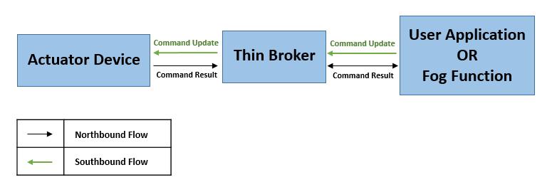
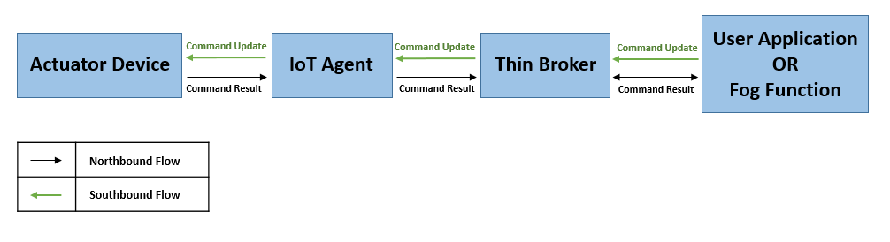
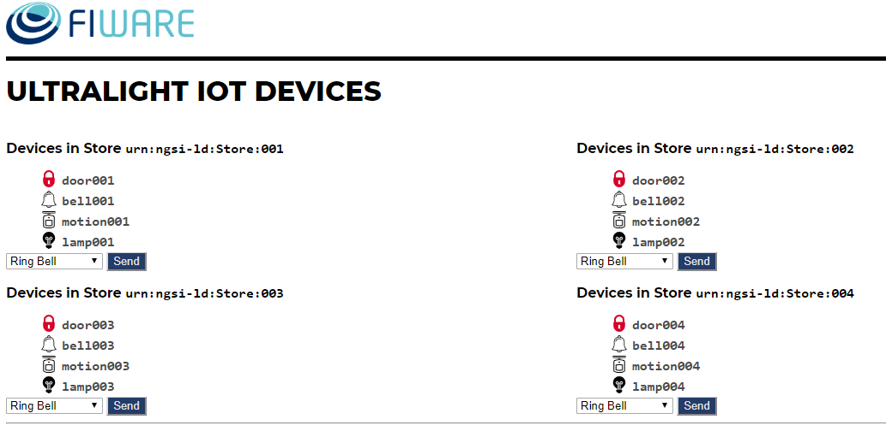
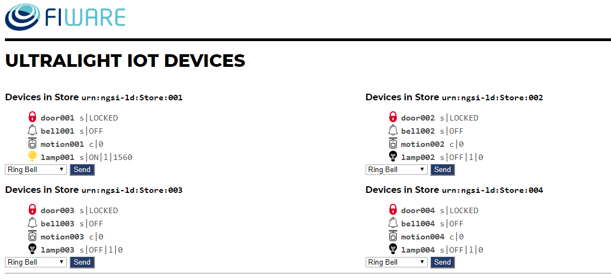
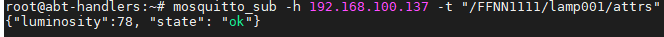
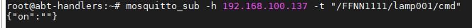

*****************************************
Integration with devices
*****************************************

There are two types of integrations with IoT devices/Actuators:

1) Southbound Integration
2) Northbound Integration

When data flow from a sensor device towards broker, it is called Northbound Flow, while in the other case when data flow from broker towards actuator devices, it is called Southbound Flow.

This tutorial will be focussed on Southbound Flow, i.e., how Fogflow will control the actuator devices to alter the environment.

Southbound Integration
=========================

Integrate an actuator device with FogFlow
------------------------------------------

The IoT devices can be of two types:

* the sensors which collect environmental data and push it to some application,
* the actuators which perform some action on the environment.

To get a basic idea of how Southbound actually works in the context of FIWARE, refer `this`_ tutorial .

.. _`this`: https://fiware-tutorials.readthedocs.io/en/latest/iot-agent/index.html

Integration with NGSI supported Devices
-----------------------------------------------

The figure below shows the how southbound flow is accomplished in Fogflow.

   

To use an NGSI device, users can start this simple `Lamp`_ device, which prints the status of the lamp when an on/off command is received.

.. _`Lamp`: https://github.com/smartfog/fogflow/tree/master/application/device/lamp

After starting the lamp device, register the lamp device on Fogflow using the following curl request.

.. code-block:: console

    curl -iX POST \
    'http://<Thin_Broker_IP>:8070/NGSI9/registerContext' \
    -H 'Content-Type: application/json' \
    -H 'fiware-service: openiot' \
    -H 'fiware-servicepath: /' \
    -d '
    {
            "contextRegistrations": [
                {
                    "entities": [
                        {
                            "type": "Lamp",
                            "isPattern": "false",
                            "id": "Lamp.001"
                        }
                    ],
                    "attributes": [
                        {
                            "name": "on",
                            "type": "command"
                        },
                        {
                            "name": "off",
                            "type": "command"
                        }
                    ],
                    "providingApplication": "http://<Lamp_Host_IP>:8888"
                }
            ],
        "duration": "P1Y"
    }'

Below is the request to run an "on" command on the lamp (the NGSI device) to turn it on. Note that this request will be fired at thin broker. Thin borker will find the provider in the registrations and will send this command update to that provider, i.e. to the device.

.. code-block:: console

    curl -iX POST \
    'http://<Thin_Broker_IP>:8070/ngsi10/updateContext' \
    -H 'Content-Type: application/json' \
    -H 'fiware-service: openiot' \
    -H 'fiware-servicepath: /' \
    -d '{	
        "contextElements": [
        {
            "entityId": {
            "id": "Lamp.001",
            "type": "Lamp",
            "isPattern": false
            },
            "attributes": [
                 {
                     "name": "on",
                     "type": "command",
                     "value": ""
                 }
             ]
        }
        ],
        "updateAction": "UPDATE"
    }'

On sending this command update, users can check the status of lamp device that was started in its logs. It will be "Lamp : on". Another supported command is "off" that the users can send to the device.
Users can have their own customized devices that send the command updates in northbound direction also.

Integration with Non-NGSI supported Devices
-----------------------------------------------

FIWARE-provided IoT Agent will work as an intermediater between a Non-NGSI Device and Fogflow's thin broker in bidirectional manner. For devices based on a specific protocol, separate IoT Agent is there, for example, IoT Agent JSON for MQTT based devices, IoT Agent UL for Ultralight Devices, and so on. Southbound flow for Non-NGSI devices is shown in the figure below. It makes use of a device-protocol specific IoT Agent.

   
Using Ultralight devices
-----------------------------

Integration of an Ultralight actuator device with Fogflow is illustrated in the below example.

To work in Southbound using an Ultralight device, IoT Agent UL and Ultralight devices must be running. Docker-Compose file for this is given `here`_. The "tutorial" service in this file provides the device services. Users need to edit this file based on their environment variables to get started.

.. _`here`: https://github.com/FIWARE/tutorials.IoT-Agent/blob/master/docker-compose.yml

The figure below shows the IoT Device monitor dashboard at http://tutorial_IP:3000/device/monitor

Please note that the "lamp001" is in "off" state. In this integration, we will light the lamp device using Fogflow.
    

   

**Registering a Device:** Device registeration is done at the IoT Agent to indicate what data the device will be providing. Following is the curl request for creating or registring a device on IoT Agent. Here, a lamp device is registered  with id "lamp001" that is supposed to be the context provider for entity "urn:ngsi-ld:Lamp:001". Corresponding to this, the IoT Agent will register the device in thin broker as well as create the entity for that device in thin broker itself.

.. code-block:: console

    curl -iX POST \
    'http://<IoT_Agent_IP>:4041/iot/devices' \
    -H 'Content-Type: application/json' \
    -H 'fiware-service: openiot' \
    -H 'fiware-servicepath: /' \
    -d '{
      "devices": [
        {
          "device_id": "lamp001",
          "entity_name": "urn:ngsi-ld:Lamp:001",
          "entity_type": "Lamp",
          "protocol": "Ultralight",
          "transport": "HTTP",
          "endpoint": "http://<Device_Host_IP>:3001/iot/lamp001",
          "commands": [
            {"name": "on","type": "command"},
            {"name": "off","type": "command"}
           ],
           "attributes": [
            {"object_id": "s", "name": "state", "type":"Text"},
            {"object_id": "l", "name": "luminosity", "type":"Integer"}
           ],
           "static_attributes": [
             {"name":"refStore", "type": "Relationship","value": "urn:ngsi-ld:Store:001"}
          ]
        }
      ]
    }'

**Sending command to device:** An external application or a Fog Function can control the actuator devices by sending commands like on/off, lock/unlock, open/close, or many others to the devices depending upon the type of device. The commands supported by a device will be known to Thin Broker through the device registration given above.

The below curl request sends an "on" command to the lamp001 device.

.. code-block:: console

    curl -iX POST \
    'http://<Thin_Broker_IP>:8070/ngsi10/updateContext' \
    -H 'Content-Type: application/json' \
    -H 'fiware-service: openiot' \
    -H 'fiware-servicepath: /' \
    -d '{
        "contextElements": [
        {
            "entityId": {
            "id": "urn:ngsi-ld:Lamp:001",
            "type": "Lamp",
            "isPattern": false
            },
            "attributes": [
                 {
                     "name": "on",
                     "type": "command",
                     "value": ""
                 }
             ]
        }
        ],
        "updateAction": "UPDATE"
    }'
    
The above request shows Fogflow entity update, which is a bit different from the format suported by other brokers like FIWARE Orion. For that reason, below request is also supported in Fogflow.

.. code-block:: console

    curl -iX POST \
    'http://<Thin_Broker_IP>:8070/v1/updateContext' \
    -H 'Content-Type: application/json' \
    -H 'fiware-service: openiot' \
    -H 'fiware-servicepath: /' \
    -d '{
        "contextElements": [
            {
                "type": "Lamp",
                "isPattern": "false",
                "id": "urn:ngsi-ld:Lamp:001",
                "attributes": [
                    {
                        "name": "on",
                        "type": "command",
                        "value": ""
                    }
                ]
            }
        ],
        "updateAction": "UPDATE"
    }'

Users can check the status of the Lamp again, it will be in lit-up state as shown in the figure below.

Using MQTT devices
-------------------------

MQTT devices run on MQTT protocol which works on subscribe and publish strategy, where the clients publish and subscribe to an MQTT Broker. All the subscribing clients are notified when another client publishes data on MQTT broker.

Mosquitto Broker is used for MQTT device simulation. Mosquitto broker allows data publishing and subscription on its uniquely identified resources called topics. These topics are defined in the format “/<apikey>/<device_id>/<topicSpecificPart>”. Users can track the updates on these topics by directly subscribing them on the host where Mosquitto is installed.

**Prerequisites for proceding further:**

* Install Mosquitto Broker.
* Start IoT Agent with MQTT Broker location pre-configured. For simplicity, add the following to the environment variables of IoT Agent JSON in the docker-compose file and then run the docker-compose. 

.. code-block:: console

      - IOTA_MQTT_HOST=<MQTT_Broker_Host_IP>
      - IOTA_MQTT_PORT=1883   # Mosquitto Broker runs at port 1883 by default.

In order to let IoT-Agent JSON allow both Northbound as well as Southbound data flow, users need to provide api-key as well for their device registration, so that the IoT-Agent can publish and subscribe to the topics using the api-key. For this, an extra Service-Provisioning request will be sent to IoT Agent. Steps to work with MQTT Devices in Fogflow are given below.

**Create a Service at IoT-Agent** using the following curl request.

.. code-block:: console

      curl -iX POST \
        'http://<IoT_Agent_IP>:4041/iot/services' \
        -H 'Content-Type: application/json' \
        -H 'fiware-service: iot' \
        -H 'fiware-servicepath: /' \
        -d '{
      "services": [
         {
           "apikey":      "FFNN1111",
           "entity_type": "Lamp",
           "resource":    "/iot/json"
         }
      ]
      }'

**Register a Lamp device** using the following curl request.

.. code-block:: console

      curl -X POST \
        http://<IoT_Agent_IP>:4041/iot/devices \
        -H 'content-type: application/json' \
        -H 'fiware-service: iot' \
        -H 'fiware-servicepath: /' \
        -d '{
        "devices": [
          {
            "device_id": "lamp001",
            "entity_name": "urn:ngsi-ld:Lamp:001",
            "entity_type": "Lamp",
            "protocol": "IoTA-JSON",
            "transport": "MQTT",
            "commands": [
              {"name": "on","type": "command"},
              {"name": "off","type": "command"}
             ],
             "attributes": [
              {"object_id": "s", "name": "state", "type":"Text"},
              {"object_id": "l", "name": "luminosity", "type":"Integer"}
             ],
             "static_attributes": [
               {"name":"refStore", "type": "Relationship","value": "urn:ngsi-ld:Store:001"}
             ]
          }
        ]
      }'

**Subscribe to Mosquitto topics:** Once service and device are successfully created, subscribe to the following topics of Mosquitto Broker in separate terminals to track what data are published on these topics:

.. code-block:: console

      mosquitto_sub -h <MQTT_Host_IP> -t "/FFNN1111/lamp001/attrs" 

.. code-block:: console

      mosquitto_sub -h <MQTT_Host_IP> -t "/FFNN1111/lamp001/cmd"
      

**Publish data to Thin Broker:** This section covers the northbound traffic. IoT Agent subscribes to some default topics like ["/+/+/attrs/+","/+/+/attrs","/+/+/configuration/commands","/+/+/cmdexe"]. So, in order to send attribute data to IoT Agent, data need to be published on a topic of Mosquitto Broker using the below command. 

.. code-block:: console

      mosquitto_pub -h <MQTT_Host_IP> -t "/FFNN1111/lamp001/attrs" -m '{"luminosity":78, "state": "ok"}'

Mosquitto broker will notify IoT-Agent for this Update, and consequently, the data will be updated at Thin Broker also.

The updated data can be viewed on the subscribed topic "/FFNN1111/lamp001/attrs" as well , as shown in the figure below.

**Run device commands:** This section covers the southbound traffic flow, i.e., how commands are run on the device. For this, send the below command updateContext request to Thin Broker. Thin broker will find the provider for this command update and will forward the UpdateContext request to that provider. In this case, IoT-Agent is the provider. IoT-Agent will publish the command at "/FFNN1111/lamp001/cmd" topic of the Mosquitto broker linked to it.

.. code-block:: console

      curl -iX POST \
      'http://<Thin_Broker_IP>:8070/ngsi10/updateContext' \
      -H 'Content-Type: application/json' \
      -H 'fiware-service: iot' \
      -H 'fiware-servicepath: /' \
      -d '{
          "contextElements": [
          {
              "entityId": {
              "id": "urn:ngsi-ld:Lamp:001",
              "type": "Lamp",
              "isPattern": false
              },
              "attributes": [
                   {
                       "name": "on",
                       "type": "command",
                       "value": ""
                   }
               ]
          }
          ],
          "updateAction": "UPDATE"
      }'
      
The updated data can be viewed on the subscribed topic "/FFNN1111/lamp001/cmd", as shown in the figure below. This means that "on" command has been run successfully on the MQTT device.

Users can again have their customized devices to publish the command result on Thin Broker side.

Other APIs for RegisterContext
-----------------------------------------------

**GET a Registration**

Below is the curl request to get a device registration from a thin broker within Fogflow System, it will tell which broker contains the registration information regarding that device.

.. code-block:: console

      curl -iX GET \
      'http://<Thin_Broker_IP>:8070/NGSI9/registration/Lamp001' \
      -H 'fiware-service: openiot' \
      -H 'fiware-servicepath: /'

The device registration id for the above registration would be "Lamp001.openiot.~" within Fogflow. 

Users can also look for the registration at thin broker in the following way, as the Fiware Headers (i.e., "fiware-service" and "fiware-servicepath") are optional in the request. The result is completely dependent on what is being searched for.

.. code-block:: console

      curl -iX GET \
      'http://<Thin_Broker_IP>:8070/NGSI9/registration/Lamp001.openiot.~'

**DELETE a Registration**

Following curl request would delete a device registration in Fogflow.

.. code-block:: console

      curl -iX DELETE \
      'http://<Thin_Broker_IP>:8070/NGSI9/registration/Lamp001' \
      -H 'fiware-service: openiot' \
      -H 'fiware-servicepath: /'

This request would delete the registration "Lamp001.openiot.~". Fiware Headers (i.e., "fiware-service" and "fiware-servicepath") are mandatory.

Northbound Integration
================================

Connect an IoT device to FogFlow
--------------------------------------

With NGSI supported Devices
--------------------------------

If the device can communicate with FogFlow via NGSI, connecting device to FogFlow
can be very easy. It requires some small application to be running on the device,
for example, a raspberry Pi with several connected sensors or actuators. 

In the following example, it is shown how a simulated PowerPanel device can be connected to FogFlow via NGSI. 
This example code is also accessible from `FogFlow code repository`_ in the application folder. 

Node.js need to be run this example code. Please install Node.js and npm.

.. _`FogFlow code repository`: https://github.com/smartfog/fogflow/blob/master/application/device/powerpanel/powerpanel.js

.. code-block:: javascript

    'use strict';
    
    const NGSI = require('./ngsi/ngsiclient.js');
    const fs = require('fs');
    
    // read device profile from the configuration file
    var args = process.argv.slice(2);
    if(args.length != 1){
        console.log('please specify the device profile');
        return;
    }
    
    var cfgFile = args[0];
    var profile = JSON.parse(
        fs.readFileSync(cfgFile)
    );
    
    var ngsi10client;
    var timer;
    
    // find out the nearby IoT Broker according to my location
    var discovery = new NGSI.NGSI9Client(profile.discoveryURL)
    discovery.findNearbyIoTBroker(profile.location, 1).then( function(brokers) {
        console.log('-------nearbybroker----------');    
        console.log(brokers);    
        console.log('------------end-----------');    
        if(brokers && brokers.length > 0) {
            ngsi10client = new NGSI.NGSI10Client(brokers[0]);
    
            // generating data observations periodically
            timer = setInterval(function(){ 
                updateContext();
            }, 1000);    
    
            // register my device profile by sending a device update
            registerDevice();
        }
    }).catch(function(error) {
        console.log(error);
    });
    
    // register device with its device profile
    function registerDevice() 
    {
        var ctxObj = {};
        ctxObj.entityId = {
            id: 'Device.' + profile.type + '.' + profile.id,
            type: profile.type,
            isPattern: false
        };
        
        ctxObj.attributes = {};
        
        var degree = Math.floor((Math.random() * 100) + 1);        
        ctxObj.attributes.usage = {
            type: 'integer',
            value: degree
        };   
        ctxObj.attributes.shop = {
            type: 'string',
            value: profile.id
        };       
        ctxObj.attributes.iconURL = {
            type: 'string',
            value: profile.iconURL
        };                   
        
        ctxObj.metadata = {};
        
        ctxObj.metadata.location = {
            type: 'point',
            value: profile.location
        };    
       
        ngsi10client.updateContext(ctxObj).then( function(data) {
            console.log(data);
        }).catch(function(error) {
            console.log('failed to update context');
        });  
    }
    
    // update context for streams
    function updateContext() 
    {
        var ctxObj = {};
        ctxObj.entityId = {
            id: 'Stream.' + profile.type + '.' + profile.id,
            type: profile.type,
            isPattern: false
        };
        
        ctxObj.attributes = {};
        
        var degree = Math.floor((Math.random() * 100) + 1);        
        ctxObj.attributes.usage = {
            type: 'integer',
            value: degree
        };
        ctxObj.attributes.deviceID = {
            type: 'string',
            value: profile.type + '.' + profile.id
        };   	     
        
        ctxObj.metadata = {};
        
        ctxObj.metadata.location = {
            type: 'point',
            value: profile.location
        }; 
        ctxObj.metadata.shop = {
            type: 'string',
            value: profile.id
        };	          
        
        ngsi10client.updateContext(ctxObj).then( function(data) {
            console.log(data);
        }).catch(function(error) {
            console.log('failed to update context');
        });    
    }
    
    process.on('SIGINT', function() 
    {    
        if(ngsi10client) {
            clearInterval(timer);
            
            // to delete the device
            var entity = {
                id: 'Device.' + profile.type + '.' + profile.id,
                type: 'Device',
                isPattern: false
            };
            ngsi10client.deleteContext(entity).then( function(data) {
                console.log(data);
            }).catch(function(error) {
                console.log('failed to delete context');
            });        
    
            // to delete the stream    
            var entity = {
                id: 'Stream.' + profile.type + '.' + profile.id,
                type: 'Stream',
                isPattern: false
            };
            ngsi10client.deleteContext(entity).then( function(data) {
                console.log(data);
            }).catch(function(error) {
                console.log('failed to delete context');
            });        
        }
    });

discoveryURL is need to modify in profile1.json.

.. code-block:: json

    {
        "discoveryURL":"http://35.198.104.115:443/ngsi9",
        "location": {
            "latitude": 35.692221,
            "longitude": 139.709059
        },
        "iconURL": "/img/shop.png",
        "type": "PowerPanel",
        "id": "01"
    }

 Packages that need to be installed as follows:

.. code-block:: console

    npm install

Run this example code as follows:

.. code-block:: console

    node powerpanel.js profile1.json

With Non-NGSI supported Devices
----------------------------------

To connect Non-NGSI IoT Devices, FIWARE provides IoT Agents that work with IoT devices based on various protocols like MQTT, Ultralight,
etc. IoT Agents can communicate over both, either NGSIv1 or NGSIv2, however, currently Fogflow supports only NGSIv1. So, users need to configure IoT Agent to use NGSIv1 format.

Users can run IoT Agent on Fogflow cloud node by directly running `docker-compose`_ file used to start the cloud node. By default, IoT Agent is already allowed. Users can opt out if they do not require it.

For running IoT Agent on edge node, users can uncomment the related command in `Start Edge`_ file.
   
.. _`docker-compose`: https://github.com/smartfog/fogflow/blob/master/docker/core/http/docker-compose.yml

.. _`Start Edge`: https://github.com/smartfog/fogflow/blob/master/docker/edge/http/start.sh

An example usage of Fiware IoT-Agent JSON sending location-based temerature data to thin broker is given below. Iot Agent requires following three requests for sending NGSI Data to broker.

- **Service Provisioning:** Service provisioning or group provisioning is used by IoT Agent to set some default commands or attributes like authentication key, optional context broker endpoint, etc. for anonymous devices.

Following is the curl request for creating or registring a service on IoT Agent.

.. code-block:: console

    curl -iX POST \
      'http://<IoT_Agent_IP>:4041/iot/services' \
      -H 'Content-Type: application/json' \
      -H 'fiware-service: iot' \
      -H 'fiware-servicepath: /' \
      -d '{
    "services": [
       {
         "apikey":      "FFNN1111",
         "entity_type": "Thing",
         "resource":    "/iot/json"
       }
    ]
    }'

- **Device Provisioning:** Device provisioning is used to specify what data and data attributes a device will be sending to the IoT Agent.

The below curl request is used to register a device having Device ID "Device1111" which would be sending the data of entity "Thing1111" to IoT Agent.

.. code-block:: console

    curl -X POST \
      http://<IoT_Agent_IP>:4041/iot/devices \
      -H 'content-type: application/json' \
      -H 'fiware-service: iot' \
      -H 'fiware-servicepath: /' \
      -d '{
            "devices": [{
                    "device_id": "Device1111",
                    "entity_name": "Thing1111",
                    "entity_type": "Thing",
                    "attributes": [{
                            "object_id":"locationName",
                            "name": "locationName",
                            "type": "string"
                    },{
                            "object_id": "locationId",
                            "name": "locationId",
                            "type": "string"
                    },{
                            "object_id": "Temperature",
                            "name": "Temperature",
                            "type": "integer"
                    }
                    ]}]
    }'

- **Sensor Data Updation:** IoT Agent maps the received data with its device registration and creates an NGSI update corresponding to the same. Note that IoT Agent receives data from Device in Non-NGSI format.

Curl request that actually sends the "Thing1111" entity update to IoT Agent on behalf of "Device1111" is given below.

.. code-block:: console

    curl -X POST \
      'http://<IoT_Agent_IP>:7896/iot/json?i=Device1111&k=FFNN1111' \
      -H 'content-type: application/json' \
      -H 'fiware-service: iot' \
      -H 'fiware-servicepath: /' \
      -d '{ 
        "locationName":"Heidelberg",
        "locationId":"0011",
        "Temperature":20
    }'

As soon as the IoT Agent recieves update from device, it requests thin broker to update the entity data in the form of an NGSIv1 UpdateContext request.
