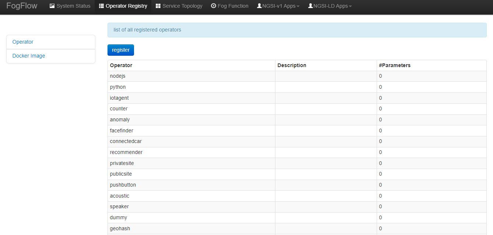
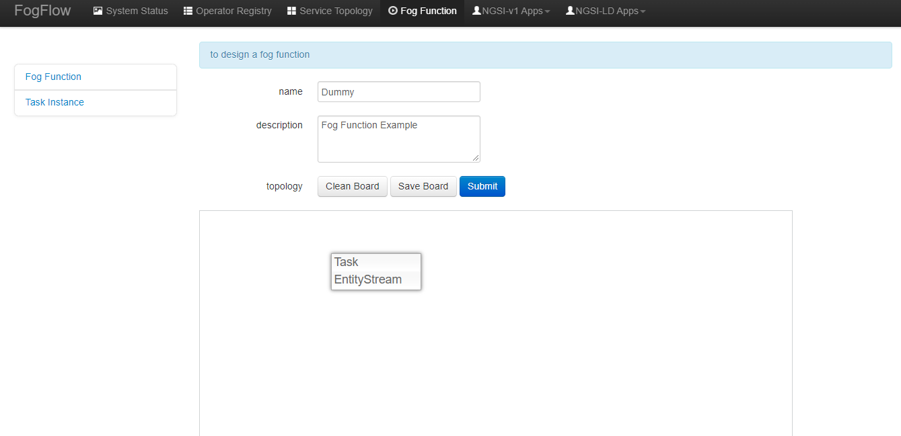
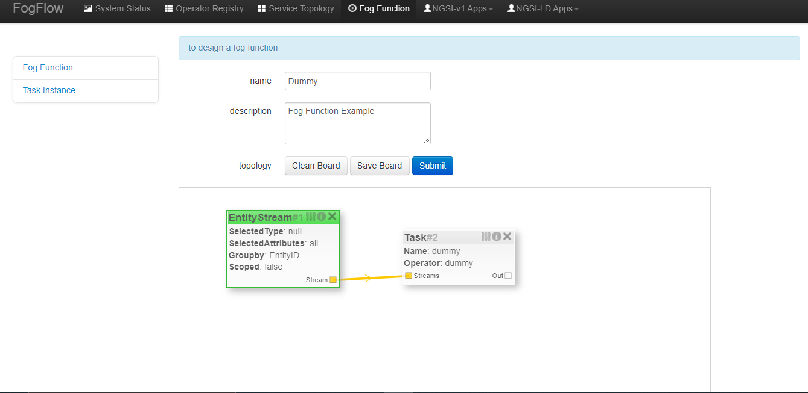

***************************************
Intent-Based Programming
***************************************
Currently the following two programing models are provided by FogFlow to support different types of workload patterns.

  1. **Fog Function**
  
  2. **Service Topology**

Fog Function
===============

Define and trigger a fog function
------------------------------------

FogFlow enables serverless edge computing, meaning that developers can define and submit a so-called fog function and then 
the rest will be done by FogFlow automatically, including:

-  triggering the submitted fog function when its input data are available
-  deciding how many instances to be created according to its defined granularity
-  deciding where to deploy the created instances

The instances in the above text refer to the task instances which run a processing logic within them and this processing logic is given by operators in fogflow. They must be registered beforehand by the users. Implementation of an example operator is given in the next sections.

Register task operators
--------------------------------------------------------

Operator code must be in the form of a docker image and must be available on docker hub. 
Registration of an operator in FogFlow can be done in one of the following two ways. 

.. note:: Please notice that each operator must have a unique name but the same operator can be associated with multiple docker images, 
            each of which is for one specific hardware or operating system but for implementing the same data processing logic. 
            During the runtime, FogFlow will select a proper docker image to run a scheduled task on an edge node, 
            based on the execution environment of the edge node. 

Register it via FogFlow Task Designer
----------------------------------------

There are two steps to register an operator in Fogflow.

**Register an Operator** to define what would be the name of Operator and what input parameters it would need. Here in this context, an operator is nothing but a named element having some parameters.
The following picture shows the list of all registered operators and their parameter count.

   
After clicking the "register" button, a design area can be seen below and an operator can be created and parameters can be added to it. To define the port for the operator application, use "service_port" and give a valid port number as its value. The application would be accessible to the outer world through this port.

.. image:: figures/operator-registry.png

**Register a Docker Image and choose Operator** to define the docker image and associate an already registered Operator with it. 

The following picture shows the list of all registered docker images and the key information of each image. 

.. image:: figures/dockerimage-registry-list.png

After clicking the "register" button, a form can be seen as below. 
Please fill out the required information and click the "register" button to finish the registration. 
The form is explained as the following. 

* Image: the name of your operator docker image
* Tag: the tag is used to publish the operator docker image; by default it is "latest"
* Hardware Type: the hardware type that the docker image supports, including X86 or ARM (e.g. Raspberry Pi)
* OS Type: the operating system type that the docker image supports; currently this is only limited to Linux
* Operator: the operator name, which must be unique and will be used when defining a service topology
* Prefetched: if this is checked, that means all edge nodes will start to fetch this docker image in advance; otherwise, the operator docker image is fetched on demand, only when edge nodes need to run a scheduled task associated with this operator. 

.. important::
    
    Please notice that the name of the docker image must be consistent with the one that is published to `Docker Hub`_.
    By default, FogFlow will fetch the required docker images from Docker Hub using the name that is registered here for an operator. 

.. _`Docker Hub`: https://github.com/smartfog/fogflow/tree/master/application/operator/anomaly

.. image:: figures/dockerimage-registry.png

Register it programmatically by sending a NGSI update 
----------------------------------------------------------

An operator can also be registered by sending docker image for a constructed NGSI update message to the IoT Broker deployed in the cloud. 

Here are the Curl and the Javascript-based code examples to register an operator and a docker image for that operator. 

.. note:: In the Javascript code example, Javascript-based library is used to interact with FogFlow IoT Broker. It can be find out in library from the github code repository (designer/public/lib/ngsi). It shall be included in ngsiclient.js of web page. 

.. note:: The Curl case assumes that the cloud IoT Broker is running on localhost on port 8070.

.. tabs::

   .. group-tab:: Curl

        .. code-block:: console 

		curl -iX POST \
		  'http://localhost:8070/ngsi10/updateContext' \
	  	-H 'Content-Type: application/json' \
	  	-d '		
	     	{
			"contextElements": [
			{ 
				"entityId":{ 
					"id":"counter",
					"type":"Operator"
				},
				"attributes":[ 
				{
					"name":"designboard",
					"type":"object",
					"value":{ 
				 	}
				},
				{ 
					"name":"operator",
					"type":"object",
					"value":{ 
						"description":"",
						"name":"counter",
						"parameters":[ 
				
						]
				 	}
				}
				],
				"domainMetadata":[ 
				{ 
					"name":"location",
					"type":"global",
					"value":"global"
				}
				]
			},
			{ 
				   "entityId":{ 
					  "id":"fogflow/counter.latest",
					  "type":"DockerImage"
				   },
				   "attributes":[ 
					  { 
						 "name":"image",
						 "type":"string",
						 "value":"fogflow/counter"
					  },
					  { 
						 "name":"tag",
						 "type":"string",
						 "value":"latest"
					  },
					  { 
						 "name":"hwType",
						 "type":"string",
						 "value":"X86"
					  },
					  { 
						 "name":"osType",
						 "type":"string",
						 "value":"Linux"
					  },
					  { 
						 "name":"operator",
						 "type":"string",
						 "value":"counter"
					  },
					  { 
						 "name":"prefetched",
						 "type":"boolean",
						 "value":false
					  }
				   ],
				   "domainMetadata":[ 
					  { 
						 "name":"operator",
						 "type":"string",
						 "value":"counter"
					  },
					  { 
						 "name":"location",
						 "type":"global",
						 "value":"global"
					  }
				   ]
				}
			],
	        "updateAction": "UPDATE"
		}'

   .. group-tab:: Javascript

        .. code-block:: Javascript 

		name = "counter"

		//register a new operator
		var newOperatorObject = {};

		newOperatorObject.entityId = {
			id : name,
			type: 'Operator',
			isPattern: false
		};

		newOperatorObject.attributes = [];

		newOperatorObject.attributes.designboard = {type: 'object', value: {}};

		var operatorValue = {}
		operatorValue = {description: "Description here...", name: name, parameters: []};
		newOperatorObject.attributes.operator = {type: 'object', value: operatorValue};

		newOperatorObject.metadata = [];
		newOperatorObject.metadata.location = {type: 'global', value: 'global'};

		// assume the config.brokerURL is the IP of cloud IoT Broker
		var client = new NGSI10Client(config.brokerURL);
		client.updateContext(newOperatorObject).then( function(data) {
			console.log(data);
		}).catch( function(error) {
			console.log('failed to register the new Operator object');
		});

		image = {}

		image = {
			name: "fogflow/counter",
			tag: "latest",
			hwType: "X86",
			osType: "Linux",
			operator: "counter",
			prefetched: false
		};

		newImageObject = {};

		newImageObject.entityId = {
			id : image.name + '.' + image.tag,
			type: 'DockerImage',
			isPattern: false
		};

		newImageObject.attributes = [];
		newImageObject.attributes.image = {type: 'string', value: image.name};
		newImageObject.attributes.tag = {type: 'string', value: image.tag};
		newImageObject.attributes.hwType = {type: 'string', value: image.hwType};
		newImageObject.attributes.osType = {type: 'string', value: image.osType};
		newImageObject.attributes.operator = {type: 'string', value: image.operator};
		newImageObject.attributes.prefetched = {type: 'boolean', value: image.prefetched};

		newImageObject.metadata = [];
		newImageObject.metadata.operator = {type: 'string', value: image.operator};
		newImageObject.metadata.location = {type: 'global', value: 'global'};

		client.updateContext(newImageObject).then( function(data) {
			console.log(data);
		}).catch( function(error) {
			console.log('failed to register the new Docker Image object');
		});

It is recommended to use fogflow dashboard to create an operator with parameters. However, if the users wish to use curl, then they can refer the following for the example operator registration with parameters shown in the above image. Afterwards, users can register a docker image that uses this operator. 

The x and y variables here are simply the coordinates of designer board. If they are not given by user, by default, all the element blocks will be placed at origin of the plane.

.. code-block:: curl

	curl -iX POST \
		  'http://localhost:8070/ngsi10/updateContext' \
	  	-H 'Content-Type: application/json' \
	  	-d '		
	     	{
			"contextElements": [
				{ 
				   "entityId":{ 
				      "id":"iota",
				      "type":"Operator"
				   },
				   "attributes":[ 
				      { 
				         "name":"designboard",
				         "type":"object",
				         "value":{ 
				            "blocks":[ 
				               { 
				                  "id":1,
				                  "module":null,
				                  "type":"Parameter",
				                  "values":{ 
				                     "name":"service_port",
				                     "values":[ 
				                        "4041"
				                     ]
				                  },
				                  "x":-425,
				                  "y":-158
				               },
				               { 
				                  "id":2,
				                  "module":null,
				                  "type":"Parameter",
				                  "values":{ 
				                    "name":"service_port",
 				                    "values":[ 
				                        "7896"
				                     ]
				                  },
				                  "x":-393,
				                  "y":-51
				               },
				               { 
				                  "id":3,
				                  "module":null,
				                  "type":"Operator",
				                  "values":{ 
				                     "description":"",
				                     "name":"iota"
				                  },
				                  "x":-186,
				                  "y":-69
				               }
				            ],
				            "edges":[ 
				               { 
				                  "block1":2,
				                  "block2":3,
				                  "connector1":[ 
				                     "parameter",
				                     "output"
				                  ],
				                  "connector2":[ 
				                     "parameters",
				                     "input"
				                  ],
				                  "id":1
				               },
				               { 
				                  "block1":1,
				                  "block2":3,
				                  "connector1":[ 
				                     "parameter",
				                     "output"
				                  ],
				                  "connector2":[ 
				                     "parameters",
				                     "input"
				                  ],
				                  "id":2
				               }
				            ]
				         }
				      },
				      { 
				         "name":"operator",
				         "type":"object",
				         "value":{ 
				            "description":"",
				            "name":"iota",
				            "parameters":[ 
				               { 
				                  "name":"service_port",
				                  "values":[ 
				                     "7896"
				                  ]
				               },
				               { 
				                  "name":"service_port",
				                  "values":[ 
				                     "4041"
 				                 ]
				               }
				            ]
				         }
				      }
				   ],
				   "domainMetadata":[ 
				      { 
				         "name":"location",
				         "type":"global",
				         "value":"global"
				      }
				   ]
				}
			],
	        "updateAction": "UPDATE"
		}'

Define a "Dummy" fog function 
-----------------------------------------------

The following steps show how to define and test a simple 'dummy' fog function using the web portal provided by FogFlow Task Designer. 
The "dummy" operator is already registered in Fogflow by default.

create a fog function from the FogFlow editor 
-------------------------------------------------

A menu will pop up whenever click a right mouse on the task design board.

The displayed menu includes the following items: 

-  **Task**: is used to define the fog function name and the processing logic (or operator). A task has input and output streams.
-  **EntityStream**: is the input data element which can be linked with a fog function Task as its input data stream. 

Click "Task" from the popup menu, a Task element will be placed on the design board, as shown below.

.. image:: figures/fog-function-add-task-element.png

Start task configuration by clicking the configuration button on the top-right corner, as illustrated in the following figure. 
Please specify the name of the Task and choose an operator out of a list of some pre-registered operators.

Please click "EntityStream" from the popup menu to place an "EntityStream" element on the design board. 

It contains the following things:

	* Selected Type: is used to define the entity type of input stream whose availability will trigger the fog function. 
	* Selected Attributes: for the selected entity type, which entity attributes are required by your fog function; "all" means to get all entity attributes.
	* Group By: should be one of the selected entity attributes, which defines the granularity of this fog function.
	* Scoped: tells if the Entity data are location-specific or not. True indicates that location-specific data are recorded in the Entity and False is used in case of broadcasted data, for example, some rule or threshold data that holds true for all locations, not for a specific location.
 
.. note:: granularity determines the number of instances for this fog function.
        In principle, the number of task instances for the defined fog function 
        will be equal to the total number of unique values of the selected entity attributes, 
        for the available input data. It also means, each instance will be assigned to handle all input entities
        with a specific attribute value. 

In this example, the granularity is defined by "id", meaning that FogFlow will create a new task instance
for each individual entity ID.

Configure the EntityStream by clicking on its configuration button as shown below. In this example, we choose "Temperature" as the entity type of input data for the "dummy" fog function.

.. image:: figures/fog-function-configure-entityStream-element.png

There can be multiple EntityStreams for a Task and they must be connected to the Task as shown here.

.. image:: figures/fog-function-connect-elements.png 

provide the code of your own function
-----------------------------------------
    
Currently FogFlow allows developers to specify their own function code inside a registered operator. For a sample operator, refer the |dummy operator code|.

.. |dummy operator code| raw:: html

    <a href="https://github.com/smartfog/fogflow/tree/master/application/operator/dummy" target="_blank">dummy operator code</a>

   
.. code-block:: javascript

    exports.handler = function(contextEntity, publish, query, subscribe) {
        console.log("enter into the user-defined fog function");
        
        var entityID = contextEntity.entityId.id;
    
        if (contextEntity == null) {
            return;
        }
        if (contextEntity.attributes == null) {
            return;
        }
    
        var updateEntity = {};
        updateEntity.entityId = {
            id: "Stream.result." + entityID,
            type: 'result',
            isPattern: false
        };
        updateEntity.attributes = {};
        updateEntity.attributes.city = {
            type: 'string',
            value: 'Heidelberg'
        };
    
        updateEntity.metadata = {};
        updateEntity.metadata.location = {
            type: 'point',
            value: {
                'latitude': 33.0,
                'longitude': -1.0
            }
        };

        console.log("publish: ", updateEntity);        
        publish(updateEntity);        
    };

 Above javascript code example can be taken as the implementation of fog function. 
This example fog function simple writes a fixed entity by calling the "publish" callback function. 

The input parameters of a fog function are predefined and fixed, including: 

-  **contextEntity**: representing the received entity data
-  **publish**: the callback function to publish your generated result back to the FogFlow system
-  **query**: optional, this is used only when your own internal function logic needs to query some extra entity data from the FogFlow context management system. 
-  **subscribe**: optional, this is used only when your own internal function logic needs to subscribe some extra entity data from the FogFlow context management system.         

.. important::

    For the callback functions *query* and *subscribe*, "extra" means any entity data that are not defined as the inputs in the annotation of your fog function. 

    A Javascript-based template of the implementation of fog functions is provided in the FogFlow repository as well. Please refer to `Javascript-based template for fog function`_

.. _`Javascript-based template for fog function`: https://github.com/smartfog/fogflow/tree/master/application/template/javascript

Templates for Java and python are also given in the repository.

Here are some examples to show how these three call back functions can be used. 

- example usage of *publish*: 
	.. code-block:: javascript
	
	    var updateEntity = {};
	    updateEntity.entityId = {
	           id: "Stream.Temperature.0001",
	           type: 'Temperature',
	           isPattern: false
	    };            
	    updateEntity.attributes = {};     
	    updateEntity.attributes.city = {type: 'string', value: 'Heidelberg'};                
	    
	    updateEntity.metadata = {};    
	    updateEntity.metadata.location = {
	        type: 'point',
	        value: {'latitude': 33.0, 'longitude': -1.0}
	    };        
	       
	    publish(updateEntity);    
    
- example usage of *query*: 
	.. code-block:: javascript
	
	    var queryReq = {}
	    queryReq.entities = [{type:'Temperature', isPattern: true}];    
	    var handleQueryResult = function(entityList) {
	        for(var i=0; i<entityList.length; i++) {
	            var entity = entityList[i];
	            console.log(entity);   
	        }
	    }  
	    
	    query(queryReq, handleQueryResult);

- example usage of *subscribe*: 
	.. code-block:: javascript
	
	    var subscribeCtxReq = {};    
	    subscribeCtxReq.entities = [{type: 'Temperature', isPattern: true}];
	    subscribeCtxReq.attributes = ['avg'];        
	    
	    subscribe(subscribeCtxReq);     
    

submit fog function
-----------------------------
    
After clicking the "Submit" button, the annotated fog function will be submitted to FogFlow. 

.. image:: figures/fog-function-submit.png

Trigger "dummy" fog function 
--------------------------------------------

The defined "dummy" fog function is triggered only when its required input data are available. 
With the following command, you can create a "Temperature" sensor entity to trigger the function. 
Please fill out the following required information: 

-  **Device ID**: to specify a unique entity ID
-  **Device Type**: use "Temperature" as the entity type
-  **Location**: to place a location on the map

.. image:: figures/device-registration.png

Once the device profile is registered, a new "Temperature" sensor entity will be created and it will trigger the "dummy" fog function automatically.

.. image:: figures/fog-function-triggering-device.png

The other way to trigger the fog function is to send a NGSI entity update to create the "Temperature" sensor entity. 
Following command can be executed to issue a POST request to the FogFlow broker. 

.. code-block:: console 

    curl -iX POST \
      'http://localhost:8080/ngsi10/updateContext' \
      -H 'Content-Type: application/json' \
      -d '
    {
        "contextElements": [
            {
                "entityId": {
                    "id": "Device.temp001",
                    "type": "Temperature",
                    "isPattern": false
                },
                "attributes": [
                {
                  "name": "temp",
                  "type": "integer",
                  "value": 10
                }
                ],
                "domainMetadata": [
                {
                    "name": "location",
                    "type": "point",
                    "value": {
                        "latitude": 49.406393,
                        "longitude": 8.684208
                    }
                }
                ]
            }
        ],
        "updateAction": "UPDATE"
    }'

 Check whether the fog function is triggered or not in the following way. 

- check the task instance of this fog function, as shown in the following picture
	.. image:: figures/fog-function-task-running.png

- check the result generated by its running task instance, as shown in the following picture 
	.. image:: figures/fog-function-streams.png

Service Topology
=================

Define and trigger a service topology
----------------------------------------

In FogFlow a service topology is defined as a graph of several operators. 
Each operator in the service topology is annotated with its inputs and outputs, 
which indicate their dependency to the other tasks in the same topology. 
**Different from fog functions, a service topology is triggerred on demand by a customized "intent" object.**

With a simple example we explain how developers can define and test a service topology in the following section. 

Use case on anomaly detection
---------------------------------------

This use case study is for retail stores to detect abnormal energy consumption in real-time.
As illustrated in the following picture, a retail company has a large number of shops distributed in different locations. 
For each shop, a Raspberry Pi device (edge node) is deployed to monitor the power consumption from all PowerPanels 
in the shop. Once an abnormal power usage is detected on the edge, 
the alarm mechanism in the shop is triggered to inform the shop owner. 
Moreover, the detected event is reported to the cloud for information aggregation. 
The aggregated information is then presented to the system operator via a dashboard service. 
In addition, the system operator can dynamically update the rule for anomaly detection.

.. figure:: figures/retails.png

* Anomaly Detector: this operator is to detect anomaly events based on the collected data from power panels in a retail store. It has two types of inputs:

	* detection rules, which are provided and updated by the operator; The detection rules input stream type is associated with ``broadcast``, meaning that the rules are needed by all task instances of this operator. The granularity of this operator is based on ``shopID``, meaning that a dedicated task instance will be created and configured for each shop
   	* sensor data from power panel

* Counter: this operator is to count the total number of anomaly events for all shops in each city. 
	Therefore, its task granularity is by ``city``. Its input stream type is the output stream type of the previous operator (Anomaly Detector). 

There are two types of result consumers: 

(1)  a dashboard service in the cloud, which subscribes to the final aggregation results generated by the counter operator for the global scope; 
(2)  the alarm in each shop, which subscribes to the anomaly events generated by the Anomaly Detector task on the local edge node in the retail store. 

.. figure:: figures/retail-flow.png

Implement your operator functions required in your service topology
-----------------------------------------------------------------------

Before you can define the designed service topology, 
all operators used in your service topology must be provided by you or the other provider in the FogFlow system.
For  this specific use case, we need to implement two operators: anomaly_detector and counter. 
Please refer to the examples provided in our code repository. 

* `anomaly_detector`_ 

* `counter`_ 

.. _`anomaly_detector`: https://github.com/smartfog/fogflow/tree/master/application/operator/anomaly
.. _`counter`: https://github.com/smartfog/fogflow/tree/master/application/operator/counter

Specify a service topology
-----------------------------------
Assume that the tasks to be used in your service topology have been implemented and registered,
you can have two ways to specify your service topology. 

using FogFlow Topology Editor
--------------------------------

The first way is to use the FogFlow editor to specify a service topology.  

.. figure:: figures/retail-topology-1.png

As seen in the picture, the following important information must be provided. 

#. define topology profile, including
    * topology name: the unique name of your topology
    * service description: some text to describe what this service is about

#. draw the graph of data processing flows within the service topology
    With a right click at some place of the design board, you will see a menu pops up 
    and then you can start to choose either task or input streams or shuffle
    to define your data processing flows according to the design you had in mind. 

#. define the profile for each element in the data flow, including
    As shown in the above picture, you can start to specify the profile of each element in the data processing flow
    by clicking the configuration button.
    
    The following information is required to specify a task profile.
	
    * name: the name of the task 
    * operator: the name of the operator that implements the data processing logic of this task; please register your operator beforehand so that it can be shown from the list
    * entity type of output streams: to specify the entity type of the produced output stream.
    
    The following information is required to specify an EntityStream Profile.

    * SelectedType: is used to define what Entity Type will be chosen by the task as its Input Stream
    * SelectedAttributes: is used to define what attribute (or attributes) of the Selected Entity Type will be considered for changing the state of a task.
    * Groupby: to determine how many instances of this task should be created on the fly; currently including the following cases
	
        *  if there is only one instance to be created for this task, please use "groupby" = "all"
        *  if you need to create one instance for each entity ID of the input streams, please user "groupby" = "entityID"
        *  if you need to create one instance for each unique value of some specific context metadata, please use the name of this registered context metadata
    
    * Scoped: tells if the Entity data are location-specific or not. True indicates that location-specific data are recorded in the Entity and False is used in case of broadcasted data, for example, some rule or threshold data that holds true for all locations, not for a specific location.

    Shuffling element serves as a connector between two tasks such that output of a task is the input for the shuffle element and same is forwarded by Shuffle to another task (or tasks) as input.

using NGSI Update to create it
-------------------------------------

Another way is to register a service topology by sending a constructed NGSI update message to the IoT Broker deployed in the cloud. 

Here are the Curl and the Javascript-based code to register the service topology that is given in the above image. Users can take reference of the above service topology, i.e., anomaly detection to understand this code.

.. note:: In the Javascript code example, we use the Javascript-based library to interact with FogFlow IoT Broker. You can find out the library from the github code repository (designer/public/lib/ngsi). You must include ngsiclient.js into your web page. 

.. note:: The Curl case assumes that the cloud IoT Broker is running on localhost on port 8070.

.. tabs::

   .. group-tab:: curl

        .. code-block:: console 

		curl -iX POST \
			'http://localhost:8070/ngsi10/updateContext' \
			-H 'Content-Type: application/json' \
			-d '
			{
				"contextElements": [
				{ 
					"entityId":{ 
						"id":"Topology.anomaly-detection",
						"type":"Topology"
					},
					"attributes":[ 
					{ 
						"name":"status",
						"type":"string",
						"value":"enabled"
					},
					{ 
						"name":"designboard",
						"type":"object",
						"value":{ 
							"blocks":[ 
							{ 
								"id":1,
								"module":null,
								"type":"Task",
								"values":{ 
									"name":"Counting",
									"operator":"counter",
									"outputs":[ 
										"Stat"
									]
								},
								"x":202,
								"y":-146
							},
							{ 
								"id":2,
								"module":null,
								"type":"Task",
								"values":{ 
									"name":"Detector",
									"operator":"anomaly",
									"outputs":[ 
										"Anomaly"
									]
								},
								"x":-194,
								"y":-134
							},
							{ 
								"id":3,
								"module":null,
								"type":"Shuffle",
								"values":{ 
									"groupby":"ALL",
									"selectedattributes":[ 
										"all"
									]
								},
								"x":4,
								"y":-18
							},
							{ 
								"id":4,
								"module":null,
								"type":"EntityStream",
								"values":{ 
									"groupby":"EntityID",
									"scoped":true,
									"selectedattributes":[ 
										"all"
									],
									"selectedtype":"PowerPanel"
								},
								"x":-447,
								"y":-179
							},
							{ 
								"id":5,
								"module":null,
								"type":"EntityStream",
								"values":{ 
									"groupby":"ALL",
									"scoped":false,
									"selectedattributes":[ 
										"all"
									],
									"selectedtype":"Rule"
								},
								"x":-438,
								"y":-5
							}
							],
							"edges":[ 
							{ 
								"block1":3,
								"block2":1,
								"connector1":[ 
									"stream",
									"output"
								],
								"connector2":[ 
									"streams",
									"input"
								],
								"id":2
							},
							{ 
								"block1":2,
								"block2":3,
								"connector1":[ 
									"outputs",
									"output",
									 0
								],
								"connector2":[ 
									"in",
									"input"
								],
								"id":3
							},
							{ 
								"block1":4,
								"block2":2,
								"connector1":[ 
									"stream",
									"output"
								],
								"connector2":[ 
									"streams",
									"input"
								],
								"id":4
							},
							{ 
								"block1":5,
								"block2":2,
								"connector1":[ 
									"stream",
									"output"
								],
								"connector2":[ 
									"streams",
									"input"
									],
								"id":5
							}
							]
						}
					},
					{ 
						"name":"template",
						"type":"object",
						"value":{ 
							"description":"detect anomaly events in shops",
							"name":"anomaly-detection",
							"tasks":[ 
							{ 
								"input_streams":[ 
								{ 
									"groupby":"ALL",
									"scoped":true,
									"selected_attributes":[ 

									],
									"selected_type":"Anomaly"
								}
								],
								"name":"Counting",
								"operator":"counter",
								"output_streams":[ 
								{ 
									"entity_type":"Stat"
								}
								]
							},
							{ 
								"input_streams":[ 
								{ 
									"groupby":"EntityID",
									"scoped":true,
									"selected_attributes":[ 

									],
									"selected_type":"PowerPanel"
								},
								{ 
									"groupby":"ALL",
									"scoped":false,
									"selected_attributes":[ 

									],
									"selected_type":"Rule"
								}
								],
								"name":"Detector",
								"operator":"anomaly",
								"output_streams":[ 
								{ 
									"entity_type":"Anomaly"
								}
								]
							}
							]
						}
					}
					],
					"domainMetadata":[ 
					{ 
						"name":"location",
						"type":"global",
						"value":"global"
					}
					]
				}	
			],
			"updateAction": "UPDATE"
		}'
		

   .. code-tab:: javascript

		// the json object that represent the structure of your service topology
		// when using the FogFlow topology editor, this is generated by the editor
		var topology = {
			"name":"template",
			"type":"object",
			"value":{
				"description":"detect anomaly events in shops",
				"name":"anomaly-detection",
				"tasks":[
				{
					"input_streams":[
					{
						"groupby":"ALL",
						"scoped":true,
						"selected_attributes":[

						],
						"selected_type":"Anomaly"
					}
					],
					"name":"Counting",
					"operator":"counter",
					"output_streams":[
					{
						"entity_type":"Stat"
					}
					]
				},
				{
					"input_streams":[
					{
						"groupby":"EntityID",
						"scoped":true,
						"selected_attributes":[

						],
						"selected_type":"PowerPanel"
					},
					{
						"groupby":"ALL",
						"scoped":false,
						"selected_attributes":[

						],
						"selected_type":"Rule"
					}
					],
					"name":"Detector",
					"operator":"anomaly",
					"output_streams":[
					{
						"entity_type":"Anomaly"
					}
					]
				}
				]
			}
		}

        	var design = {
			"name":"designboard",
			"type":"object",
			"value":{
				"blocks":[
				{
					"id":1,
					"module":null,
					"type":"Task",
					"values":{
						"name":"Counting",
						"operator":"counter",
						"outputs":[
							"Stat"
						]
					},
					"x":202,
					"y":-146
				},
				{
					"id":2,
					"module":null,
					"type":"Task",
					"values":{
						"name":"Detector",
						"operator":"anomaly",
						"outputs":[
							"Anomaly"
						]
					},
					"x":-194,
					"y":-134
				},
				{
					"id":3,
					"module":null,
					"type":"Shuffle",
					"values":{
						"groupby":"ALL",
						"selectedattributes":[
							"all"
						]
					},
					"x":4,
					"y":-18
				},
				{
					"id":4,
					"module":null,
					"type":"EntityStream",
					"values":{
						"groupby":"EntityID",
						"scoped":true,
						"selectedattributes":[
							"all"
						],
						"selectedtype":"PowerPanel"
					},
					"x":-447,
					"y":-179
				},
				{
					"id":5,
					"module":null,
					"type":"EntityStream",
					"values":{
						"groupby":"ALL",
						"scoped":false,
						"selectedattributes":[
							"all"
						],
						"selectedtype":"Rule"
					},
					"x":-438,
					"y":-5
				}
				],
				"edges":[
				{
					"block1":3,
					"block2":1,
					"connector1":[
						"stream",
						"output"
					],
					"connector2":[
						"streams",
						"input"
					],
					"id":2
				},
				{
					"block1":2,
					"block2":3,
					"connector1":[
						"outputs",
						"output",
						0
					],
					"connector2":[
						"in",
						"input"
					],
					"id":3
				},
				{
					"block1":4,
					"block2":2,
					"connector1":[
						"stream",
						"output"
					],
					"connector2":[
						"streams",
						"input"
					],
					"id":4
				},
				{
					"block1":5,
					"block2":2,
					"connector1":[
						"stream",
						"output"
					],
					"connector2":[
						"streams",
						"input"
					],
					"id":5
				}
				]
			}
		}

		//submit it to FogFlow via NGSI Update
		var topologyCtxObj = {};

		topologyCtxObj.entityId = {
			id : 'Topology.' + topology.value.name,
			type: 'Topology',
			isPattern: false
		};

		topologyCtxObj.attributes = {};
		topologyCtxObj.attributes.status = {type: 'string', value: 'enabled'};
		topologyCtxObj.attributes.designboard = design;
		topologyCtxObj.attributes.template = topology;

		// assume the config.brokerURL is the IP of cloud IoT Broker
		var client = new NGSI10Client(config.brokerURL);

		// send NGSI10 update
		client.updateContext(topologyCtxObj).then( function(data) {
			console.log(data);
		}).catch( function(error) {
			console.log('failed to submit the topology');
		});    
	

Trigger the service topology by sending an Intent
------------------------------------------------------------------------------

Once developers submit a specified service topology and the implemented operators, 
the service data processing logic can be triggered by following two steps:

* Sending a high level intent object which breaks the service topology into separate tasks
* Providing Input Streams to the tasks of that service topology.

The intent object is sent using the fogflow dashboard with the following properties: 

* Topology: specifies which topology the intent object is meant for.
* Priority: defines the priority level of all tasks in your topology, which will be utilized by edge nodes to decide how resources should be assigned to the tasks.
* Resource Usage: defines how a topology can use resources on edge nodes. Sharing in an exclusive way means the topology will not share the resources with any task from other topologies. The other way is inclusive one.
* Objective: of maximum throughput, minimum latency and minimum cost can be set for task assignment at workers. However, this feature is not fully supported yet, so it can be set as "None" for now.
* Geoscope: is a defined geographical area where input streams should be selected. Global as well as custom geoscopes can be set.

.. figure:: figures/intent-registry.png

Fogflow topology master will now be waiting for input streams for the tasks contained in the service topology. As soon as context data are received, which fall within the scope of the intent object, tasks are launched on the nearest workers.

Here are curl examples to send Input streams for Anomaly-Detector use case. It requires PowerPanel as well as Rule data.

.. note:: Users can also use |Simulated Powerpanel Devices| to send PowerPanel data.

.. |Simulated Powerpanel Devices| raw:: html

    <a href="https://github.com/smartfog/fogflow/tree/544ebe782467dd81d5565e35e2827589b90e9601/application/device/powerpanel" target="_blank">Simulated Powerpanel Devices</a>

.. note:: The Curl case assumes that the cloud IoT Broker is running on localhost on port 8070.

.. code-block:: console

		curl -iX POST \
		  'http://localhost:8070/ngsi10/updateContext' \
	  	-H 'Content-Type: application/json' \
	  	-d '		
	     	{
			"contextElements": [
	            	{ 
			   "entityId":{ 
			      "id":"Device.PowerPanel.01",
			      "type":"PowerPanel"
			   },
			   "attributes":[ 
			      { 
				 "name":"usage",
				 "type":"integer",
				 "value":4
			      },
			      { 
				 "name":"shop",
				 "type":"string",
				 "value":"01"
			      },
			      { 
				 "name":"iconURL",
				 "type":"string",
				 "value":"/img/shop.png"
			      }
			   ],
			   "domainMetadata":[ 
			      { 
				 "name":"location",
				 "type":"point",
				 "value":{ 
				    "latitude":35.7,
				    "longitude":138
				 }
			      },
			      { 
				 "name":"shop",
				 "type":"string",
				 "value":"01"
			      }
			   ]
			} ],
	        	"updateAction": "UPDATE"
		}'
		
		
.. code-block:: console

		curl -iX POST \
		  'http://localhost:8070/ngsi10/updateContext' \
	  	-H 'Content-Type: application/json' \
	  	-d '		
	     	{
			"contextElements": [
	            	{ 
			   "entityId":{ 
			      "id":"Stream.Rule.01",
			      "type":"Rule"
			   },
			   "attributes":[ 
			      { 
				 "name":"threshold",
				 "type":"integer",
				 "value":30
			      }
			   ]
			}],
	        	"updateAction": "UPDATE"
		}'

