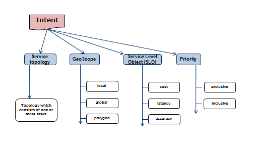
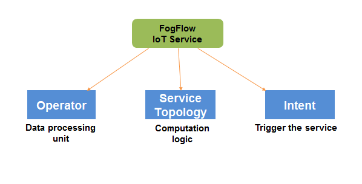
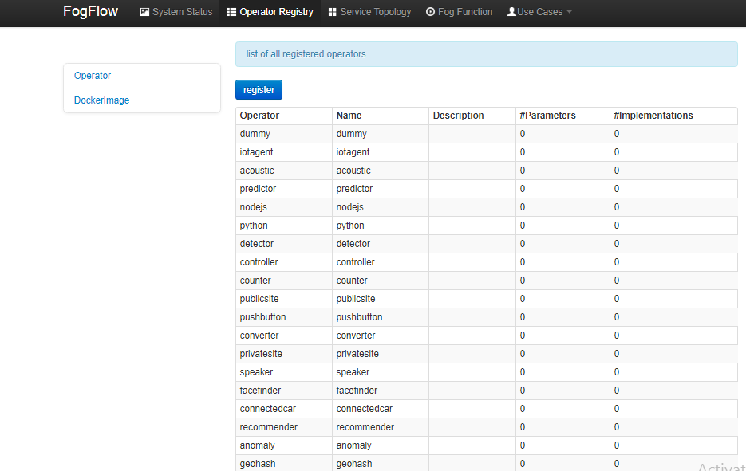
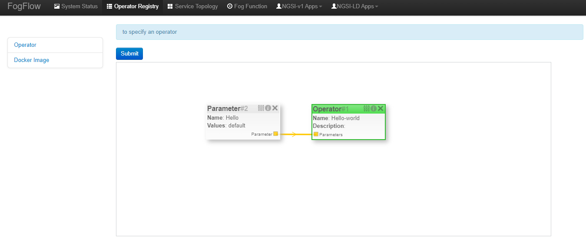
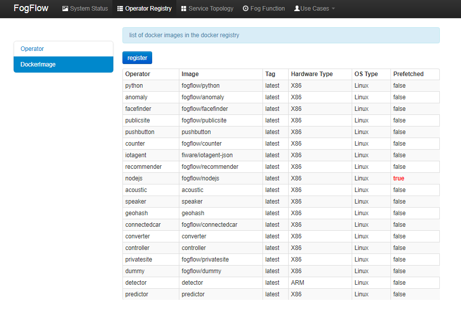
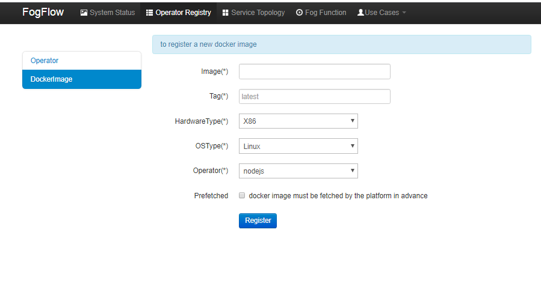
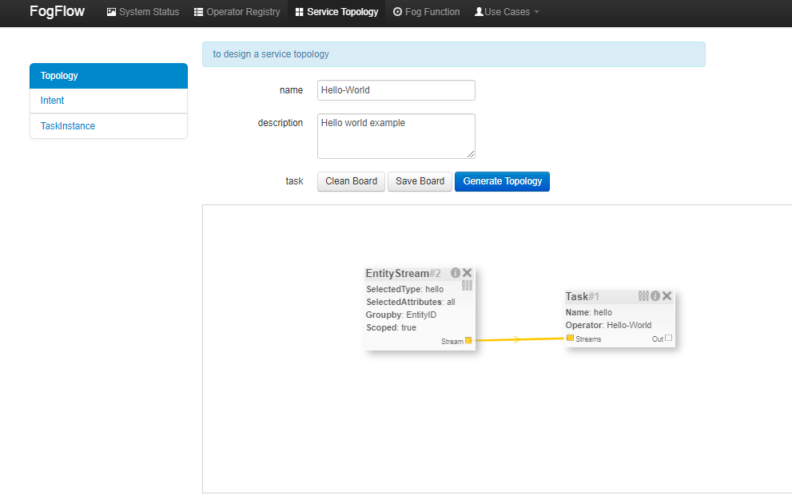
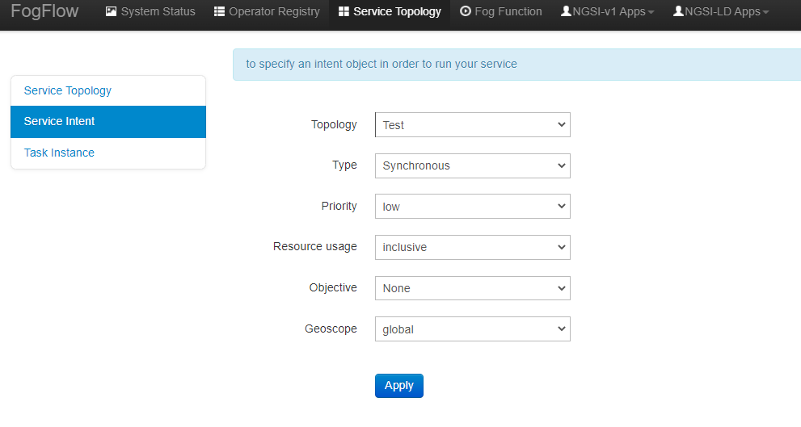

Intent Model
==================

An intent object basically consists of these properties as illustrated in below figure.

- Serivce topology specifies the computation logic for which the intent object is triggered. 

- Geoscope is defined a geographical location where input streams should be selected. Geoscope cab be setect as global value as well as can be set custom geoscopes. 

- Service Level Object (SLO) is the objective of maximum throughput, minimum latency and minimum cost can be set for task assignment at workers. However, this feature is not fully supported yet, so User can ignore this. It can be set as “None” for now. 

- Resource Usage defines how a topology can use resources on edge nodes. It can either exlusive or inclusive. In an exclusive way means the topology will not share the resources with any task from other topologies. Whereas in an inclusive one topology will share the resources with any task from other topologies.

Three Key Elements
=====================

The three key elements to program an IoT service is illustrated via below figure.

In FogFlow several operators form a graph which is defined as a service topology. Each operator in the service topology is annotated with its inputs and outputs, which indicate their dependency to the other tasks in the same topology. Service topology can easily compose different operators to form their service logic in just a few minutes. After that, during the runtime data processing flows can be automatically triggerred based on the high level data usage intent defined by service users. Service users can be either data producers or result consumers.

Service topology example of "Hello-World"
=========================================

Register task operators
----------------------------------------------

**Register an Operator** to define what would be the name of Operator and what input parameters it would need. Here in this context, an operator is nothing but a named element having some parameters.
The following picture shows the list of all registered operators and their parameter count.

After clicking the "register" button, a design area can be seen below and an operator can be created and parameters can be added to it. Add name of operator "Hello-World" and add a description for operator( it is optional). Add parameter name , it can be anything here it is written as hello and value is set as default.

**Register a Docker Image and choose Operator** to define the docker image and associate an already registered Operator with it. 

The following picture shows the list of all registered docker images and the key information of each image. 

After clicking the "register" button, a form can be seen as below. 
Please fill out the required information and click the "register" button to finish the registration. 
The form is explained as the following. 

* Image: the name of your operator docker image
* Tag: the tag is used to publish the operator docker image; by default it is "latest"
* Hardware Type: the hardware type that the docker image supports, including X86 or ARM (e.g. Raspberry Pi)
* OS Type: the operating system type that the docker image supports; currently this is only limited to Linux
* Operator: the operator name, which must be unique and will be used when defining a service topology
* Prefetched: if this is checked, that means all edge nodes will start to fetch this docker image in advance; otherwise, the operator docker image is fetched on demand, only when edge nodes need to run a scheduled task associated with this operator. 

.. important::
    
    Please notice that the name of the docker image must be consistent with the one that is published to `Docker Hub`_.
    By default, FogFlow will fetch the required docker images from Docker Hub using the name that is registered here for an operator. 
    
.. _`Docker Hub`: https://github.com/smartfog/fogflow/tree/master/application/operator/anomaly
    
    

Define and trigger a service topology for "Hello-World"
------------------------------------------------------------

Define service topology using FogFlow Topology Editor.

As seen in the picture, the following important information must be provided. 

#. define topology profile, including
    * topology name: the unique name of your topology
    * service description: some text to describe what this service is about
    
#. draw the graph of data processing flows within the service topology
    With a right click at some place of the design board, you will see a menu pops up 
    and then you can start to choose either task or input streams or shuffle
    to define the data processing flow.
   
   
The following information is required to specify a task profile.
	
    * name: the name of the task 
    * operator: the name of the operator that implements the data processing logic of this task; an operator shall be registered beforehand so that it can be shown from the list
    * entity type of output streams: to specify the entity type of the produced output stream.
    
    The following information is required to specify an EntityStream Profile.

    * SelectedType: is used to define what Entity Type will be chosen by the task as its Input Stream
    * SelectedAttributes: is used to define what attribute (or attributes) of the Selected Entity Type will be considered for changing the state of a task.
    * Groupby: to determine how many instances of this task should be created on the fly; currently including the following cases
	
        *  if there is only one instance to be created for this task, please use "groupby" = "all"
        *  if it is needed to create one instance for each entity ID of the input streams, please use "groupby" = "entityID"
        *  if it is neded to create one instance for each unique value of some specific context metadata, please use the name of this registered context metadata
    
    
* Scoped: tells if the Entity data are location-specific or not. True indicates that location-specific data are recorded in the Entity and False is used in case of broadcasted data, for example, some rule or threshold data that holds true for all locations, not for a specific location.

    Shuffling element serves as a connector between two tasks such that output of a task is the input for the shuffle element and same is forwarded by Shuffle to another task (or tasks) as input.
    
    
    
Trigger the service topology by sending an Intent
------------------------------------------------------------------------------

Once developers submit a specified service topology and the implemented operators, 
the service data processing logic can be triggered by following two steps:

* Sending a high level intent object which breaks the service topology into separate tasks
* Providing Input Streams to the tasks of that service topology.

The intent object is sent using the fogflow dashboard with the following properties: 

* Topology: specifies which topology the intent object is meant for.
* Priority: defines the priority level of all tasks in your topology, which will be utilized by edge nodes to decide how resources should be assigned to the tasks.
* Resource Usage: defines how a topology can use resources on edge nodes. Sharing in an exclusive way means the topology will not share the resources with any task from other topologies. The other way is inclusive one.
* Objective: of maximum throughput, minimum latency and minimum cost can be set for task assignment at workers. However, this feature is not fully supported yet, so it can be set as "None" for now.
* Geoscope: is a defined geographical area where input streams should be selected. Global as well as custom geoscopes can be set.

Fogflow topology master will now be waiting for input streams for the tasks contained in the service topology. As soon as context data are received, which fall within the scope of the intent object, tasks are launched on the nearest workers.

