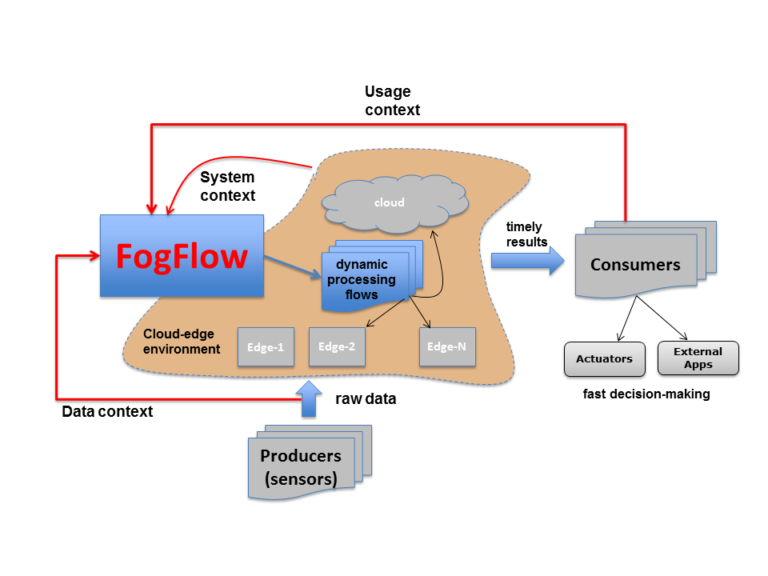
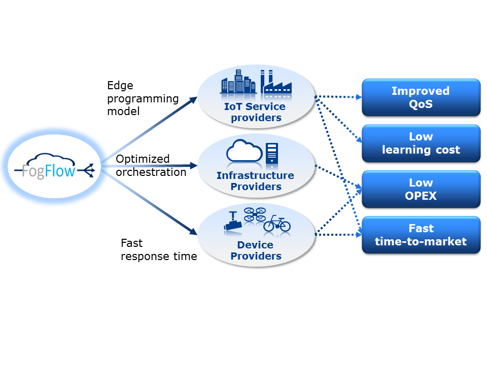
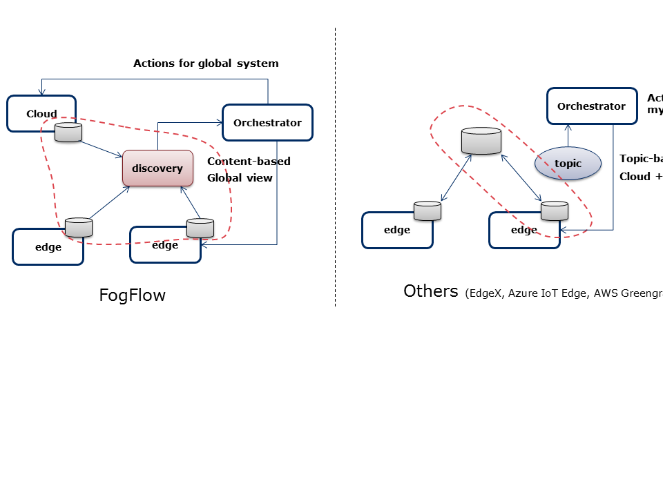
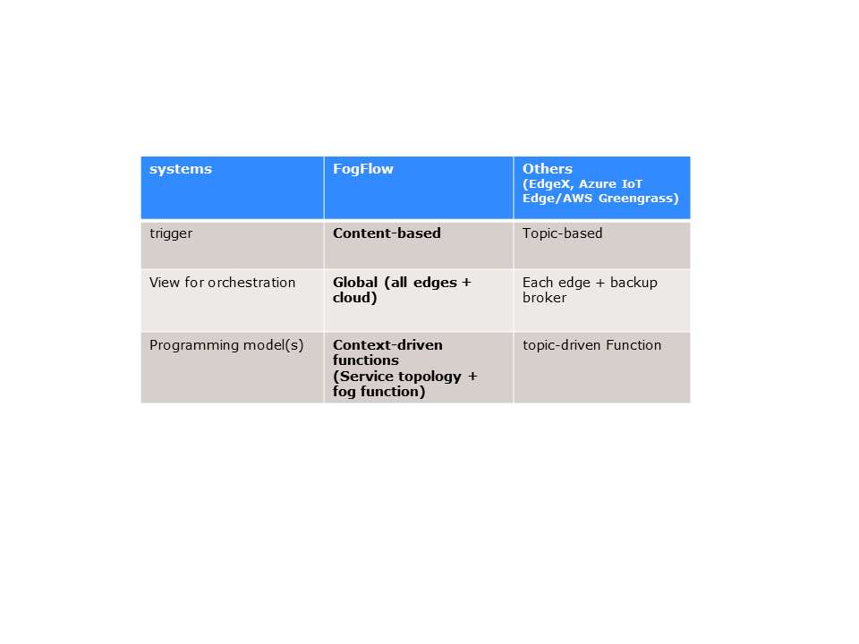

*******************************
High level introduction
*******************************

Nowadays IoT infrastructure providers for smart city, smart industry, and connected vehicles 
are facing huge complexity and cost to manage their geo-distributed infrastructures 
for supporting various IoT services, especially those that require low latency. 
FogFlow is a distributed execution framework to dynamically orchestrate IoT services over cloud and edges, 
in order to reduce internal bandwidth consumption and offer low latency. 

By providing automated and optimized IoT service orchestration with high scalability and reliability, 
FogFlow helps infrastructure providers to largely reduce their operation cost. 
FogFlow also provides a data-centric programming model 
and a development tool chain for service developers and system integrators to quickly realize IoT services 
with low development cost and fast time-to-market. 

Motivation
===============================

FogFlow is an IoT edge computing framework, which is designed to address the following concerns: 

- The cost of a cloud-only solution is too high to run a large scale IoT system with >1000 geo-distributed devices

- Many IoT services require fast response time, such as <10ms end-to-end latency

- Service providers are facing huge complexity and cost to fast design and deploy their IoT services in a cloud-edge environment - business demands are changing fast over time and service providers need to try out and release any new services over their shared cloud-edge infrastructure at a fast speed

- Lack of programming model to fast design and deploy IoT services over geo-distributed ICT infrastructure

- Lack of interoperability and openness to share and reuse data and dervied results across various applications

With FogFlow, service providers can easily programme their IoT services with minimal development effort
and also they are able to release new IoT services with fast time-to-market. 
On the other hand, for IoT platform operators, FogFlow can help them to seamlessly server latency-sensitive IoT services over cloud and edges 
with low operation cost and optimized QoS. 

High level view
===============================

The unique feature of FogFlow is **context-driven**, meaning that 
FogFlow is able to orchestrate dynamic data processing flows over cloud & edges 
based on three types of contexts, including: 

- System context: available resources which are changing over time
    The resources in a cloud-edge environment are geo-distributed in nature and they are dynamically changing over time;
    As compared to cloud computing, resources in such a cloud-edge environment are more *heterogenous* and *dynamical*.    

- Data context: the structure and registered metadata of available data, including both raw sensor data and intermediate data
    based on the standardized and unified data model and communicatino interface, 
    namely **NGSI**, FogFlow is able to see the content of all data generated by sensors 
    and data processing tasks in the system, 
    such as data type, attributes, registered metadata, relations, and geo-locations;

- Usage context: high level intents defined by all different types of users (developers, service consumers, data providers) to specify what they want to achieve. 
    For example, for service consumers, they can specify which type of results are expected 
    under which type of QoS within which geo-scope; 
    for data providers, they can specify how their data should be utilized by whom.
    In FogFlow, orchestration decisions are made to meet those user-definable objectives during the runtime. 
    We are working on more advanced algorithms to enable those new features. 

By leveraging these three kinds of context, FogFlow is able to orchestrate IoT services in a more intelligent and automatic manner. 

Technical benefit
===============================

As illustrated in the following figure, 
FogFlow provides a standard-based and data-centric edge programming model 
for IoT service providers to easily and fast realize their services for various business demands. 
With its data-driven and optimized service orchestration mechanism, 
FogFlow helps infrastructure providers to automatically and efficiently manage 
thousands of cloud and edge nodes for city-scale IoT services to achieve optimized performance. 
In large scale IoT projects like Smart Cities or Smart Factories, 
FogFlow can therefore save development and operation cost, improve productivity, 
provide fast time-to-market, as well as increase scalability and reliability. 

Differentiation
===============================

As compared to the other existing IoT edge computing frameworks, 
such as EdgeX, Azure IoT Edge, Amazon Greengrass. 
FogFlow has the following unique features illustrated in the following picture. 

- The service orchestration in FogFlow is driven by context, rather than raw events or topics. 
    This feature is enabled by the design of introducing a new layer, namely IoT Discovery, 
    which provides a update summary of available entity data on all brokers. 
    As compared to event or topic based orchestration, our context-based orchestration in FogFlow is more flexible 
    and more light-weight.
    This is because the orchestration decisions in FogFlow can be made based on aggregated context, 
    without reading throught all involved data streams. 
    On the other hand, FogFlow takes into account the high level intentions defined by users 
    to make optimized orchestration decisions for better QoS.     

- The FogFlow services and applications are designed against a global view of all cloud nodes and edge nodes, rather than from the perspective of each individual edge node. 
    This design principle can largely simplify the required development effort and management overhead,
    especially FogFlow can support well distributed applications which could run across all cloud nodes and edge nodes seamlessly
    without knowing the details of how tasks coordination between cloud and edge or between different edge nodes should be carried out. 
    However, for most of the other IoT Edge Computing frameworks, services or applications are designed for each edge
    and they are not really distributed services or applications, because those services or applications
    are able to run either in the cloud or at some edge but they are not able to run over cloud nodes and edge nodes 
    in a distributed fasion. 

More detailed differentiations are summarized in the following table. 

    

    

