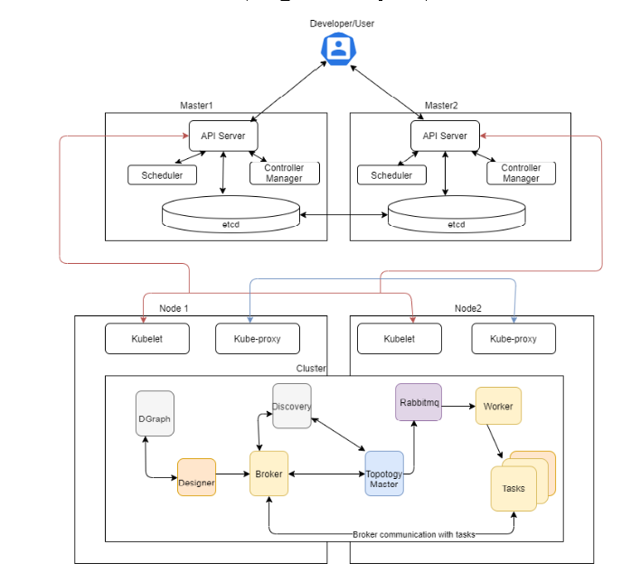
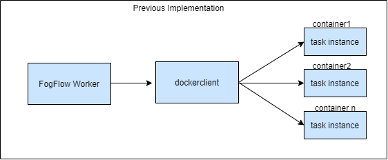
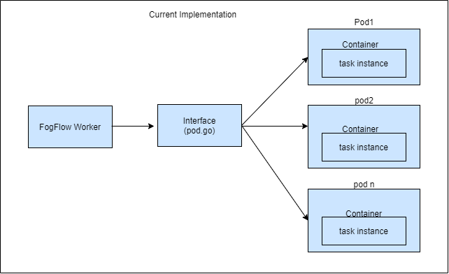
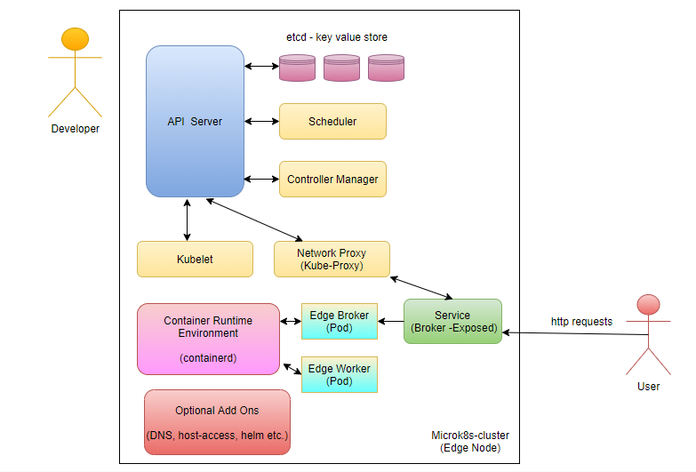
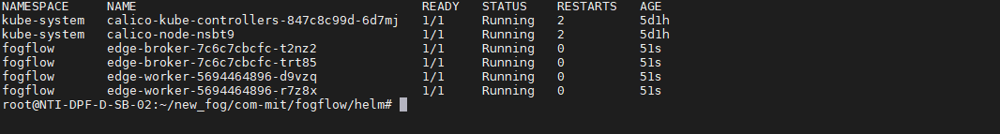

**********************
Kubernetes Integration
**********************

The components of FogFlow can be built via source code as well as in docker environment using docker-compose tool. In docker environment each component of FogFlow is running as single instance. Whole FogFlow system will have to re-start in case any single component container goes down and if any single service is overloaded it cannot scale to handle the load.  
To overcome these issues FogFlow has migrated to Kubernetes. FogFlow components will be deployed in Kubernetes cluster environment based on end user requirement. Various cluster configuration can be deployed:

1.	Master and Worker on same Node
2.	Single Master and Single Worker
3.	Single Master and Multi Worker Node
4.	Multiple Master and Multi Worker Node

Along with cluster following features of K8s are implemented in FogFlow:

1. **High Availability and Load Balancing**: 
High Availability is about setting up Kubernetes, along with its supporting components in a way that there is no single point of failure. If the environment setup has multiple applications running on Single container then this container can easily fail. Same as the virtual machine for high availability multiple replicas of a container can be run in Kubernetes. Load balancing is efficient in distributing incoming network traffic across a group of backend servers. A load balancer is a device that distributes network or application traffic across a cluster of servers. The load balancer plays a big role for achieving the high availability and better performance of the cluster. 

2. **Self-Healing**: 
This feature of kubernetes is what makes it best among others. If any pod gets deleted manually or accidentally, it is restared by kubernetes cluster. This maintains continuity with the deployed project. This feature of kuberenetes to heal a pod is referred as auto-heal. 

3. **Automated Rollouts & Rollback**: This can be achieved by rolling update. Rolling updates are the default strategy to update the running version of your app. With every new update cycle the previously launched Pod is removed and in its place a  newer Pod with latest updates is launched incrementally. 
When any change is introduced that breaks production, then there should be  a plan to roll back that change. Kubernetes and kubectl offer a simple mechanism to roll back changes to its resources such as Deployments.

4. **Ease the deployment with Helm Support**: Helm is a tool that streamlines the installation and management of Kubernetes applications. 
Helm Chart helps to define, install, and upgrade even the most complex Kubernetes application.
FogFlow document would be updated with the functioning details of above features to understand and access the Kubernetes environment well.

**Limitation of FogFlow K8s Integration**

Below are few limitations of FogFlow Kubernetes Integration. These limitation will be implemented in future.

1. Security and Network Policy in K8s environment.

2. Taints and Trait

3. Performance Evaluation

4. Other Functionality

FogFlow Cloud architecture diagram on Kubernetes
----------------------------------------------

FogFlow cloud node components such as Dgraph, Discovery, Broker, Designer, Master, Worker, Rabbitmq are distributed in cluster nodes. The communication between FogFlow components and their behaviour are as previous and the worker node will launch task instances on docker container. 

Follow the link `here`_ to know how Kubernetes component works

.. _`here`: https://kubernetes.io/docs/concepts/overview/components/

Here are the prerequisite commands for running FogFlow on K8s:

1. docker
2. Kubernetes
3. Helm

.. important:: 
	**please also allow your user to execute the Docker Command without Sudo**
	
To install Kubernetes, please refer to  `Kubernetes Official Site`_ or Check alternate `Install Kubernetes`_,

To install Helm, please refer `Install Helm`_

.. _`Kubernetes Official Site`: https://kubernetes.io/docs/setup/production-environment/tools/kubeadm/install-kubeadm/

.. _`Install Kubernetes`: https://medium.com/@vishal.sharma./installing-configuring-kubernetes-cluster-on-ubuntu-18-04-lts-hosts-f37b959c8410

.. _`Install Helm`: https://helm.sh/docs/intro/install/

Deploy FogFlow Cloud Components on K8s Environment
--------------------------------------------------

FogFlow cloud node components such as Dgraph, Discovery, Broker, Designer, Master, Worker, Rabbitmq are distributed in cluster nodes. The communication between FogFlow components and their behaviour are as usual and the worker node will launch task instances on docker container. 

**Fetch all required scripts**

Download the Kubernetes file and the configuration files as below.

.. code-block:: console

        # the Kubernetes yaml file to start all FogFlow components on the cloud node
        wget https://raw.githubusercontent.com/smartfog/fogflow/master/helm/fogflow-chart.zip

install unzip tool on system to extract JSON files from dashboards.zip

.. code-block:: console

          #command to install unzip in ubuntu
          apt-get install unzip

          #command to unzip the fogflow-chart.zip in same location
          unzip fogflow-chart.zip

	
   
Configure IP Addresses in config.json File
-------------------------------------------------------------

You need to change the following IP addresses in config.json according to your own environment. The config.json file present in the abobe downloaded folder "fogflow-chart"

- **my_hostip**: this is the IP of your host machine, which should be accessible for both the web browser on your host machine and docker containers. Please DO NOT use "127.0.0.1" for this.

- **site_id**: each FogFlow node (either cloud node or edge node) requires to have a unique string-based ID to identify itself in the system;
- **physical_location**: the geo-location of the FogFlow node;
- **worker.capacity**: it means the maximal number of docker containers that the FogFlow node can invoke;  

Configure values.yaml File
---------------------------

-Edit namespace and serviceAccount as per requirement. Add the no. of replicaCount required.

-Change dgraph, configJson and nginxConf path in values.yaml  file as per the environment hostPath.

-Change externalIPs as per the environment.

.. code-block:: console

      #Kubernetes namespace of FogFlow components
      namespace: default

      #replicas will make sure that no. of replicaCount mention in values.yaml
      #are running all the time for the deployment
      replicaCount: 1

      serviceAccount: default
      #Specifies whether a service account should be created
        create: true
      #Annotations to add to the service account
        annotations: {}
      #The name of the service account to use.
      #If not set and create is true, a name is generated using the fullname template
        name: ""

      #hostPath for dgraph volume mount
      dgraph:
        hostPath:
          path: /mnt/dgraph

      #hostPath for config.json, add this path to fogflow-chart directory
      configJson:
        hostPath:
          path: /home/necuser/fogflow/helm/files/fogflow-chart/config.json

      #hostPath for nginx.conf, add this path to fogflow-chart directory
      nginxConf:
        hostPath:
          path: /home/necuser/fogflow/fogflow/yaml/nginx.conf

      #External IP to expose cluster
      Service:
       spec:
        externalIPs:
        - XXX.XX.48.24

	  
Start all Fogflow components with Helm Chart
-------------------------------------------------------------

Execute Helm command from outside the Helm-Chart folder to start FogFlow Components, here helm-chart name is "fogflow-chart". 

Add "--set" flag with helm install command to pass configuration from command line.

.. code-block:: console
 
          helm install ./fogflow-chart --set externalIPs={XXX.XX.48.24} --generate-name

Refer Helm official `link`_ for more details

.. _`link`: https://helm.sh/docs/helm/

Validate the setup
-------------------------------------------------------------

There are two ways to check if the FogFlow cloud node is started correctly: 

- Check all the Pods are Up and Running using "kubectl get pods --namespace=<namespace_name>"

.. code-block:: console  

         kubectl get pods --namespace=fogflow
		 
		 
        NAME                           READY   STATUS              RESTARTS   AGE
        cloud-broker-c78679dd8-gx5ds   1/1     Running             0          8s
        cloud-worker-db94ff4f7-hwx72   1/1     Running             0          8s
        designer-bf959f7b7-csjn5       1/1     Running             0          8s
        dgraph-869f65597c-jrlqm        1/1     Running             0          8s
        discovery-7566b87d8d-hhknd     1/1     Running             0          8s
        master-86976888d5-drfz2        1/1     Running             0          8s
        nginx-69ff8d45f-xmhmt          1/1     Running             0          8s
        rabbitmq-85bf5f7d77-c74cd      1/1     Running             0          8s

		
- Check the system status from the FogFlow DashBoard

System status can also be verified from FogFlow dashboard on web browser to see the current system status via the URL: http://<coreservice_ip>/index.html

**Launch FogFlow Worker task instances on k8s pods**

Previously, task instances was launching on Docker containers. In that case, FogFlow worker used to call go-dockerclient and with the help of this client was launching task instances on docker containers.

Now, An interface pod.go is being used. This interface will receive the dockerimage name, port and configuration details from worker and launch the task inside a pod.

Create a task using link `task_Instance`_

.. _`task_Instance`: https://fogflow.readthedocs.io/en/latest/intent_based_program.html#define-a-dummy-fog-function 

FogFlow Edge Node Kubernetes Support
-------------------------------------------

Edge node being a light weight component of Fogflow architecture is using the lighter version of kubernetes. The edge node will interact with IoT Devices and actuators to accomplish the task launched on that particular edge node. The lighter version of kubernetes is supported by Microk8s utility, which comes as a distribution with snap tool. MicroK8s is the smallest, fastest, fully-conformant Kubernetes that will connect with cloud kubernetes clusters easily. 

Microk8s supports self-healing high availability clusters, which is the key attribute that makes it a great pick for kubernetes at edge. When edge lose a cluster database node, another node is promoted automatically. It gives the user hassle free opertaions of deployments, initiating and stopping cluster and even bundle of additional add ons. For more details, please visit official site  of `microk8s`_.

.. _`microk8s`: https://microk8s.io

FogFlow Edge Architecture over Microk8s
------------------------------------------

Microk8s Installation And Setup
---------------------------------------

To setup microk8s kubernetes cluster on edge node follow the below mentioned steps:

**step 1** : Verify the installation of snapd utility, using **snap version**. If snap is not preinstalled on edge, use below commands for its installation.

.. code-block:: console

        #Start by updating packages

        $sudo apt update

        #Now install snapd tool

        $sudo apt install snapd

**Step 2** : Now install microk8s using below commands.

.. code-block:: console

        $sudo snap install microk8s --classic

**Step 3** : Verfiy the status of microk8s, that is whether it is running or not.

.. code-block:: console

        #to check status

        $microk8s.status

**Step 4** : If the output of above step indicate that microk8s is not in running state, then use below command to start it.

.. code-block:: console

        $microk8s.start

        #to check the status again follow the command 

        $microk8s.status

**Step 5** : Now to enable microk8s to interact with host, user need to enbale the following add ons. It can be done using following command.

.. code-block:: console

        #to enable add ons

        $microk8s.enable host-access helm3

        #to check if add ons are enabled or not, verify the status of microk8

        $microk8s.status

With above steps basic installation and setup of microk8s is accomplished.

Configuring Microk8s kubernetes cluster
---------------------------------------------

To be able to create deployment over microk8s kubernetes cluster, user needs to create namespace and serviceaccount in kubernetes cluster for edge node. To do so, follow the below procedure.

.. code-block:: console

        $microk8s.kubectl create namespace <User Specified>

        #eg : microk8s.kubectl create namespace fogflow

Note: Now, to create service account, fetch the serviceaccount.yaml file. 

.. code-block:: console 

        #to fetch serviceaccount.yaml file
        
        $wget https://raw.githubusercontent.com/smartfog/fogflow/master/yaml/serviceaccount.yaml

To configure the serviceaccount file, change the occurence of namespace with <User Specified> name mentioned in above step, that is the name used  while creating namespace.

.. code-block:: console

        apiVersion: v1
        kind: ServiceAccount
        metadata:
        namespace: <User Specified> #eg namespace: fogflow
        name: fogflow-dns

        #similarly change all the occurences of namespace in this file (it will be changed at three places in files, in above shown manner)

With the above procedure, microk8 cluster is ready to deploy pods and services on it.

Deploying Edge-Chart With Microk8s and helm 
----------------------------------------------

For deploying edge chart, use helm3 tool with microk8s as shown below. 

.. code-block:: console

        #fetch scripts for edge-chart

        $wget https://raw.githubusercontent.com/smartfog/fogflow/master/helm/edge-chart.zip

To unzip the downloaded folder using following, 

.. code-block:: console

        #command to install unzip in ubuntu
        
        $apt-get install unzip

        #command to unzip the file dashboards.zip

        $unzip edge-chart.zip

**Step 1** : Edit the config.json file in edge-chart folder.

 .. code-block:: console
   
      "coreservice_ip": "<Cloud Node IP>",       
      
      #Eg. "coreservice_ip": "172.30.48.24"

      
      "my_hostip": "<Edge Node Ip>",

      #Eg. "my_hostip": "172.30.48.46"

**Step 2** : Edit the namespace, externalIPs and path under configJson tag in values.yaml file inside edge-chart folder.

.. code-block:: console

        namespace: <User Specified>   #Eg. namespace: fogflow 

        #replicas will make sure that no. of replicaCount mention in values.yaml
        #are running all the time for the deployment
        replicaCount: 2 

        serviceAccount:
        #Specifies whether a service account should be created
        create: true
        #Annotations to add to the service account
        annotations: {}
        #The name of the service account to use.
        #If not set and create is true, a name is generated using the fullname template
        name: ""

        #hostPath for config.json  
        configJson:
        hostPath:
        path: /root/new_fog/fogflow-helm/helm/edge-chart/config.json

        Service:
        spec: 
        externalIPs: 
        - 172.30.48.46 #The IP of Edge Node 

Note: The value of **"namespace"** will be one which user specified while creating the namespace in previous steps. Value of **"externalIPs"** will be the IP of edge node and value of **"path"** under configJson will be equal to the path of host machine where config.json is present inside edge-chart.

**Step 3** : To finally deploy chart, use the command as below.

.. code-block:: console

        $microk8s.helm3 install ./edge-chart --set externalIPs={XXX.XX.48.46} --generate-name

        #the externalIPs is IP of edge node.

        #to check status of deployed pods 

        $microk8s.kubectl get pods --all-namespaces

