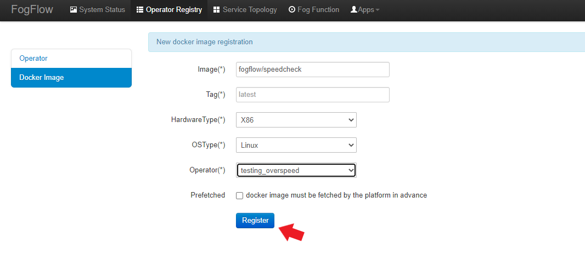
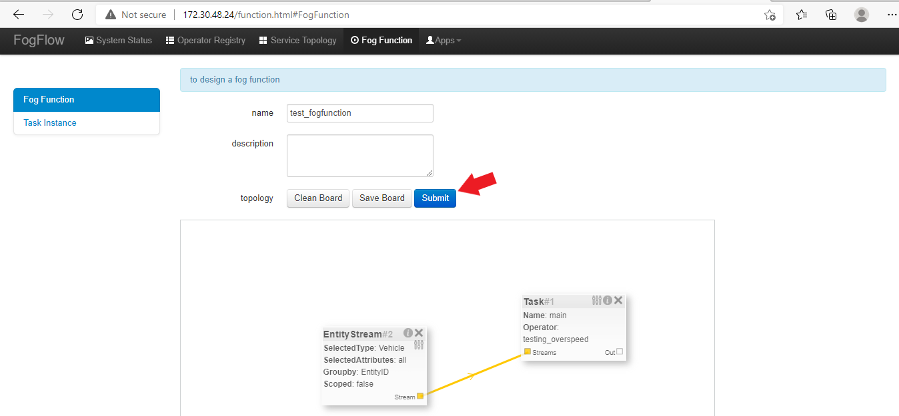

******************************************
Kubernetes Integration Using YAML Files
******************************************

Fogflow can be deployed on kubernetes cluster using individual YAML files if user whish to do so. To accomplish that, following are the prerequisites :

1. docker
2. Kubernetes

.. important:: 
	**please also allow your user to execute the Docker Command without Sudo**
	
To install Kubernetes, please refer to  `Kubernetes Official Site`_ or Check alternate `Install Kubernetes`_,

.. _`Kubernetes Official Site`: https://kubernetes.io/docs/setup/production-environment/tools/kubeadm/install-kubeadm/

.. _`Install Kubernetes`: https://medium.com/@vishal.sharma./installing-configuring-kubernetes-cluster-on-ubuntu-18-04-lts-hosts-f37b959c8410

Deploy FogFlow Cloud Components on K8s Environment Using YAML Files
--------------------------------------------------------------------

FogFlow cloud node components such as Dgraph, Discovery, Broker, Designer, Master, Worker, Rabbitmq are distributed in cluster nodes. The communication between FogFlow components and their behaviour are as usual and the worker node will launch task instances on kubernetes pod.

Inorder to setup the components, please refer the steps below:

**Step 1** : Clone the github repository of Fogflow using this `link`_.

.. _`link` : https://github.com/smartfog/fogflow

**Step 2** : Now, traverse to **"deployment/kubernetes/cloud-node"** folder in Fogflow repository.
  
**Step 3** : Edit the **externalIPs** value in nginx.yaml as per user's environment.

.. code-block:: console

    apiVersion: v1
    kind: Service
    metadata:
    namespace: fogflow                      
    name: nginx
    labels:
        run: nginx
    spec:
    type: LoadBalancer
    ports:
        - port: 80
        targetPort: 80
    selector:
        run: nginx
    externalIPs: [172.30.48.24]  //edit this
   
**Step 4** : Now, edit **path** variable in dragph.yaml as per user's environment. The complete path is to be mentioned as shown below:

.. code-block:: console

    volumes:
      - name: dgraph
        hostPath: 
          path: /root/kcheck/src/fogflow/deployment/kubernetes/cloud-node/dgraph      //This is to be updated as per user's own environment

**Step 5** : Now, in order to deploy cloud-node components, use below command.

.. code-block:: console

    ./install.sh

Now verify the deployments using, 

1. Fogflow dashboard : In your browser, type for http://<externalIPs>:80 (externalIPs is the one mentioned in nginx.yaml file).

2. Check for pods status, using **kubectl get pods --namespace=fogflow**

.. code-block:: console

    NAME                          READY   STATUS    RESTARTS   AGE
    cloudbroker-cd68f4977-tnrbx   1/1     Running   0          52s
    cloudworker-c68c8574c-77rsw   1/1     Running   0          51s
    designer-57dfb754f4-zmc7l     1/1     Running   0          50s
    dgraph-76b8c965c-54zhm        1/1     Running   0          52s
    discovery-5c9cbb4798-kqd2t    1/1     Running   0          52s
    master-866bcddb6b-ghd64       1/1     Running   0          51s
    nginx-54bb77f5c-kz8mq         1/1     Running   0          50s
    rabbitmq-6cdd877677-jn68r     1/1     Running   0          51s

In order to stop the deployments of Fogflow system, follow below command:

.. code-block:: console

    ./uninstall.sh

Trigger a Task Inside a kubernetes Pod 
--------------------------------------------------

In order to launch a task instance associated with a fog function, follow below procedure:

**Step 1:** Open Fogflow dashboard using this address "http://<externalIPs>:80".

.. figure:: figures/dashboard.png

**Step 2:** To register Operator, select Operator Registry Tab from horizontal bar on dashboard. Select operator from menu on left and then click register button. Right click on workspace and select operator from drop down list and enter details as shown and at last click on submit.

.. figure:: figures/operator_creation.png 

**Step 3"** Register the following docker image, corresponding to the operator created in above step.

.. code-block:: console

	pradumn99/connection
   
  	The above operator will notify Fogflow, When speed of a vehicle goes beyond 50.

   	To register the image, select DockerImage from left menu, under Operator Registry from dashboard and click register button.

**Step 4:** Now, to create a fogfunction, toggle on Fog Function in the horizontal bar on dashboard. Select Fog Function from left menu and click register button. Enter the name and description (optional) as shown. Right click in the workspace and select task and Entity stream from drop down list and configure details.

**Step 5:** To trigger fog function and launch task instance inside kubernetes pod, send below curl request.

.. code-block:: console

    curl --location --request POST '172.30.48.24:80/ngsi-ld/v1/entities/' \
    --header 'Content-Type: application/json' \
    --header 'Accept: application/ld+json' \
    --data-raw '{
        "id": "urn:ngsi-ld:Vehicle:A100",
        "type": "Vehicle",
        "brandName": {
            "type": "Property",
            "value": "Mercedes"
        },
        "isParked": {
            "type": "Relationship",
            "object": "urn:ngsi-ld:OffStreetParking:Downtown1",
            "observedAt": "2017-07-29T12:00:04",
            "providedBy": {
                "type": "Relationship",
                "object": "urn:ngsi-ld:Person:Bob"
            }
        },
        "speed": {
            "type": "Property",
            "value": "50"
        },
        "createdAt": "2017-07-29T12:00:04",
        "location": {
            "type": "GeoProperty",
            "value": {
                "type": "Point",
                "coordinates": [31,140]
            }
        }
    }'

**Step 6:** To see the launched task instance inside kubernetes pod, follow below command:

.. code-block:: console

    $kubectl get pods -n fogflow 

    NAME                                        READY   STATUS    RESTARTS   AGE
    cloudbroker-cd68f4977-tnrbx                 1/1     Running   0          5m
    cloudworker-c68c8574c-77rsw                 1/1     Running   0          4m59s
    designer-57dfb754f4-zmc7l                   1/1     Running   0          4m58s
    dgraph-76b8c965c-54zhm                      1/1     Running   0          5m
    discovery-5c9cbb4798-kqd2t                  1/1     Running   0          5m
    fogflow-deployment-35431-5676c798d5-5cdfs   1/1     Running   0          68s    // Launched task instance inside Pod
    master-866bcddb6b-ghd64                     1/1     Running   0          4m59s
    nginx-54bb77f5c-kz8mq                       1/1     Running   0          4m58s
    rabbitmq-6cdd877677-jn68r                   1/1     Running   0          4m59s
