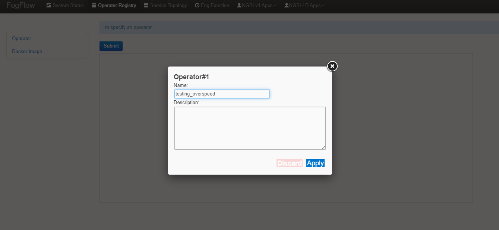

******************************************
Kubernetes Integration Using YAML Files
******************************************

Fogflow can be deployed on kubernetes cluster using individual YAML files if user whish to do so. To accomplish that, following are the prerequisites :

1. docker
2. Kubernetes

.. important:: 
	**please also allow your user to execute the Docker Command without Sudo**
	
To install Kubernetes, please refer to  `Kubernetes Official Site`_ or Check alternate `Install Kubernetes`_,

.. _`Kubernetes Official Site`: https://kubernetes.io/docs/setup/production-environment/tools/kubeadm/install-kubeadm/

.. _`Install Kubernetes`: https://medium.com/@vishal.sharma./installing-configuring-kubernetes-cluster-on-ubuntu-18-04-lts-hosts-f37b959c8410

Deploy FogFlow Cloud Components on K8s Environment Using YAML Files
--------------------------------------------------------------------

FogFlow cloud node components such as Dgraph, Discovery, Broker, Designer, Master, Worker, Rabbitmq are distributed in cluster nodes. The communication between FogFlow components and their behaviour are as usual and the worker node will launch task instances on kubernetes pod.

Inorder to setup the components, please refer the steps below:

**Step 1** : Clone the github repository of Fogflow using this `link`_ and traverse to **"deployment/kubernetes/cloud-node"** folder in Fogflow repository.

.. _`link` : https://github.com/smartfog/fogflow
 

**Step 2** : Edit **path** variable in dragph.yaml as per user's environment. Note that the dgraph folder will be generated in the clode-node folder itself. Please mention the complete path of **dgraph folder** which is present in cloud-node folder on user's system as shown below as shown below:

.. code-block:: console

    volumes:
      - name: dgraph
        hostPath: 
          path: /root/cloud-node/dgraph      //This is to be updated as per user's own environment

**Step 3** : User need to Configure the config.json section in *configmap.yaml file (/cloud-node/configmap.yaml)* as shown below:

- **my_hostip**: this is the IP of your host machine, which should be accessible for both the web browser on your host machine and docker containers. Please DO NOT use "127.0.0.1" for this.

- **site_id**: each FogFlow node (either cloud node or edge node) requires to have a unique string-based ID to identify itself in the system;
- **physical_location**: the geo-location of the FogFlow node;
- **worker.capacity**: it means the maximal number of docker containers that the FogFlow node can invoke;

.. code-block:: console

        apiVersion: v1
        data:
        config.json: |
        {
            "my_hostip": "172.30.48.24", 
            "physical_location":{
                "longitude": 139.709059,
                "latitude": 35.692221
             },
             "site_id": "001",
             "logging":{
                 "info":"stdout",
                 "error":"stdout",
                 "protocol": "stdout",
                 "debug": "stdout"
             },
             "discovery": {
                 "http_port": 8090
             },
             "broker": {
                 "http_port": 8070
             },
             "master": {
                 "ngsi_agent_port": 1060
             },
             "worker": {
                 "container_autoremove": false,
                 "start_actual_task": true,
                 "capacity": 8
             },
             "designer": {
                 "webSrvPort": 8080,
                 "agentPort": 1030
             },
             "rabbitmq": {
                 "port": 5672,
                 "username": "admin",
                 "password":"mypass"
             },
             "https": {
                 "enabled" : false
             },
             "persistent_storage": {
                 "port": 9080
             }
        }

**Step 4** : Use below command to deploy the cloud-node components.

.. code-block:: console

    ./install.sh [my_hostip] 

    E.g. ./install.sh 172.30.48.24
    The IP address is the one which will be configured in previous step as my_hostip

Now verify the deployments using, 

1. Fogflow dashboard : In your browser, type for http://<externalIPs>:80 (externalIPs is the same one as mentioned in nginx.yaml file).

2. Check for pods status, using **kubectl get pods --namespace=fogflow**

.. code-block:: console

    NAME                          READY   STATUS    RESTARTS   AGE
    cloudbroker-cd68f4977-tnrbx   1/1     Running   0          52s
    cloudworker-c68c8574c-77rsw   1/1     Running   0          51s
    designer-57dfb754f4-zmc7l     1/1     Running   0          50s
    dgraph-76b8c965c-54zhm        1/1     Running   0          52s
    discovery-5c9cbb4798-kqd2t    1/1     Running   0          52s
    master-866bcddb6b-ghd64       1/1     Running   0          51s
    nginx-54bb77f5c-kz8mq         1/1     Running   0          50s
    rabbitmq-6cdd877677-jn68r     1/1     Running   0          51s

In order to stop the deployments of Fogflow system, follow below command:

.. code-block:: console

    ./uninstall.sh
    This is the script present in cloud-node folder

Trigger a Task Inside a kubernetes Pod 
--------------------------------------------------

In order to launch a task instance associated with a fog function, follow below procedure:

**Step 1:** Open Fogflow dashboard using this address "http://<externalIPs>:80".

.. figure:: figures/dashboard.png

**Step 2:** To register Operator, select Operator Registry Tab from horizontal bar on dashboard. Select operator from menu on left and then click register button. Right click on workspace and select operator from drop down list and enter details as shown and at last click on submit.

**Step 3:** Register the following docker image, corresponding to the operator created in above step.

.. code-block:: console

	fogflow/speedcheck:latest
   
  	The above operator will notify Fogflow, When speed of a vehicle goes beyond 50.

   	To register the image, select DockerImage from left menu, under Operator Registry from dashboard and click register button.

**Step 4:** Now, to create a fogfunction, toggle on Fog Function in the horizontal bar on dashboard. Select Fog Function from left menu and click register button. Enter the name and description (optional) as shown. Right click in the workspace and select task and Entity stream from drop down list and configure details.

.. figure:: figures/fog_function_creation2.png

**Step 5:** To trigger fog function and launch task instance inside kubernetes pod, send below curl request.

.. code-block:: console

    curl --location --request POST '172.30.48.24:80/ngsi-ld/v1/entities/' \
    --header 'Content-Type: application/json' \
    --header 'Accept: application/ld+json' \
    --data-raw '{
        "id": "urn:ngsi-ld:Vehicle:A100",
        "type": "Vehicle",
        "brandName": {
            "type": "Property",
            "value": "Mercedes"
        },
        "isParked": {
            "type": "Relationship",
            "object": "urn:ngsi-ld:OffStreetParking:Downtown1",
            "observedAt": "2017-07-29T12:00:04",
            "providedBy": {
                "type": "Relationship",
                "object": "urn:ngsi-ld:Person:Bob"
            }
        },
        "speed": {
            "type": "Property",
            "value": "50"
        },
        "createdAt": "2017-07-29T12:00:04",
        "location": {
            "type": "GeoProperty",
            "value": {
                "type": "Point",
                "coordinates": [31,140]
            }
        }
    }'

**Note:** Please edit this **(172.30.48.24)** IP address with the one, where fogflow is running. 

**Step 6:** To see the launched task instance inside kubernetes pod in cluster, follow below command:

.. code-block:: console

    $kubectl get pods -n fogflow 

    NAME                                        READY   STATUS    RESTARTS   AGE
    cloudbroker-cd68f4977-tnrbx                 1/1     Running   0          5m
    cloudworker-c68c8574c-77rsw                 1/1     Running   0          4m59s
    designer-57dfb754f4-zmc7l                   1/1     Running   0          4m58s
    dgraph-76b8c965c-54zhm                      1/1     Running   0          5m
    discovery-5c9cbb4798-kqd2t                  1/1     Running   0          5m
    fogflow-deployment-35431-5676c798d5-5cdfs   1/1     Running   0          68s    // Launched task instance inside Pod
    master-866bcddb6b-ghd64                     1/1     Running   0          4m59s
    nginx-54bb77f5c-kz8mq                       1/1     Running   0          4m58s
    rabbitmq-6cdd877677-jn68r                   1/1     Running   0          4m59s

Deploy FogFlow Edge Components on Microk8s Environment Using YAML Files
-------------------------------------------------------------------------

To setup microk8s kubernetes cluster on edge node follow the below mentioned steps:

**step 1** : Verify the installation of snapd utility, using **snap version**. If snap is not preinstalled on edge, use below commands for its installation.

.. code-block:: console

        #Start by updating packages

        $sudo apt update

        #Now install snapd tool

        $sudo apt install snapd

**Step 2** : Now install microk8s using below commands.

.. code-block:: console

        $sudo snap install microk8s --classic

**Step 3** : Verfiy the status of microk8s, that is whether it is running or not.

.. code-block:: console

        #to check status

        $microk8s.status

**Step 4** : If the output of above step indicate that microk8s is not in running state, then use below command to start it.

.. code-block:: console

        $microk8s.start

        #to check the status again follow the command 

        $microk8s.status

**Step 5** : Now to enable microk8s to interact with host, user need to enbale the following add ons. It can be done using following command.

.. code-block:: console

        #to enable add ons

        $microk8s.enable host-access helm3

        #to check if add ons are enabled or not, verify the status of microk8

        $microk8s.status

With above steps basic installation and setup of microk8s is accomplished.

Deploy Edge Node 
------------------

**Step 1** : Clone the github repository of Fogflow using this `link`_ and traverse to **"deployment/kubernetes/edge-node"** folder in Fogflow repository.

.. _`link` : https://github.com/smartfog/fogflow

**Step 2** : User need to Configure the config.json section in *edge-configmap.yaml file (/edge-node/edge-configmap.yaml)* as shown below:

- **coreservice_ip**: this the IP of Fogflow cloud node, which should be accessible for edge node to connect. 
- **my_hostip**: this is the IP of your host machine, which should be accessible for both the web browser on your host machine and docker containers. Please DO NOT use "127.0.0.1" for this.

- **site_id**: each FogFlow node (either cloud node or edge node) requires to have a unique string-based ID to identify itself in the system;
- **physical_location**: the geo-location of the FogFlow node;
- **worker.capacity**: it means the maximal number of docker containers that the FogFlow node can invoke;

.. code-block:: console

        apiVersion: v1
        data:
        config.json: |
        {
            "coreservice_ip": "172.30.48.24",
            "my_hostip": "172.30.48.46",
            "physical_location":{
                "longitude": 140,
                "latitude": 32
             },
             "site_id": "002",
             "logging":{
                 "info":"stdout",
                 "error":"stdout",
                 "protocol": "stdout",
                 "debug": "stdout"
             },
             "discovery": {
                 "http_port": 8090
             },
             "broker": {
                 "http_port": 8060
             },
             "master": {
                 "ngsi_agent_port": 1060
             },
             "worker": {
                 "container_autoremove": false,
                 "start_actual_task": true,
                 "capacity": 8
             },
             "designer": {
                 "webSrvPort": 8080,
                 "agentPort": 1030
             },
             "rabbitmq": {
                 "port": 5672,
                 "username": "admin",
                 "password":"mypass"
             },
             "https": {
                 "enabled" : false
             },
             "persistent_storage": {
                 "port": 9080
             }
        }

**Step 3** : Use below command to deploy the edge-node components.

.. code-block:: console

    ./install.sh [my_hostip]

    E.g. ./install.sh 172.30.48.46
    The IP address is the one, which will be configured in previous step as my_hostip i.e. where the edge node will be running.

Now verify the deployments using,

1. Fogflow dashboard : In your browser, type for http://<cloud-node-IP>:80 (cloud-node-IP is the one where Fogflow cloud-node dasboard is visible ). Now on left hand side, select broker and see the newly added broker and similarly select worker tab on left side and see newly added worker details.

2. Check for pods status, using **microk8s.kubectl get pods --namespace=fogflow**

.. code-block:: console

    NAME                           READY   STATUS    RESTARTS   AGE
    edgebroker01-cd68f4977-tnrbx   1/1     Running   0          52s
    edgeworker01-c68c8574c-77rsw   1/1     Running   0          51s

In order to stop the deployments of Fogflow edge node, follow below command:

.. code-block:: console

    ./uninstall.sh
     This script is present inside edge node folder

