****************************************************************************************************************
FogFlow Cloud Components Deployment on K8s Environment With Preconfigured RBAC (Role Based Access Control)
****************************************************************************************************************

FogFlow cloud node components such as Dgraph, Discovery, Broker, Designer, Master, Worker, Rabbitmq are distributed in cluster nodes. The communication between FogFlow components and their behaviour are as usual and the worker node will launch task instances on kubernetes pod. 

**Fetch all required scripts**

Download the Kubernetes file and the configuration files as below.

.. code-block:: console

        # the Kubernetes yaml file to start all FogFlow components on the cloud node
        wget https://raw.githubusercontent.com/smartfog/fogflow/development/helm_with_RBAC/cloud-chart-RBAC.zip

install unzip tool on system to extract files from cloud-chart-RBAC.zip

.. code-block:: console

          #command to install unzip in ubuntu
          apt-get install unzip

          #command to unzip the fogflow-chart.zip in same location
          unzip cloud-chart-RBAC.zip

	
   
Configure IP Addresses in config.json File
-------------------------------------------------------------

You need to change the following IP addresses in config.json according to user's environment. The config.json file present in the above downloaded folder "cloud-chart-RBAC"

- **my_hostip**: this is the IP of your host machine, which should be accessible for both the web browser on your host machine and docker containers. Please DO NOT use "127.0.0.1" for this.

- **site_id**: each FogFlow node (either cloud node or edge node) requires to have a unique string-based ID to identify itself in the system;
- **physical_location**: the geo-location of the FogFlow node;
- **worker.capacity**: it means the maximal number of docker containers that the FogFlow node can invoke;  

Configure Namespace in Cloud Kubernetes Cluster
-------------------------------------------------

In order to launch fogflow components, user need to create a namespace. To create namespace in kubernetes cluster, use below command:

.. code-block::

    $kubectl create ns <User_provided_name> // E.g. kubectl create ns fogflow_fiware_integration

Configure values.yaml File
---------------------------

- User should provide name of the namespace created by him in previous step. 

- User should provide name of serviceAccount as per requirement. 

- User should configure the no. of replicaCount required.

- User should provide absolute path for dgraph, configJson and nginxConf in values.yaml file as per the environment.

- User should provide externalIPs as per the environment.

.. important::

        1. externalIPs are the IPs where Fogflow dashboard will be visible i.e. externalIP's are my_hostip in case of fogflow.
        2. externalIPs will be used by user to make any CRUD request to Fogflow

.. code-block:: console

      #Kubernetes namespace of FogFlow components
      namespace: fogflow

      #replicas will make sure that no. of replicaCount mention in values.yaml
      #are running all the time for the deployment
      replicaCount: 1

      serviceAccount: default
      #Specifies whether a service account should be created
        create: true
      #Annotations to add to the service account
        annotations: {}
      #The name of the service account to use.
      #If not set and create is true, a name is generated using the fullname template
        name: "fogflow-dns"

      #hostPath for dgraph volume mount
      dgraph:
        hostPath:
          path: /mnt/dgraph

      #hostPath for config.json, add this path to cloud-chart directory
      configJson:
        hostPath:
          path: /home/necuser/fogflow/helm_with_RBAC/cloud-chart-RBAC/config.json

      #hostPath for nginx.conf, add this path to cloud-chart directory
      nginxConf:
        hostPath:
          path: /home/necuser/fogflow/helm_with_RBAC/cloud-chart-RBAC/nginx.conf

      #External IP to expose cluster
      Service:
       spec:
        externalIPs:
        - XXX.XX.48.24

	  
Start all Fogflow components with Helm 
-------------------------------------------------------------

Execute Helm command from outside the Helm-Chart folder to start FogFlow Components, here helm-chart name is "cloud-chart-RBAC". 

Add "--set" flag with helm install command to pass configuration from command line.

.. code-block:: console
 
          helm install ./cloud-chart-RBAC --set externalIPs={XXX.XX.48.24} --generate-name --namespace=fogflow
          //Namespace should be the one created above. In our case namespace was "fogflow"

Refer Helm official `link`_ for more details

.. _`link`: https://helm.sh/docs/helm/

Validate the setup
-------------------------------------------------------------

There are two ways to check if the FogFlow cloud node is started correctly: 

- Check all the Pods are Up and Running using "kubectl get pods --namespace=<namespace_name>"

.. code-block:: console  

         kubectl get pods --namespace=fogflow
		 
		 
        NAME                           READY   STATUS              RESTARTS   AGE
        cloud-broker-c78679dd8-gx5ds   1/1     Running             0          8s
        cloud-worker-db94ff4f7-hwx72   1/1     Running             0          8s
        designer-bf959f7b7-csjn5       1/1     Running             0          8s
        dgraph-869f65597c-jrlqm        1/1     Running             0          8s
        discovery-7566b87d8d-hhknd     1/1     Running             0          8s
        master-86976888d5-drfz2        1/1     Running             0          8s
        nginx-69ff8d45f-xmhmt          1/1     Running             0          8s
        rabbitmq-85bf5f7d77-c74cd      1/1     Running             0          8s

		
- Check the system status from the FogFlow DashBoard

System status can also be verified from FogFlow dashboard on web browser to see the current system status via the URL: http://<coreservice_ip>/index.html

**Launch FogFlow Worker task instances on k8s pods**

Previously, task instances was launching on Docker containers. In that case, FogFlow worker used to call go-dockerclient and with the help of this client was launching task instances on docker containers.

.. figure:: figures/dockerTaskInstance.png

Now, An interface pod.go is being used. This interface will receive the dockerimage name, port and configuration details from worker and launch the task inside a pod.

.. figure:: figures/podTaskInstance.png 

Create a task using link `task_Instance`_

.. _`task_Instance`: https://fogflow.readthedocs.io/en/latest/intent_based_program.html#define-a-dummy-fog-function 

*****************************************************************************************************
Edge-Chart Deployment on Microk8s Environment With Preconfigured RBAC (Role Based Access Control) 
*****************************************************************************************************

For deploying edge chart, use helm3 tool with microk8s as shown below. 

.. code-block:: console

        #fetch scripts for edge-chart-RBAC

        $wget https://raw.githubusercontent.com/smartfog/fogflow/development/helm_with_RBAC/edge-chart-RBAC.zip

To unzip the downloaded folder, use following, 

.. code-block:: console

        #command to install unzip in ubuntu
        
        $apt-get install unzip

        #command to unzip the file dashboards.zip

        $unzip edge-chart-RBAC.zip

**Step 1** : Edit the config.json file in edge-chart folder.

 .. code-block:: console
   
      "coreservice_ip": "<Cloud Node IP>",       
      
      #Eg. "coreservice_ip": "172.30.48.24"

      
      "my_hostip": "<Edge Node Ip>",

      #Eg. "my_hostip": "172.30.48.46"

**Step 2** : Create a namespace in order to deploy edge-components in microk8s environment.

.. code-block:: console

        $microk8s.kubectl create ns <User_provided_name> //E.g. microk8s.kubectl create ns fogflow

**Step 3** : Edit the namespace as created above, serviceaccount name, externalIPs  in values.yaml file inside edge-chart-RBAC folder. User should change the and path under configJson tag as per his environment and also configure the value of replicaCount.

.. code-block:: console

        namespace: <User Specified>   #Eg. namespace: fogflow  (as created in previous step)

        #replicas will make sure that no. of replicaCount mention in values.yaml
        #are running all the time for the deployment
        replicaCount: 2 

        serviceAccount:
        #Specifies whether a service account should be created
        create: true
        #Annotations to add to the service account
        annotations: {}
        #The name of the service account to use.
        #If not set and create is true, a name is generated using the fullname template
        name: ""

        #hostPath for config.json  
        configJson:
        hostPath:
        path: /root/new_fog/fogflow-helm/helm/edge-chart-RBAC/config.json

        Service:
        spec: 
        externalIPs: 
        - 172.30.48.46 #The IP of Edge Node 

Note: The value of **"namespace"** will be one which user specified while creating the namespace in previous steps. Value of **"externalIPs"** will be the IP of edge node and value of **"path"** under configJson will be equal to the path of host machine where config.json is present inside edge-chart-RBAC.

**Step 4** : To finally deploy chart, use the command as below.

.. code-block:: console

        $microk8s.helm3 install ./edge-chart-RBAC --set externalIPs={XXX.XX.48.46} --generate-name --namespace=fogflow

        #the externalIPs is IP of edge node.

        #to check status of deployed pods use below command

        $microk8s.kubectl get pods --all-namespaces

.. figure:: figures/microk8s_pods.png

***********************
Kubernetes Security 
***********************

Kubernetes provides many controls that can greatly improve an application's security. In order to use any of those methods provided by kubernetes, one need to properly configure the apiserver. **Role Based Access Control (RBAC)** is one such security implementation. RBAC is a method of regulating access to computer or network resources based on the roles of individual users within an organization. RBAC authorization uses the **rbac.authorization.k8s.io** API group to drive authorization decisions, allowing user to dynamically configure policies through the Kubernetes API.

RBAC Verification over Cloud Node Kubernetes Cluster
-------------------------------------------------------------

It is assumed that kubernetes cluter is setup and running at cloud node. RBAC is implemented in cloud node automatically through cloud-chart-RBAC chart deployment using helm. 

- On deploying the chart using helm, a **sericeaccount** is created with name **fogflow-dns** is created in "fogflow" namespace (or any other namespace configured by user). Once these namespace and serviceaccount is created, next roles and their rolebindings are created. The table lists the created roles and rolebinding. 

+--------------------+----------------+----------------------+
|     Roles          |  RoleBindings  |    Scope             |
+--------------------+----------------+----------------------+
| fogflow-root-role  |   RootUser     |  Cluster             |
+--------------------+----------------+----------------------+
| fogflow-admin-role |   Admin        |  fogflow - namespace |
+--------------------+----------------+----------------------+
| fogflow-user-role  |   EndUser      |  fogflow - namespace |
+--------------------+----------------+----------------------+

- To verify the creation of above resources, use following commands:

.. code-block:: console

   $kubectl get ns --namespace=fogflow
   // The value of namespace should be as per user.

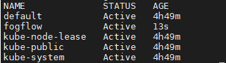

.. code-block:: console

   $kubectl get rolebindings --namespace=fogflow

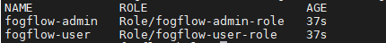

Steps To Add Users in Cloud Node Kubernetes Cluster
-------------------------------------------------------

To add users in kubernetes cluster at cloud node, follow below steps:

1. Certificate Generation And Root User Addition
--------------------------------------------------

**Step 1**: Generate User's private key, using below command.

.. code-block:: console

   $openssl genrsa -out RootUser1.key 2048

**Step 2**: Generate User's certificate signing request using below commands.

.. code-block:: console

   $openssl req -new -key RootUser1.key -out RootUser1.csr -subj "/CN=RootUser1/O=RootUser"

   #the tag "/O=RootUser" defines the rolebinding, so enter carefully

**Step 3**: Generate User's certificate using below command.

.. code-block:: console

   $openssl x509 -req -in RootUser1.csr -CA /etc/kubernetes/pki/ca.crt -CAkey /etc/kubernetes/pki/ca.key  -CAcreateserial -out RootUser1.crt -days 365

   #The "-day" tag justifies the no of days for which user's certificate will be valid. so it can be changed accordingly.

**Step 4**: To add user to kubernetes cluster, use following command.

.. code-block:: console

   $kubectl config set-credentials RootUser1 --client-certificate /root/RootUser/RootUser1.crt --client-key /root/RootUser/RootUser1.key

Note: The tags **--client-certificate** is followed by the path where user's private key is kept and **--client-key** is followed by path where user's certificate is kept. To verify added user, use below command.

.. code-block:: console

   $kubectl config view

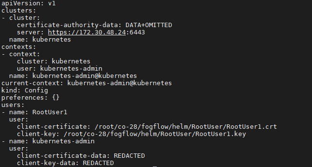

**Step 5**: Set the context in kubeconfig to recently added user using following command.

.. code-block:: console

   $kubectl config set-context RootUser-context1 --cluster=kubernetes --namespace=fogflow --user=RootUser1

Note: set the value of namespace according to the value mentioned in values.yaml. Here **RootUser-context1** is the new context set for RootUser1.

**Step 6**: Now verify the permissions RootUser1 has by using various kubectl commands with above context as shown below.

.. code-block:: console

   $kubectl get node --context=RootUser-context1

   $kubectl delete pods "any pod name" --context=RootUser-context1

   $kubectl get pods --context=RootUser-context1

   $kubectl get pods --namespace=fogflow --context=RootUser-context1

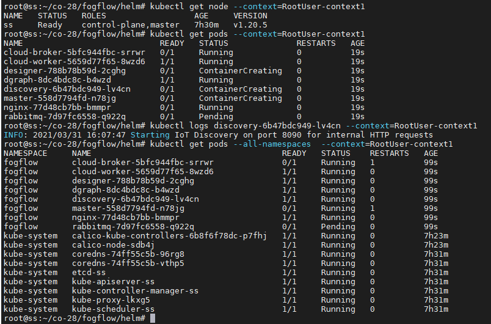

2. Certificate Generation And Admin User Addition
--------------------------------------------------

**Step 1**: Generate User's private key, using below command.

.. code-block:: console

   $openssl genrsa -out AdminUser1.key 2048

**Step 2**: Generate User's certificate signing request using below commands.

.. code-block:: console

   $openssl req -new -key AdminUser1.key -out AdminUser1.csr -subj "/CN=AdminUser1/O=Admin"

   #the tag "/O=Admin" defines the rolebinding, so enter carefully

**Step 3**: Generate User's certificate using below command.

.. code-block:: console

   $openssl x509 -req -in AdminUser1.csr -CA /etc/kubernetes/pki/ca.crt -CAkey /etc/kubernetes/pki/ca.key  -CAcreateserial -out AdminUser1.crt -days 365

   #The "-day" tag justifies the no of days for which user's certificate will be valid. so it can be changed accordingly.

**Step 4**: To add user to kubernetes cluster, use following command.

.. code-block:: console

   $kubectl config set-credentials AdminUser1 --client-certificate /root/AdminUser/AdminUser1.crt --client-key /root/AdminUser/AdminUser1.key

Note: The tags **--client-certificate** is followed by the path where user's private key is kept and **--client-key** is followed by path where user's certificate is kept. To verify added user, use below command.

.. code-block:: console

   $kubectl config view

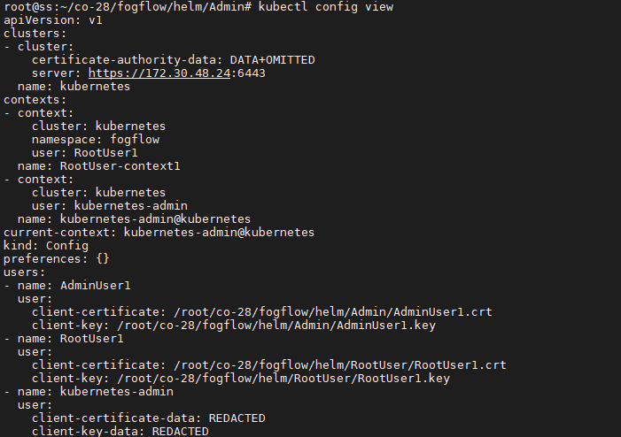

**Step 5**: Set the context in kubeconfig to recently added user using following command.

.. code-block:: console

   $kubectl config set-context AdminUser-context1 --cluster=kubernetes --namespace=fogflow --user=AdminUser1

Note: set the value of namespace according to the value mentioned in values.yaml. Here **AdminUser-context1** is the new context set for RootUser1.

**Step 6**: Now verify the permissions RootUser1 has by using various kubectl commands with above context as shown below.

.. code-block:: console

   $kubectl get node --context=AdminUser-context1

   $kubectl delete pods "any pod name" --context=AdminUser-context1

   $kubectl get pods --context=AdminUser-context1

   $kubectl get pods --namespace=fogflow --context=AdminUser-context1

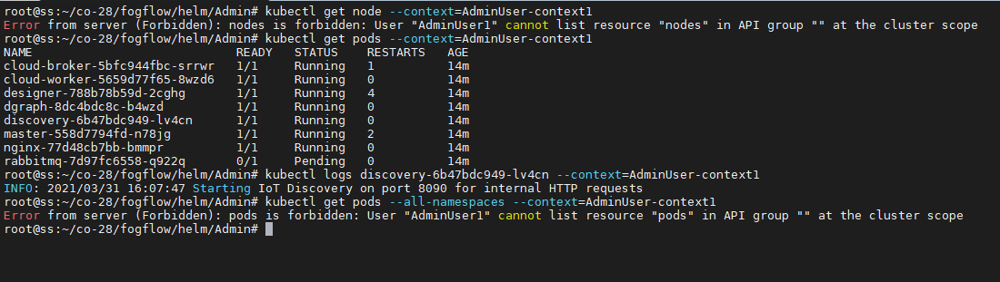

3. Certificate Generation And End User Addition
--------------------------------------------------

**Step 1**: Generate User's private key, using below command.

.. code-block:: console

   $openssl genrsa -out EndUser1.key 2048

**Step 2**: Generate User's certificate signing request using below commands.

.. code-block:: console

   $openssl req -new -key EndUser1.key -out EndUser1.csr -subj "/CN=EndUser1/O=EndUser"

   #the tag "/O=EndUser" defines the rolebinding, so enter carefully

**Step 3**: Generate User's certificate using below command.

.. code-block:: console

   $openssl x509 -req -in EndUser1.csr -CA /etc/kubernetes/pki/ca.crt -CAkey /etc/kubernetes/pki/ca.key  -CAcreateserial -out EndUser1.crt -days 365

   #The "-day" tag justifies the no of days for which user's certificate will be valid. so it can be changed accordingly.

**Step 4**: To add user to kubernetes cluster, use following command.

.. code-block:: console

   $kubectl config set-credentials EndUser1 --client-certificate /root/EndUser/EndUser1.crt --client-key /root/EndUser/EndUser1.key

Note: The tags **--client-certificate** is followed by the path where user's private key is kept and **--client-key** is followed by path where user's certificate is kept. To verify added user, use below command.

.. code-block:: console

   $kubectl config view

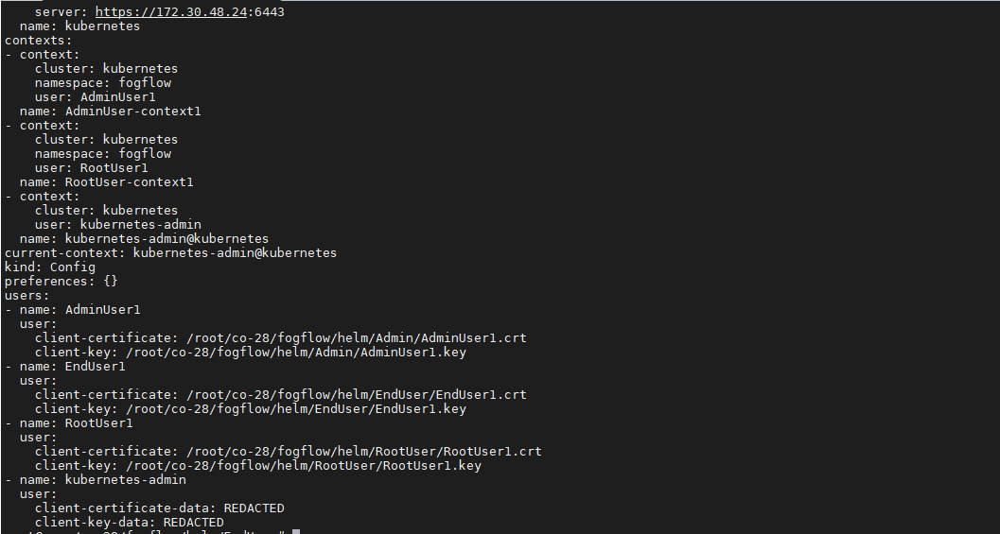

**Step 5**: Set the context in kubeconfig to recently added user using following command.

.. code-block:: console

   $kubectl config set-context EndUser-context1 --cluster=kubernetes --namespace=fogflow --user=EndUser1

Note: set the value of namespace according to the value mentioned in values.yaml. Here **EndUser-context1** is the new context set for RootUser1.

**Step 6**: Now verify the permissions RootUser1 has by using various kubectl commands with above context as shown below.

.. code-block:: console

   $kubectl get node --context=EndUser-context1

   $kubectl delete pods "any pod name" --context=EndUser-context1

   $kubectl get pods --context=EndUser-context1

   $kubectl get pods --namespace=fogflow --context=EndUser-context1

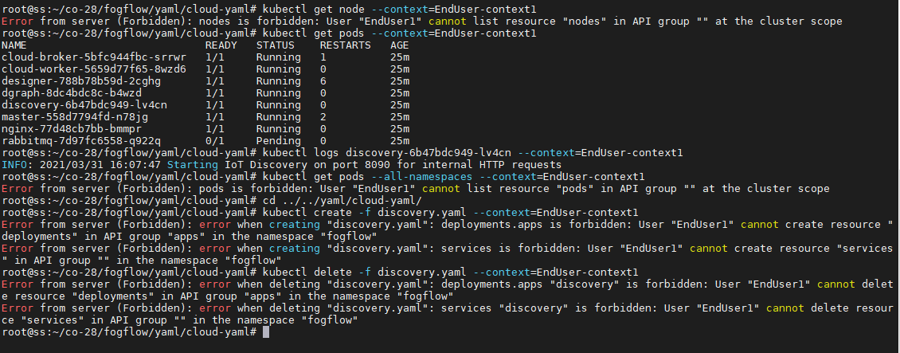

RBAC Verification over Edge Node Microk8s Kubernetes Cluster
--------------------------------------------------------------

It is assumed that microk8s kubernetes cluter is setup and running at edge node. RBAC is implemented in edge node automatically through edge-chart-RBAC chart deployment using helm3.
        
- On deploying the edge-chart-RBAC using helm, a **sericeaccount** is created with name **fogflow-dns** is created in "fogflow" namespace (or any other namespace configured by user). Once these namespace and serviceaccount is created, next roles and their rolebindings are created. The table lists the created roles and rolebinding.

+--------------------+----------------+----------------------+
|     Roles          |  RoleBindings  |    Scope             |
+--------------------+----------------+----------------------+
| fogflow-root-role  |   RootUser     |  Cluster             |
+--------------------+----------------+----------------------+
| fogflow-admin-role |   Admin        |  fogflow - namespace |
+--------------------+----------------+----------------------+
| fogflow-user-role  |   EndUser      |  fogflow - namespace |
+--------------------+----------------+----------------------+

- To verify the creation of above resources, use following commands:

.. code-block:: console

   $mirok8s.kubectl get ns 

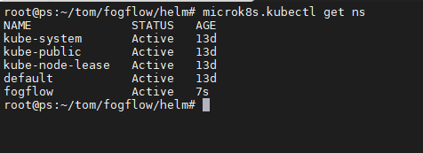

.. code-block:: console

   $microk8s.kubectl get rolebindings --namespace=fogflow

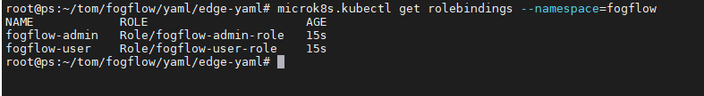

Steps to Add Users in Edge Node Kubernetes Cluster
-----------------------------------------------------------

To add users in kubernetes cluster at edge node, follow below steps:

1. Certificate Generation And Root User Addition
--------------------------------------------------

**Step 1**: Generate User's private key, using below command.

.. code-block:: console

   $openssl genrsa -out RootUser1.key 2048

**Step 2**: Generate User's certificate signing request using below commands.

.. code-block:: console

   $openssl req -new -key RootUser1.key -out RootUser1.csr -subj "/CN=RootUser1/O=RootUser"

   #the tag "/O=RootUser" defines the rolebinding, so enter carefully

**Step 3**: Generate User's certificate using below command.

.. code-block:: console

   $openssl x509 -req -in RootUser1.csr -CA /var/snap/microk8s/current/certs/ca.crt -CAkey /var/snap/microk8s/current/certs/ca.key  -CAcreateserial -out RootUser1.crt -days 365

   #The "-day" tag justifies the no of days for which user's certificate will be valid. so it can be changed accordingly.

**Step 4**: To add user to kubernetes cluster, use following command.

.. code-block:: console

   $microk8s.kubectl config set-credentials RootUser1 --client-certificate /root/RootUser/RootUser1.crt --client-key /root/RootUser/RootUser1.key

Note: The tags **--client-certificate** is followed by the path where user's private key is kept and **--client-key** is followed by path where user's certificate is kept. To verify added user, use below command.

.. code-block:: console

   $microk8s.kubectl config view

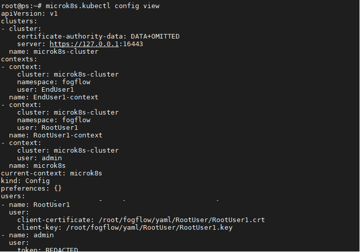

**Step 5**: Set the context in kubeconfig to recently added user using following command.

.. code-block:: console

   $microk8s.kubectl config set-context RootUser1-context --cluster=microk8s-cluster --namespace=fogflow --user=RootUser1

Note: set the value of namespace according to the value mentioned in values.yaml. Here **RootUser-context1** is the new context set for RootUser1.

**Step 6**: Now verify the permissions RootUser1 has by using various kubectl commands with above context as shown below.

.. code-block:: console

   $microk8.kubectl get node --context=RootUser1-context

   $microk8.kubectl delete pods "any pod name" --context=RootUser1-context

   $microk8s.kubectl get pods --context=RootUser1-context

   $microk8s.kubectl get pods --namespace=fogflow --context=RootUser1-context

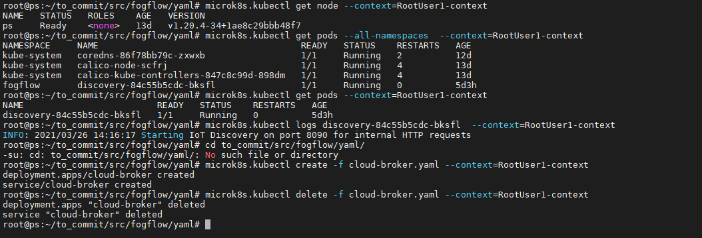

2. Certificate Generation And Admin User Addition
--------------------------------------------------

**Step 1**: Generate User's private key, using below command.

.. code-block:: console

   $openssl genrsa -out AdminUser1.key 2048

**Step 2**: Generate User's certificate signing request using below commands.

.. code-block:: console

   $openssl req -new -key AdminUser1.key -out AdminUser1.csr -subj "/CN=AdminUser1/O=Admin"

   #the tag "/O=Admin" defines the rolebinding, so enter carefully

**Step 3**: Generate User's certificate using below command.

.. code-block:: console

   $openssl x509 -req -in AdminUser1.csr -CA /var/snap/microk8s/current/certs/ca.crt -CAkey /var/snap/microk8s/current/certs/ca.key  -CAcreateserial -out AdminUser1.crt -days 365

   #The "-day" tag justifies the no of days for which user's certificate will be valid. so it can be changed accordingly.

**Step 4**: To add user to kubernetes cluster, use following command.

.. code-block:: console

   $microk8s.kubectl config set-credentials AdminUser1 --client-certificate /root/AdminUser/AdminUser1.crt --client-key /root/AdminUser/AdminUser1.key

Note: The tags **--client-certificate** is followed by the path where user's private key is kept and **--client-key** is followed by path where user's certificate is kept. To verify added user, use below command.

.. code-block:: console

   $microk8s.kubectl config view

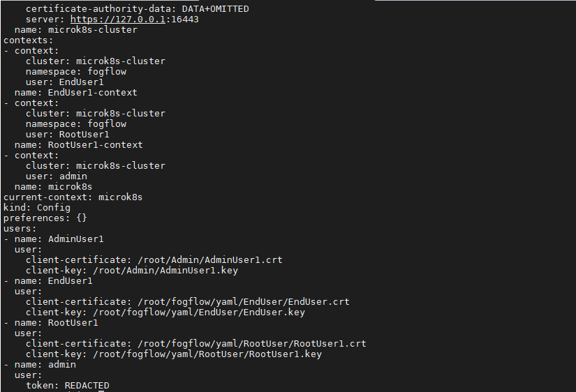

**Step 5**: Set the context in kubeconfig to recently added user using following command.

.. code-block:: console

   $microk8s.kubectl config set-context AdminUser-context1 --cluster=microk8s-cluster --namespace=fogflow --user=AdminUser1

Note: set the value of namespace according to the value mentioned in values.yaml. Here **AdminUser-context1** is the new context set for RootUser1.

**Step 6**: Now verify the permissions RootUser1 has by using various kubectl commands with above context as shown below.

.. code-block:: console

   $microk8s.kubectl get node --context=AdminUser-context1

   $microk8s.kubectl delete pods "any pod name" --context=AdminUser-context1

   $microk8s.kubectl get pods --context=AdminUser-context1

   $microk8s.kubectl get pods --namespace=fogflow --context=AdminUser-context1

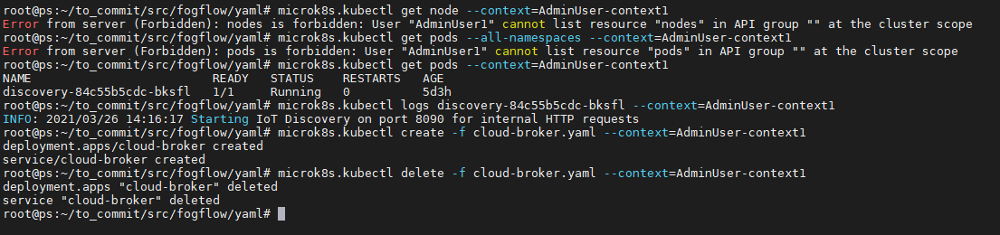

3. Certificate Generation And End User Addition
--------------------------------------------------

**Step 1**: Generate User's private key, using below command.

.. code-block:: console

   $openssl genrsa -out EndUser1.key 2048

**Step 2**: Generate User's certificate signing request using below commands.

.. code-block:: console

   $openssl req -new -key EndUser1.key -out EndUser1.csr -subj "/CN=EndUser1/O=EndUser"

   #the tag "/O=EndUser" defines the rolebinding, so enter carefully

**Step 3**: Generate User's certificate using below command.

.. code-block:: console

   $openssl x509 -req -in EndUser1.csr -CA /var/snap/microk8s/current/certs/ca.crt -CAkey /var/snap/microk8s/current/certs/ca.key  -CAcreateserial -out EndUser1.crt -days 365

   #The "-day" tag justifies the no of days for which user's certificate will be valid. so it can be changed accordingly.

**Step 4**: To add user to kubernetes cluster, use following command.

.. code-block:: console

   $microk8s.kubectl config set-credentials EndUser1 --client-certificate /root/EndUser/EndUser1.crt --client-key /root/EndUser/EndUser1.key

Note: The tags **--client-certificate** is followed by the path where user's private key is kept and **--client-key** is followed by path where user's certificate is kept. To verify added user, use below command.

.. code-block:: console

   $microk8s.kubectl config view

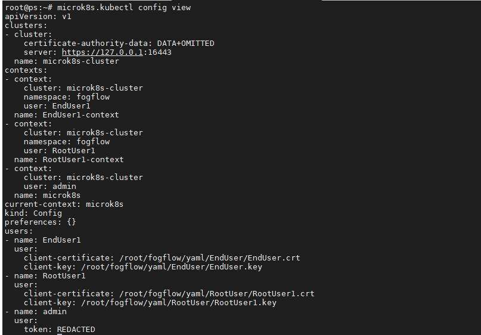

**Step 5**: Set the context in kubeconfig to recently added user using following command.

.. code-block:: console

   $microk8s.kubectl config set-context EndUser1-context --cluster=microk8s-cluster --namespace=fogflow --user=EndUser1

Note: set the value of namespace according to the value mentioned in values.yaml. Here **EndUser-context1** is the new context set for RootUser1.

**Step 6**: Now verify the permissions RootUser1 has by using various kubectl commands with above context as shown below.

.. code-block:: console

   $microk8s.kubectl get node --context=EndUser1-context

   $micr0k8s.kubectl delete pods "any pod name" --context=EndUser1-context

   $microk8s.kubectl get pods --context=EndUser1-context

   $microk8s.kubectl get pods --namespace=fogflow --context=EndUser1-context

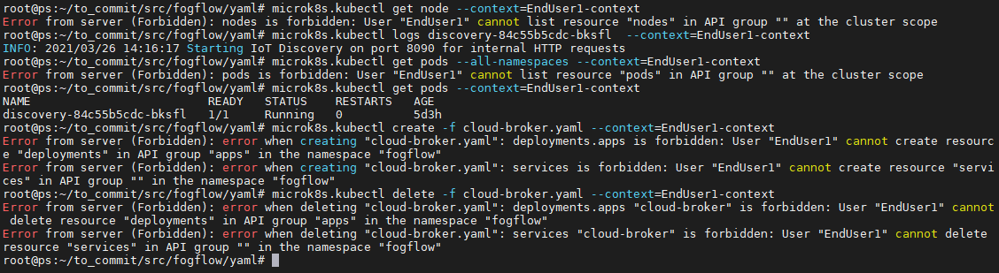
