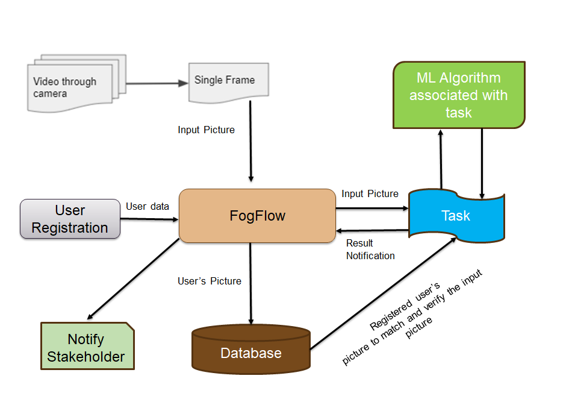
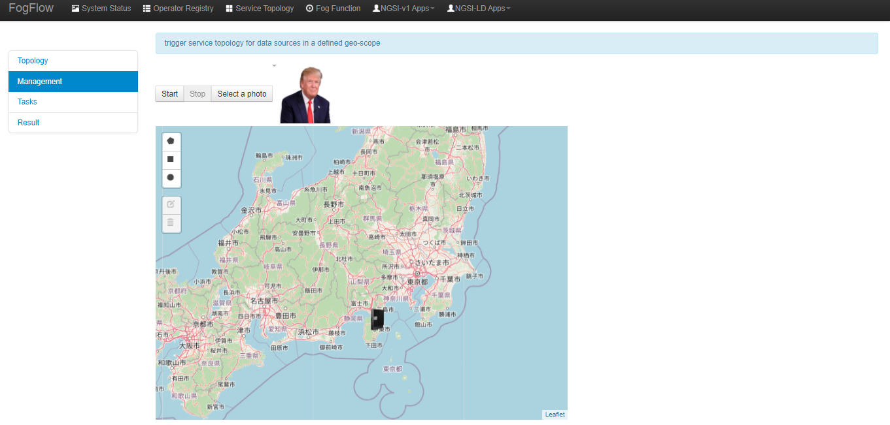
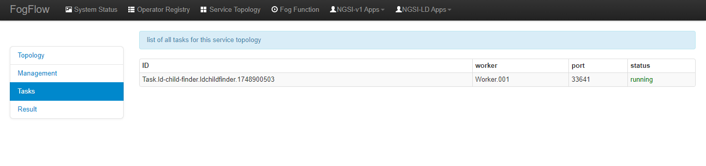
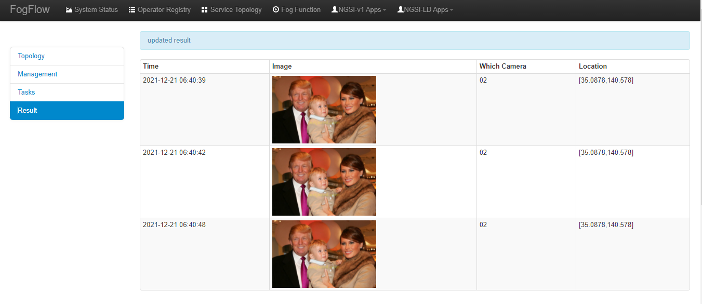

**************************************************************
'Lost Child Finder' example of NGSI-LD based operator
**************************************************************

Use case on Lost Child Finder
========================================

This use case study is designed for finding the lost child through the face detection mechanism using the digital image of the child.  
A face recognition system is a technology capable of matching a human face from a digital image or a video frame against a database of faces. Face recognition is a vital part of a security system. It helps to identify a person in an image or video.
In this use case we provide image of the lost child to the operator. The local camera identifies the lost child based upon the various facial similarities and patterns. Once the child is identified by the face-recognition algorithms, the information such as camera location, camera ID and the time of recognition is sent.
The aggregated information can also be subscribed via a dashboard service.

.. figure:: figures/lost-child-topology.png

Initial Requirement Analysis :

(1) Deployed At : Any place because face verification can be utilized as a biometric authentication process.
(2) Input : The image frames from a surveillance camera's video feed.
(3) Output : A notification stating about authentication of the person
(4) Additional Requirements : Database to store images of a person as a base reference for verification. 

Execution Scenario Analysis
-------------------------------------

(1) The camera the video will be slotted into frames and sent to fogflow as input image.

(2) This will further trigger the task that will be configured to handle the input image and map that against its database containing images of only authenticated persons. If the image matches with that of a person in the database, the result will be that the person is authenticated further to take entry in premises or further secured areas.
 
(3) The result will be shared to Fogflow's thin broker and it will further pass notification to the associated person/stakeholder which has subscribed to Fogflow.

LD Lost Child Menu 
-----------------------------------------------------------------------
As shown in the figure menu of this use case, we have 5 tabs namely: Topology, Management, Tasks, and Result.

#. Topology, includes
    * The brief pictorial representation of the use-case.
    * It can be used to used the flow and the working of the use-case.

#. Mangement, includes
    * Start/Stop Button.
    * This Start/Stop Button is to used to start the service intent. Without firing service intent, no tasks will run. 	

#. Task, includes
    * Task page lists down the ID of the task associated with the particular digital image of the lost child, the worker assigned to the task, the port where the task is running and its live status.

#. Result, includes
    * The tabular representation which details the time, Camera ID, and the location of the lost child. Face recognition algorithm identifies the child in the image provided and matches it with the live input coming from the camera. Once the image matches, the result is displayed in the form of table. 

Implement your operator functions required in your service topology
-----------------------------------------------------------------------

Before you can define the designed service topology, 
all operators used in your service topology must be provided by you or the other provider in the FogFlow system.
As shown in the figure below, for  this specific use case, we need to implement two input streams which are: Camera input and Lost Child Image and one operator: face_finder. 
Please refer to the examples provided in our code repository. 

* `LDFace_Finder_Operator`_ 

.. _`LDFace_Finder_Operator`: https://github.com/smartfog/fogflow/tree/Catalogue_Tutorial/application/operator/NGSI-LD-operator/LDface-finder

Using Surveillance Device to trigger the use case
-------------------------------------

The surveillance device developed is used to trigger this case. The profile for surveillance device is as follows: 

User need to change the following IP addresses in profile.json according to their own environment. The profile.json is present under *Surveillance folder* under *Device folder* (i.e. application/device/surveillance/profile.json ).

- **myIP**: this is the IP of your host machine, which should be accessible for both the web browser on your host machine and docker containers. Please DO NOT use “127.0.0.1” for this.
- **location**: the geo-location of the FogFlow node;
- **iconURL**: It is URL of the image coming from camera which is to matched with the image of lost child;  

.. group-tab:: json

        .. code-block:: json 

		{
			"discoveryURL": "http://180.179.214.148/ngsi9",
			"myIP": "180.179.214.148",
			"myPort": 8092,
			"location": {
				"latitude": 36.146094,
				"longitude": 138.239776
			},
			"iconURL": "/img/camera.png",
			"type": "lDCamera",
			"id": "02"
		}
		

