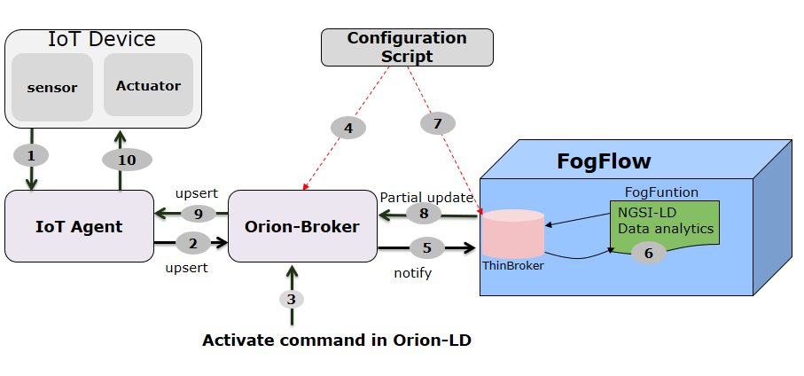
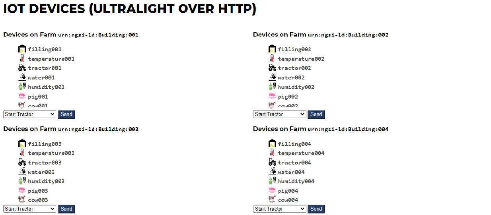
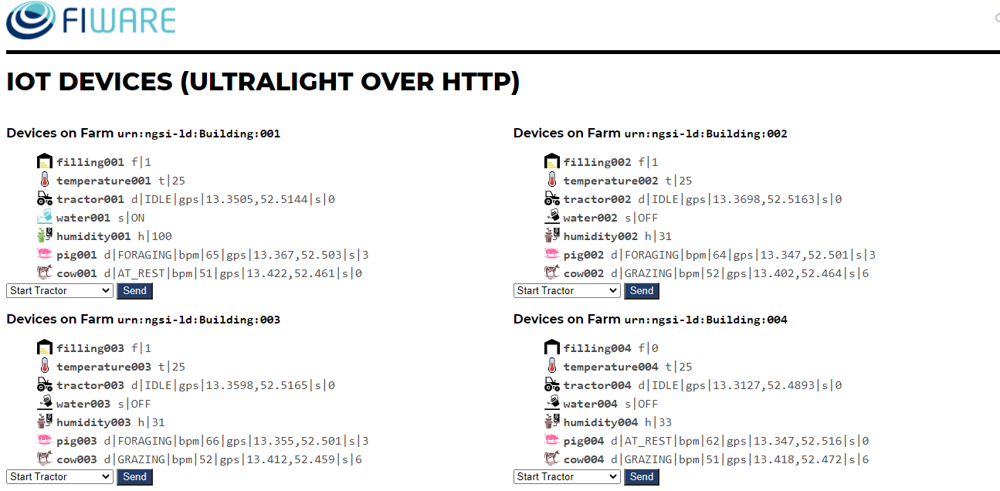
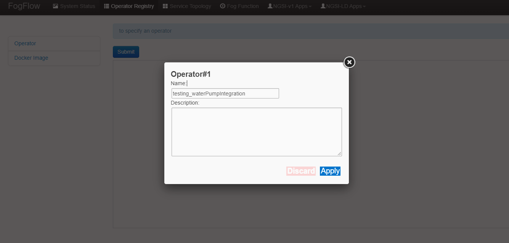
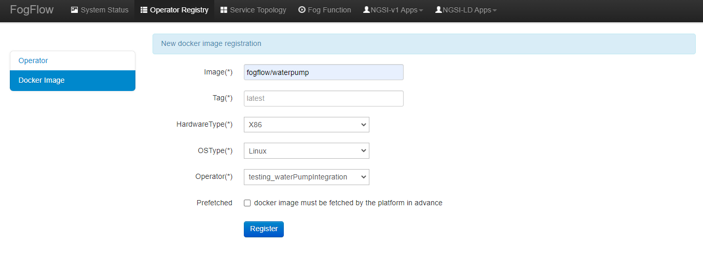
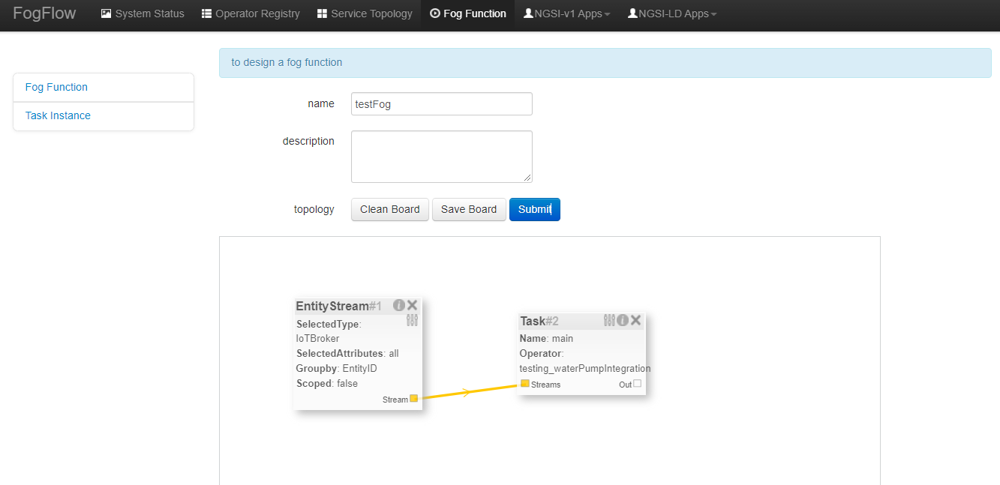

Integrate FogFlow with NGSILD Based IoT agent 
****************************************************

This tutorial introduces how FogFlow could be utilized as an advanced data analytics framework to enable on-demand data analytics
on top of the raw data captured in the NGSI-LD IoT agent.
 
**IOT AGENT:** An IoT Agent is a component that lets a group of devices send their data to and be managed from a Context Broker using their own native protocols. if someone want to know more about IoT Agent then can refer `Link`_.
There are several IoT Agent in the market which are in production or already workable. 

-   `IoTAgent-JSON`_ - a bridge between HTTP/MQTT messaging (with a JSON payload) and NGSI-LD
-   `IoTAgent-LWM2M`_ - a bridge between the `Lightweight M2M`_ protocol and NGSI-LD
-   `IoTAgent-UL`_ - a bridge between HTTP/MQTT messaging (with a JSON payload) and NGSI-LD
-   `IoTagent-LoRaWAN`_ - a bridge between the `LoRaWAN`_ protocol and NGSI-LD

.. _`Link`: https://ngsi-ld-tutorials.readthedocs.io/en/latest/iot-agent.html
.. _`IoTAgent-JSON`: https://fiware-iotagent-json.readthedocs.io/en/latest/
.. _`IoTAgent-LWM2M`: https://fiware-iotagent-lwm2m.readthedocs.io/en/latest/
.. _`Lightweight M2M`: https://www.omaspecworks.org/what-is-oma-specworks/iot/lightweight-m2m-lwm2m/
.. _`IoTAgent-UL`: https://fiware-iotagent-ul.readthedocs.io/en/latest
.. _`IoTagent-LoRaWAN`: https://fiware-lorawan.readthedocs.io/en/latest/
.. _`LoRaWAN`: https://www.thethingsnetwork.org/docs/lorawan/

The following diagram shows a simple example of how to do this in details with **IoTAgent-UL**, mainly including four aspects with 10 steps

* how to fetch some raw data from an IoT Agent into the orion broker (**Step 1-4**)
* how to fetch raw data from orion broker into the FogFlow system (**Step 5-7**)
* how to use the serverless function in FogFlow to do customized data analytics (**Step 8**)
* how to push the generate analytics results back to the IoT agent for further sharing (**Step 9-11**)

Start Up
****************************************************

First, please refer  `FogFlow on a Single Machine`_ to set up a FogFlow system on a single host machine

.. _`FogFlow on a Single Machine`: https://fogflow.readthedocs.io/en/latest/onepage.html

Please clone the repository and create the necessary images like orion broker and IoT agent by running the commands as shown:

.. code-block:: console
    
     git clone https://github.com/smartfog/fogflow.git
     cd fogflow/test/iot-agent/

    ./services orion
  
     If you want to clean up and start over again you can do this with the following command:
    
    ./services stop
  
**Note:** version of docker-compose should be greater than 1.21.*.

Before you start the following steps, please check if your Orion-LD broker and FogFlow system is running properly.

check if the orion-ld broker is running

.. code-block:: console

	curl <orion-ld-brokerIP>:1026/ngsi-ld/ex/v1/version

The response will look similar to the following:

.. code-block:: console

	{
  		"Orion-LD version": "0.7.0",
  		"based on orion": "1.15.0-next",
  		"kbase version": "0.6",
  		"kalloc version": "0.6",
  		"khash version": "0.6",
  		"kjson version": "0.6",
		"boost version": "1_62",
		"microhttpd version": "0.9.72-0",
		"openssl version": "OpenSSL 1.1.0l  10 Sep 2019",
		"mongo version": "1.1.3",
		"rapidjson version": "1.0.2",
		"libcurl version": "7.52.1",
		"libuuid version": "UNKNOWN",
		"branch": "",
		"cached subscriptions": 0,
		"Next File Descriptor": 19
	}

check if the IoT Agent broker is running

.. code-block:: console

	curl <IoT-AgentIP>:4041/iot/about

The response will look similar to the following:

.. code-block:: console

	{
		"libVersion": "2.20.0",
		"port": "4041",
		"baseRoot": "/",
		"version": "1.20.1"	
	}

**Note:** version of IoT Agent should be greater or equal to  1.20.*.

check if the IoT Device (Sensor, Actuator)is running properly
	
	Check the status from the Device dashboard

	You can open the device dashboard in your web browser to see the current system status via the URL: **<IoT-DeviceIP>:3000/device/monitor**
	
	Once you are able to access the device dashboard, you can see the following web page

check if the FogFlow system is running properly
	
	Check the system status from the FogFlow DashBoard

	You can open the FogFlow dashboard in your web browser to see the current system status via the URL: **<FogFlow-DesignerIP>:80**
	
	Once you are able to access the FogFlow dashboard, you can see the following web page

.. figure:: figures/dashboard.png

How to Fetch data from IoT Agent to Orion-LD
================================================================

**Step 1** Provisioning a Service Group
-----------------------------------------------------------------
Invoking group provision is always the first step in connecting devices since it is always necessary to supply an authentication key with each measurement and the IoT Agent will not initially know which URL the context broker is responding on.

It is also possible to set up default commands and attributes for all anonymous devices as well, but this is not done within this tutorial as we will be provisioning each device separately.

This example provisions an anonymous group of devices. It tells the IoT Agent that a series of devices will be sending messages to the IOTA_HTTP_PORT (where the IoT Agent is listening for Northbound communications data coming from the IOT device)

.. code-block:: console   

	curl -iX POST 'http://<IoT-AgentIP>:4041/iot/services' \
	-H 'fiware-service: openiot' \
	-H 'fiware-servicepath: /' \
	-H 'Content-Type: application/json' \
	--data-raw '{
    	"services": [
        	{
            	"apikey": "4jggokgpepnvsb2uv4s40d59ov",
            	"cbroker": "http://orion:1026",
            	"entity_type": "Device",
            	"resource": "/iot/d",
            	"attributes": [
                	{
                    	"object_id": "bpm", "type": "Property", "name": "heartRate",
                    	"metadata": { "unitCode": {"type": "Text", "value": "5K" }}
                	},
                	{
                    	"object_id": "s", "name": "status", "type": "Property"
                	},
                	{
                    	"object_id": "gps", "name": "location", "type": "geo:point"
                	}
            	],
            	"static_attributes": [
                	{
                    	"name": "category", "type": "Property", "value": "sensor"
                	},
                	{
                    "name": "supportedProtocol", "type": "Property", "value": "ul20"
                	}
            	]
        	}
    	   ]
	}'

cbroker in the example is location of Context-Broker where IoT Agent can pass any measurements received to the correct location. cbroker is an optional attribute - if it is not provided, the IoT Agent uses the context broker URL as defined in the configuration file, however it has been included here for completeness.

**Note:** To know about Fiware-Service and Fiware-ServicePath please click  `here`_

.. _`here`: https://ngsi-ld-tutorials.readthedocs.io/en/latest/iot-agent.html#connecting-iot-devices

In the example the IoT Agent is informed that the `/iot/d` endpoint will be used and that devices will authenticate
themselves by including the token **4jggokgpepnvsb2uv4s40d59ov**. For an UltraLight IoT Agent this means devices will be
sending GET or POST requests to:**http://iot-agent:7896/iot/d?i=<device_id>&k=4jggokgpepnvsb2uv4s40d59ov**

**Step 2** Provisioning an Actuator
----------------------------------
The example below provisions a waterPump with the `deviceId=water001`. The endpoint is
`http://iot-sensors:3001/iot/water001` and it can accept the "on" command. The `transport=HTTP` attribute defines the
communications protocol to be used.

.. code-block:: console  

	curl -L -X POST 'http://<IoT-AgentIP>:4041/iot/devices' \
    	-H 'fiware-service: openiot' \
    	-H 'fiware-servicepath: /' \
    	-H 'Content-Type: application/json' \
	--data-raw '
		{
	"devices": [{
		"device_id": "water001",
		"entity_name": "urn:ngsi-ld:Device:water001",
		"entity_type": "Device",
		"protocol": "PDI-IoTA-UltraLight",
		"transport": "HTTP",
		"endpoint": "http://<IoT-DeviceIP>:3001/iot/water001",
		"commands": [{
				"name": "on",
				"type": "command"
			},
			{
				"name": "off",
				"type": "command"
			}
		],
		"static_attributes": [{
			"name": "controlledAsset",
			"type": "Relationship",
			"value": "urn:ngsi-ld:Building:barn001"
		}]
	    }]
	}'

**step 3** IoT Agent records the measurement of Actuator after Provisioning the Actuator on it and forward the measurement to Orion. Execute the following command to retrieve the recorded measurement of actuator from Orion

.. code-block:: console 

	curl -L -X GET 'http://<orion-ld-brokerIP>:1026/ngsi-ld/v1/entities/urn:ngsi-ld:Device:water001' \
   	-H 'fiware-service: openiot' \
	-H 'fiware-servicepath: /' \
   	-H 'Link: <https://uri.etsi.org/ngsi-ld/v1/ngsi-ld-core-context-v1.3.jsonld>; rel="https://uri.etsi.org/ngsi-ld/v1/ngsi-ld-core-contet.jsonld"; type="application/ld+json"' \
        -H 'Content-Type: application/json' 

Response
-------------------

.. code-block:: console 

	{
		"@context": "https://uri.etsi.org/ngsi-ld/v1/ngsi-ld-core-context-v1.3.jsonld",
		"id": "urn:ngsi-ld:Device:water001",
		"type": "Device",
		"location": {
			"type": "GeoProperty",
			"value": {
				"type": "Point",
				"coordinates": [0, 0]
			}
		},
		"controlledAsset": {
			"object": "urn:ngsi-ld:Building:barn001",
			"type": "Relationship",
			"observedAt": "2022-03-22T18:01:54.890Z"
		},
		"category": {
			"value": "sensor",
			"type": "Property",
			"observedAt": "2022-03-22T18:01:54.890Z"
		},
		"supportedProtocol": {
			"value": "ul20",
			"type": "Property",
			"observedAt": "2022-03-22T18:01:54.890Z"
		},
		"on_status": {
			"value": {
				"@type": "commandStatus",
				"@value": "OK"
			},
			"type": "Property",
			"observedAt": "2022-03-22T18:00:54.828Z"
		},
		"on_info": {
			"value": {
				"@type": "commandResult",
				"@value": " on OK"
			},
			"type": "Property",
			"observedAt": "2022-03-22T18:00:54.828Z"
		},
		"off_status": {
			"value": {
				"@type": "commandStatus",
				"@value": "OK"
			},
			"type": "Property",
			"observedAt": "2022-03-22T18:01:54.890Z"
		},
		"off_info": {
			"value": {
				"@type": "commandResult",
				"@value": " off OK"
			},
			"type": "Property",
			"observedAt": "2022-03-22T18:01:54.890Z"
		},
		"on": {
			"type": "Property",
			"value": {
				"@type": "command",
				"@value": ""
			}
		},
		"off": {
			"type": "Property",
			"value": {
				"@type": "command",
				"@value": ""
			}
		}
	}

	

**Step 4** To observe the state of the water sprinkler change through device monitor URL:**<IoT-DeviceIP>:3000/device/monitor** send the below PATCH request directly to the IoT Agent's North Port

.. code-block:: console 

	curl -L -X PATCH 'http://<IoT-AgentIP>:4041/ngsi-ld/v1/entities/urn:ngsi-ld:Device:water001/attrs/on' \
    	-H 'fiware-service: openiot' \
    	-H 'fiware-servicepath: /' \
    	-H 'Content-Type: application/json' \
	--data-raw '{

        	"type": "Property",
        	"value": " "

	}'

To verify the status of entity **urn:ngsi-ld:Device:water001** open the device dashboard in your web browser by using URL: **<IoT-DeviceIP>:3000/device/monitor** . The status should be "on".

How to Fetch data from Orion-LD to FogFlow 
================================================================

**Step 5** Issue a subscription to Orion-LD broker. 
-------------------------------------------------------------------

.. code-block:: console    

	curl -iX POST \
		  'http://<orion-ld-brokerIP>:1026/ngsi-ld/v1/subscriptions' \
		  -H 'Content-Type: application/json' \
		  -H 'Accept: application/ld+json' \
		  -H 'fiware-service: openiot' \
		  -H 'fiware-servicepath: /' \
		  -H 'Link: <https://uri.etsi.org/ngsi-ld/v1/ngsi-ld-core-context-v1.3.jsonld>; rel="https://uri.etsi.org/ngsi-ld/v1/ngsi-ld-core-context.jsonld"; type="application/ld+json"' \
		  -d ' {
                 	"type": "Subscription",
                	"entities": [{
				"id": "urn:ngsi-ld:Device:water001",
                               "type": "Device"
                 	}],
             	      "notification": {
                          "format": "normalized",
                          "endpoint": {
                                   "uri": "http://<fogflow_broker_IP>:8070/ngsi-ld/v1/notifyContext/",
                                   "accept": "application/ld+json"
             	           }
                       }
 	           }'

**Step 6** send the below PATCH request to Enable Orion-Broker commands
-------------------------------------------------------------------

.. code-block:: console 

	curl -L -X PATCH 'http://<orion-ld-brokerIP>:1026/ngsi-ld/v1/entities/urn:ngsi-ld:Device:water001/attrs/on' \
	-H 'fiware-service: openiot' \
	-H 'fiware-servicepath: /' \
	-H 'Accept: application/ld+json' \
	-H 'Link: <https://uri.etsi.org/ngsi-ld/v1/ngsi-ld-core-context-v1.3.jsonld>; rel="https://uri.etsi.org/ngsi-ld/v1/ngsi-ld-core-context.jsonld"; type="application/ld+json"' \
	-H 'Content-Type: application/json' \
	--data-raw '{

        	"type": "Property",
        	"value": " "

	}'
	
**Step 7** Check if FogFlow receives the subscribed entity. 
-------------------------------------------------------------------

Use the CURL command to query entities of type "Device" from  FogFlow thinBroker. 

.. code-block:: console    

	curl -iX GET \
		  'http://<fogflow_broker_IP>:8070/ngsi-ld/v1/entities?type=Device' \
		  -H 'Content-Type: application/json' \
		  -H 'Accept: application/ld+json' \
		  -H 'fiware-service: openiot' \
		  -H 'fiware-servicepath: /' \
		  -H 'Link: <https://uri.etsi.org/ngsi-ld/v1/ngsi-ld-core-context-v1.3.jsonld>; rel="https://uri.etsi.org/ngsi-ld/v1/ngsi-ld-core-context.jsonld"; type="application/ld+json"' 

Note: Replace localhost with the IP where fogflow thinbroker is running.
Note: Replace the localhost with IP where Orion-LD broker is running and <fogflow_broker_IP> with the IP where the fogflow broker is running.

How to Program and Apply a Data Analytics Function 
================================================================

**Step 8** Please refer the steps below, to register fogfunction using dashboard.
------------------------------------------------------------------------------

1. To register Operator, open fogflow dashboard. Select Operator Registry Tab from horizontal bar, select operator from menu on left and then click register button. Right click on workspace and select operator from drop down list and enter details as shown and at last click on submit.

2. Register the following docker image, corresponding to the operator created in above step.
   
   
.. code-block:: console

	fogflow/waterpump

        The above operator send a "off" command after 1 hour if waterPump is "on".

   	To register the image, select DockerImage from left menu, under Operator Registry from dashboard and click register button.

3. Now, to create a fogfunction, toggle on Fog Function in the horizontal bar on dashboard. select Fog Function from left menu and click register button. Enter the name and description (optional) as shown. Right click in the workspace and select task and Entity stream from drop down list and configure details.

Note: For a details on fogfunction creation follow the `Document link`_ .
 
.. _`Document link`: https://fogflow.readthedocs.io/en/latest/intent_based_program.html

How to Push the Generated Result back to the IoT Agent
=============================================================

**Step 9**: Fog Function do some data analytics in step no. 6 and publish the analytics result on fogflow broker. Orion-LD  subscribes fogFlow broker for getting the analytics result and orion broker notify the result to the IoT agent.

.. code-block:: console

        curl -iX POST \
                  'http://<fogflow_broker_IP>:8070/ngsi-ld/v1/subscriptions/' \
                  -H 'Content-Type: application/json' \
		  -H 'Integration: IoTI' \
                  -H 'Accept: application/ld+json' \
		  -H 'fiware-service: openiot' \
		  -H 'fiware-servicepath: /' \
                  -H 'Link: <https://uri.etsi.org/ngsi-ld/v1/ngsi-ld-core-context-v1.3.jsonld>; rel="https://uri.etsi.org/ngsi-ld/v1/ngsi-ld-core-context.jsonld"; type="application/ld+json"' \
                  -d ' {
                        "type": "Subscription",
                        "entities": [{
			       "id": "urn:ngsi-ld:Device:water001",
                               "type": "Device"
                        }],
                      "notification": {
                          "format": "normalized",
                          "endpoint": {
                                   "uri": "http://<orion-ld-brokerIP>:1026",
                                   "accept": "application/ld+json"
                           }
                       }
                   }'

Note: Replace fogflow_broker_IP with IP where Fogflow thinbroker is running and <orion-ld-brokerIP> with IP where orion-ld broker is running.
 
**Step 10**:Thinbroker will notify the analytical data to Orion broker as in step No 9, Orion broker has subscribed for the analytical data.

**Step 11**:Open the device dashboard in your web browser by using URL: **<IoT-DeviceIP>:3000/device/monitor**. After 1 minut (its depend on FogFunction losic of step no 8.) the status of water001  should be "off"

.. figure:: figures/status.png

