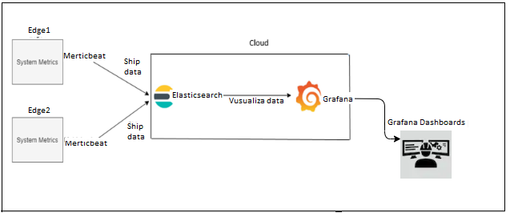
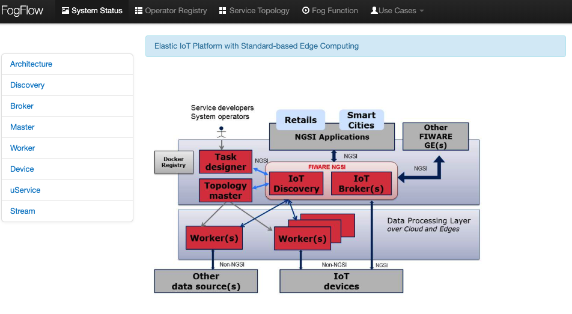
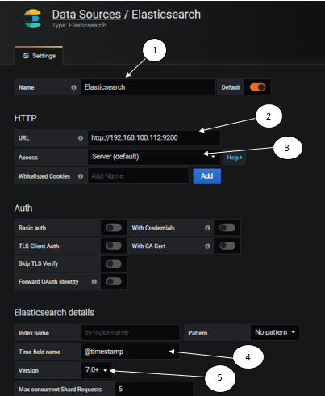
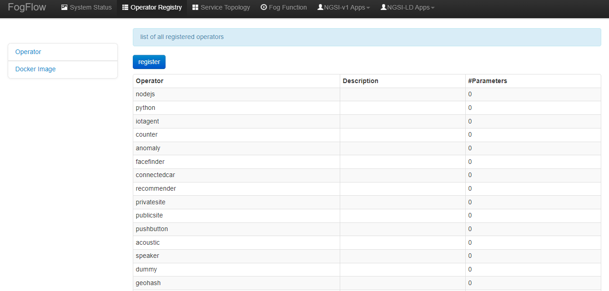
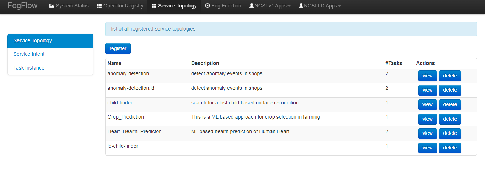
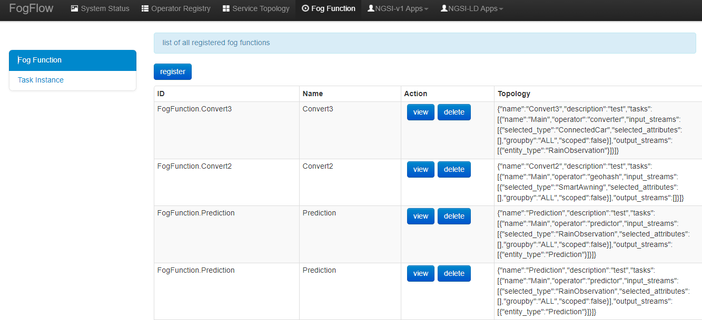

*****************************************
One-page tutorial
*****************************************

This is an one-page introductory tutorial to FogFlow.
In the FIWARE-based architecture, FogFlow can be used to dynamically trigger data processing functions 
between IoT devices and Orion Context Broker, 
for the purpose of transforming and preprocessing raw data at edge nodes (e.g., IoT gateways or Raspberry Pis).

Fogflow system health can be monitored by system monitoring tools Metricbeat, Elasticsearch and Grafana in short EMG. 
With these tools edges and Fogflow Docker service health can be monitored. 
Metricbeat deployed on Edge node. Elasticsearch and Grafana on Cloud node.

As illustrated by the following picture, in order to set up FogFlow System Monitoring tools to monitor system resource usage.

The tutorial introduces a typical FogFlow system setup with a simple example to do anomaly detection at edges for temperature sensor 
data.
It explains an example usecase implementation using FogFlow and FIWARE Orion in integration with each other. 

As shown in the following diagram, in this use case a connected temperature sensor sends an update message to the FogFlow system, 
which triggers some running task instance of a pre-defined fog function to generate some analytics result. 
The fog function is specified in advance via the FogFlow dashboard, 
however, it is triggerred only when the temperature sensor joins the sytem. In a real distributed setup, 
the running task instance will be deployed at the edge node closed to the temperature sensor. 
Once the generated analytics result is generated, 
it will be forwarded from the FogFlow system to Orion Context Broker. 
This is because a subscription with Orion Context Broker as the reference URL has been issued.  

.. figure:: figures/systemview.png

Here are the prerequisite commands for running FogFlow:

1. docker

2. docker-compose

For ubuntu-16.04, you need to install docker-ce and docker-compose.

To install Docker CE, please refer to `Install Docker CE`_, required version > 18.03.1-ce;

.. important:: 
	**please also allow your user to execute the Docker Command without Sudo**

To install Docker Compose, please refer to `Install Docker Compose`_, 
required version 18.03.1-ce, required version > 2.4.2

.. _`Install Docker CE`: https://www.digitalocean.com/community/tutorials/how-to-install-and-use-docker-on-ubuntu-16-04
.. _`Install Docker Compose`: https://www.digitalocean.com/community/tutorials/how-to-install-docker-compose-on-ubuntu-16-04

Set up all FogFlow components on a single machine
===========================================================

Fetch all required scripts
-------------------------------------------------------------

Download the docker-compose file and the configuration files as below.

.. code-block:: console    

	# the docker-compose file to start all FogFlow components on the cloud node
	wget https://raw.githubusercontent.com/smartfog/fogflow/master/docker/core/http/docker-compose.yml

	# the configuration file used by all FogFlow components
	wget https://raw.githubusercontent.com/smartfog/fogflow/master/docker/core/http/config.json

	# the configuration file used by the nginx proxy
	wget https://raw.githubusercontent.com/smartfog/fogflow/master/docker/core/http/nginx.conf

        # the configuration file used by metricbeat
        wget https://raw.githubusercontent.com/smartfog/fogflow/master/docker/core/http/metricbeat.docker.yml
	
	
Change the IP configuration accordingly
-------------------------------------------------------------

You need to change the following IP addresses in config.json according to your own environment.

- **coreservice_ip**: it is used by all FogFlow edge nodes to access the core services (e.g., nginx on port 80 and rabbitmq on port 5672) on the FogFlow cloud node; usually this will be the public IP of the FogFlow cloud node.
- **external_hostip**: for the configuration of the FogFlow cloud node, this is the same as coreservice_ip used by the components (Cloud Worker and Cloud Broker) to access the running FogFlow core services;        
- **internal_hostip**: this is the IP of your default docker bridge, which is the "docker0" network interface on your Linux host. For the docker engine on Windows or Mac OS, there is no "docker0" network interface; instead, you need to use the special domain name "host.docker.internal".  

- **site_id**: each FogFlow node (either cloud node or edge node) requires to have a unique string-based ID to identify itself in the system;
- **physical_location**: the geo-location of the FogFlow node;
- **worker.capacity**: it means the maximal number of docker containers that the FogFlow node can invoke;  

Change the IP configuration of elasticsearch and metricbeat accordingly
---------------------------------------------------------------------------

You need to change the following IP addresses in docker-compose.yml according to your own environment.

- **output.elasticsearch.hosts**: it is the host location of elasticsearch on which metricbeat shares data in csv format.

Also need to change the following IP addresses in metricbeat.docker.yml according to your own environment.

- **name**: It is the name given for uniqueness for cloud nodes from egde nodes on grafana metric dashboard. You can mention any name in place of IP address.

- **hosts**: It is the host location of elasticsearh database, where metricbeat is going to share metric data.

.. important:: 

	please DO NOT use "127.0.0.1" as the IP address of **coreservice_ip** and **external_hostip**, because they will be used by a 
	running task inside a docker container. 
	
	**Firewall rules:** to make your FogFlow web portal accessible via the external_ip; the following ports must be open as well: 
	80 and 5672 for TCP

	**Mac Users:** if you like to test FogFlow on your Macbook, please install Docker Desktop and also use "host.docker.internal" 
	to replace coreservice_ip, external_hostip, and internal_hostip in the configuration file

Start all Fogflow components 
-------------------------------------------------------------

Pull the docker images of all FogFlow components and start the FogFlow system

.. code-block:: console    

	#if you already download the docker images of FogFlow components, this command can fetch the updated images
	docker-compose pull  

	docker-compose up -d

Validate your setup
-------------------------------------------------------------

There are two ways to check if the FogFlow cloud node is started correctly: 

- Check all the containers are Up and Running using "docker ps -a"

.. code-block:: console    

	docker ps -a
	
	CONTAINER ID      IMAGE                       COMMAND                  CREATED             STATUS              PORTS                                                 NAMES
	90868b310608      nginx:latest            "nginx -g 'daemon of…"   5 seconds ago       Up 3 seconds        0.0.0.0:80->80/tcp                                       fogflow_nginx_1
	d4fd1aee2655      fogflow/worker          "/worker"                6 seconds ago       Up 2 seconds                                                                 fogflow_cloud_worker_1
	428e69bf5998      fogflow/master          "/master"                6 seconds ago       Up 4 seconds        0.0.0.0:1060->1060/tcp                               fogflow_master_1
	9da1124a43b4      fogflow/designer        "node main.js"           7 seconds ago       Up 5 seconds        0.0.0.0:1030->1030/tcp, 0.0.0.0:8080->8080/tcp       fogflow_designer_1
	bb8e25e5a75d      fogflow/broker          "/broker"                9 seconds ago       Up 7 seconds        0.0.0.0:8070->8070/tcp                               fogflow_cloud_broker_1
	7f3ce330c204      rabbitmq:3              "docker-entrypoint.s…"   10 seconds ago      Up 6 seconds        4369/tcp, 5671/tcp, 25672/tcp, 0.0.0.0:5672->5672/tcp     fogflow_rabbitmq_1
	9e95c55a1eb7      fogflow/discovery       "/discovery"             10 seconds ago      Up 8 seconds        0.0.0.0:8090->8090/tcp                               fogflow_discovery_1
        399958d8d88a      grafana/grafana:6.5.0   "/run.sh"                29 seconds ago      Up 27 seconds       0.0.0.0:3003->3000/tcp                               fogflow_grafana_1
        9f99315a1a1d      fogflow/elasticsearch:7.5.1 "/usr/local/bin/dock…" 32 seconds ago    Up 29 seconds       0.0.0.0:9200->9200/tcp, 0.0.0.0:9300->9300/tcp       fogflow_elasticsearch_1
        57eac616a67e      fogflow/metricbeat:7.6.0 "/usr/local/bin/dock…"   32 seconds ago     Up 29 seconds                                                                  fogflow_metricbeat_1

.. important:: 

	if you see any container is missing, you can run "docker ps -a" to check if any FogFlow component is terminated with some 
	problem. If there is, you can further check its output log by running "docker logs [container ID]"

- Check the system status from the FogFlow DashBoard

You can open the FogFlow dashboard in your web browser to see the current system status via the URL: http://<coreservice_ip>/index.html

.. important:: 

	If the FogFlow cloud node is behind a gateway, you need to create a mapping from the gateway IP to the coreservice_ip and then 
	access the FogFlow dashboard via the gateway IP;
	If the FogFlow cloud node is a VM in a public cloud like Azure Cloud, Google Cloud, or Amazon Cloud, you need to access the 
	FogFlow dashboard via the public IP of your VM;
	

Once you are able to access the FogFlow dashboard, you can see the following web page

Configure Elasticsearch on Grafana Dashboard
-------------------------------------------------------------

Grafana dashboard can be accessible on web browser to see the current system status via the URL: 
http://<output.elasticsearch.hosts>:3003/. The default username and password for Grafana login are admin and admin respectively.

- After successful login to grafana, click on "Create your first data source" on Home Dashboard to setup the source of data.
- Select Elasticsearch from Add Data Sourch page. Now you are on page Data Sources/Elasticsearch same as below figure.

1. Put a name for the Data Source.
2. In HTTP detail ,mention URL of your elasticsearch and Port. URL shall include HTTP. 
3. In Access select Server(default). URL needs to be accessible from the Grafana backend/server.
4. In Elasticsearch details, put @timestamp for Time field name. Here a default for the time field can be specified with the name of your Elasticsearch index. Use a time pattern for the index name or a wildcard.
5. Select Elasticsearch Version.

Then click on "Save & Test" button.

Set up the Metricbeat
---------------------------------------------

- Change the details of Elasticsearch in metricbeat.docker.yml file as below:

.. code-block:: json

        name: "<155.54.239.141_cloud>"
        metricbeat.modules:
        - module: docker
          #Docker module parameters that has to be monitored based on user requirement, example as below
          metricsets: ["cpu","memory","network"]
          hosts: ["unix:///var/run/docker.sock"]
          period: 10s
          enabled: true
        - module: system
          #System module parameters that has to be monitored based on user requirement, example as below
          metricsets: ["cpu","load","memory","network"]
          period: 10s

        output.elasticsearch:
          hosts: '155.54.239.141:9200'
	  

Try out an existing IoT service
===========================================================

Once the FogFlow cloud node is set up, you can try out some existing IoT services without running any FogFlow edge node.
For example, you can try out a simple fog function as below.  

Initialize all defined services with three clicks
-------------------------------------------------------------

- Click "Operator Registry" in the top navigator bar to triger the initialization of pre-defined operators. 

After you first click "Operator Registry", a list of pre-defined operators will be registered in the FogFlow system. 
With a second click, you can see the refreshed list as shown in the following figure.

- Click "Service Topology" in the top navigator bar to triger the initialization of pre-defined service topologies. 

After you first click "Service Topology", a list of pre-defined topologies will be registered in the FogFlow system. 
With a second click, you can see the refreshed list as shown in the following figure.

- Click "Fog Function" in the top navigator bar to triger the initialization of pre-defined fog functions. 

After you first click "Fog Function", a list of pre-defined functions will be registered in the FogFlow system. 
With a second click, you can see the refreshed list as shown in the following figure.

Simulate an IoT device to trigger the Fog Function
-------------------------------------------------------------

There are two ways to trigger the fog function:

**1. Create a “Temperature” sensor entity via the FogFlow dashboard**

You can register a device entity via the device registration page: "System Status" -> "Device" -> "Add". 
Then you can create a “Temperature” sensor entity by filling the following element:
- **Device ID:** to specify a unique entity ID
- **Device Type:** use “Temperature” as the entity type
- **Location:** select a location on the map
 

.. figure:: figures/device-registration.png

**2. Send an NGSI entity update to create the “Temperature” sensor entity**
 
Send a curl request to the FogFlow broker for entity update:

.. code-block:: console    

	
	curl -iX POST \
		  'http://coreservice_ip/ngsi10/updateContext' \
		  -H 'Content-Type: application/json' \
		  -d '
		{
		    "contextElements": [
		        {
		            "entityId": {
		                "id": "Device.Temp001",
		                "type": "Temperature",
		                "isPattern": false
		                },
		            "attributes": [
		                    {
		                    "name": "temperature",
		                    "type": "float",
		                    "value": 73
		                    },
		                    {
		                    "name": "pressure",
		                    "type": "float",
		                    "value": 44
		                    }
		                ],
		            "domainMetadata": [
		                    {
		                    "name": "location",
		                    "type": "point",
		                    "value": {
		                    "latitude": -33.1,
		                    "longitude": -1.1
		                    }}
		                ]
		        }
		    ],
		    "updateAction": "UPDATE"
		}'

Check if the fog function is triggered
-------------------------------------------------------------

Check if a task is created under "Task" in System Management.**

.. figure:: figures/task.png

Check if a Stream is created under "Stream" in System Management.**

.. figure:: figures/result.png

Integrate FogFlow with Orion Broker
======================================

Start Up Orion
-------------------------------------------------------------

You may follow the orion docs to set up a Orion Context Broker instance from here: `Installing Orion`.

.. _`Installing Orion`: https://fiware-orion.readthedocs.io/en/master/admin/install/index.html

You may also setup Orion on docker using below commands.(docker is required this method)
Note: Orion container has a dependency on MongoDB database.

**Prerequisite:** Docker should be installed.

First launch MongoDB container using below command:

.. code-block:: console    

	sudo docker run --name mongodb -d mongo:3.4

And then run Orion with this command

.. code-block:: console    

	sudo docker run -d --name orion1 --link mongodb:mongodb -p 1026:1026 fiware/orion -dbhost mongodb

Check that everything works with

.. code-block:: console    

	curl http://<Orion IP>:1026/version

Note: Allow port 1026 in firewall for public access.

Issue a subscription to forward the generated result to Orion Context Broker
----------------------------------------------------------------------------------

Use the following curl request to subscribe Fogflow Broker to FIWARE Orion:

.. code-block:: console    

	curl -iX POST \
	  'http://coreservice_ip/ngsi10/subscribeContext' \
	  -H 'Content-Type: application/json'  \
	  -H 'Destination: orion-broker'  \
	  -d '
	{
	  "entities": [
	    {
	      "id": ".*",
	      "type": "Result",
	      "isPattern": true
	    }
	  ],
	  "reference": "http://<Orion IP>:1026/v2/op/notify"
	}'

Please note that this subscription request does not use any restrictions and attributes, it is a general subscription request based of entity type.

Query the result from Orion Context Broker
-------------------------------------------------------------

Visit the following URL in your browser and search for the desired context entities:

.. code-block:: console    

	curl http://<Orion IP>:1026/v2/entities/

