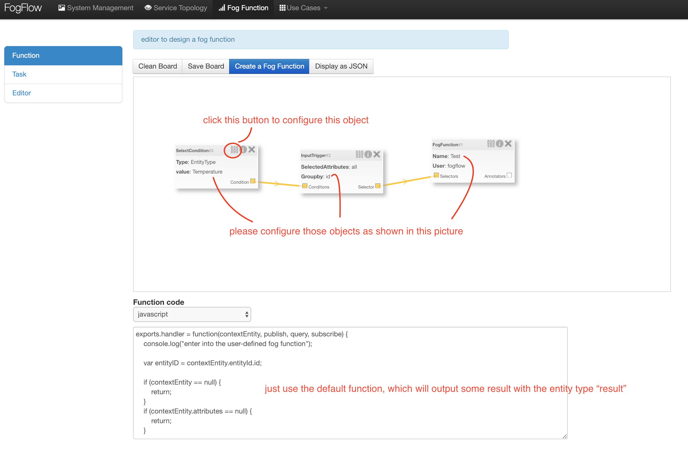
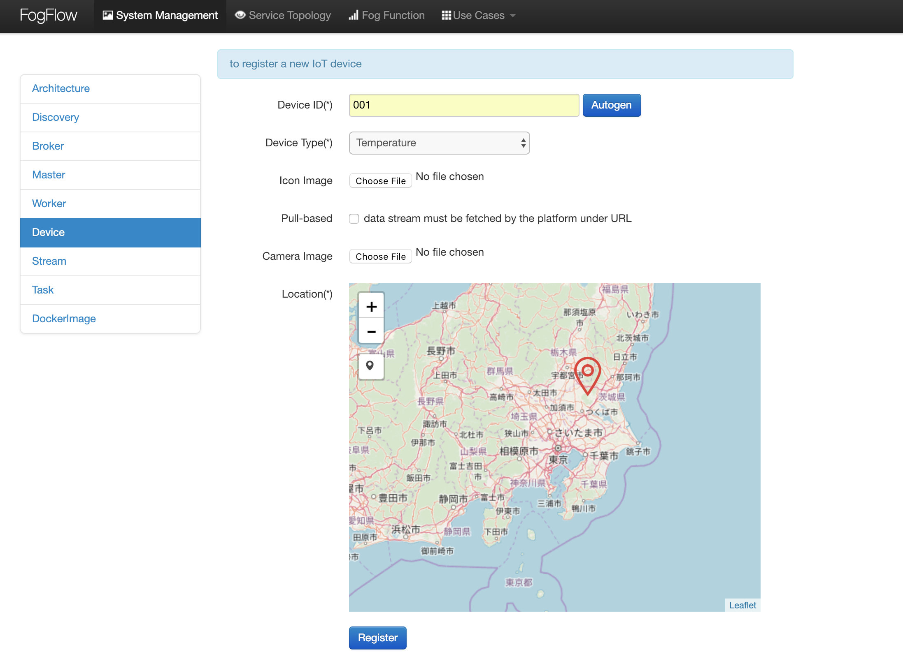

*****************************************
One-page tutorial
*****************************************

This is an one-page introductory tutorial to FogFlow.
In the FIWARE-based architecture, FogFlow can be used to dynamically trigger data processing functions 
between IoT devices and Orion Context Broker, 
for the purpose of transforming and preprocessing raw data at edge nodes (e.g., IoT gateways or Raspberry Pis).

The tutorial introduces a typical FogFlow system setup with a simple example to do anomaly detection at edges for temperature sensor data. 
It explains an example usecase implementation using FogFlow and FIWARE Orion in integration with each other. 

As shown in the following diagram, in this use case a connected temperature sensor sends an update message to the FogFlow system, 
which triggers some running task instance of a pre-defined fog function to generate some analytics result. 
The fog function is specified in advance via the FogFlow dashboard, 
however, it is triggerred only when the temperature sensor joins the sytem. In a real distributed setup, 
the running task instance will be deployed at the edge node closed to the temperature sensor. 
Once the generated analytics result is generated, 
it will be forwarded from the FogFlow system to Orion Context Broker. 
This is because a subscription with Orion Context Broker as the reference URL has been issued.  

.. figure:: figures/systemview.png
    :width: 100 %

Start Up FogFlow
===============================================================

Here are the prerequisite commands for starting FogFlow:

1. docker

2. docker-compose

For ubuntu-16.04, you need to install docker-ce and docker-compose.

To install Docker CE, please refer to `Install Docker CE`, required version > 18.03.1-ce;

.. important:: 
	**please also allow your user to execute the Docker Command without Sudo**

To install Docker Compose, please refer to `Install Docker Compose`, 
required version 18.03.1-ce, required version > 2.4.2

.. _`Install Docker CE`: https://www.digitalocean.com/community/tutorials/how-to-install-and-use-docker-on-ubuntu-16-04
.. _`Install Docker Compose`: https://www.digitalocean.com/community/tutorials/how-to-install-docker-compose-on-ubuntu-16-04

**Setup FogFlow:**

Download the docker-compose file and the config.json file to setup flogflow.

.. code-block:: console    

	wget https://raw.githubusercontent.com/smartfog/fogflow/master/docker/core/docker-compose.yml

	wget https://raw.githubusercontent.com/smartfog/fogflow/master/docker/core/config.json

you need to change the following addresses in config.json according to your own environment.

- **webportal_ip**: this is the IP address to access the FogFlow web portal provided by Task Designer. It must be accessible from outside by user's browser.  
- **coreservice_ip**: it is used by all edge nodes to access the FogFlow core services, including Discovery, Broker(Cloud), and RabbitMQ;
- **external_hostip**: this is the same as coreservice_ip, for the cloud part of FogFlow;        
- **internal_hostip**: is the IP of your default docker bridge, which is the "docker0" network interface on your host

.. important:: 

	please DO NOT use "127.0.0.1" as the IP address of **coreservice_ip** and **external_hostip**, because they will be used by a running task inside a docker container. 
	
	**Firewall rules:** to make your FogFlow web portal accessible via the external_ip; the following ports must be open as well: 80, 443, 8080, and 5672 for TCP
    
Pull the docker images of all FogFlow components and start the FogFlow system

.. code-block:: console    

	docker-compose pull

	docker-compose up -d

Check all the containers are Up and Running using "docker ps -a"

.. code-block:: console    

	root@fffog-ynomljrk3y7bs23:~# docker ps -a
	CONTAINER ID  IMAGE              COMMAND           CREATED      STATUS       PORTS                                       NAMES
	122a61ece2ce  fogflow/master     "/master"         26 hours ago Up 26 hours  0.0.0.0:1060->1060/tcp                      fogflow_master_1
	e625df7a1e51  fogflow/designer   "node main.js"    26 hours ago Up 26 hours  0.0.0.0:80->80/tcp, 0.0.0.0:1030->1030/tcp  fogflow_designer_1
	42ada6ee39ae  fogflow/broker     "/broker"         26 hours ago Up 26 hours  0.0.0.0:8080->8080/tcp                      fogflow_broker_1
	39b166181acc  fogflow/discovery  "/discovery"      26 hours ago Up 26 hours  0.0.0.0:443->443/tcp                        fogflow_discovery_1
	8951aaac0049  tutum/rabbitmq     "/run.sh"         26 hours ago Up 26 hours  0.0.0.0:5672->5672/tcp, 15672/tcp           fogflow_rabbitmq_1
	7f32d441c54a  mdillon/postgis    "docker-entry…"   26 hours ago Up 26 hours  0.0.0.0:5432->5432/tcp                      fogflow_postgis_1
	53bf689d3db6  fogflow/worker     "/worker"         26 hours ago Up 26 hours                                              fogflow_cloud_worker_1
	root@fffog-ynomljrk3y7bs23:~# 

**Test the Fogflow Dashboard:**

Open the link “http://<webportal_ip>” in your browser to check the status of all FogFlow running components in the cloud.
So now you can also check all the components using dashboard.

Start Up Orion
====================

You may follow the orion docs to set up a Orion Context Broker instance from here: `Installing Orion`.

.. _`Installing Orion`: https://fiware-orion.readthedocs.io/en/master/admin/install/index.html

You may also setup Orion on docker using below commands.(docker is required this method)
Note: Orion container has a dependency on MongoDB database.

**Prerequisite:** Docker should be installed.

First launch MongoDB container using below command:

.. code-block:: console    

	sudo docker run --name mongodb -d mongo:3.4

And then run Orion with this command

.. code-block:: console    

	sudo docker run -d --name orion1 --link mongodb:mongodb -p 1026:1026 fiware/orion -dbhost mongodb

Check that everything works with

.. code-block:: console    

	curl http://<Orion IP>:1026/version

Note: Allow port 1026 in firewall for public access.

Program a simple fog function via FogFlow Dashboard
=======================================================

**Create a simple Fog Function that:**

	- accepts "Temperature" Entity Type as SelectCondition, "id" as granularity and "all" as SelectedAttributes,

	- publishes a context entity of type "result" in Streams.

	

Simulate an IoT device to trigger the Fog Function
=====================================================

There are two ways to trigger the fog function:

**1. Create a “Temperature” sensor entity by filling the following element:**
 - **Device ID:** to specify a unique entity ID
 - **Device Type:** use “Temperature” as the entity type
 - **Location:** select a location on the map
 

**2. Send an NGSI entity update to create the “Temperature” sensor entity:**
 - Send a curl request to the FogFlow broker for entity update:

.. code-block:: console    

	curl -iX POST \
	  'http://<Fogflow IP>:8080/ngsi10/updateContext' \
	  -H 'Content-Type: application/json' \
	  -d '
	{
	    "contextElements": [
	        {
	            "entityId": {
	                "id": "Temperature001",
	                "type": "Temperature",
	                "isPattern": false
	                },
	            "attributes": [
	                    {
	                    "name": "temperature",
	                    "type": "float",
	                    "value": 73
	                    },
	                    {
	                    "name": "pressure",
	                    "type": "float",
	                    "value": 44
	                    }
	                ],
	            "domainMetadata": [
	                    {
	                    "name": "location",
	                    "type": "point",
	                    "value": {
	                    "latitude": -33.1,
	                    "longitude": -1.1
	                    }}
	                ]
	        }
	    ],
	    "updateAction": "UPDATE"
	}'

Check if the fog function is triggered
============================================

**1.  Check if a task is created under "Task" in System Management.**

.. figure:: figures/task.png
    :width: 100 %

**2. Check if a Stream is created under "Stream" in System Management.**

.. figure:: figures/result.png
    :width: 100 %

Issue a subscription to forward the generated result to Orion Context Broker
================================================================================

Use the following curl request to subscribe Fogflow Broker to FIWARE Orion:

.. code-block:: console    

	curl -iX POST \
	  'http://<Fogflow IP>:8080/ngsi10/subscribeContext' \
	  -H 'Content-Type: application/json'  \
	  -H 'Destination: orion-broker'  \
	  -d '
	{
	  "entities": [
	    {
	      "id": ".*",
	      "type": "result",
	      "isPattern": true
	    }
	  ],
	  "reference": "http://<Orion IP>:1026/v2"
	}'

Please note that this subscription request does not use any restrictions and attributes, it is a general subscription request based of entity type.

Query the result from Orion Context Broker
==============================================

Visit the following URL in your browser and search for the desired context entities:

.. code-block:: console    

	curl http://<Orion IP>:1026/v2/entities/

