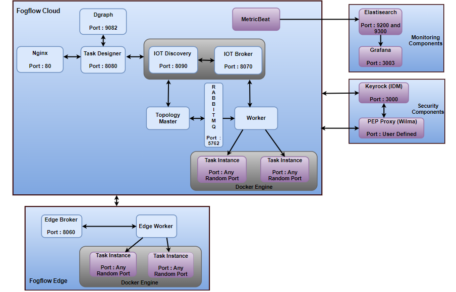

Quick Start
===========================================================

This is an one-page introductory tutorial to FogFlow.
In the FIWARE-based architecture, FogFlow can be used to dynamically trigger data processing functions 
between IoT devices and Orion Context Broker, 
for the purpose of transforming and preprocessing raw data at edge nodes (e.g., IoT gateways or Raspberry Pis).

The tutorial introduces a typical FogFlow system setup with a simple example to do anomaly detection at edges for temperature sensor 
data.
It explains an example usecase implementation using FogFlow and FIWARE Orion in integration with each other. 

Every time to implement a usecase FogFlow creates some internal NGSI entities such as operators, Docker image, Fog Function and service topology.
So these entity data are very important for FogFlow system and these are need to be stored somewhere. An entity data can not be stored in FogFlow memory
because memory is volatile and it will lose content when power is lost. To solve this issue FogFlow introduces `Dgraph`_  a persistent storage.
The persistent storage will store FogFlow entity data in the form of graph.

.. _`Dgraph`: https://dgraph.io/docs/get-started/

As shown in the following diagram, in this use case a connected temperature sensor sends an update message to the FogFlow system, 
which triggers some running task instance of a pre-defined fog function to generate some analytics result. 
The fog function is specified in advance via the FogFlow dashboard, 
however, it is triggerred only when the temperature sensor joins the sytem. In a real distributed setup, 
the running task instance will be deployed at the edge node closed to the temperature sensor. 
Once the generated analytics result is generated, 
it will be forwarded from the FogFlow system to Orion Context Broker. 
This is because a subscription with Orion Context Broker as the reference URL has been issued.  

.. figure:: figures/systemview.png

Here are the prerequisite commands for running FogFlow:

1. docker

2. docker-compose

For ubuntu-16.04, you need to install docker-ce and docker-compose.

To install Docker CE, please refer to `Install Docker CE`_, required version > 18.03.1-ce;

.. important:: 
	**please also allow your user to execute the Docker Command without Sudo**

To install Docker Compose, please refer to `Install Docker Compose`_, 
required version 18.03.1-ce, required version > 2.4.2

.. _`Install Docker CE`: https://www.digitalocean.com/community/tutorials/how-to-install-and-use-docker-on-ubuntu-16-04
.. _`Install Docker Compose`: https://www.digitalocean.com/community/tutorials/how-to-install-docker-compose-on-ubuntu-16-04

Fetch all required scripts
-------------------------------------------------------------

Download the docker-compose file and the configuration files as below.

.. code-block:: console    

	# the docker-compose file to start all FogFlow components on the cloud node
	wget https://raw.githubusercontent.com/smartfog/fogflow/master/release/3.2.6/cloud/docker-compose.yml
	
	# the configuration file used by all FogFlow components
	wget https://raw.githubusercontent.com/smartfog/fogflow/master/release/3.2.6/cloud/config.json
	
	# the configuration file used by the nginx proxy
	wget https://raw.githubusercontent.com/smartfog/fogflow/master/release/3.2.6/cloud/nginx.conf

	
Change the IP configuration accordingly
-------------------------------------------------------------

You need to change the following IP addresses in config.json according to your own environment and also check if the used port nubmers are blocked by your firewall. 

- **my_hostip**: this is the IP of your host machine, which should be accessible for both the web browser on your host machine and docker containers. Please DO NOT use "127.0.0.1" for this. 
- **site_id**: each FogFlow node (either cloud node or edge node) requires to have a unique string-based ID to identify itself in the system;
- **physical_location**: the geo-location of the FogFlow node;
- **worker.capacity**: it means the maximal number of docker containers that the FogFlow node can invoke;  

.. important:: 

	please DO NOT use "127.0.0.1" as the IP address of **my_hostip**, because it is only accessible to a 
	running task inside a docker container. 
	
	**Firewall rules:** To make FogFlow web portal accessible and for its proper functioning, the following ports must be free and open over TCP in host machine. 
	
	.. code-block:: console

		Component		Port

		Discovery		8090 
		Broker			8070
		Dgraph			9082
		Designer		8080
		Nginx			  80
		Rabbitmq		5672
		Task			launched over any port internally

	**Note : Task Instance is launched over dynamically assigned port, which is not predefined. So, users can possibly allow local ports using rule in his firewall. This will result in smooth functioning of Task Instances.**

	**Above mentioned port number(s) are default port number(s)**. If user needs to change the port number(s), please make sure the change is consistence in all the configuration files named as **"config.json"**.

	**Mac Users:** if you like to test FogFlow on your Macbook, please install Docker Desktop and also use "host.docker.internal" 
	as my_hostip in the configuration file.

Start all Fogflow components 
-------------------------------------------------------------

Pull the docker images of all FogFlow components and start the FogFlow system

.. code-block:: console    

	#if you already download the docker images of FogFlow components, this command can fetch the updated images
	docker-compose pull  

	docker-compose up -d

Validate your setup
-------------------------------------------------------------

There are two ways to check if the FogFlow cloud node is started correctly: 

- Check all the containers are Up and Running using "docker ps -a"

.. code-block:: console    

	docker ps -a
	
	795e6afe2857   nginx:latest            "/docker-entrypoint.…"   About a minute ago   Up About a minute   0.0.0.0:80->80/tcp                                                                               fogflow_nginx_1
	33aa34869968   fogflow/worker:3.2.6      "/worker"                About a minute ago   Up About a minute                                                                                                    fogflow_cloud_worker_1
	e4055b5cdfe5   fogflow/master:3.2.6      "/master"                About a minute ago   Up About a minute   0.0.0.0:1060->1060/tcp                                                                           fogflow_master_1
	cdf8d4068959   fogflow/designer:3.2.6    "node main.js"           About a minute ago   Up About a minute   0.0.0.0:1030->1030/tcp, 0.0.0.0:8080->8080/tcp                                                   fogflow_designer_1
	56daf7f078a1   fogflow/broker:3.2.6      "/broker"                About a minute ago   Up About a minute   0.0.0.0:8070->8070/tcp                                                                           fogflow_cloud_broker_1
	51901ce6ee5f   fogflow/discovery:3.2.6   "/discovery"             About a minute ago   Up About a minute   0.0.0.0:8090->8090/tcp                                                                           fogflow_discovery_1
	51eff4975621   dgraph/standalone       "/run.sh"                About a minute ago   Up About a minute   0.0.0.0:6080->6080/tcp, 0.0.0.0:8000->8000/tcp, 0.0.0.0:8082->8080/tcp, 0.0.0.0:9082->9080/tcp   fogflow_dgraph_1
	eb31cd255fde   rabbitmq:3              "docker-entrypoint.s…"   About a minute ago   Up About a minute   4369/tcp, 5671/tcp, 15691-15692/tcp, 25672/tcp, 0.0.0.0:5672->5672/tcp                           fogflow_rabbitmq_1

.. important:: 

	if you see any container is missing, you can run "docker ps -a" to check if any FogFlow component is terminated with some 
	problem. If there is, you can further check its output log by running "docker logs [container ID]"

- Check the system status from the FogFlow DashBoard

You can open the FogFlow dashboard in your web browser to see the current system status via the URL: http://<my_hostip>/index.html

.. important:: 

	If the FogFlow cloud node is behind a gateway, you need to create a mapping from the gateway IP to the my_hostip and then 
	access the FogFlow dashboard via the gateway IP;
	If the FogFlow cloud node is a VM in a public cloud like Azure Cloud, Google Cloud, or Amazon Cloud, you need to access the 
	FogFlow dashboard via the public IP of your VM;
	

Once you are able to access the FogFlow dashboard, you can see the following web page

.. figure:: figures/dashboard.png

Hello World Example
===========================================================

Once the FogFlow cloud node is set up, you can try out some existing IoT services without running any FogFlow edge node.
For example, you can try out a simple fog function as below.  

Initialize all defined services with three clicks
-------------------------------------------------------------

- Click "Operator Registry" in the top navigator bar to triger the initialization of pre-defined operators. 

After you first click "Operator Registry", a list of pre-defined operators will be registered in the FogFlow system. 
With a second click, you can see the refreshed list as shown in the following figure.

.. figure:: figures/operator-list.png

- Click "Service Topology" in the top navigator bar to triger the initialization of pre-defined service topologies. 

After you first click "Service Topology", a list of pre-defined topologies will be registered in the FogFlow system. 
With a second click, you can see the refreshed list as shown in the following figure.

.. figure:: figures/topology-list.png

- Click "Fog Function" in the top navigator bar to triger the initialization of pre-defined fog functions. 

After you first click "Fog Function", a list of pre-defined functions will be registered in the FogFlow system. 
With a second click, you can see the refreshed list as shown in the following figure.

.. figure:: figures/function-list.png

Simulate an IoT device to trigger the Fog Function
-------------------------------------------------------------

There are two ways to trigger the fog function:

**1. Create a “Temperature” sensor entity via the FogFlow dashboard**

You can register a device entity via the device registration page: "System Status" -> "Device" -> "Add". 
Then you can create a “Temperature” sensor entity by filling the following element:
- **Device ID:** to specify a unique entity ID
- **Device Type:** use “Temperature” as the entity type
- **Location:** select a location on the map
 

.. figure:: figures/device-registration.png

**2. Send an NGSI entity update to create the “Temperature” sensor entity**
 
Send a curl request to the FogFlow broker for entity update:

.. code-block:: console    

	
	curl -iX POST \
		  'http://my_hostip/ngsi10/updateContext' \
		  -H 'Content-Type: application/json' \
		  -d '
		{
		    "contextElements": [
		        {
		            "entityId": {
		                "id": "Device.Temp001",
		                "type": "Temperature",
		                "isPattern": false
		                },
		            "attributes": [
		                    {
		                    "name": "temperature",
		                    "type": "float",
		                    "value": 73
		                    },
		                    {
		                    "name": "pressure",
		                    "type": "float",
		                    "value": 44
		                    }
		                ],
		            "domainMetadata": [
		                    {
		                    "name": "location",
		                    "type": "point",
		                    "value": {
		                    "latitude": -33.1,
		                    "longitude": -1.1
		                    }}
		                ]
		        }
		    ],
		    "updateAction": "UPDATE"
		}'

Check if the fog function is triggered
-------------------------------------------------------------

Check if a task is created under "Task" in System Management.**

.. figure:: figures/fog-function-task-running.png

Check if a Stream is created under "Stream" in System Management.**

.. figure:: figures/fog-function-streams.png

