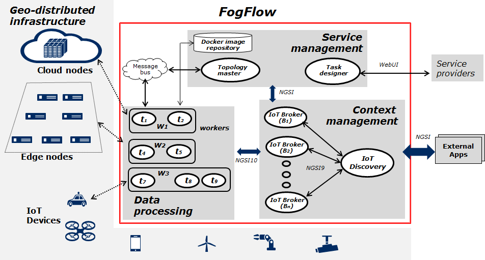

*****************************************
System overview
*****************************************

System architecture
===============================

The FogFlow framework operates on a geo-distributed, hierarchical, and heterogeneous ICT infrastructure that includes cloud nodes, edge nodes, and IoT devices. The following figure illustrates the system architecture of FogFlow and its major components across three logical layers

Three layers
===============================

Logically, FogFlow consists of the following three layers: 

- **service management**: convert service requirements into concrete execution plan and then deploy the generated execution plan over cloud and edges

- **context management**: manage all context information and make them discoverable and accessible via flexible query and subscribe interfaces

- **data processing**: launch data processing tasks and establish data flows between tasks via the pub/sub interfaces provided by the context management layer

System components
===============================

centralized service components to be deployed in the cloud

- **Task Designer**: provide the web-based interface for service providers to specify, register, and manage their tasks and service topologies;

- **Topology Master**: figure out when and which task should be instantiated, dynamically configure them, and also decide where to deploy them over cloud and edges;

- **IoT Discovery**: manage all registered context availability information, including its ID, entity type, attribute list, and metadata; allow other components to query and subscribe their interested context availability information via NGSI9 

distributed components to be deployed both in the cloud and at edges 

- **Worker**: according to the assignment from the topology master, each worker will launch its scheduled task instances in docker containers on its local host; configure their inputs and outputs and manage all task instances locally based on task priority  

- **IoT Broker**: each broker manages a part of context entities published by nearby IoT devices and also provides a single view of all context entities for IoT devices to query and subscribe the entities they need

external service components to be used in FogFlow

- **Dock Registry**: managed all docker images provided by developers;

- **RabbitMQ**: The internal communication between topology master and the workers 

- **PostgreSQL**: the backend database to save the registered context availability information 

