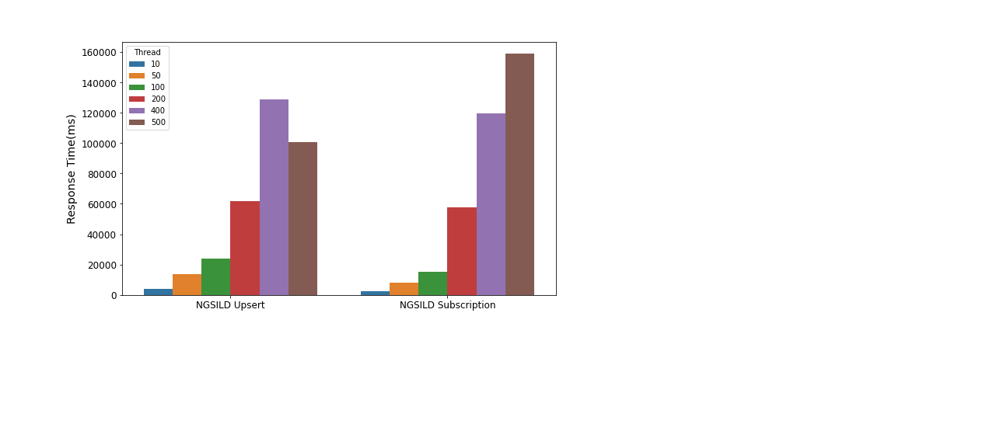
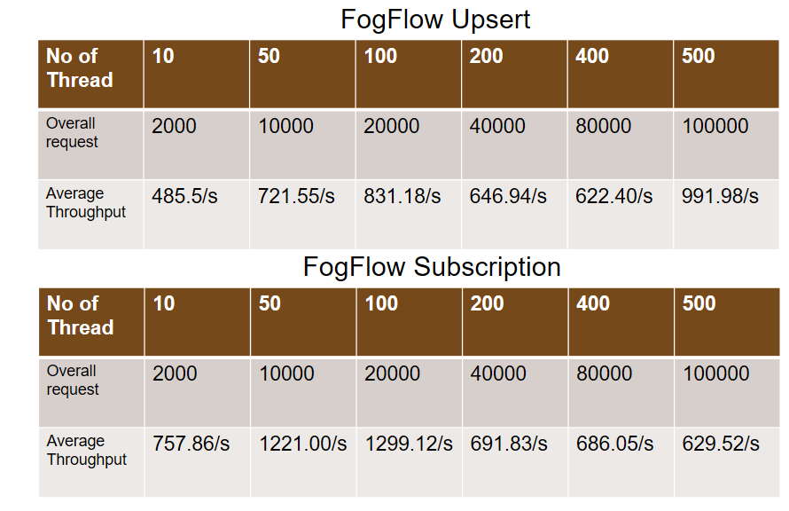
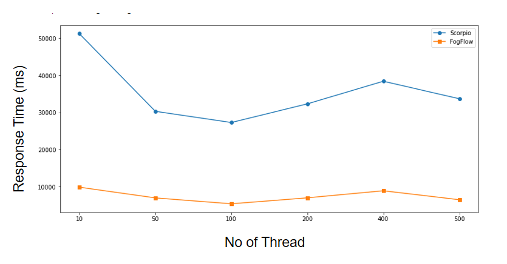
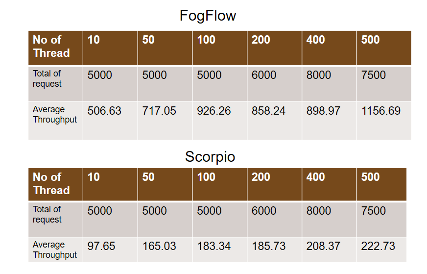

*****************************************
Performance Evaluation
*****************************************

Performance of NGSI-LD based thinBroker in FogFlow 
================================================================

This tutorial introduces the performace evaluation of NGSILD based context management systems of the FogFlow framework. Our analyses include the performance comparision of FogFlow broker with other NGSILD broker(orion broker, stelio Broker, Scorpio Broker) in terms of  throughput (number of messages per second) and response time/message propagation latency and  efficiency of context availability discoveries and context transfers in the smart city scale.Moreover, we analyze the scalability of FogFlow using multiple IoT Brokers.

Experiement Setup
-------------------

**FogFlow system:** To test the performance, I have deployed one cloud node(4vCPUs, 16 GB RAM) and two edge node(4vCPUs, 8 GB RAM) in doker container.

**Listener client:** To measure the delay of context update from the moment sent by a context producer to the time received by a subscriber we are using listener client. Listener client is deployed on a VM(4cpu, 8GB RAM)

**Testing tool:** TO produce the test data for fogflow broker we are using Apache JMeter testing tool. JMeter is deployed on a VM(8cpu, 8GB RAM)

Throughput and latency to create new entities
--------------------------------------------------

**To test the performance of subscription and upsert API** 

The above graph depicts the variation of latency over number of threads (the real time users). The Y axis represent latency and X axis represent number of threads. On analysing above data, it becomes evident that with increasing number of thread the total number of requests increases. The throughput in contrast to the increasing number of request indicates the good performance of fogflow for Upsert requests.

The above graph depicts the variation of latency over number of threads (the real time users) in case of subscription. The Y axis represent latency and X axis represent number of threads. On analysing above data, it becomes evident that with increasing number of thread the total number of requests increases. The throughput in contrast to the increasing number of request indicates the average performance of fogflow for Subscription requests. Given the fact that fogflow subscriptions are interacting with fogflow component like fogflow discovery making it reliable but adding an extra tint of time in generating response.

**Compare the performance of FogFlow subscription and upsert API with Scorpio Broker subscription and upsert** TO compare response time of upsert API with scorpio Broker upsert API we have created 36500 entities by using different no of thread 10, 50,100, 200, 400,500. The following graph repersent latency on y-axis and no of thread  on x-axis. From the graph it is clear that for all the cases latency of FogFLow upsert API is lower than latency of Scorpio upsert APi.

.. figure:: figures/1.2Subscription.png

.. figure:: figures/1.2SubscriptionData.png

**To test how the performance can be scaled up with more FogFlow edge nodes **

.. figure:: figures/1.3upsert.png

.. figure:: figures/1.3upsertdata.png

Throughput and latency to query entities
--------------------------------------------------

**To compare the performance of Query APIs with the other NGSI-LD brokers**
.. figure:: figures/2.1Id.png

.. figure:: figures/2.1IDData.png

.. figure:: figures/2.1SubID.png

.. figure:: figures/2.1SubBYIDData.png

**To test how the performance of Query APIs can be scaled up with more FogFlow edge nodes**

.. figure:: figures/2.3.png

.. figure:: figures/2.3QueryCloudEdge.png

Update Propagation from Context Producers to Context Consumer
------------------------------------------------------------------

to measure the delay of context update from the moment sent by a context producer to the time received by a subscriber

to measure how many updates can flow from the context producer to the subscriber per second

to compare the performance with the other NGSI-LD brokers

to test how the performance can be scaled up with more subscribers

