*****************************************
Performance Evaluation
*****************************************

Performance of NGSI-LD based thinBroker in FogFlow 
================================================================

This tutorial introduces the performace evaluation of NGSILD based context management systems of the FogFlow framework. The following analyses include the performance comparision of FogFlow broker with other NGSILD broker(orion broker, Scorpio Broker) on the basis of throughput (number of messages per second) and response time/message propagation latency.

Experiement Setup
-------------------

**FogFlow system:** To test the performance, FogFlow is deployed on one cloud node(4vCPUs, 16 GB RAM) and two edge node(4vCPUs, 8 GB RAM) in doker container.

**Listener client:** To measure the delay of context update from the moment sent by a context producer to the time received by a subscriber we are using listener client. Listener client is deployed on a VM(4cpu, 8GB RAM)

**Testing tool:** TO produce the test data for fogflow broker we are using Apache JMeter testing tool. JMeter is deployed on a VM(8cpu, 8GB RAM)

Throughput and latency to create new entities
--------------------------------------------------

**Create**
************

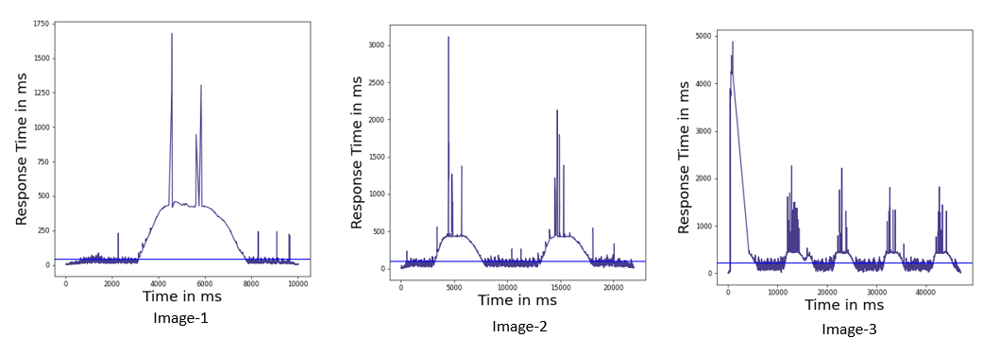

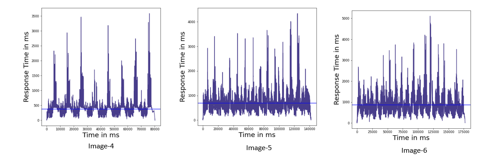

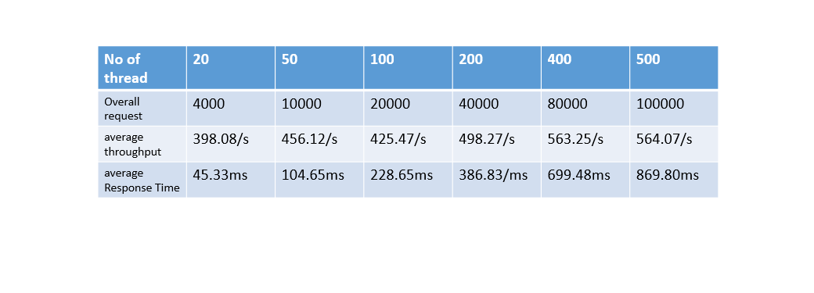

**Analysis of Graphs**:
The above graphs are plotted against Create API in Fogflow. The Y axis in graph represents response time and X axis represents timestamp to gnerate real time environment. The line parallel to X axis is the mean of response time for all the entities created using Create API. The graph shows the response time in contrast to each and every request that is handled by Fogflow broker. 

- *Image-1* corresponds to 20 threads (analogus to real time users) where each thread sends 200 requests
- *Image-2* corresponds to 50 threads (analogus to real time users) where each thread sends 200 requests
- *Image-3* corresponds to 100 threads (analogus to real time users) where each thread sends 200 requests
- *Image-4* corresponds to 200 threads (analogus to real time users) where each thread sends 200 requests
- *Image-5* corresponds to 400 threads (analogus to real time users) where each thread sends 200 requests
- *Image-6* corresponds to 500 threads (analogus to real time users) where each thread sends 200 requests

From the data in the above table it can be observed that with growing number of threads the number of overall requests increases. For example in *Image-1* and from given data, it can be observed that for 4000 requests the average throughput is 398.08/s as well as mean response time is 45.33 ms and on other hand for 1,00,000 the average throughput is 564.07/s and mean response time is 869.80 ms. These values depicts the good and efficient performance of Create API in Fogflow. Thus the data populated in table supports the analysis made on above graphs. Hence, Fogflow can handle larger simultaneous Create requests and perform good in such scenario. 

**Update**
**************

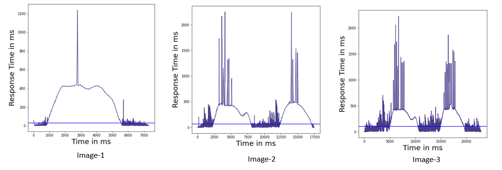

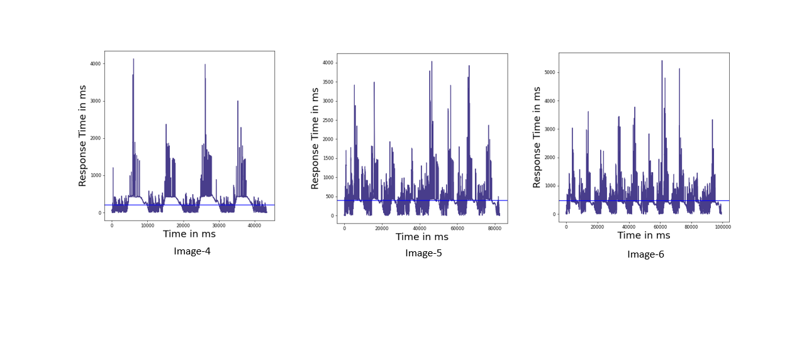

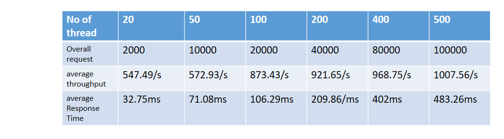

**Analysis of Graphs**:
The above graphs are plotted against Update API in Fogflow. The Y axis in graph represents response time and X axis represents timestamp to stimulate real time environment. The line parallel to X axis is the mean of response time for all the entities updated using Update API. The graph shows the response time in contrast to each and every request that is handled by Fogflow broker. 

- *Image-1* corresponds to 20 threads (analogus to real time users) where each thread sends 100 requests
- *Image-2* corresponds to 50 threads (analogus to real time users) where each thread sends 200 requests
- *Image-3* corresponds to 100 threads (analogus to real time users) where each thread sends 200 requests
- *Image-4* corresponds to 200 threads (analogus to real time users) where each thread sends 200 requests
- *Image-5* corresponds to 400 threads (analogus to real time users) where each thread sends 200 requests
- *Image-6* corresponds to 500 threads (analogus to real time users) where each thread sends 200 requests

From the data in the above table it can be observed that with growing number of threads the number of overall requests increases. For example in *Image-1* and from given data, it can be observed that for 4000 requests the average throughput is 547.49/s as well as mean response time is 32.75 ms and on other hand for 1,00,000 the average throughput is 1007.56/s and mean response time is 483.26 ms. These values depicts the good and efficient performance of Update API in Fogflow. Thus the data populated in table supports the analysis made on above graphs. Hence, Fogflow can handle larger simultaneous Update requests and perform good in such scenario. 

**Subscription**
*****************

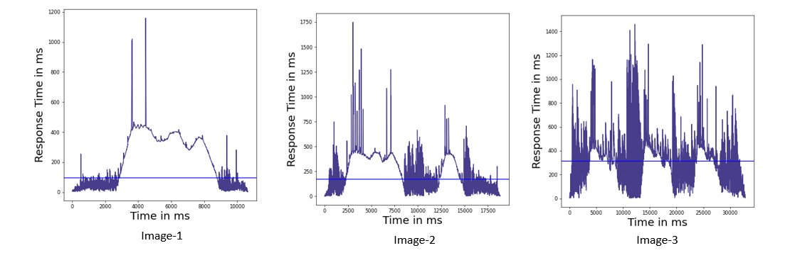

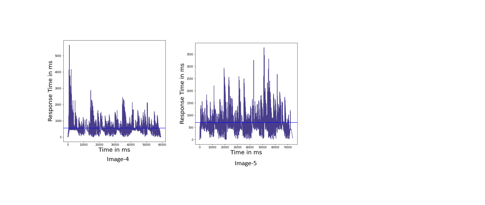

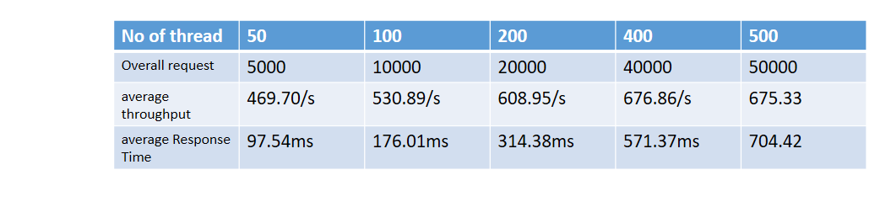

**Analysis of Graphs**:
The above graphs are plotted against Subscription API in Fogflow. The Y axis in graph represents response time and X axis represents timestamp to stimulate real time environment. The line parallel to X axis is the mean of response time for all the subscriptions created using Subscription API. The graph shows the response time in contrast to each and every request that is handled by Fogflow broker. 

- *Image-1* corresponds to 50 threads (analogus to real time users) where each thread sends 100 requests
- *Image-2* corresponds to 100 threads (analogus to real time users) where each thread sends 100 requests
- *Image-3* corresponds to 200 threads (analogus to real time users) where each thread sends 100 requests
- *Image-4* corresponds to 400 threads (analogus to real time users) where each thread sends 100 requests
- *Image-5* corresponds to 500 threads (analogus to real time users) where each thread sends 100 requests

From the data in the above table it can be observed that with growing number of threads the number of overall requests increases. For example in *Image-1* and from given data, it can be observed that for 5000 requests the average throughput is 469.70/s as well as mean response time is 97.54 ms and on other hand for 50,000 the average throughput is 675.33/s and mean response time is 704.42 ms. These values depicts the good and efficient performance of Update API in Fogflow. Thus the data populated in table supports the analysis made on above graphs. Hence, Fogflow can handle larger simultaneous Update requests and perform good in such scenario.

Performance Comparison between Fogflow and Scorpio Broker
--------------------------------------------------------------

To compare response time of Fogflow upsert API with Scorpio Broker upsert API, we have created entities by using different no of thread 50,100, 200, 400, 500. The following graph repersent response time on Y-axis and timestamp on X-axis. 

**Fogflow Upsert API Vs. Scorpio Upsert API**
************************************************

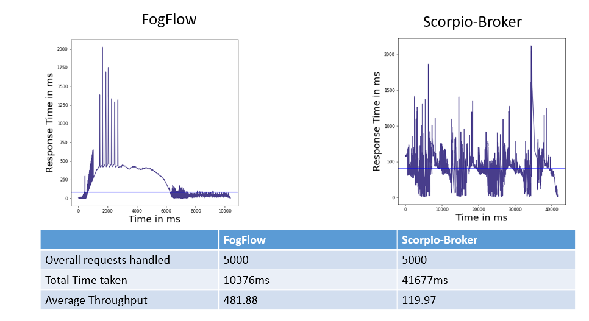

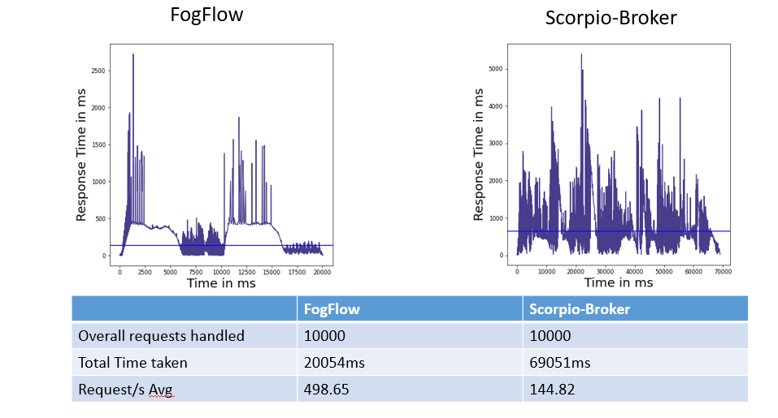

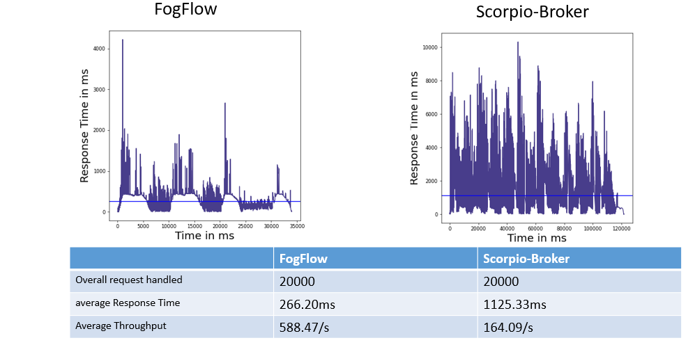

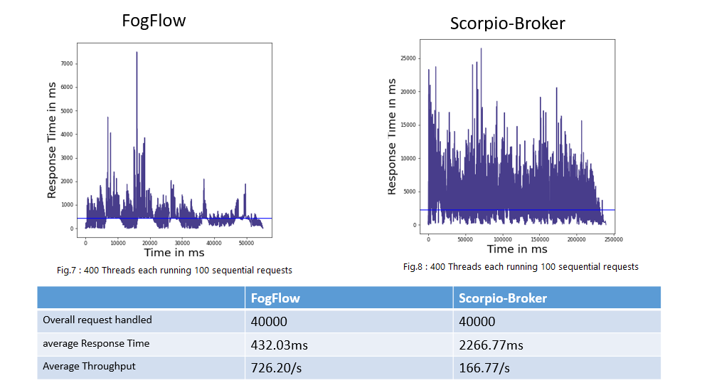

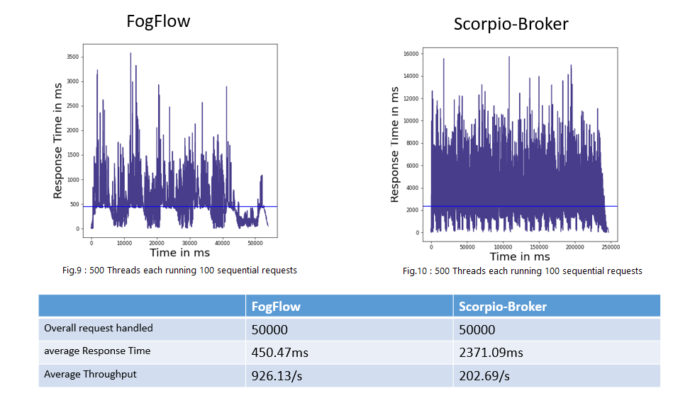

**Comparison Result** : The above graphs depicts comparison between two brokers i.e. the left graph represents Fogflow broker and right graph represents Scorpio broker. With a detailed analysis of the graphs based on response-time and timestamp, it is visible that Fogflow broker's Upsert API is a better performer than Scorpio broker's Upsert API. As shown in tabular data, it is evident that on increasing the number of threads which utlimately increases number of requests are better handled in case of Fogflow.

- *Image-1* corresponds to 50 threads (analogus to real time users) where each thread sends 100 requests
- *Image-2* corresponds to 100 threads (analogus to real time users) where each thread sends 100 requests
- *Image-3* corresponds to 200 threads (analogus to real time users) where each thread sends 100 requests
- *Image-4* corresponds to 400 threads (analogus to real time users) where each thread sends 100 requests
- *Image-5* corresponds to 500 threads (analogus to real time users) where each thread sends 100 requests

For example on executing 5000 requests, Fogflow has an average throughput of 481.88/s whereas Scorpio broker on same number of requests has an average throughput of 119.97/s. Similarly, increasing the number of requests as shown in table below the graphs, it can be observed that the throughput increases. For 40,000 requests, Fogflow gives a throughput of 726.20/s whereas Scorpio gives a throughput of 166.77/s. Overall fluctuations in response time for Fogflow and Scorpio broker is also a parameter that signifies the better performance of Fogflow when compared with Scorpio broker. Thus the data populated in table supports the analysis made on above graphs. Hence, Fogflow can handle larger simultaneous Upsert requests and perform good in such scenario.

*Hence Fogflow's Upsert API is better in performance than Scorpio Broker Upsert API*

**Fogflow Subscription API Vs. Scorpio Subscription API**
***************************************************************

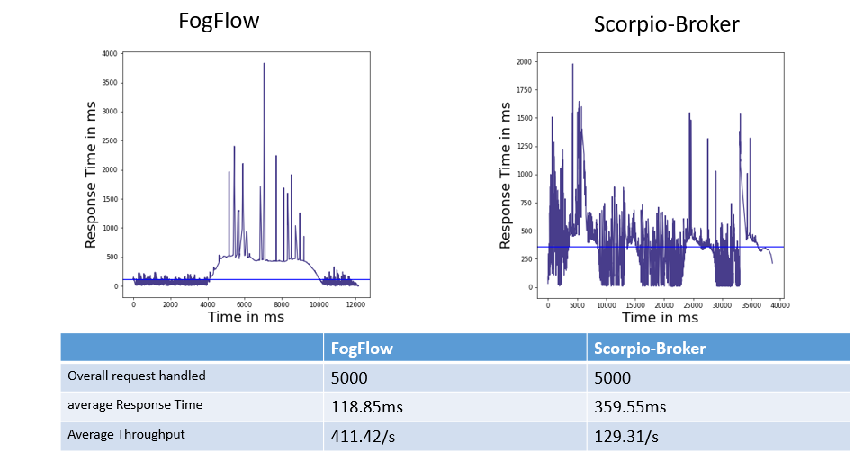

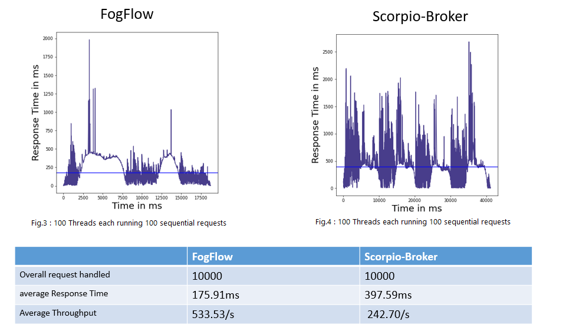

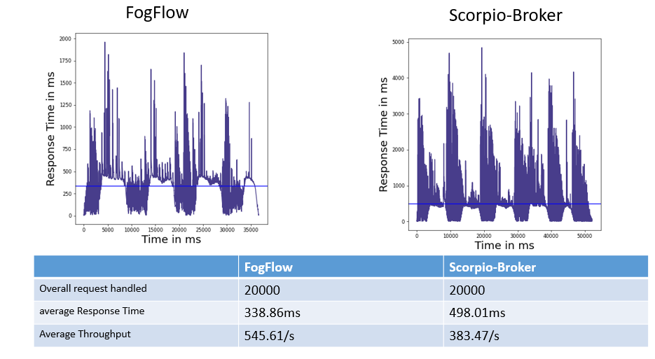

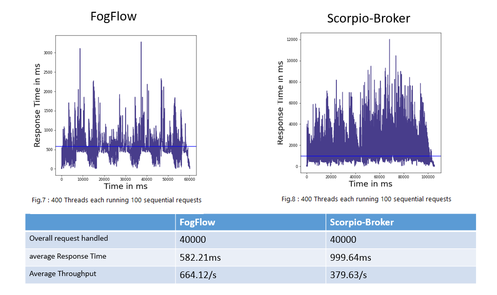

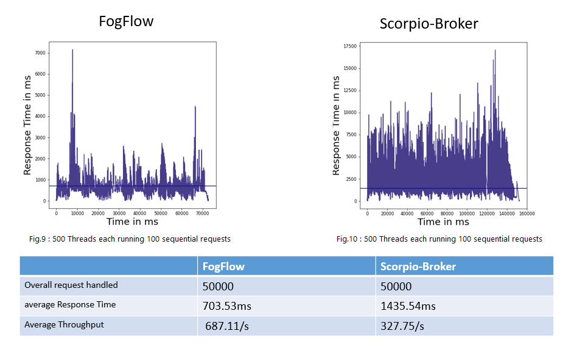

**Comparison Result** : The above graphs depicts comparison between two brokers i.e. the left graph represents Fogflow broker and right graph represents Scorpio broker. With a detailed analysis of the graphs based on response-time and timestamp, it is visible that Fogflow broker's Subscription API is a better performer than Scorpio broker's Subscription API. As shown in tabular data, it is evident that on increasing the number of threads which utlimately increases number of requests are better handled in case of Fogflow.

- *Image-1* corresponds to 50 threads (analogus to real time users) where each thread sends 100 requests
- *Image-2* corresponds to 100 threads (analogus to real time users) where each thread sends 100 requests
- *Image-3* corresponds to 200 threads (analogus to real time users) where each thread sends 100 requests
- *Image-4* corresponds to 400 threads (analogus to real time users) where each thread sends 100 requests
- *Image-5* corresponds to 500 threads (analogus to real time users) where each thread sends 100 requests

For example on executing 5000 requests, Fogflow has an average throughput of 411.42/s and a mean response time of 118.5 ms whereas Scorpio broker on same number of requests has an average throughput of 129.31/s and mean response time of 359.55 ms. This shows that Fogflow is able to handle the requests in better and efficient manner with a greater throughput and lesser mean response time than Scorpio broker. Similarly, increasing the number of requests as shown in table below the graphs, it can be observed that the throughput increases. For 50,000 requests, Fogflow gives a throughput of 687.11/s  and mean response time of 703.5 ms whereas Scorpio gives a throughput of 327.75/s and mean response time of 1435.54 ms. Overall fluctuations in response time for Fogflow and Scorpio broker is also a parameter that signifies the better performance of Fogflow when compared with Scorpio broker. Thus the data populated in table supports the analysis made on above graphs. Hence, Fogflow can handle larger simultaneous Subscription requests and perform good in such scenario.

*Hence Fogflow's Subscription API is better in performance than Scorpio Broker Subscription API*

**Performance Enhancement by scaling up Fogflow with Multiple Edge Nodes - Fogflow Upsert API**
******************************************************************************************************

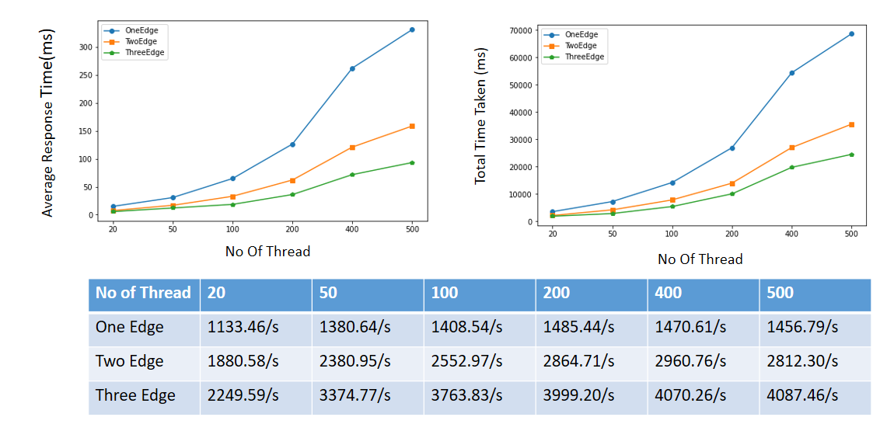

**Analysis of Graphs** : The above graphs are combination of three graphs i.e. the blue marker represents Fogflow single Edge node, orange marker represents Fogflow two Edge nodes and green marker represents three Edge nodes. With a detailed analysis of the response-time and number of thread graph, it is visible that Fogflow Single Edge node has a lower throughput. Further it can also be deduced that with the increase in number of edges the throughput increases. 

- *Image-1* corresponds to 50 threads (analogus to real time users) where each thread sends 200 requests
- *Image-2* corresponds to 100 threads (analogus to real time users) where each thread sends 200 requests
- *Image-3* corresponds to 200 threads (analogus to real time users) where each thread sends 200 requests
- *Image-4* corresponds to 400 threads (analogus to real time users) where each thread sends 200 requests
- *Image-5* corresponds to 500 threads (analogus to real time users) where each thread sends 200 requests

For example, the throughput for 20 threads (i.e. 4000 requests) in one Fogflow edge node is 1133.46/s and the mean is 14.71 ms whereas for 500 threads(i.e. 1,00,000 requests) the throughput is 1456.79/s and mean resposne time is 331.15 ms. Because of the fact that the increased number of edge brokers speed up the process because they all are interally connected to discovery evidently reflects in the graphs as well as the data populated in the above table. The requests made to edge node are registered with discovery directly than having to follow up a longer path through cloud broker. Thus, the Upsert API has an increased throughput on same number of thread as for multiple edge nodes. As shown in tabular data, the 2 edge nodes architecture achieves a throughput of 1880.58/s for 20 threads (i.e. 4000 requests) with a mean response time of 7.08 ms whereas for 500 threads (i.e. 1,00,000 requests) the throughput is 2812.30/s and mean response time is 158.58 ms. On further increasing the number of edge nodes i.e. within a three edge node architecture for 20 threads (i.e. 4000 requests) the acheived throughput is 2249.59/s and mean response time is 5.23 ms whereas for 500 threads (i.e. 1,00,000 requests) the achieved throughput is 4087.46/s and mean response time of 93.13 ms. Hence, Fogflow can handle larger simultaneous Upsert requests and perform good in a scenario where number of edge nodes are increased.

*Hence Fogflow's Upsert API performs better on addition of new edge node in the architecture*

Throughput and latency to query entities
--------------------------------------------------
To compare response time of Fogflow Query API with Scorpio Broker Query API, we have created 1,00,000 entities by using different no of thread 50,100, 200, 400,500. The following graph repersent response time on Y-axis and no of thread on X-axis. 

**Fogflow Query API Vs. Scorpio Query API - Query based on Entity ID**
****************************************************************************

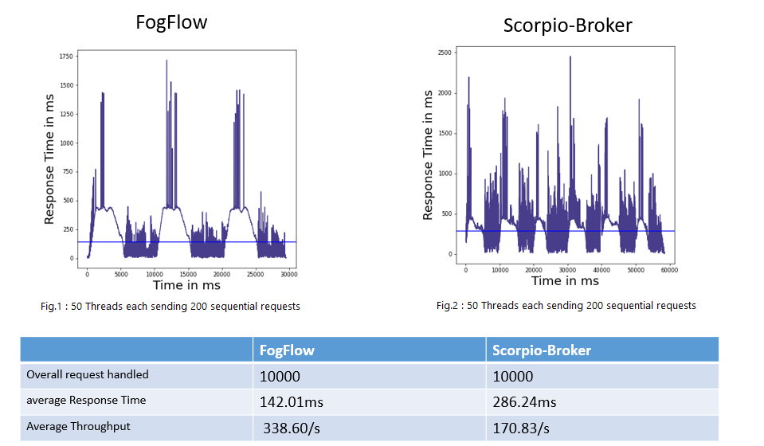

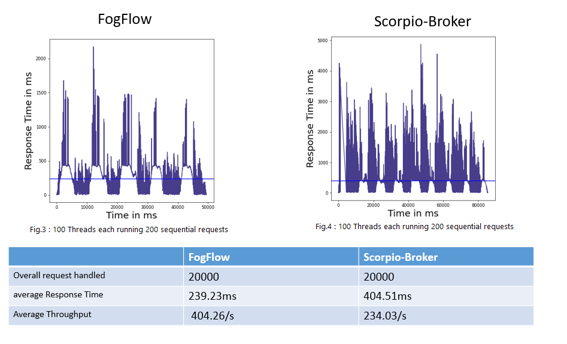

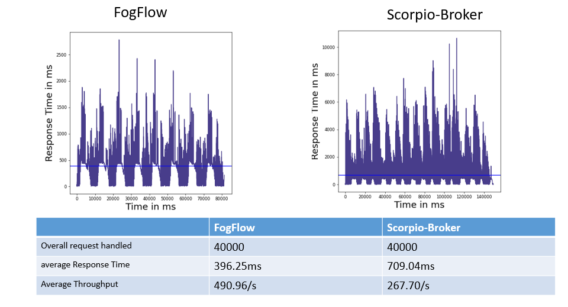

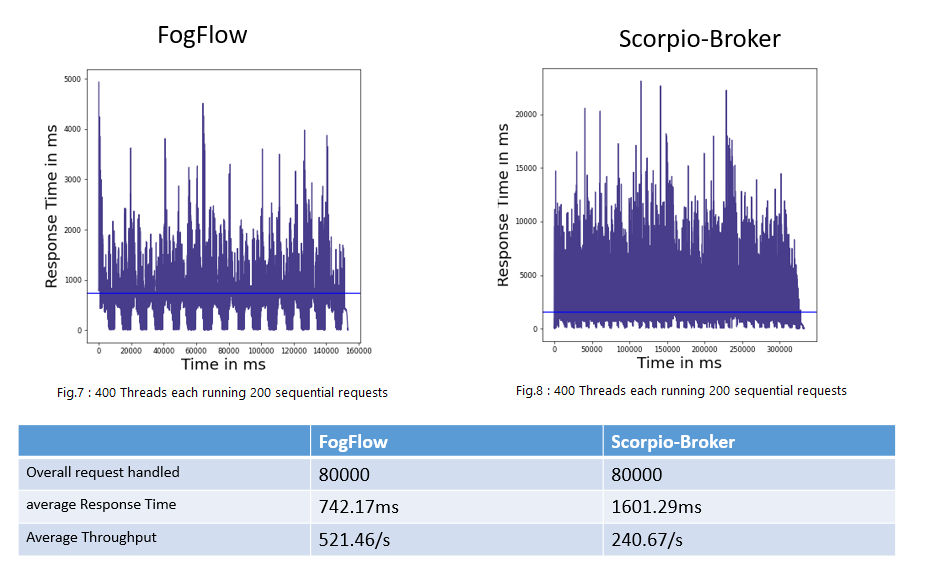

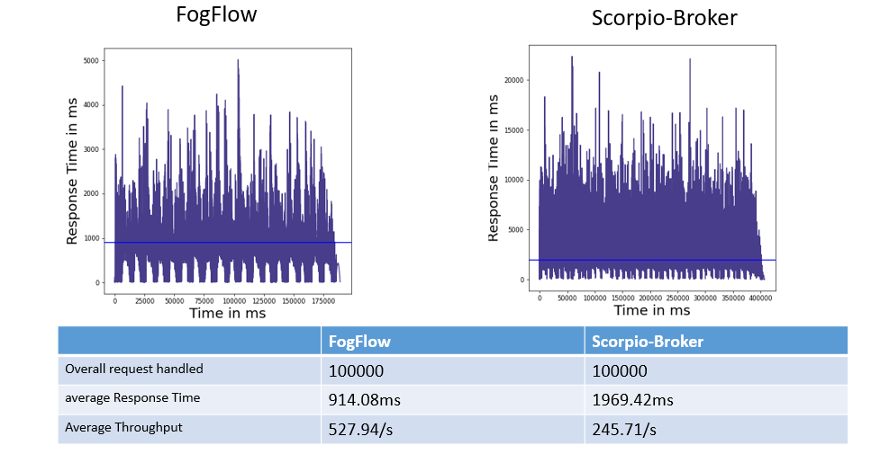

**Comparison Result** : The above graphs depicts comparison between two brokers i.e. the left graph represents Fogflow broker and right graph represents Scorpio broker. With a detailed analysis of the graphs based on response-time and timestamp, it is visible that Fogflow broker's Query API based on entity Id is a better performer than Scorpio broker's Query API based on entity Id. As shown in tabular data, it is evident that on increasing the number of threads which utlimately increases number of requests are better handled in case of Fogflow.

- *Image-1* corresponds to 50 threads (analogus to real time users) where each thread sends 200 requests
- *Image-2* corresponds to 100 threads (analogus to real time users) where each thread sends 200 requests
- *Image-3* corresponds to 200 threads (analogus to real time users) where each thread sends 200 requests
- *Image-4* corresponds to 400 threads (analogus to real time users) where each thread sends 200 requests
- *Image-5* corresponds to 500 threads (analogus to real time users) where each thread sends 200 requests

For example on executing 10,000 requests, Fogflow has an average throughput of 338.60/s and a mean response time of 142.01 ms whereas Scorpio broker on same number of requests has an average throughput of 170.83/s and mean response time of 286.24 ms. This shows that Fogflow is able to handle the requests in better and efficient manner with a greater throughput and lesser mean response time than Scorpio broker. Similarly, increasing the number of requests as shown in table below the graphs, it can be observed that the throughput increases because Fogflow mainatins an index for these entites to fetch and display the details of entities in a quicker manner. For 1,00,000 requests, Fogflow gives a throughput of 527.94/s  and mean response time of 914.08 ms whereas Scorpio gives a throughput of 245.71/s and mean response time of 1969.42 ms. Overall fluctuations in response time for Fogflow and Scorpio broker is also a parameter that signifies the better performance of Fogflow when compared with Scorpio broker. Thus the data populated in table supports the analysis made on above graphs. Hence, Fogflow can handle larger simultaneous Subscription requests and perform good in such scenario.

*Hence Fogflow Query API is better in performance than Scorpio Broker Query API based on entity ID*

**Fogflow Query API Vs. Scorpio Query API - Query based on Subscription ID**
******************************************************************************

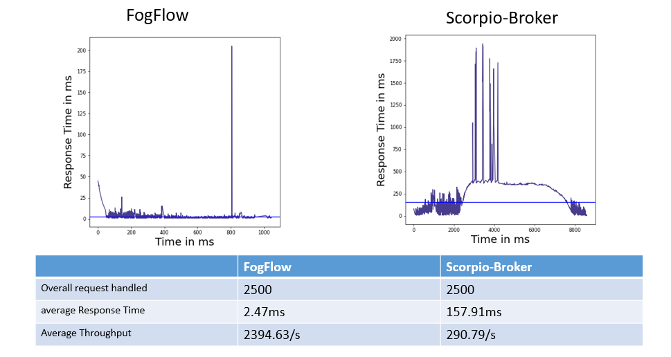

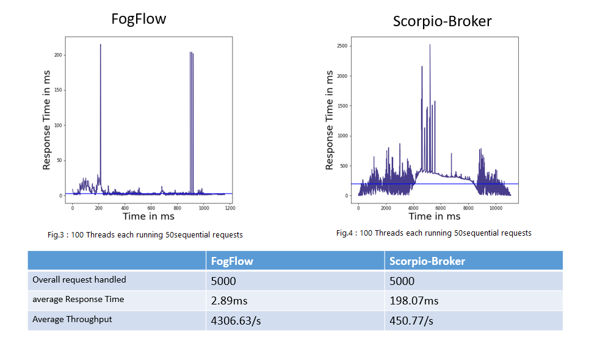

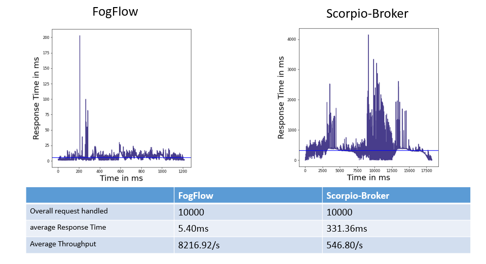

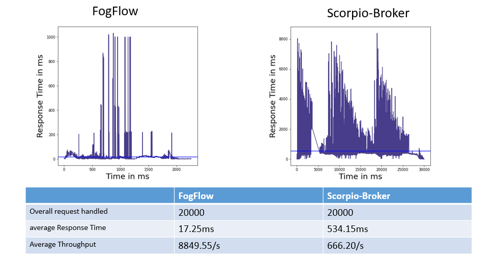

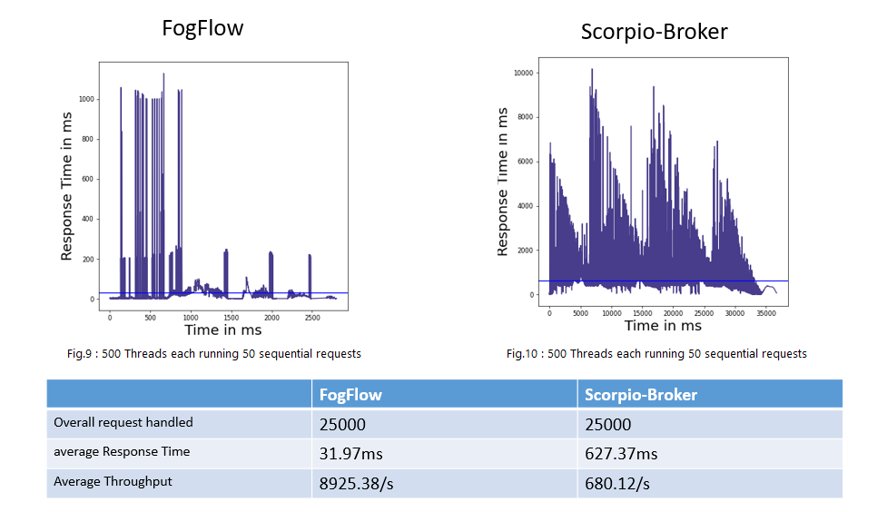

**Comparison Result** : The above graphs depicts comparison between two brokers i.e. the left graph represents Fogflow broker and right graph represents Scorpio broker. With a detailed analysis of the graphs based on response-time and timestamp, it is visible that Fogflow broker's Query API based on Subscription Id is a better performer than Scorpio broker's Query API based on Subscription Id. As shown in tabular data, it is evident that on increasing the number of threads which utlimately increases number of requests are better handled in case of Fogflow.

- *Image-1* corresponds to 50 threads (analogus to real time users) where each thread sends 50 requests
- *Image-2* corresponds to 100 threads (analogus to real time users) where each thread sends 50 requests
- *Image-3* corresponds to 200 threads (analogus to real time users) where each thread sends 50 requests
- *Image-4* corresponds to 400 threads (analogus to real time users) where each thread sends 50 requests
- *Image-5* corresponds to 500 threads (analogus to real time users) where each thread sends 50 requests

For example on executing 2500 requests, Fogflow has an average throughput of 2394.63/s and a mean response time of 2.47 ms whereas Scorpio broker on same number of requests has an average throughput of 290.79/s and mean response time of 157.91 ms. This shows that Fogflow is able to handle the requests in better and efficient manner with a greater throughput and lesser mean response time than Scorpio broker. Similarly, increasing the number of requests as shown in table below the graphs, it can be observed that the throughput increases because Fogflow mainatins an index for these Id's to fetch and display the details of entities in a quicker manner. For 25,000 requests, Fogflow gives a throughput of 8925.38/s  and mean response time of 31.97 ms whereas Scorpio gives a throughput of 680.12/s and mean response time of 627.37 ms. Overall fluctuations in response time for Fogflow and Scorpio broker is also a parameter that signifies the better performance of Fogflow when compared with Scorpio broker. Thus the data populated in table supports the analysis made on above graphs. Hence, Fogflow can handle larger simultaneous Subscription requests and perform good in such scenario.

*Hence Fogflow Query API is better in performance than Scorpio Broker Query API based on Subscription ID*

**Performance Enhancement by scaling up Fogflow with Multiple Edge Nodes - Fogflow Query API**

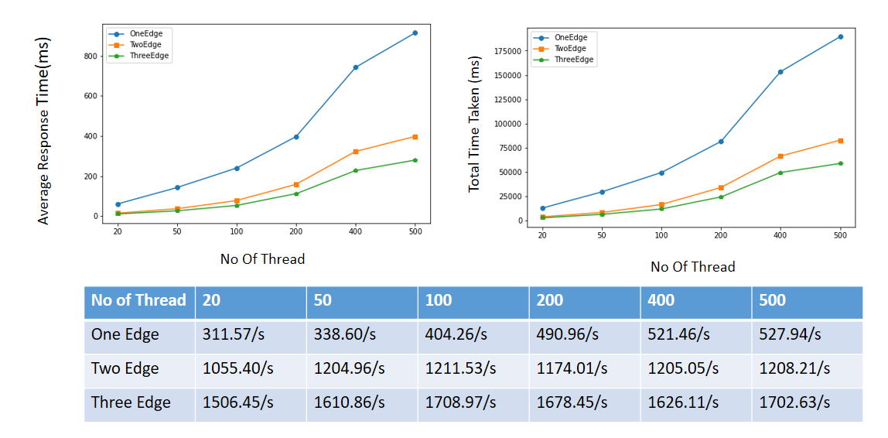

**Analysis of Graphs** : The above graphs are combination of three graphs i.e. the blue marker represents Fogflow single Edge node, orange marker represents Fogflow two Edge nodes and green marker represents three Edge nodes. With a detailed analysis of the response-time and number of thread graph, it is visible that Fogflow Single Edge node has a lower throughput. Further it can also be deduced that with the increase in number of edges the throughput increases. 

- *Image-1* corresponds to 50 threads (analogus to real time users) where each thread sends 200 requests
- *Image-2* corresponds to 100 threads (analogus to real time users) where each thread sends 200 requests
- *Image-3* corresponds to 200 threads (analogus to real time users) where each thread sends 200 requests
- *Image-4* corresponds to 400 threads (analogus to real time users) where each thread sends 200 requests
- *Image-5* corresponds to 500 threads (analogus to real time users) where each thread sends 200 requests

For example, the throughput for 20 threads (i.e. 4000 requests) in one Fogflow edge node is 311.57/s and the mean is 60.00 ms whereas for 500 threads(i.e. 1,00,000 requests) the throughput is 527.94/s and mean resposne time is 914.08 ms. Because of the fact that the increased number of edge brokers speed up the process because they all are interally connected to discovery evidently reflects in the graphs as well as the data populated in the above table. The requests made to edge node are registered with discovery directly than having to follow up a longer path through cloud broker. Thus, the Upsert API has an increased throughput on same number of thread as for multiple edge nodes. As shown in tabular data, the two edge node architecture achieves a throughput of 1055.40/s for 20 threads (i.e. 4000 requests) with a mean response time of 13.98 ms whereas for 500 threads (i.e. 1,00,000 requests) the throughput is 1208.21/s and mean response time is 397.58 ms. On further increasing the number of edge nodes i.e. within a three edge node architecture for 20 threads (i.e. 4000 requests) the acheived throughput is 1506.45/s and mean response time is 10. 01 ms whereas for 500 threads (i.e. 1,00,000 requests) the achieved throughput is 1702.46/s and mean response time of 279.17 ms. Hence, Fogflow can handle larger simultaneous Query requests and perform good in a scenario where number of edge nodes are increased.

*Hence Fogflow's Upsert API performs better on addition of new edge node in the architecture*

Update Propagation from Context Producers to Context Consumer
------------------------------------------------------------------

**To measure the delay of context update from the moment sent by a context producer to the time received by a subscriber**
*********************************************************************************************************************************
The architecture to measure the delay involves the fogflow system running in one network and the listner running in two variated networks:

**- Same Network**

This indicate that fogflow and the listner are both present in the same network and the delay is measured in accordance to that. With the possibility of receiving context update, there arise two more possibilties. One possibility is the case when the document used by fogflow is cached in the architecture and thus the dealy is affected accordingly. Other possibility being that the document is not cached within the network. With caching the performance is good and hence the result are as follows :
 
*1. If document is already cached then the notification is recieved in this interval : 181.192µs to 10.60s*

*2. If document is not cached then the notification is recieved in this interval of 3 seconds*

**- Different Network**

This indicate that fogflow and the listner are both present in the different network and the delay is measured in accordance to that. With the possibility of receiving context update, there arise two more possibilties. One possibility is the case when the document used by fogflow is cached in the architecture and thus the dealy is affected accordingly. Other possibility being that the document is not cached within the network. With caching the performance is good but because of separated network it is bit delayed and hence the result are as follows :
 
*1. If document is already cached then the notification is recieved in this interval : 2ms to 34ms*

*2. If document is not cached then the notification is recieved in this interval of 4 seconds*

**To measure how many updates can flow from the context producer to the subscriber per second**
*******************************************************************************************************

The Fogflow follows subscribe and publish architecture. The context consumer subscribes the Fogflow broker to receive notification regarding the data. So, if a subscription in Fogflow receives any updated entity  or newly create entity, it publishes that to the context subscriber in the form of notification payload. 

Thus the Fogflow system and subscribers exchange notifications as per availability of data and per second there is approx 25 to 35 notification received on an average.

**To compare the performance with the other NGSI-LD brokers**
********************************************************************

When Fogflow is compared with NGSI-LD broker it can be observed that they are difference in their performance. Say, for example when Fogflow is compared with Scorpio broker to examine the delay of received notification, there are two considerations. One states that the Scorpio broker and Listner can be in same network with a cached and non-cached document. Other states that Scorpio broker and Listner can be in different. 

**- Comparision between Fogflow and Scorpio broker : When either of brokers[Fogflow/Scorpio] and Listner are in same network**

This indicate that either of the broker and the listner are both present in the same network and the delay is measured in accordance to that. With the possibility of receiving context update, there arise two more possibilties. One possibility is the case when the document used by fogflow is cached in the architecture and thus the dealy is affected accordingly. Other possibility being that the document is not cached within the network. With caching the performance is good and hence the result are as follows :

.. figure:: figures/compare1.PNG

**- Comparision between Fogflow and Scorpio broker : When either of brokers[Fogflow/Scorpio] and Listner are in different network**

This indicate that either of the broker and the listner are both present in the different network and the delay is measured in accordance to that. With the possibility of receiving context update, there arise two more possibilties. One possibility is the case when the document used by fogflow is cached in the architecture and thus the dealy is affected accordingly. Other possibility being that the document is not cached within the network. With caching the performance is good but because of separated network it is bit delayed and hence the result are as follows :

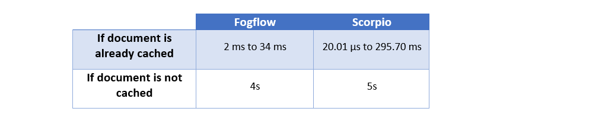

**To measure how many updates can flow from the Fogflow/Scorpio to the subscriber per second**

Either of brokers follows subscribe and publish architecture. The context consumer(subscriber) subscribes the Fogflow broker to receive notification regarding the data. So, if a subscription in either broker receives any updated entity  or newly create entity, it publishes that to the context subscriber in the form of notification payload. 

*The Fogflow system and subscribers exchange  25 to 35 notifications per second as per availability of data on an average*

*The Scorpio system and subscribers exchange  10 to 28 notifications per second as per availability of data on an average*
