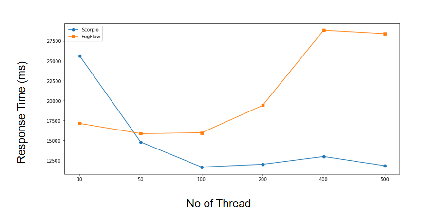
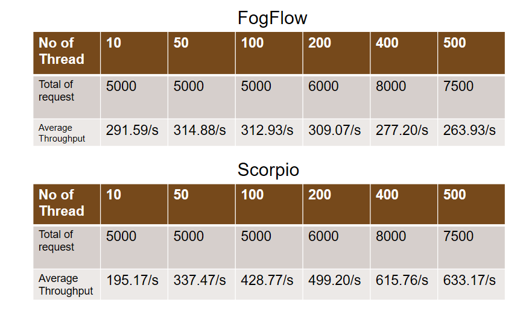
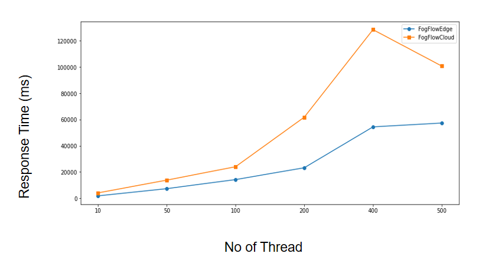
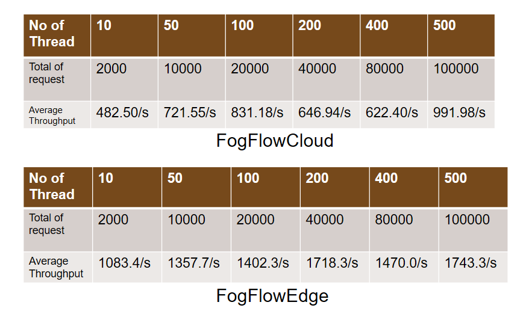
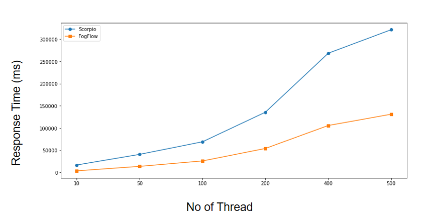
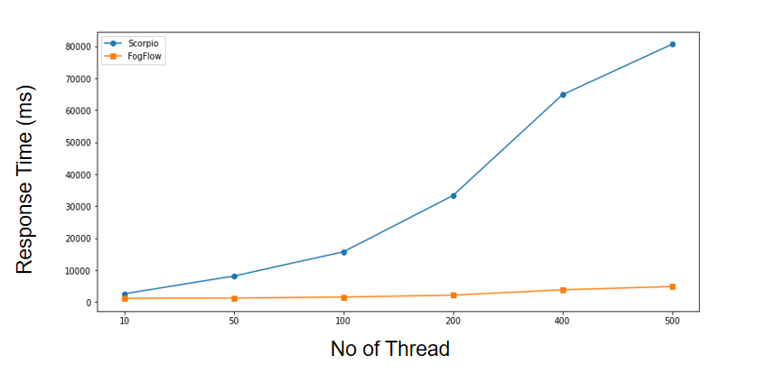
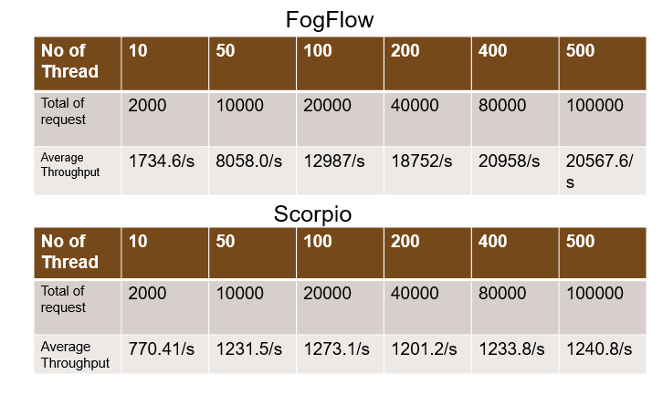
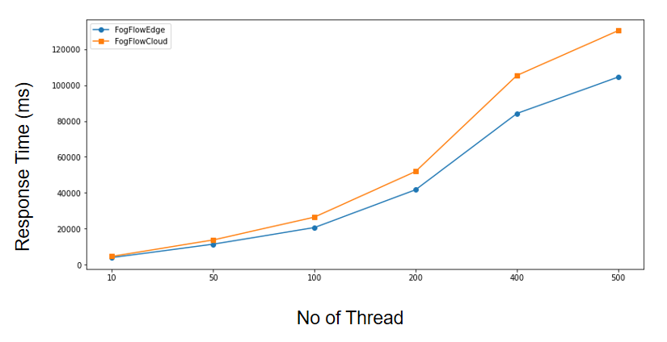
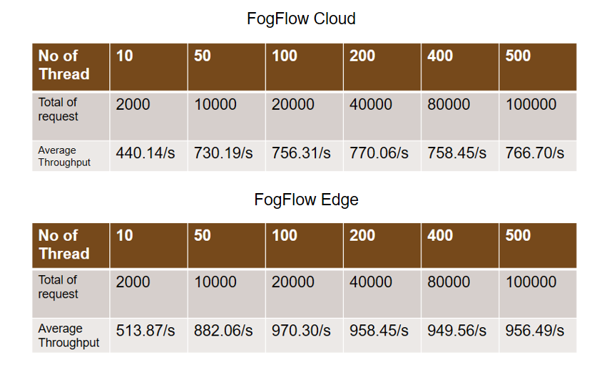

*****************************************
Performance Evaluation
*****************************************

Performance of NGSI-LD based thinBroker in FogFlow 
================================================================

This tutorial introduces the performace evaluation of NGSILD based context management systems of the FogFlow framework. The following analyses include the performance comparision of FogFlow broker with other NGSILD broker(orion broker, Scorpio Broker) on the basis of throughput (number of messages per second) and response time/message propagation latency.

Experiement Setup
-------------------

**FogFlow system:** To test the performance, FogFlow is deployed on one cloud node(4vCPUs, 16 GB RAM) and two edge node(4vCPUs, 8 GB RAM) in doker container.

**Listener client:** To measure the delay of context update from the moment sent by a context producer to the time received by a subscriber we are using listener client. Listener client is deployed on a VM(4cpu, 8GB RAM)

**Testing tool:** TO produce the test data for fogflow broker we are using Apache JMeter testing tool. JMeter is deployed on a VM(8cpu, 8GB RAM)

Throughput and latency to create new entities
--------------------------------------------------

**Create**

.. figure:: figures/imgUpsertCreate.png

.. figure:: figures/imgUpsertCreate2.png

**update**

.. figure:: figures/upsertUpdate1.png

.. figure:: figures/upsertUpdate2.png

**Subscription**

.. figure:: figures/Subcreate1.png

.. figure:: figures/subCreate2.png

Performance Comparison between Fogflow and Scorpio Broker
--------------------------------------------------------------

To compare response time of Fogflow upsert API with Scorpio Broker upsert API, we have created 36500 entities by using different no of thread 10, 50,100, 200, 400,500. The following graph repersent response time on Y-axis and no of thread on X-axis. 

**Fogflow Upsert API Vs. Scorpio Upsert API**

.. figure:: figures/com50.png

.. figure:: figures/com100.png

.. figure:: figures/com200.png

.. figure:: figures/com400.png

.. figure:: figures/com500.png

**Comparison Result** : The above graphs depicts comparison between two brokers i.e. the left graph represents Fogflow broker and right graph represents Scorpio broker. With a detailed analysis of the graphs based on response-time and timestamp, it is visible that Fogflow broker's Upsert API is a better performer than Scorpio broker's Upsert API. As shown in tabular data, it is evident that on increasing the number of threads which utlimately increases number of requests are better handled in case of Fogflow. For example on executing 5000 requests, Fogflow has an average throughput of 481.88/s whereas Scorpio broker on same number of requests has an average throughput of 119.97/s. Similarly, increasing the number of requests as shown in table below the graphs, it can be observed that the throughput increases. For 40,000 requests, Fogflow gives a throughput of 726.20/s whereas Scorpio gives a throughput of 116.77/s. Overall fluctuations in response time for Fogflow and Scorpio broker is also a parameter that signifies the better performance of Fogflow when compared with Scorpio broker. 

*Hence Fogflow Upsert API is better in performance than Scorpio Broker Upsert API*

**Fogflow Subscription API Vs. Scorpio Subscription API**

**Comparison Result** : The above graph is combination of two graphs i.e. the blue marker represents Scorpio broker and orange marker represents Fogflow. With a detailed analysis of the response-time and number of thread graph, it is visible that Fogflow broker's Subscription API is a better performer than Scorpio broker's Subscription API initially but gradually the graph of Fogflow rises which reflects the small increase in response time. Given the fact that fogflow subscriptions are interacting with fogflow component like fogflow discovery making it reliable but adding an extra tint of time in generating response gives it an edge over other brokers but trade's off quality over extra tint of response time. The reliability here is a key factor because of its distributed architecture that involves different edge nodes which is missing in scorpio btoker.

**Performance Enhancement by scaling up Fogflow with Multiple Edge Nodes - Fogflow Upsert API**

**Comparison Result** : The above graph is combination of two graphs i.e. the blue marker represents Fogflow Edge node and orange marker represents Fogflow cloud node. With a detailed analysis of the response-time and number of thread graph, it is visible that Fogflow cloud node has a higher response time than Fogflow edge node because of the fact that the increased number of edge brokers speed up the process because they all are interally connected to discovery. The requests made to edge node are registered with discovery directly than having to follow up a longer path through cloud broker. Thus, the Upsert API has an increased throughput on same number of thread as for cloud. As shown in tabular data, the cloud achieves a throughput of 991.98/s for 1,00,000 requests with 500 number of threads and edge node achieves 1743.3/s for same 1,00,000 requests for 500 number of threads.

Throughput and latency to query entities
--------------------------------------------------
To compare response time of Fogflow Query API with Scorpio Broker Query API, we have created 1,00,000 entities by using different no of thread 10, 50,100, 200, 400,500. The following graph repersent response time on Y-axis and no of thread on X-axis. 

**Fogflow Query API Vs. Scorpio Query API - Query based on Entity ID**

.. figure:: figures/2.1IDData.png

**Comparison Result** : The above graph is combination of two graphs i.e. the blue marker represents Scorpio broker and orange marker represents Fogflow. With a detailed analysis of the response-time and number of thread graph, it is visible that Fogflow broker's Query API based on entity ID is a better performer than Scorpio broker's Query API based on entity ID. As shown in tabular data, it is evident that on icreasing the number of threads which utlimately increases number of requests are better handled in case of Fogflow. For example on executing 500 threads with a sum total of 1,00,000 requests, Fogflow has an average throughput of 762.7/s whereas Scorpio broker on same number of thread has an average throughput of 311.22/s.

*Hence Fogflow Query API is better in performance than Scorpio Broker Query API based on entity ID*

**Fogflow Query API Vs. Scorpio Query API - Query based on Subscription ID**

**Comparison Result** : The above graph is combination of two graphs i.e. the blue marker represents Scorpio broker and orange marker represents Fogflow. With a detailed analysis of the response-time and number of thread graph, it is visible that Fogflow broker's Query API based on subscription ID is a far better performer than Scorpio broker's Query API based on subscription ID. As shown in tabular data, it is evident that on icreasing the number of threads which utlimately increases number of requests are better handled in case of Fogflow. For example on executing 500 threads with a sum total of 1,00,000 requests, Fogflow has an average throughput of 20567.6/s whereas Scorpio broker on same number of thread has an average throughput of 1240.8/s.

*Hence, Fogflow Query API is far better in performance than Scorpio Broker Query API based on subscription ID*

**Performance Enhancement by scaling up Fogflow with Multiple Edge Nodes - Fogflow Query API**

**Comparison Result** : The above graph is combination of two graphs i.e. the blue marker represents Fogflow Edge node and orange marker represents Fogflow cloud node. With a detailed analysis of the response-time and number of thread graph, it is visible that Fogflow cloud node has a higher response time than Fogflow edge node because of the fact that the increased number of edge brokers speed up the process because they all are having the entities locally which are fetched. The requests made to edge node are directly responding with the entity details than having to follow up a longer path through cloud broker. Thus, the Query API has an increased throughput on same number of thread as for cloud. As shown in tabular data, the cloud achieves a throughput of 766.70/s for 1,00,000 requests with 500 number of threads and edge node achieves 956.49/s for same 1,00,000 requests for 500 number of threads.

Update Propagation from Context Producers to Context Consumer
------------------------------------------------------------------

to measure the delay of context update from the moment sent by a context producer to the time received by a subscriber

to measure how many updates can flow from the context producer to the subscriber per second

to compare the performance with the other NGSI-LD brokers

to test how the performance can be scaled up with more subscribers

