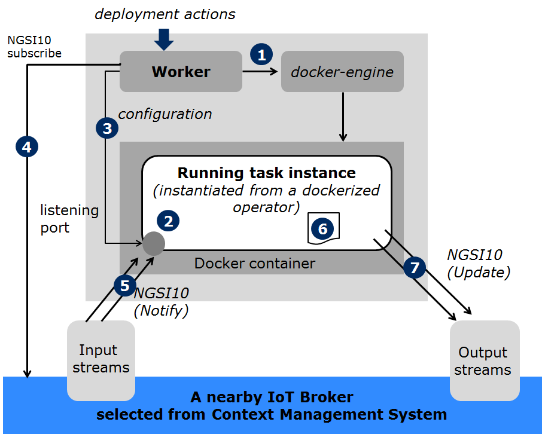

.. _flow-task:

*****************************************
Context-driven data flows
*****************************************

In FogFlow each worker is an agent to perform the following two type of deployment actions assigned by Topology Master. 

- start/terminate a task instance
- add/remove an input stream to an existing running task instance

For example, each worker takes the following steps to start a task instance. 

#. the worker asks its local docker engine to create a new container for running the new task instance with a specified listening port number

#. the task instance starts to run and listening on the given port number to receive input data streams

#. the worker sends a configuration object to the running task instance via its listening port

#. the worker issues NGSI10 subscriptions on behalf of the running task instance 

#. the required input data streams flow into the running task instance for further processing via its listening port

#. the running task instance processes the received input stream data and then generate its result

#. the running task instance publishes the generated result as its output by sending NGSI10 updates

