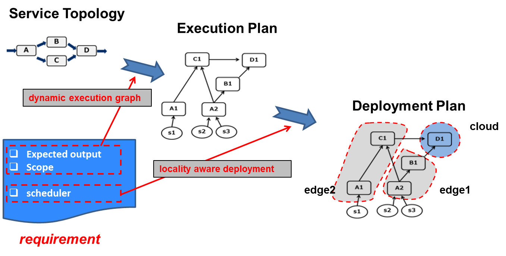

*****************************************
Edge programming models
*****************************************

Currently the following two programing models are provided by FogFlow to support different types of workload patterns.

Service Topology
==================================

The first workload pattern is to trigger necessary processing flows to produce some output data 
only when the output data are requested by consumers. 
To define an IoT service based on this pattern, 
the service provider needs to define a service topology, 
which consists of a set of linked operators and each operator is annotated with a specific granularity. 
The granularity of an operator will be taken into account 
by FogFlow to decide how many task instances of such an operator should be instantiated based on the available data. 

A service topology must be triggered explicitly by a requirement object issued by a consumer or any application. 
The requirement object defines which part of processing logic in the defined service topology needs to be triggered 
and it can also optionally define a specific geo-scope to filter out data sources 
for applying the triggered processing logic.

Fog Function
==================================

The second workload pattern is designed for the scenario in which service designers 
do not a-priori know the exact sequence of stream processing steps. 
Instead they can define a fog function to include a specific operator for handling a given type of information. 
FogFlow can then create the graph of processing flows based on this description of all fog functions. 
Different from service topology, a fog function is a very simple topology 
with only one operator and it is triggered when its input data become available. 
As FogFlow can automatically chain different fog functions as well as allow 
more than one fog functions to handle a new data item, 
a constantly changing execution graph can be automatically triggered and managed 
by the FogFlow runtime as data arrive and disappear. 
From the design perspective, fog func-tion is more flexible than service topology, 
because the overall processing logic of an IoT service can be easily changed over time 
by adding or removing fog functions when the service processing logic needs to modify for new business requirements. 
With the fog function programming model, FogFlow can support serverless computing for a cloud-edge based environment. 

.. figure:: figures/function-orchestration.png
   :width: 100 %

