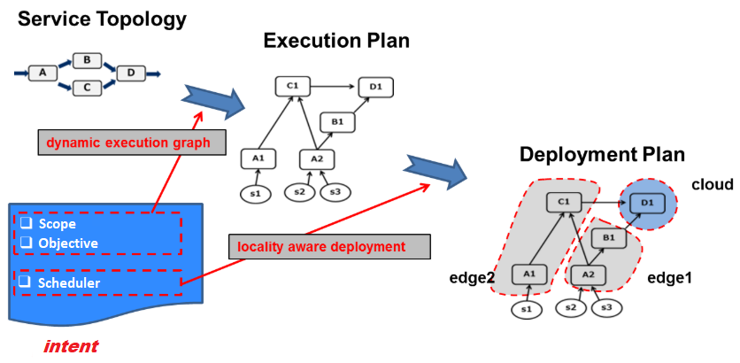
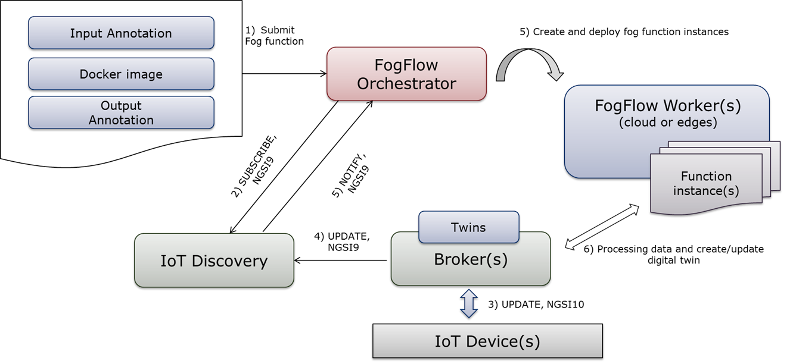
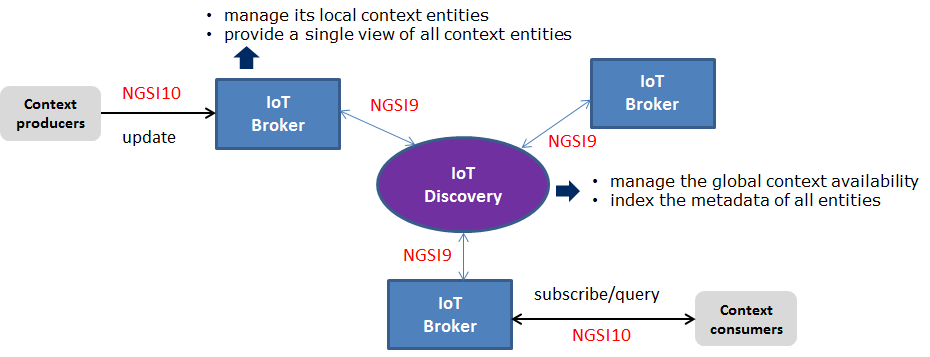

***********************************
Programming Model
***********************************

Intent-based programming model
===================================

Currently the following two programing models are provided by FogFlow to support different types of workload patterns.

Service Topology
----------------------

The first workload pattern is to trigger necessary processing flows to produce some output data 
only when the output data are requested by consumers. 
To define an IoT service based on this pattern, 
the service provider needs to define a service topology, 
which consists of a set of linked operators and each operator is annotated with a specific granularity. 
The granularity of an operator will be taken into account 
by FogFlow to decide how many task instances of such an operator should be instantiated based on the available data. 

A service topology must be triggered explicitly by an intent object issued by a consumer or any application. 
The intent object defines when (based on priority) a service topology needs to be triggered 
and it can also optionally define a specific geo-scope to filter out data sources for applying the triggered processing logic. The Part of service topology that meets the intent conditions and has input data available, will be triggered.

Fog Function
--------------------

The second workload pattern is designed for the scenario in which service designers 
do not a-priori know the exact sequence of stream processing steps. 
Instead they can define a fog function to include a specific operator for handling a given type of information. 
FogFlow can then create the graph of processing flows based on this description of all fog functions. 
Different from service topology, a fog function is a very simple topology 
with only one operator and it is triggered when its input data become available. 
As FogFlow can automatically chain different fog functions as well as allow 
more than one fog functions to handle a new data item, 
a constantly changing execution graph can be automatically triggered and managed 
by the FogFlow runtime as data arrive and disappear. 
From the design perspective, fog function is more flexible than service topology, 
because the overall processing logic of an IoT service can be easily changed over time 
by adding or removing fog functions when the service processing logic needs to modify for new business requirements. 
With the fog function programming model, FogFlow can support serverless computing for a cloud-edge based environment. 

Context-driven service orchestration
=======================================

Distributed context management
-----------------------------------

The context management system is designed to provide a global view for all system components and running task instances 
to query, subscribe, and update context entities via the unified data model and the communication protocol *NGSI*. 
It plays a very important role to support the standard-based edge programming model in FogFlow. 
As compared to other existing brokers like MQTT-based Mosquitto or Apache Kafka, 
the distributed context management system in FogFlow has the following features: 

* separating context availability and context entity
* providing separated and standardized interfaces to manage both context data (via NGSI10) and context availability (via NGSI9). 
* supporting not only ID-based and topic-based query and subscription but also geoscope-based query and subscription

As illustrated by the following figure, in FogFlow a large number of distributed IoT Brokers work in parallel
under the coordination a global and centralized IoT Discovery. 

IoT Discovery
---------------
The centralized IoT Discovery provides a global view of context availability of context data and provides NGSI9 interfaces for registration, discovery, and subscription of context availability. 

IoT Broker
------------
The IoT Broker in Fogflow is very light-weight, because it keeps only the lastest value of each context entity
and saves each entity data directly in the system memory. 
This brings high throughput and low latency for the data transfer from context produers to context consumers. 

Each IoT Broker manages a portion of the context data and registers data to the shared IoT Discovery.
However, all IoT Brokers can equally provide any requested context entity via NGSI10 
because they can find out which IoT Broker provides the entity through the shared IoT Discovery and then fetch the entity from that remote IoT Broker. 

