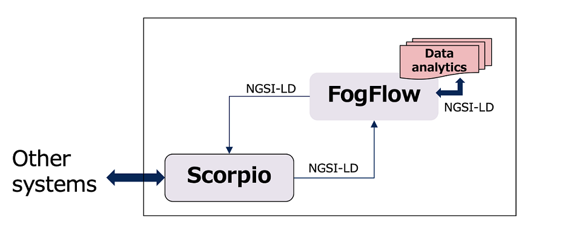

Using NGSI-LD speciifcation implementation 
===============================================
Scorpio integration with FogFLow enable FogFlow task to communicate with scorpio Broker.
The figure below shows how data will transmit between socrpio broker, FogFlow broker and FogFlow task.

Integration steps
===============================================
**Pre-Requisites:**

* Fogflow should be up and running with atleast one node.
* Scorpio Broker should be up and running.
* Create and trigger NGSI-LD task (`See Document`_).
.. _`See Document`: https://fogflow.readthedocs.io/en/latest/intent_based_program.html.

**There are two type of Itegration**

**TYPE 1**

* NGSI-LD device will sends some update to scopio broker.
* FoFlow Will subscribe to scorpio Broker to get notification for every update.
* FogFlow Task will subscriber to FogFlow to get notification for furthur analysis.

**Subscrioption request for Scorpio Broker**

.. code-block:: console

    curl -iX POST \
    'http://<Scorpio Broker>/ngsi-ld/v1/subscriptions/' \
      -H 'Content-Type: application/ld+json' \
      -H 'Accept: application/ld+json' \
      -H 'Link: <{{link}}>; rel="https://uri.etsi.org/ngsi-ld/v1/ngsi-ld-core-context.jsonld"; type="application/ld+json"' \
      -d '
      {
         "type": "Subscription",
         "entities": [{
                "id" : "urn:ngsi-ld:Vehicle:A13",
                "type": "Vehicle"
           }],
          "watchedAttributes": ["*"],
          "notification": {
                 "attributes": ["*"],
                  "format": "keyValues",
                 "endpoint": {
                        "uri": "http://<FogFLow Broker>/ngsi-ld/v1/notifyContext/",
                        "accept": "application/json"
                }
         }
    }'

**Entity create request for Scorpio Broker**

.. code-block:: console

     curl -iX POST \
    'http://<Scorpio Broker>/ngsi-ld/v1/entities/' \
     -H 'Content-Type: application/ld+json' \
     -H 'Accept: application/ld+json' \
     -H 'Link: <{{link}}>; rel="https://uri.etsi.org/ngsi-ld/v1/ngsi-ld-core-context.jsonld"; type="application/ld+json"' \
    -d '
        {
         "id": "urn:ngsi-ld:Vehicle:A13",
         "type": "Vehicle",
             "brandName": {
                  "type": "Property",
                  "value": "BMW",
                  "observedAt": "2017-07-29T12:00:04"
                },
                 "isParked": {
                   "type": "Relationship",
                   "object": "urn:ngsi-ld:OffStreetParking:Downtown",
                   "observedAt": "2017-07-29T12:00:04",
                    "providedBy": {
                        "type": "Relationship",
                        "object": "urn:ngsi-ld:Person:Bob"
                     },
        "location": {
                "type": "GeoProperty",
                "value": {
                        "type": "Point",
                        "coordinates": [-8.5, 41.2]
                }
        }
}'

    
    
**Entity update request for Scorpio Broker**

.. code-block:: console

    curl -iX PATCH \
    'http://<Scorpio Broker>/ngsi-ld/v1/entities/urn:ngsi-ld:Vehicle:A13/attrs' \
      -H 'Content-Type: application/ld+json' \
      -H 'Accept: application/ld+json' \
      -H 'Link: <{{link}}>; rel="https://uri.etsi.org/ngsi-ld/v1/ngsi-ld-core-context.jsonld"; type="application/ld+json"' \
      -d '
     {
	"brandName": {
		"type": "Property",
        "value" : "BM2"
	}
}'

**Type 2**

* FogFlow task will publish NGSI-LD to the FogFlow broker.
* Scorpio broker will subscribe to the FogFlow broker to get the notification form FogFlow broker.

.. code-block:: console

    curl -iX POST \
    'http://<FogFlow Broker>/ngsi-ld/v1/subscriptions/' \
      -H 'Content-Type: application/ld+json' \
      -H 'Accept: application/ld+json' \
      -H 'Link: <{{link}}>; rel="https://uri.etsi.org/ngsi-ld/v1/ngsi-ld-core-context.jsonld"; type="application/ld+json"' \
      -d '
      {
         "type": "Subscription",
         "entities": [{
                "id" : "urn:ngsi-ld:Vehicle:A13",
                "type": "Vehicle"
           }],
          "watchedAttributes": [],
          "notification": {
                 "attributes": [],
                  "format": "keyValues",
                 "endpoint": {
                        "uri": "http://<Scorpio Broker>/notifyContext",
                        "accept": "application/json"
                }
         }
    }'
