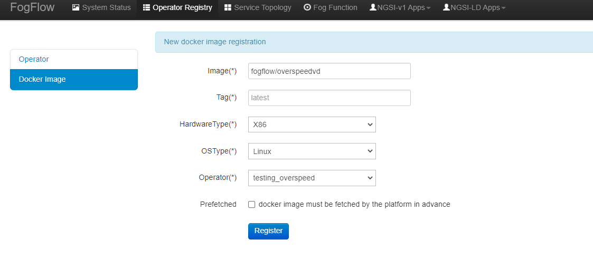

*****************************************
Integrate FogFlow with Other NGSI-LD Broker
*****************************************

This tutorial introduces how FogFlow could be utilized as an advanced data analytics framework to enable on-demand data analytics
on top of the raw data captured in the NGSI-LD brokers, such as Scorpio, Orion-LD, and Stellio. 
The following diagram shows a simple example of how to do this in details, mainly including
three aspects with 7 steps

* how to fetch some raw data from an NGSI-LD broker into the FogFlow system (**Step 1-3**)
* how to use the serverless function in FogFlow to do customized data analytics (**Step 4**)
* how to push the generate analytics results back to the NGSI-LD broker for further sharing (**Step 5-7**)
 

.. figure:: figures/fogflow-ngsild-broker.png

Before looking into the detailed steps, please set up a FogFlow system and 
an NGSI-LD broker according to the following information. 

First, please refer  `FogFlow on a Single Machine`_ to set up a FogFlow system on a single host machine 

.. _`FogFlow on a Single Machine`: https://fogflow.readthedocs.io/en/latest/onepage.html

In terms of the NGSI-LD broker, there are different choices (Scorpio, Orion-LD, Stellio). Let’s take Orion-LD as a concrete example to show the detailed steps. Please refer following steps to set up a Orion-LD broker on same host machine. The integration with other brokers (e.g., Scorpio, Stellio) will require some small changes to the port number in the requests and some configuration changes.

.. code-block:: console

	# fetch the docker-compose file  of Orion-LD 
	wget https://raw.githubusercontent.com/smartfog/fogflow/master/test/orion-ld/docker-compose.yml
	
	# start the orion-ld broker
	docker-compose pull
	docker-compose up -d 

Before you start the following steps, please check if your Orion-LD broker and FogFlow system is running properly. 

# check if the orion-ld broker is running

.. code-block:: console

	curl localhost:1026/ngsi-ld/ex/v1/version

# check if the FogFlow system is running properly
	
	Check the system status from the FogFlow DashBoard

	You can open the FogFlow dashboard in your web browser to see the current system status via the URL: localhost:80
	
	Once you are able to access the FogFlow dashboard, you can see the following web page

.. figure:: figures/dashboard.png

	

How to Fetch data from Orion-LD to FogFlow 
================================================================

**Step 1**: Issue a subscription to Orion-LD broker. 

.. code-block:: console    

	curl -iX POST \
		  'http://localhost:1026/ngsi-ld/v1/subscriptions' \
		  -H 'Content-Type: application/json' \
		  -H 'Accept: application/ld+json' \
		  -H 'Link: <https://uri.etsi.org/ngsi-ld/v1/ngsi-ld-core-context.jsonld>; rel="https://uri.etsi.org/ngsi-ld/v1/ngsi-ld-core-context.jsonld"; type="application/ld+json"' \
		  -d ' {
                 	"type": "Subscription",
                	"entities": [{
                               "type": "Vehicle"
                 	}],
             	      "notification": {
                          "format": "normalized",
                          "endpoint": {
                                   "uri": "http://<fogflow_broker_IP>:8070/ngsi-ld/v1/notifyContext/",
                                   "accept": "application/ld+json"
             	           }
                       }
 	           }'

Note: Replace the localhost with IP where Orion-LD broker is running and <fogflow_broker_IP> with the IP where the fogflow broker is running.

**Step 2**: Send an entity update to Orion-Ld broker.

.. code-block:: console

	curl -iX POST \
		'http://localhost:1026/ngsi-ld/v1/entityOperations/upsert' \
		-H 'Content-Type: application/json' \
		-H 'Accept: application/ld+json' \
		-H 'Link: <https://uri.etsi.org/ngsi-ld/v1/ngsi-ld-core-context.jsonld>; rel="https://uri.etsi.org/ngsi-ld/v1/ngsi-ld-core-context.jsonld"; type="application/ld+json"' \

		-d '
		[
		{
   			"id": "urn:ngsi-ld:Vehicle:A106",
   			"type": "Vehicle",
   			"brandName": {
                		"type": "Property",
                 		 "value": "Mercedes"
    			},
    			"isParked": {
                  		"type": "Relationship",
                  		"object": "urn:ngsi-ld:OffStreetParking:Downtown1",
                  		"providedBy": {
                                	  "type": "Relationship",
                                  	  "object": "urn:ngsi-ld:Person:Bob"
                   		 }		
    			 },
     			"speed": {
                		"type": "Property",
                		"value": 120
     			 },
     			"location": {
                    		"type": "GeoProperty",
                    		"value": {
                              		"type": "Point",
                             		 "coordinates": [-8.5, 41.2]
                   		  }
    			  }
		}
		]'

Note: Replace localhost with the IP where Orion-LD broker is running.

**Step 3**: Check if FogFlow receives the subscribed entity. 

Use the CURL command to query entities of type "Vehicle" from  FogFlow thinBroker. 

.. code-block:: console    

	curl -iX GET \
		  'http://localhost:8070/ngsi-ld/v1/entities?type=Vehicle' \
		  -H 'Content-Type: application/json' \
		  -H 'Accept: application/ld+json' \
		  -H 'Link: <https://uri.etsi.org/ngsi-ld/v1/ngsi-ld-core-context.jsonld>; rel="https://uri.etsi.org/ngsi-ld/v1/ngsi-ld-core-context.jsonld"; type="application/ld+json"' \

Note: Replace localhost with the IP where fogflow thinbroker is running.

How to Program and Apply a Data Analytics Function 
================================================================

**Step 4**: Please refer the steps below, to register fogfunction using dashboard.

1. To register Operator, open fogflow dashboard. Select Operator Registry Tab from horizontal bar, select operator from menu on left and then click register button. Right click on workspace and select operator from drop down list and enter details as shown and at last click on submit.

.. figure:: figures/operator_creation.png 

2. Register the following docker image, corresponding to the operator created in above step.
   
   
.. code-block:: console

	fogflow/overspeedvd
   
  	The above operator will notify Fogflow, When speed of a vehicle goes beyond 50.

   	To register the image, select DockerImage from left menu, under Operator Registry from dashboard and click register button.

3. Now, to create a fogfunction, toggle on Fog Function in the horizontal bar on dashboard. select Fog Function from left menu and click register button. Enter the name and description (optional) as shown. Right click in the workspace and select task and Entity stream from drop down list and configure details.

.. figure:: figures/fog_function_creation.png

Note: For a details on fogfunction creation follow the `Document link`_ .
 
.. _`Document link`: https://fogflow.readthedocs.io/en/latest/intent_based_program.html

How to Push the Generated Result back to the NGSI-LD broker 
=============================================================

**Step 5**: Fog Function do some data analytics in step no. 4 and publish the analytics result on fogflow broker. NGSILD broker  subscribes fogFlow broker for getting the analytics result.

.. code-block:: console

        curl -iX POST \
                  'http://localhost:8070/ngsi-ld/v1/subscriptions/' \
                  -H 'Content-Type: application/json' \
		  -H 'Integration: NGSILDBroker' \
                  -H 'Accept: application/ld+json' \
                  -H 'Link: <https://uri.etsi.org/ngsi-ld/v1/ngsi-ld-core-context.jsonld>; rel="https://uri.etsi.org/ngsi-ld/v1/ngsi-ld-core-context.jsonld"; type="application/ld+json"' \

                  -d ' {
                        "type": "Subscription",
                        "entities": [{
			       "id": "urn:ngsi-ld:Vehicle:A106daresult",
                               "type": "daresult"
                        }],
                      "notification": {
                          "format": "normalized",
                          "endpoint": {
                                   "uri": "http://<orion-ld-brokerIP>:1026",
                                   "accept": "application/ld+json"
                           }
                       }
                   }'

Note: Replace localhost with IP where Fogflow thinbroker is running and <orion-ld-brokerIP> with IP where orion-ld broker is running.
 
**Step 6**:Thinbroker will notify the analytical data to NGSILD broker as in step No 5, NGSI-LD broker has subscribed for the analytical data.

**Step 7**:Use the CURL command to query entities of type "daresult" from NGSILD broker.

.. code-block:: console

        curl -iX GET \
                  'http://localhost:1026/ngsi-ld/v1/entities?type=daresult' \
                  -H 'Content-Type: application/json' \
                  -H 'Accept: application/ld+json' \
                  -H 'Link: <https://uri.etsi.org/ngsi-ld/v1/ngsi-ld-core-context.jsonld>; rel="https://uri.etsi.org/ngsi-ld/v1/ngsi-ld-core-context.jsonld"; type="application/ld+json"' \

