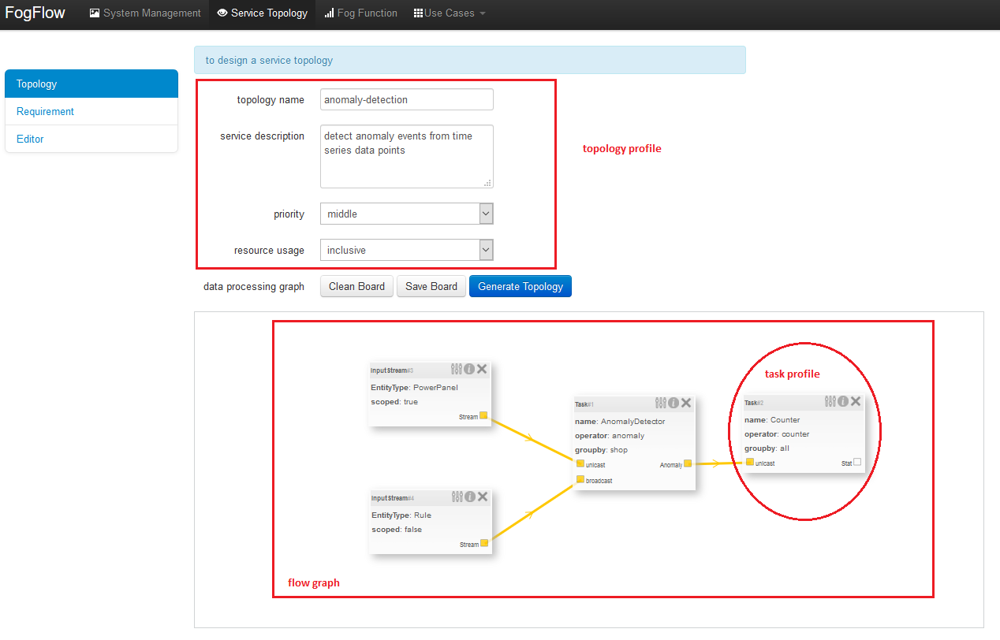
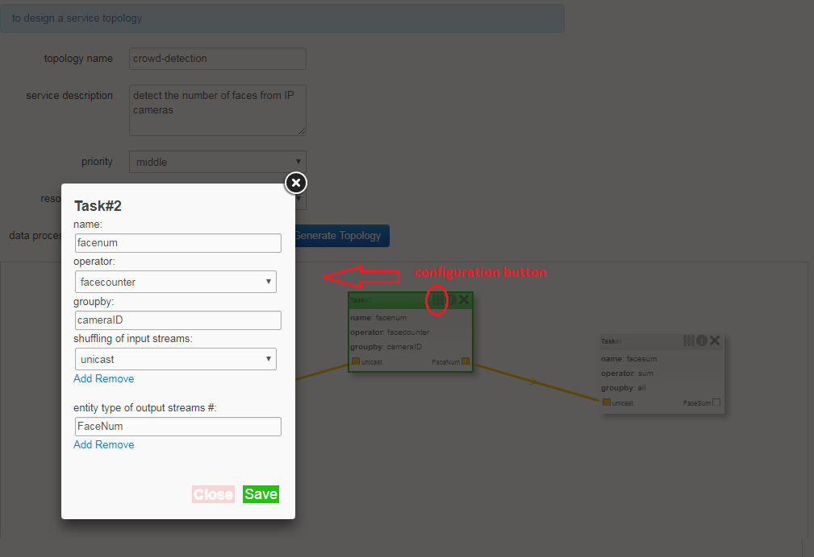

Service topology
====================================================

The FogFlow programming model defines the way of how to specify a *service topology* 
using *declarative hints* and how to implement tasks based on NGSI. 
First, developers decompose an IoT service into multiple tasks and then define its service topology 
as a DAG in JSON format to express the data dependencies between different tasks. 
On the other hand, the FogFlow programming model provides declarative hints for developers 
to guide service orchestration without introducing much complexity.

The following concepts are required to understand the FogFlow programming model. 

A service topology presents the decomposited data processing logic of a service application. 
Decomposting the entire service application logic into small data processing tasks
allows FogFlow to dynamically and seamlessly migrate data processing tasks between the cloud and edges. 
It also enables better sharing of intermediate results. 

Each service topology is represented as a directed acyclic graph (DAG) of multiple linked tasks, 
with the following properties: 

* description: a text to describe what this service topology is about
* name: a unique name of this service topology
* priority: the task priority of this service topology 
* tasks: the list of its tasks

Requirement

Once developers submit a specified service topology and the implemented operators, 
the service data processing logic can be triggered on demand by a high level processing requirement. 
The processing requirement is sent as NGSI10 update, with the following properties: 

* topology: which topology to trigger
* expected output: the output stream type expected by external subscribers
* scope: a defined geoscope for the area where input streams should be selected
* scheduler: which type of scheduling method should be chosen by Topology Master for task assignment

Currently, FogFlow provides the following two ways for service developers to specify and register a service topology. 

Define and register a service topology via FogFlow Task Designer
-----------------------------------------------------------------

The following picture shows the graphical user interface to specify a service topology. 

As seen in the picture, the following important information must be provided. 

#. define topology profile, including

	* topology name: the unique name of your topology
	* service description: some text to describe what this service is about
	* priority: define the priority level of all tasks in your topology, which will be utilized by edge nodes to decide how resource should be assigned to tasks 
	* resource usage: define if the tasks in this topology can use the resources on edge nodes in an exclusive way, meaning that not sharing resources with any task from the other topologies

#. draw the graph of data processing flows within the service topology

	With a right click at some place of the design board, you will see a memu pops up 
	and then you can start to choose either task or input streams 
	to define your data processing flows according to the design you had in mind. 

#. define Task Profile for each task in the data flow, including

	As shown in the following picture, you can start to specify the profile of each task in the data processing flow
	by clicking the configuration button. The following information is required to specify a task profile. 
	
	* name: the name of the task 
	* operator: the name of the operator that implements the data processing logic of this task; please register your operator beforehand so that it can be shown from the list. 
	* groupby: to determine how many instances of this task should be created on the fly; currently including the following cases: 
	
		- if ther is only one instance to be created for this task, please use "groupby" = "all"
		- if you need to create one instance for each entity ID of the input streams, please user "groupby" = "entityID"
		- if you need to create one instance for each unique value of some specific context metadata, please use the name of this registered context metadata
	
	* shuffling of input streams: to indicate how the input stream should be assigned to the instance(s) of this task during the runtime, including the following two cases: 
	
		- "shuffling" = "broadcast": the selected input streams should be repeatedly assigned to every task instance of this operator
		- "shuffling" = "unicast": each of the selected input streams should be assigned to a specific task instance only once	
	
	* entity type of output streams: to specify the entity type of the produced output stream

Define and register a service topology programmatically by sending a NGSI update 
---------------------------------------------------------------------------------

You can also register a service topology by sending a constructed NGSI update message to the IoT Broker deployed in the cloud. 

Here is a Javascript-based code example to register an operator docker image. 
Within this code example, we use the Javascript-based library to interact with FogFlow IoT Broker. 
You can find out the library from the github code repository (designer/public/lib/ngsi). You must include ngsiclient.js into your web page. 

.. code-block:: javascript

	var topology = {  
	   "description":"detect anomaly events from time series data points",
	   "name":"anomaly-detection",
	   "priority": {
	        "exclusive": false,
	        "level": 100
	   },
	   "trigger": "on-demand",   
	   "tasks":[  
	      {  
	         "name":"AnomalyDetector",
	         "operator":"anomaly",
	         "groupBy":"shop",
	         "input_streams":[  
	            {  
	              	"type": "PowerPanel",
	                "shuffling": "unicast",
	              	"scoped": true
	            },
	            {  
	              	"type": "Rule",
	                "shuffling": "broadcast",
	              	"scoped": false               
	            }                       
	         ],
	         "output_streams":[  
	            {  
	               "type":"Anomaly"
	            }
	         ]
	      },
	      {  
	         "name":"Counter",
	         "operator":"counter",
	         "groupBy":"*",
	         "input_streams":[  
	            {  
	               "type":"Anomaly",
	               "shuffling": "unicast",
	               "scoped": true               
	            }           
	         ],
	         "output_streams":[  
	            {  
	               "type":"Stat"
	            }
	         ]
	      }	      
	   ]
	}
	

Given a service topology object defined as above, here is the Javascript-based code example to register a service topology object. 

.. code-block:: javascript

    var topologyCtxObj = {};
    
    topologyCtxObj.entityId = {
        id : 'Topology.' + topology.name, 
        type: topology.name,
        isPattern: false
    };
    
    topologyCtxObj.attributes = {};   
    topologyCtxObj.attributes.status = {type: 'string', value: 'enabled'};
    topologyCtxObj.attributes.template = {type: 'object', value: topology};    
    
	// assume the config.brokerURL is the IP of cloud IoT Broker
    var client = new NGSI10Client(config.brokerURL);	

	// send NGSI10 update	
    client.updateContext(topologyCtxObj).then( function(data) {
        console.log(data);                
    }).catch( function(error) {
        console.log('failed to submit the topology');
    });