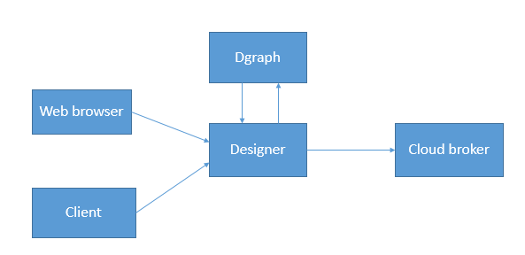

.. _cloud-setup:

*****************************************
System Setup
*****************************************

System Overview
======================

FogFlow is a distributed execution framework to support dynamic processing flows over cloud and edges. It can dynamically and 
automatically composite multiple NGSI-based data processing tasks to form high level IoT services and then orchestrate and optimize 
the deployment of those services within a shared cloud-edge environment.

The shared environment of FogFlow cloud-edge can be created with one FogFlow cloud node and more than one FogFlow edge nodes as
illustrated in below figure. All integrated features that are running in FogFlow system, can be seen in this figure. 

.. figure:: figures/FogFlow_System_Design.png

FogFlow is now supporting graph database to store internal entity data for later use. In FogFlow system, the interaction point of graph database is designer.
So FogFlow entity that create either by FogFlow web browser or via any other client such as curl or python client,
the entity creation request directly goes to Designer. Then Designer will send this entity request on cloud broker to 
register the entity and at the same time Designer will send this data on DGraph to store it into database.

Whenever FogFlow system will restart, Designer will trigger a query request to DGraph and get all the stored entities
from DGraph then send these entities to cloud broker to register them.

.. note:: FogFlow Designer is dependent on Discovery and Cloud Broker.

The integration of FogFlow Designer and DGraph is done via gRPC, where a Dgraph client is implemented with Designer server as in below code
using gRPC. Default port of gRPC is 9080, in FogFlow 9082 port is used.

.. code-block:: console

   /*
   creating grpc client for making connection with dgraph
   */
   function newClientStub() {
       return new dgraph.DgraphClientStub(config.HostIp+":"+config.grpcPort, grpc.credentials.createInsecure());
   }

   // Create a client.
   function newClient(clientStub) {
      return new dgraph.DgraphClient(clientStub);
   }
   
   
Whenever new FogFlow entity gets created by web browser the request goes to designer or user directly creates entity on designer using any client. Then designer perform two tasks:

1. Send request to cloud broker to register the entity.

2. Calls DGraph client to store entity data, the DGraph client will create a connection with dgraph server after that create schema and then send data to DGraph. Apart from this, one another flow will be triggered from designer when FogFlow system will restart. In this flow designer will query all stored entity data from DGraph and forward to cloud broker for registering these entites.

Below the glimpse of code to create schema and insert data into DGraph.

.. code-block:: console

   /*
   create schema for node
   */
   async function setSchema(dgraphClient) {
       const schema = `
            attributes: [uid] .
            domainMetadata: [uid] .
            entityId: uid .
            updateAction: string .
            id: string .
            isPattern: bool .
            latitude: float .
            longitude: float .
            name: string .
            type: string .
	          value: string . 
       `;
       const op = new dgraph.Operation();
       op.setSchema(schema);
       await dgraphClient.alter(op);
   }
   
   /*
   insert data into database
   */
   async function createData(dgraphClient,ctx) {
       const txn = dgraphClient.newTxn();
       try {
           const mu = new dgraph.Mutation();
           mu.setSetJson(ctx);
           const response = await txn.mutate(mu);
           await txn.commit();
       }
	    finally {
          await txn.discard();
       }
   }
   
For detailed code refer https://github.com/smartfog/fogflow/blob/development/designer/dgraph.js 

In this page, a brief introduction is given about FogFlow integrations, for more detailed information refer links.

There are mainly two types of integration Northbound and Southbound, flow of data from a sensor device towards broker is known 
as Northbound Flow and when flow of data from broker towards actuator devices, then it is known as Southbound Flow.
more detail about Northbound and Southbound data flow can be checked via `this`_ page.

.. _`this`: https://fogflow.readthedocs.io/en/latest/integration.html

FogFlow can be Integrated with Scorpio broker. Scorpio is an NGSI-LD compliant context broker. So, an NGSI-LD Adapter is built 
to enable FogFlow Ecosystem to interact with Scorpio context broker. The NGSI-LD Adapter converts NGSI data format to NGSI-LD and forward it to Scorpio broker, more detail can be checked via `Integrate FogFlow with Scorpio Broker`_ page.

.. _`Integrate FogFlow with Scorpio Broker`: https://fogflow.readthedocs.io/en/latest/scorpioIntegration.html

**FogFlow NGSI-LD Support** FogFlow is providing NGSI-LD API support along with NGSI9 and NGSI10. 
NGSI-LD format aims at utilizing the **linked data model used by Fiware** for the purpose of unambiguous and better understanding of context sharing communication among components of fogflow or other GE's. It reduces the complexity of maintaining the data among NGSIv1 and NGSIv2 model by establishing a relationship between data to deduce information in a more efficient manner.

- The reason for incorporating this model is the direct need of linked data association that are forming the backbone of Edge Computing. 
- this bridges the gap between Fogflow and other GE's, since this has made possible to interact among each other, like the interaction among Fogflow and Scorpio Broker. Detail about NGSI-LD APIs can be checked via `API Walkthrough`_  page.

.. _`API Walkthrough`: https://fogflow.readthedocs.io/en/latest/api.html#ngsi-ld-supported-apis

FogFlow can also be Integrated with Orion context broker using NGSI APIs. More detail can be checked via `Integrate FogFlow with FIWARE`_ page.

.. _`Integrate FogFlow with FIWARE`: https://fogflow.readthedocs.io/en/latest/fogflow_fiware_integration.html

Similarly, FogFlow Integration with WireCloud is provided to visualize the data with the help of different widgets of wirecloud
.FogFlow Integration with QuantumLeap is to store time series based historical data. More detail can be checked via  `Integrate FogFlow with WireCloud`_ for wirecloud and `Integrate FogFlow with QuantumLeap`_ page for QuantumLeap.

.. _`Integrate FogFlow with WireCloud`: https://fogflow.readthedocs.io/en/latest/wirecloudIntegration.html
.. _`Integrate FogFlow with QuantumLeap`: https://fogflow.readthedocs.io/en/latest/quantumleapIntegration.html

FogFlow also provides a secure communication between the FogFlow cloud node and the FogFlow edge nodes, and between two edge nodes.
To acheive HTTPs-based secure communication in FogFlow, it is necessary for FogFlow cloud node and the FogFlow edge
node to have their own domain names. Further the detail configuration and setup steps can be checked via `Security`_.

.. _`Security`: https://fogflow.readthedocs.io/en/latest/https.html

FogFlow Storage
======================

Previously, FogFlow was using its internal data structure to store the FogFlow internal entities
like operator, Fog-function, docker images and service-topology. FogFlow was not supporting any permanent 
storage to store FogFlow internal NGSI entities. Hence, it loses all stored internal entities whenever FogFlow broker went down. 
So, to resolve this problem FogFlow is using a Persistent Storage named DGraph. 

Persistent storage is a data storage device that retains data after power to that device is shut off. 
It is also sometimes referred to as non-volatile storage.

The Dgraph data model consists of data sets, records, and attributes. Where Records are the fundamental 
units of data in the Dgraph and an attribute is the basic unit of a record schema. Assignments from attributes
(also known as key-value pairs) describe records in the Dgraph. The flow diagram of data with persistent storage is as below:

1.	User of FogFlow can create the FogFlow internal entities using Web browser through designer.

2.	User of FogFlow can create the FogFlow internal entities using client(curl) through designer.

3.	Designer can store and get the created entities from the Dgraph database in case of requirement. 

4.	Designer can get the old registered entities from the Dgraph database and can registered in the cloud broker.

There are many databases available that support Graph Database for example: Neo4j, DGraph are among the top using databases. 
FogFlow is using DGraph, reason behind selecting DGraph is as below:

1. Dgraph is 160x faster than Neo4j for loading graph data.

2. Dgraph consumes 5x lesser memory compared to Neo4j.

3. Dgraph supports most of the functionality that one needs to get the job done.

Prerequisite
=================

Here are the prerequisite commands for starting FogFlow:

1. docker

2. docker-compose

For ubuntu-16.04, you need to install docker-ce and docker-compose.

To install Docker CE, please refer to `Install Docker CE`_, required version > 18.03.1-ce;

.. important:: 
	**please also allow your user to execute the Docker Command without Sudo**

To install Docker Compose, please refer to `Install Docker Compose`_, 
required version 18.03.1-ce, required version > 2.4.2

.. _`Install Docker CE`: https://www.digitalocean.com/community/tutorials/how-to-install-and-use-docker-on-ubuntu-16-04
.. _`Install Docker Compose`: https://www.digitalocean.com/community/tutorials/how-to-install-docker-compose-on-ubuntu-16-04

Start FogFlow Cloud node
=============================

Fetch all required scripts
---------------------------------

Download the docker-compose file and the configuration files as below.

.. code-block:: console    

	# the docker-compose file to start all FogFlow components on the cloud node
	wget https://raw.githubusercontent.com/smartfog/fogflow/development/deployment/docker/cloud-node/docker-compose.yml

	# the configuration file used by all FogFlow components
	wget https://raw.githubusercontent.com/smartfog/fogflow/development/deployment/docker/cloud-node/config.json

	

Change the IP configuration accordingly
---------------------------------------------

You need to change the following IP addresses in config.json according to your own environment.

- **my_hostip**: the IP of the FogFlow cloud node and this IP address should be accessible to the FogFlow edge node. Please DO NOT use "127.0.0.1" for this. 
- **site_id**: each FogFlow node (either cloud node or edge node) requires to have a unique string-based ID to identify itself in the system;
- **physical_location**: the geo-location of the FogFlow node;
- **worker.capacity**: it means the maximal number of docker containers that the FogFlow node can invoke;  

.. important:: 

	please DO NOT use "127.0.0.1" as the IP address of **my_hostip** , because they will be used by a running task inside a docker container. 
	
	**Firewall rules:** to make your FogFlow web portal accessible via the external_ip; the following ports must be open as well: 80 and 5672 for TCP

Start all components on the FogFlow Cloud Node
------------------------------------------------------

Pull the docker images of all FogFlow components and start the FogFlow system

.. code-block:: console    

    # if you already download the docker images of FogFlow components, this command can fetch the updated images
	docker-compose pull  

	docker-compose up -d

Validate your setup
----------------------------------

There are two ways to check if the FogFlow cloud node is started correctly: 

- Check all the containers are Up and Running using "docker ps -a"

.. code-block:: console    

	docker ps -a
	
	CONTAINER ID      IMAGE                       COMMAND                  CREATED             STATUS              PORTS                                                                                          NAMES
	d4fd1aee2655      fogflow/worker          "/worker"                6 seconds ago       Up 2 seconds                                                                                                         fogflow_cloud_worker_1
	428e69bf5998      fogflow/master          "/master"                6 seconds ago       Up 4 seconds        0.0.0.0:1060->1060/tcp                                                                           fogflow_master_1
	9da1124a43b4      fogflow/designer        "node main.js"           7 seconds ago       Up 5 seconds        0.0.0.0:1030->1030/tcp, 0.0.0.0:8080->8080/tcp                                                   fogflow_designer_1
	bb8e25e5a75d      fogflow/broker          "/broker"                9 seconds ago       Up 7 seconds        0.0.0.0:8070->8070/tcp                                                                           fogflow_cloud_broker_1
	7f3ce330c204      rabbitmq:3              "docker-entrypoint.s…"   10 seconds ago      Up 6 seconds        4369/tcp, 5671/tcp, 25672/tcp, 0.0.0.0:5672->5672/tcp                                            fogflow_rabbitmq_1
	9e95c55a1eb7      fogflow/discovery       "/discovery"             10 seconds ago      Up 8 seconds        0.0.0.0:8090->8090/tcp                                                                           fogflow_discovery_1

.. important:: 

	if you see any container is missing, you can run "docker ps -a" to check if any FogFlow component is terminated with some problem. If there is, you can further check its output log by running "docker logs [container ID]"

	  
Try out existing IoT services
-------------------------------------

Once the FogFlow cloud node is set up, you can try out some existing IoT services without running any FogFlow edge node.
For example, you can try out a simple fog function as below.  

- Click "Operator Registry" in the top navigator bar to triger the initialization of pre-defined operators. 

After you first click "Operator Registry", a list of pre-defined operators will be registered in the FogFlow system. 
With a second click, you can see the refreshed list as shown in the following figure.

.. figure:: figures/operator-list.png

- Click "Service Topology" in the top navigator bar to triger the initialization of pre-defined service topologies. 

After you first click "Service Topology", a list of pre-defined topologies will be registered in the FogFlow system. 
With a second click, you can see the refreshed list as shown in the following figure.

.. figure:: figures/topology-list.png

- Click "Fog Function" in the top navigator bar to triger the initialization of pre-defined fog functions. 

After you first click "Fog Function", a list of pre-defined functions will be registered in the FogFlow system. 
With a second click, you can see the refreshed list as shown in the following figure.

.. figure:: figures/function-list.png

- Create an IoT device entity to trigger the Fog Function

You can register a device entity via the device registration page: 
1) click "System Status"; 
2) click "Device";
3) click "Add";

Then you will see the following device registration page. 

.. figure:: figures/device-registration.png

- Check if the fog function is triggered

Check if a task is created under "Task" in System Management.**

.. figure:: figures/fog-function-task-running.png

Check if a Stream is created under "Stream" in System Management.**

.. figure:: figures/fog-function-streams.png

Start FogFlow edge node
==========================

Typically, an FogFlow edge node needs to deploy a Worker, an IoT broker and a system monitoring agent metricbeat. 
The Edge IoT Broker at the edge node can establish the data flows between all task instances launched on the same edge node. 
However, this Edge IoT Broker is optional, 
especially when the edge node is a very constrained device that can only support a few tasks without any data dependency. 

Here are the steps to start an FogFlow edge node: 

Install Docker Engine 
------------------------

To install Docker CE and Docker Compose, please refer to `Install Docker CE and Docker Compose on Respberry Pi`_. 

.. _`Install Docker CE and Docker Compose on Respberry Pi`: https://withblue.ink/2019/07/13/yes-you-can-run-docker-on-raspbian.html

.. note:: Docker engine must be installed on each edge node, because all task instances in FogFlow will be launched within a docker container.

Download the deployment script 
-------------------------------------------------

.. code-block:: console    
      
  #download the deployment scripts
  wget https://raw.githubusercontent.com/smartfog/fogflow/master/docker/edge/http/edge_start.sh
  wget https://raw.githubusercontent.com/smartfog/fogflow/master/docker/edge/http/edge_stop.sh	
	
  #make them executable
  chmod +x edge_start.sh  edge_stop.sh       

Download the default configuration file 
-------------------------------------------------

.. code-block:: console   
         	
	#download the configuration file          
	wget https://raw.githubusercontent.com/smartfog/fogflow/master/docker/edge/http/config.json

Change the configuration file accordingly
-------------------------------------------------

You can use the default setting for a simple test, but you need to change the following addresses according to your own environment: 
        
- **coreservice_ip**: please refer to the configuration of the cloud part. This is the accessible address of your FogFlow core services running in the cloud node;
- **external_hostip**: this is the external IP address, accessible for the cloud broker. It is useful when your edge node is behind NAT;
- **my_hostip** is the IP of your default docker bridge, which is the "docker0" network interface on your host.
- **site_id** is the user-defined ID for the edge Node. Broker and Worker IDs on that node will be formed according to this Site ID.
- **container_autoremove** is used to configure that the container associated with a task will be removed once its processing is complete.
- **start_actual_task** configures the Fogflow worker to include all those activities that are required to start or terminate a task or maintain a running task along with task configurations instead of performing the minimal effort. It is recommended to keep it true.
- **capacity** is the maximum number of docker containers that the FogFlow node can invoke. The user can set the limit by considering resource availability on a node.

.. code-block:: console

    //you can see the following part in the default configuration file
    { 
        "coreservice_ip": "155.54.239.141", 
        "external_hostip": "35.234.116.177", 
        "my_hostip": "172.17.0.1", 
        
	
	"site_id": "002",
	
	
	"worker": {
        "container_autoremove": false,
        "start_actual_task": true,
        "capacity": 4
	}
	
	
    } 

Start Edge node components
-------------------------------------------------

.. note:: if the edge node is ARM-basd, please attach arm as the command parameter

.. code-block:: console    

      #start both components in the same script
      ./edge_start.sh 
    
      #if the edge node is ARM-basd, please attach arm as the command parameter
      #./edge_start.sh  arm
      

Stop Edge node components
-------------------------------------------------

.. code-block:: console    

	#stop both components in the same script
	./edge_stop.sh 

