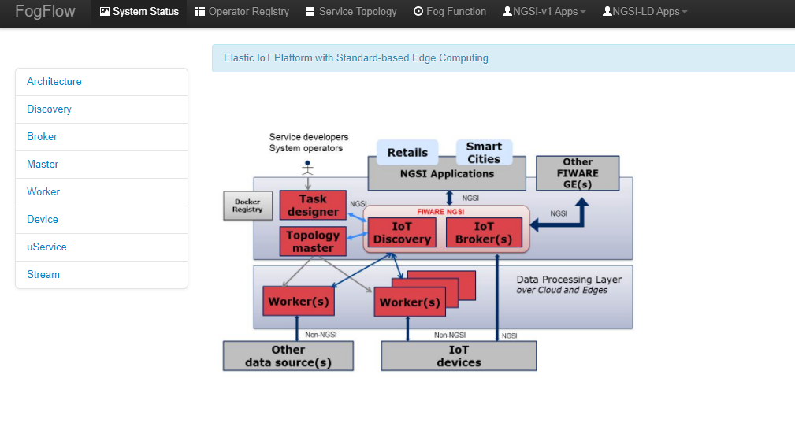

.. _cloud-setup:

*****************************************
Set up everything on a single machine
*****************************************

Here are the prerequisite commands for starting FogFlow:

1. docker

2. docker-compose

For ubuntu-16.04, you need to install docker-ce and docker-compose.

To install Docker CE, please refer to `Install Docker CE`_, required version > 18.03.1-ce;

.. important:: 
	**please also allow your user to execute the Docker Command without Sudo**

To install Docker Compose, please refer to `Install Docker Compose`_, 
required version 18.03.1-ce, required version > 2.4.2

.. _`Install Docker CE`: https://www.digitalocean.com/community/tutorials/how-to-install-and-use-docker-on-ubuntu-16-04
.. _`Install Docker Compose`: https://www.digitalocean.com/community/tutorials/how-to-install-docker-compose-on-ubuntu-16-04

Fetch all required scripts
===========================================================

Download the docker-compose file and the configuration files as below.

.. code-block:: console    

	# the docker-compose file to start all FogFlow components on the cloud node
	wget https://raw.githubusercontent.com/smartfog/fogflow/master/docker/core/http/docker-compose.yml

	# the configuration file used by all FogFlow components
	wget https://raw.githubusercontent.com/smartfog/fogflow/master/docker/core/http/config.json

	# the configuration file used by the nginx proxy
	wget https://raw.githubusercontent.com/smartfog/fogflow/master/docker/core/http/nginx.conf

Change the IP configuration accordingly
===========================================================

You need to change the following IP addresses in config.json according to your own environment.

- **coreservice_ip**: it is used by all FogFlow edge nodes to access the core services (e.g., nginx on port 80 and rabbitmq on port 5672) on the FogFlow cloud node; usually this will be the public IP of the FogFlow cloud node.
- **external_hostip**: for the configuration of the FogFlow cloud node, this is the same as coreservice_ip used by the components (Cloud Worker and Cloud Broker) to access the running FogFlow core services;        
- **internal_hostip**: this is the IP of your default docker bridge, which is the "docker0" network interface on your Linux host. For the docker engine on Windows or Mac OS, there is no "docker0" network interface; instead, you need to use the special domain name "host.docker.internal".  

- **site_id**: each FogFlow node (either cloud node or edge node) requires to have a unique string-based ID to identify itself in the system;
- **physical_location**: the geo-location of the FogFlow node;
- **worker.capacity**: it means the maximal number of docker containers that the FogFlow node can invoke;  

.. important:: 

	please DO NOT use "127.0.0.1" as the IP address of **coreservice_ip** and **external_hostip**, because they will be used by a running task inside a docker container. 
	
	**Firewall rules:** to make your FogFlow web portal accessible via the external_ip; the following ports must be open as well: 80 and 5672 for TCP

Start all components on the FogFlow Cloud Node
===========================================================

Pull the docker images of all FogFlow components and start the FogFlow system

.. code-block:: console    

    # if you already download the docker images of FogFlow components, this command can fetch the updated images
	docker-compose pull  

	docker-compose up -d

Validate your setup
===========================================================

There are two ways to check if the FogFlow cloud node is started correctly: 

- Check all the containers are Up and Running using "docker ps -a"

.. code-block:: console    

	docker ps -a
	
	CONTAINER ID        IMAGE               COMMAND                  CREATED             STATUS              PORTS                                                   NAMES
	90868b310608        nginx:latest        "nginx -g 'daemon of…"   5 seconds ago       Up 3 seconds        0.0.0.0:80->80/tcp                                      fogflow_nginx_1
	d4fd1aee2655        fogflow/worker      "/worker"                6 seconds ago       Up 2 seconds                                                                fogflow_cloud_worker_1
	428e69bf5998        fogflow/master      "/master"                6 seconds ago       Up 4 seconds        0.0.0.0:1060->1060/tcp                                  fogflow_master_1
	9da1124a43b4        fogflow/designer    "node main.js"           7 seconds ago       Up 5 seconds        0.0.0.0:1030->1030/tcp, 0.0.0.0:8080->8080/tcp          fogflow_designer_1
	bb8e25e5a75d        fogflow/broker      "/broker"                9 seconds ago       Up 7 seconds        0.0.0.0:8070->8070/tcp                                  fogflow_cloud_broker_1
	7f3ce330c204        rabbitmq:3          "docker-entrypoint.s…"   10 seconds ago      Up 6 seconds        4369/tcp, 5671/tcp, 25672/tcp, 0.0.0.0:5672->5672/tcp   fogflow_rabbitmq_1
	9e95c55a1eb7        fogflow/discovery   "/discovery"             10 seconds ago      Up 8 seconds        0.0.0.0:8090->8090/tcp                                  fogflow_discovery_1
	
.. important:: 

	if you see any container is missing, you can run "docker ps -a" to check if any FogFlow component is terminated with some problem. If there is, you can further check its output log by running "docker logs [container ID]"

- Check the system status from the FogFlow DashBoard

You can open the FogFlow dashboard in your web browser to see the current system status via the URL: http://<coreservice_ip>/index.html

.. important:: 

	If the FogFlow cloud node is behind a gateway, you need to create a mapping from the gateway IP to the coreservice_ip and then access the FogFlow dashboard via the gateway IP;
	If the FogFlow cloud node is a VM in a public cloud like Azure Cloud, Google Cloud, or Amazon Cloud, you need to access the FogFlow dashboard via the public IP of your VM;

Once you are able to access the FogFlow dashboard, you can see the following web page

Try out existing IoT services
===========================================================

Once the FogFlow cloud node is set up, you can try out some existing IoT services without running any FogFlow edge node.
For example, you can try out a simple fog function as below.  

- Click "Operator Registry" in the top navigator bar to triger the initialization of pre-defined operators. 

After you first click "Operator Registry", a list of pre-defined operators will be registered in the FogFlow system. 
With a second click, you can see the refreshed list as shown in the following figure.

.. figure:: figures/operator-list.png

- Click "Service Topology" in the top navigator bar to triger the initialization of pre-defined service topologies. 

After you first click "Service Topology", a list of pre-defined topologies will be registered in the FogFlow system. 
With a second click, you can see the refreshed list as shown in the following figure.

.. figure:: figures/topology-list.png

- Click "Fog Function" in the top navigator bar to triger the initialization of pre-defined fog functions. 

After you first click "Fog Function", a list of pre-defined functions will be registered in the FogFlow system. 
With a second click, you can see the refreshed list as shown in the following figure.

.. figure:: figures/function-list.png

- Create an IoT device entity to trigger the Fog Function

You can register a device entity via the device registration page: 
1) click "System Status"; 
2) click "Device";
3) click "Add";

Then you will see the following device registration page. 

.. figure:: figures/device-registration.png

- Check if the fog function is triggered

Check if a task is created under "Task" in System Management.**

.. figure:: figures/task.png

Check if a Stream is created under "Stream" in System Management.**

.. figure:: figures/result.png

