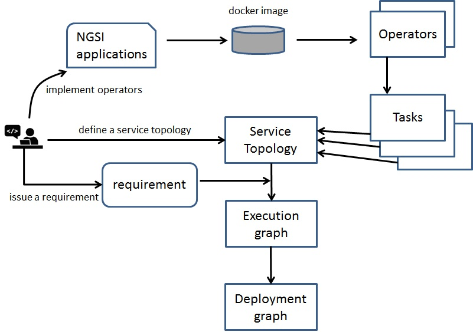

What is required to design, implement, and use a service
========================================================

In FogFlow a service is represented by a service topology, which consists of a set of linked data processing tasks. 
Therefore, we have to carefully consider how we can decompose the entire data processing logic into multiple small tasks
so that they can be dynamically created and placed either in the cloud or at edges. 
Here we outline what needs to be done from the design and implementation phase to the service usage phase. 

Design phase
--------------

During the design phase we can take a top-down approach to think about how your entire service logic can be divied into small tasks. 

#. Analyze the major data processing part in your service

	Basically we consider the entire data processing part as a black box and then start to define what are the input data 
	and what are the output results to be produced. 

#. Break down the major data processing part into small pieces (data processing tasks)

	We can follow a data-driven approach to check for each output what are the required inputs and data processing logics. 
	Meanwhile, we can check if we can break the data processing logic into small tasks mainly for two purposers: 
	1) the intermediate results can be shared across various tasks to produce different outputs;
	2) tasks can be smaller so that they can be dynamically migrated between edges and clouds. 
	

#. Verify the entire data processing flows with inputs and outputs

	After having the seperated tasks of the data processing logic in your service application,
	you can start to verify how they can be specified based on the FogFlow programming model, 
	mainly by checking if each task can be described with the FogFlow task specification, 
	such as input or output data stream types, task granularity; 

Implementation phase
-----------------------

As illustrated by the following diagram, the following steps are required to implement a service. 

#. implement a dockerized operator

	For each task object in a defined service topology, its data processing logic is provided by an operator, 
	which is mapped to one or more than one dockerized applications. 
	The name of an operator must be unique and the same operator can be mapped to multiple dockerized applications,
	which provide the implementation of the same operator for different operating systems (such as Ubuntu, Windows, MacOS)
	and different hardwards (such as x86-based or ARM-based, 64bits or 32 bits). 
	
	The detailed instruction on how to implement a dockerized application is provided under :ref:`operator-implementation`

#. push the docker image to the docker registry 
	
	Once you build up the docker image for the operator, you need to push the docker image to the public or private docker registry,
	which is configured and used by FogFlow. 
	
	.. code-block:: bash
		
		# if you use the default public docker registry
		docker push task1
		
		# if you use your own private docker registry, which is using the domain name "myRegistry.com"
		docker tag  task1  myRegistry.com/task1
		docker push myRegistry.com/task1
		

#. register the implemented operator

	In order for FogFlow to use the operator, we must register it. This can be done in two different ways. 
	
	- register the dockerized operator image via FogFlow Task Designer
		
	- registery the dockerized operator image by sending a NGSI update to the FogFlow Context Management system
	
	More details can be seen in :ref:`operator-registration`. 
	
	

#. define and register a service topology 

	Once all required operators have been registered in FogFlow, we can start to define 
	the service topology. Currently, FogFlow privdes two ways to define and register a service topology. 
	
	- register a service topology via FogFlow Task Designer
		
	- registery a service topology by sending a NGSI update to the FogFlow Context Management system
	
	More details can be seen in :ref:`topology-registration`. 

Usage phase
-----------------------

Once the defined service topology is registered in FogFlow, we can trigger the service topology 
by sending processing requirements. The processing requirement is sent as NGSI10 update, with the following properties: 

* topology: which topology to trigger
* expected output: the output stream type expected by external subscribers
* scope: a defined geoscope for the area where input streams should be selected
* scheduler: which type of scheduling method should be chosen by Topology Master for task assignment

#. define a requirement object

#. send the defined requirement as a context update to trigger the service topology

#. query or subscribe to the generated outputs

More details can be seen in :ref:`trigger-topology`. 

