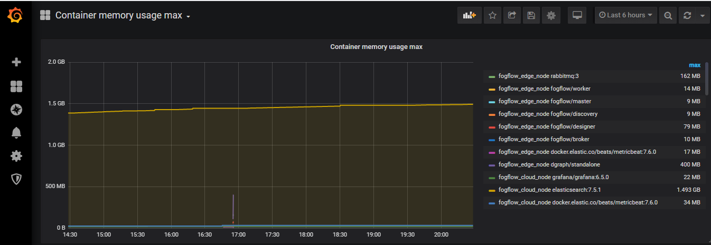
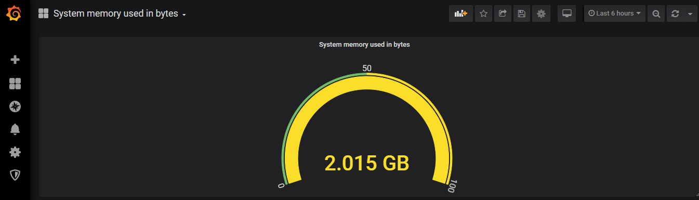
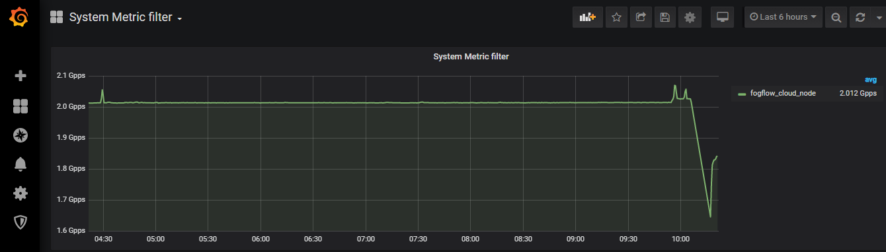
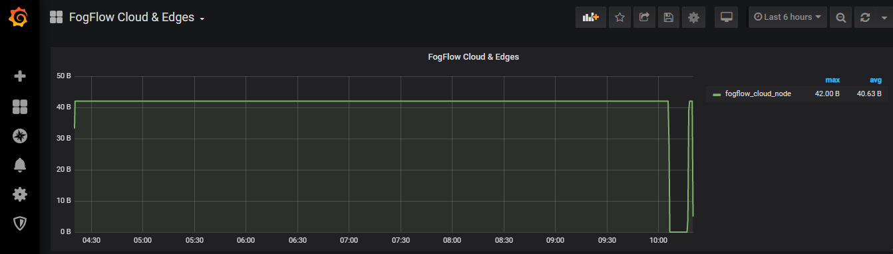

*************************
Monitoring
*************************

Fogflow system health can be monitored by system monitoring tools Metricbeat, Elasticsearch and Grafana in short EMG. 
With these tools edges and Fogflow Docker service health can be monitored. 
Metricbeat deployed on Edge node. Elasticsearch and Grafana on Cloud node.

As illustrated in following picture, set up System Monitoring tools  to monitor system resource usage.

.. figure:: figures/Fogflow_System_Monitoring_Architecture.png

Set up Monitoring components on Cloud node
===========================================================

Fetch all required scripts
-------------------------------------------------------------

Download the docker-compose file and the configuration files as below.

.. code-block:: console    

	# the docker-compose file to start all Monitoring components on the cloud node
	wget https://raw.githubusercontent.com/smartfog/fogflow/master/docker/core/http/grafana/docker-compose.yml
	
	# the configuration file used by Grafana
	wget https://raw.githubusercontent.com/smartfog/fogflow/master/docker/core/http/grafana/grafana.yaml

	# the configuration file used by metric beat
	wget https://raw.githubusercontent.com/smartfog/fogflow/master/docker/core/http/grafana/metricbeat.docker.yml

        # JSON files to configure grafana dashboard 
	wget https://raw.githubusercontent.com/smartfog/fogflow/master/docker/core/http/grafana/dashboards.zip

install unzip tool on system to extract JSON files from dashboards.zip

.. code-block:: console
 
          #command to install unzip in ubuntu  
          apt-get install unzip

          #command to unzip the file dashboards.zip
          unzip dashboards.zip

.. note:: It is supposed that FogFlow cloud components are in running state before setting up system monitoring.

Start all Monitoring components
----------------------------------

.. code-block:: console  
 
             docker-compose up -d

             #Check all the containers are Up and Running using "docker ps -a"
             docker ps -a

Configure Elasticsearch on Grafana Dashboard
===========================================================  

Grafana dashboard can be accessible on web browser via the URL: http://<Cloud_Public_IP>:3003/. 
The default username and password for Grafana login are admin and admin respectively.

- After successful login to grafana, click on "Add data source" in Home Dashboard to setup the source of data.
- Select Elasticsearch from Add Data Source page. Now the new page is Data Sources/Elasticsearch same as below figure.

.. figure:: figures/Elastic_config.png

1. Put a name for the Data Source i.e. "Elasticsearch".
2. In HTTP detail ,mention URL of your elasticsearch and Port. URL shall include HTTP for eg: "http://192.168.100.112:9200"
3. In Access select "Server(default)". URL needs to be accessible from the Grafana backend/server.
4. In Elasticsearch details, put "@timestamp" for Time field name. 
5. Select Elasticsearch Version i.e. "7.0+".

Then click on "Save & Test" button.

On successful configuration the dashboard will return "Index OK. Time field name OK."

Grafana-based monitoring
===========================================================  
        
Grafana based system metrics can be seen on grafana dashboard. Follow the steps:

1. In the sidebar, take the cursor over Dashboards (squares) icon.

2. click Manage. 

3. The dashboard appears in a Services folder.

Select particular dashboard to see the corresponding monitoring metrics.

- **Below dashboard diagram for containers list with maximum memory usage**.

- **Below dashboard diagram to show system memory used in bytes on cloud node**.

- **Below dashboard diagram to show system metric data rate in packet per second on cloud node**.

- **Below dashboard diagram to show FogFlow Cloud node that are live**.

.. note:: Before proceeding please clear the browser cache, browser might saves some information from websites in its cache and cookies. Clearing them fixes certain problems, like loading or formatting issues on sites.
	     

Set up Metricbeat on Edge node
-------------------------------------

Download the metricbeat yml file for edge node.

.. code-block:: console  

            # the configuration file used by metric beat
            wget https://raw.githubusercontent.com/smartfog/fogflow/master/docker/core/http/grafana/metricbeat.docker.yml

**Optional** - Edit "name" in metricbeat.docker.yml file to add particular name for better identification of edge node. Further user can update the output.elasticsearch.hosts in the metricbeat.docker.yml file.

.. code-block:: json

        name: "<155.54.239.141/edge02>"
        metricbeat.modules:
        - module: docker
          #Docker module parameters to monitor based on user requirement,example as below
          metricsets: ["cpu","memory","network"]
          hosts: ["unix:///var/run/docker.sock"]
          period: 10s
          enabled: true
        - module: system
          #System module parameters to monitor based on user requirement, example as below
          metricsets: ["cpu","load","memory","network"]
          period: 10s

        # User can update this while executing docker run command also. 
        output.elasticsearch:
          hosts: '155.54.239.141:9200'
        

Copy below Docker run command, edit and replace <Cloud_Public_IP> with IP/URL of elasticsearch in output.elasticsearch.hosts=["<Cloud_Public_IP>:9200"]>. This command will deploy metric beat on edge node.

.. code-block:: console  

            docker run -d   --name=metricbeat   --user=root   --volume="$(pwd)/metricbeat.docker.yml:/usr/share/metricbeat/metricbeat.yml:ro"   --volume="/var/run/docker.sock:/var/run/docker.sock:ro"   --volume="/sys/fs/cgroup:/hostfs/sys/fs/cgroup:ro"   --volume="/proc:/hostfs/proc:ro"   --volume="/:/hostfs:ro"   docker.elastic.co/beats/metricbeat:7.6.0 metricbeat -e   -E output.elasticsearch.hosts=["<Cloud_Public_IP>:9200"]

Metrices for Edge node can be seen on same Grafana dashboard with cloud node metrics via URL: http://<Cloud_Public_IP>:3003/. 

- **Below dashboard diagram to show system memory used in bytes on cloud as well as on edge node**.

.. figure:: figures/System_Memory_Gauge.png

- **Below dashboard diagram to show system metric data rate in packet per second on cloud as well as on edge node**.

.. figure:: figures/System_Metric_filter.png

- **Below dashboard diagram to show FogFlow Cloud and Edge nodes that are live**.

.. figure:: figures/Fogflow_Cloud_Edge_Nodes.png

