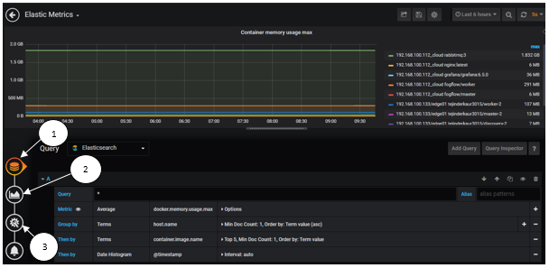
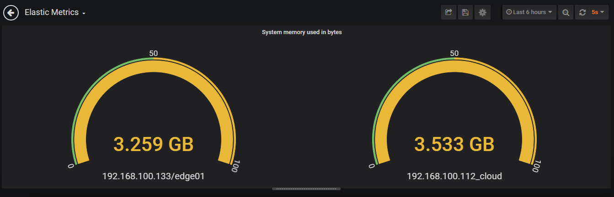
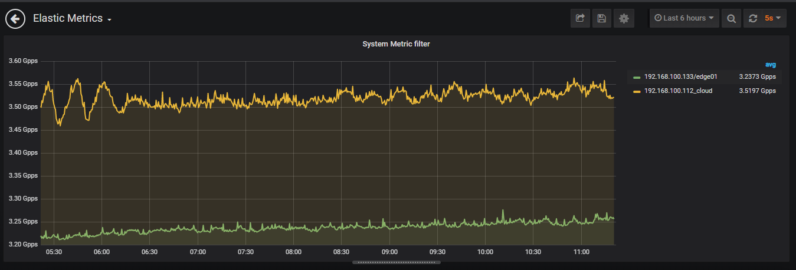
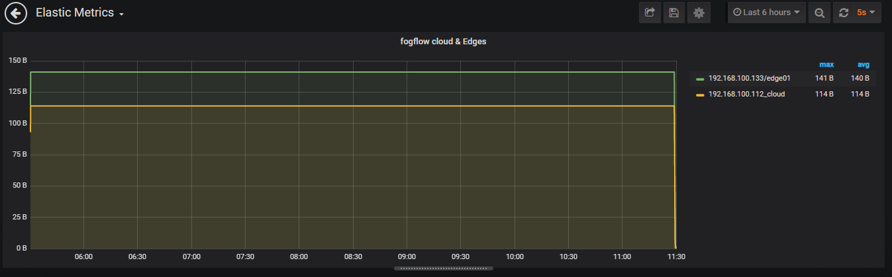

*************************
Monitoring
*************************

Fogflow system health can be monitored by system monitoring tools Metricbeat, Elasticsearch and Grafana in short EMG. 
With these tools edges and Fogflow Docker service health can be monitored. 
Metricbeat deployed on Edge node. Elasticsearch and Grafana on Cloud node.

As illustrated by the following picture, in order to set up FogFlow System Monitoring tools to monitor system resource usage.

.. figure:: figures/Fogflow_System_Monitoring_Architecture.png

Configure Elasticsearch on Grafana Dashboard
===========================================================  

Grafana dashboard can be accessible on web browser to see the current system status via the URL: 
http://<output.elasticsearch.hosts>:3003/. The default username and password for Grafana login are admin and admin respectively.

- After successful login to grafana, click on "Create your first data source" on Home Dashboard to setup the source of data.
- Select Elasticsearch from Add Data Sourch page. Now you are on page Data Sources/Elasticsearch same as below figure.

.. figure:: figures/Elastic_config.png

1. Put a name for the Data Source.
2. In HTTP detail ,mention URL of your elasticsearch and Port. URL shall include HTTP. 
3. In Access select Server(default). URL needs to be accessible from the Grafana backend/server.
4. In Elasticsearch details, put @timestamp for Time field name. Here a default for the time field can be specified with the name of your Elasticsearch index. Use a time pattern for the index name or a wildcard.
5. Select Elasticsearch Version.

Then click on "Save & Test" button.

Set up the Metricbeat
===========================================================  

- Change the details of Elasticsearch in metricbeat.docker.yml file as below:

.. code-block:: json

        name: "<155.54.239.141_cloud>"
        metricbeat.modules:
        - module: docker
          #Docker module parameters that has to be monitored based on user requirement, example as below
          metricsets: ["cpu","memory","network"]
          hosts: ["unix:///var/run/docker.sock"]
          period: 10s
          enabled: true
        - module: system
          #System module parameters that has to be monitored based on user requirement, example as below
          metricsets: ["cpu","load","memory","network"]
          period: 10s

        output.elasticsearch:
          hosts: '155.54.239.141:9200'
	  

Fogflow system health can be monitored by system monitoring tools Metricbeat, Elasticsearch and Grafana in short EMG. 
With these tools edges and Fogflow Docker service health can be monitored. 
Metricbeat deployed on Edge node. Elasticsearch and Grafana on Cloud node.

As illustrated by the following picture, in order to set up FogFlow System Monitoring tools to monitor system resource usage.

.. figure:: figures/Fogflow_System_Monitoring_Architecture.png

Set up all FogFlow components on a single machine
===========================================================

Fetch all required scripts
-------------------------------------------------------------

Download the docker-compose file and the configuration files as below.

.. code-block:: console    

	# the docker-compose file to start all FogFlow components on the cloud node
	wget https://raw.githubusercontent.com/smartfog/fogflow/master/docker/core/http/docker-compose.yml

	# the configuration file used by all FogFlow components
	wget https://raw.githubusercontent.com/smartfog/fogflow/master/docker/core/http/config.json

	# the configuration file used by the nginx proxy
	wget https://raw.githubusercontent.com/smartfog/fogflow/master/docker/core/http/nginx.conf

        # the configuration file used by metricbeat
        wget https://raw.githubusercontent.com/smartfog/fogflow/master/docker/core/http/metricbeat.docker.yml

Change the IP configuration of elasticsearch and metricbeat accordingly
---------------------------------------------------------------------------

You need to change the following IP addresses in docker-compose.yml according to your own environment.

- **output.elasticsearch.hosts**: it is the host location of elasticsearch on which metricbeat shares data in csv format.

Also need to change the following IP addresses in metricbeat.docker.yml according to your own environment.

- **name**: It is the name given for uniqueness for cloud nodes from egde nodes on grafana metric dashboard. You can mention any name in place of IP address.

- **hosts**: It is the host location of elasticsearh database, where metricbeat is going to share metric data.

Grafana-based monitoring
===========================================================  
        
To monitor metrics of FogFlow cloud as well as edge nodes in graphical format we need to setup dashboard.
Here are some basic Grafana visualization dashboard setting examples to monitor system resources.

- **Below diagram illustrate steps to setup dashboard for containers list with maximum memory usage**.

1. To create query for Elasticsearch select Query: Metrics: Average(docker.memory.usage.max), Group by: Terms(host.name), Terms(container.image.name), Date Histogram(@timestamp) from drop down list.
2. Click on Visualization select Graph from drop down , Draw Modes (Lines), Mode Options(Fill:1,Fill Gradient:0,Line Width:2), Stacking & Null value(Null value:connected)
   Axes- Left Y(Unit:bytes,Scale:linear), Right Y(Unit:short,Scale:linear), X-Axis(Mode:Time)
   Legend- Options(Show,As Table,To the right), Values(Max)
3. Click on General Title: Container memory usage max, write Description if there is any description.

- **Below diagram illustrate steps to setup dashboard to show system memory used in bytes**.

1. To create query for Elasticsearch select Query: memory, Metrics: Average(system.memory.actual.used.bytes), Group by: Terms(host.name), Date Histogram(@timestamp)from drop down list.
2. Click on Visualization select Gauge from drop down , Display (Show:Calculation, Calc:Last(not null), Labels, Markers), Field (Unit:bytes, Min:0, Max:100), Thresholds (50 (yellow), base (green)).
3. Click on General Title: System memory used in bytes, write Description if there is any description.

- **Below diagram illustrate steps to setup dashboard to show system metric data rate in packet per second**.

1. To create query for Elasticsearch select Query: Metrics: Average(system.memory.actual.used.bytes), Group by: Terms(agent.name), Date Histogram(@timestamp)from drop down list.
2. Click on Visualization select Graph from drop down , Draw Modes (Lines), Mode Options(Fill:1,Fill Gradient:0,Line Width:2), Hover tooltip(Mode: All series, Sort order:Increasing), Stacking & Null value(Null value:connected).
   Axes- Left Y(Unit:packets/sec, Scale:linear), Right Y(Unit:packets/sec, Scale:linear), X-Axis(Mode:Time)
   Legend- Options(Show,As Table,To the right), Values(Avg)
3. Click on General Title: System Metric filter, write Description if there is any description.

- **Below diagram illustrate steps to setup dashboard to show FogFlow Cloud and Edge nodes that are live**.

1. To create query for Elasticsearch select Query: Metrics: Count(), Group by: Terms(agent.name), Date Histogram(@timestamp) from drop down list.
2. Click on Visualization select Graph from drop down , Draw Modes (Lines), Mode Options(Fill:1,Fill Gradient:0,Line Width:2).
   Axes- Left Y(Unit:bytes, Scale:linear), Right Y(Unit:short, Scale:linear), X-Axis(Mode:Time).
   Legend- Options(Show, As Table, To the right), Values(Avg, Max).

Configure Elasticsearch on Grafana Dashboard
-------------------------------------------------------------

Grafana dashboard can be accessible on web browser to see the current system status via the URL: 
http://<output.elasticsearch.hosts>:3003/. The default username and password for Grafana login are admin and admin respectively.

- After successful login to grafana, click on "Create your first data source" on Home Dashboard to setup the source of data.
- Select Elasticsearch from Add Data Sourch page. Now you are on page Data Sources/Elasticsearch same as below figure.

.. figure:: figures/Elastic_config.png

1. Put a name for the Data Source.
2. In HTTP detail ,mention URL of your elasticsearch and Port. URL shall include HTTP. 
3. In Access select Server(default). URL needs to be accessible from the Grafana backend/server.
4. In Elasticsearch details, put @timestamp for Time field name. Here a default for the time field can be specified with the name of your Elasticsearch index. Use a time pattern for the index name or a wildcard.
5. Select Elasticsearch Version.

Then click on "Save & Test" button.

Set up the Metricbeat
---------------------------------------------

- Change the details of Elasticsearch in metricbeat.docker.yml file as below:

.. code-block:: json

        name: "<155.54.239.141_cloud>"
        metricbeat.modules:
        - module: docker
          #Docker module parameters that has to be monitored based on user requirement, example as below
          metricsets: ["cpu","memory","network"]
          hosts: ["unix:///var/run/docker.sock"]
          period: 10s
          enabled: true
        - module: system
          #System module parameters that has to be monitored based on user requirement, example as below
          metricsets: ["cpu","load","memory","network"]
          period: 10s

        output.elasticsearch:
          hosts: '155.54.239.141:9200'
	  