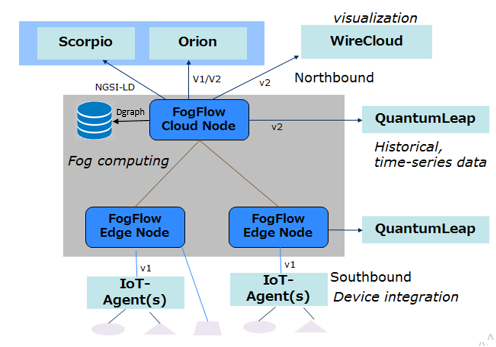

*****************************
System Overview
*****************************

FogFlow is a distributed execution framework to support dynamic processing flows over cloud and edges. It can dynamically and 
automatically composite multiple NGSI-based data processing tasks to form high level IoT services and then orchestrate and optimize 
the deployment of those services within a shared cloud-edge environment.

The shared environment of FogFlow cloud-edge can be created with one FogFlow cloud node and more than one FogFlow edge nodes as
illustrated in below figure. All integrated features that are running in FogFlow system, can be seen in this figure. 

FogFlow is now supporting graph database to store internal entity data for later use. In FogFlow system, the interaction point of graph database is designer.
So FogFlow entity that create either by FogFlow web browser or via any other client such as curl or python client,
the entity creation request directly goes to Designer. Then Designer will send this entity request on cloud broker to 
register the entity and at the same time Designer will send this data on DGraph to store it into database.

Whenever FogFlow system will restart, Designer will trigger a query request to DGraph and get all the stored entities
from DGraph then send these entities to cloud broker to register them.

.. note:: FogFlow Designer is dependent on Discovery and Cloud Broker.

The integration of FogFlow Designer and DGraph is done via gRPC, where a Dgraph client is implemented with Designer server as in below code
using gRPC. Default port of gRPC is 9080, in FogFlow 9082 port is used.

.. code-block:: console

   /*
   creating grpc client for making connection with dgraph
   */
   function newClientStub() {
       return new dgraph.DgraphClientStub(config.HostIp+":"+config.grpcPort, grpc.credentials.createInsecure());
   }

   // Create a client.
   function newClient(clientStub) {
      return new dgraph.DgraphClient(clientStub);
   }
   
   
Whenever any new FogFlow entity creates ( via web browser or via other clients) the request goes to designer, then designer 
perform two tasks:

1. Send request to cloud broker to register the entity.

2. Calls DGraph client to store entity data, the DGraph client will create a connection with dgraph server after that create schema and then send data to DGraph. Apart from this, one another flow will be triggered from designer when FogFlow system will restart. In this flow designer will query all stored entity data from DGraph and forward to cloud broker for registering these entites.

Below the glimpse of code to create schema and insert data into DGraph.

.. code-block:: console

   /*
   create scheema for node
   */
   async function setSchema(dgraphClient) {
       const schema = `
            attributes: [uid] .
            domainMetadata: [uid] .
            entityId: uid .
            updateAction: string .
            id: string .
            isPattern: bool .
            latitude: float .
            longitude: float .
            name: string .
            type: string .
	          value: string . 
       `;
       const op = new dgraph.Operation();
       op.setSchema(schema);
       await dgraphClient.alter(op);
   }
   
   /*
   insert data into database
   */
   async function createData(dgraphClient,ctx) {
       const txn = dgraphClient.newTxn();
       try {
           const mu = new dgraph.Mutation();
           mu.setSetJson(ctx);
           const response = await txn.mutate(mu);
           await txn.commit();
       }
	    finally {
          await txn.discard();
       }
   }
   
For detailed code refer https://github.com/smartfog/fogflow/blob/development/designer/dgraph.js 

In this page, a brief introduction is given about FogFlow integrations, for more detailed information refer links.

There are mainly two types of integration Northbound and Southbound, flow of data from a sensor device towards broker is known 
as Northbound Flow and when flow of data from broker towards actuator devices, then it is known as Southbound Flow.
more detail about Northbound and Southbound data flow can be checked via `this`_ page.

.. _`this`: https://fogflow.readthedocs.io/en/latest/integration.html

FogFlow can be Integrated with Scorpio broker. Scorpio is an NGSI-LD compliant context broker. So, an NGSI-LD Adapter is built 
to enable FogFlow Ecosystem to interact with Scorpio context broker. The NGSI-LD Adapter converts NGSI data format to NGSI-LD and forward it to Scorpio broker, more detail can be checked via `Integrate FogFlow with Scorpio Broker`_ page.

.. _`Integrate FogFlow with Scorpio Broker`: https://fogflow.readthedocs.io/en/latest/scorpioIntegration.html

FogFlow can also be Integrated with Orion context broker using NGSI APIs. More detail can be checked via `Integrate FogFlow with FIWARE`_ page.

.. _`Integrate FogFlow with FIWARE`: https://fogflow.readthedocs.io/en/latest/fogflow_fiware_integration.html

Similarly, FogFlow Integration with WireCloud is provided to visualize the data with the help of different widgets of wirecloud
.FogFlow Integration with QuantumLeap is to store time series based historical data. More detail can be checked via  `Integrate FogFlow with WireCloud`_ for wirecloud and `Integrate FogFlow with QuantumLeap`_ page for QuantumLeap.

.. _`Integrate FogFlow with WireCloud`: https://fogflow.readthedocs.io/en/latest/wirecloudIntegration.html
.. _`Integrate FogFlow with QuantumLeap`: https://fogflow.readthedocs.io/en/latest/quantumleapIntegration.html

FogFlow also provides a secure communication between the FogFlow cloud node and the FogFlow edge nodes, and between two edge nodes.
To acheive HTTPs-based secure communication in FogFlow, it is necessary for FogFlow cloud node and the FogFlow edge
node to have their own domain names. Further the detail configuration and setup steps can be checked via `Security`_.

.. _`Security`: https://fogflow.readthedocs.io/en/latest/https.html

