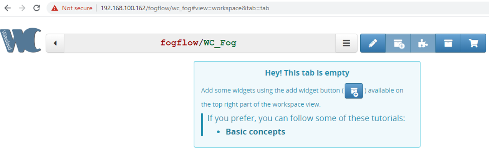
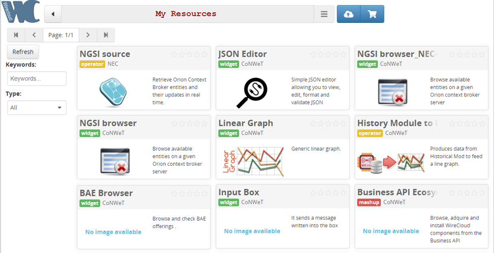
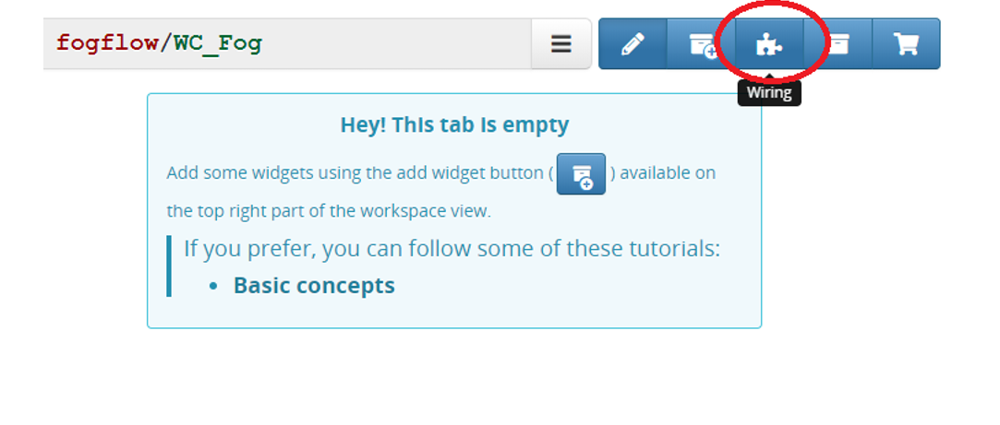
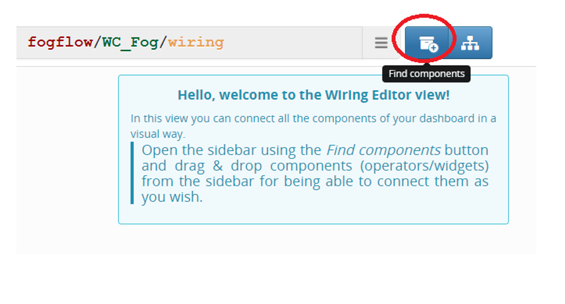
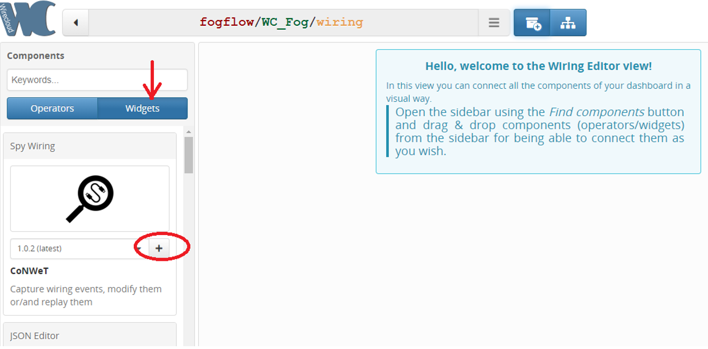
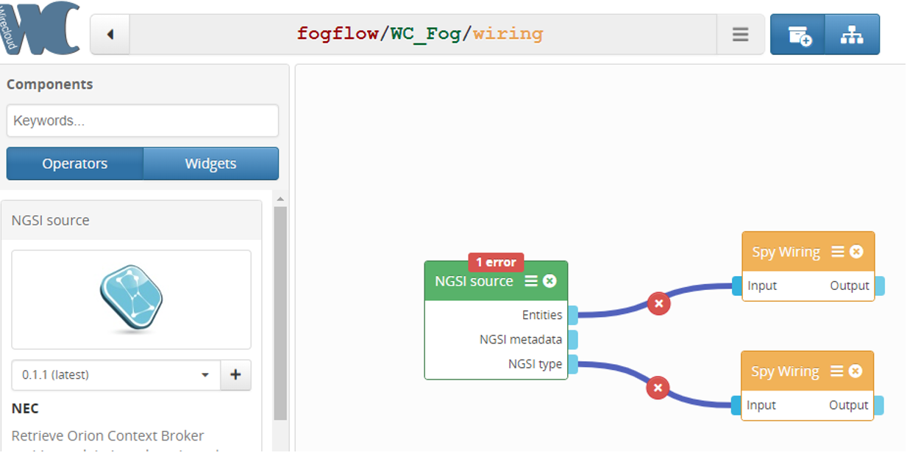
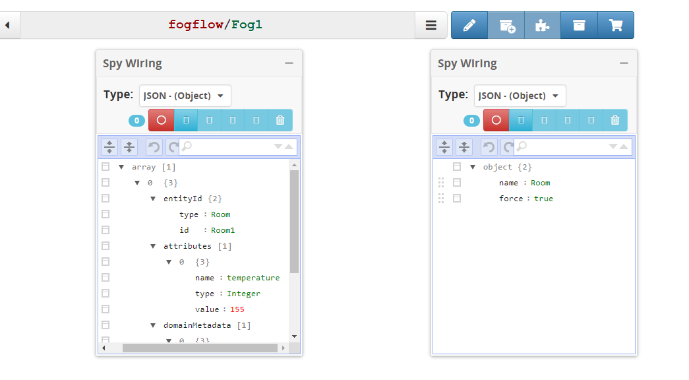

*****************************************
Integrate FogFlow with WireCloud
*****************************************

`WireCloud`_ builds on cutting-edge end-user development, RIA and semantic technologies to offer a next-generation end-user centred web application mashup platform aimed at leveraging the long tail of the Internet of Services.

.. _`WireCloud`: https://wirecloud.readthedocs.io/en/stable/

The figure below shows the integration of FogFlow with WIRECLOUD

.. figure:: figures/Wc_FFIntegration.png

1. WireCloud sends a subscription request to the FogFlow-Broker in NGSIv2.
2. User will send the update request to the Fogflow-Broker in NGSIv1.
3. FogFlow Broker will notify WireCloud in NGSIv2.

Integration steps
===============================================

**Pre-Requisites:**

* Fogflow should be up and running with atleast one node.
* WireCloud should be up and running  `WireCloud installation steps`_ .

.. _`WireCloud installation steps` : https://wirecloud.readthedocs.io/en/stable/installation_guide/

* Fiware NGSI-Proxy shiuld be up and running  `NGSI-Proxy installation steps`_ .

.. _`NGSI-Proxy installation steps` : https://github.com/conwetlab/ngsi-proxy 

**Steps to subscribe fogflow using wirecloud:**

 **Step1:**  Open Wirecloud Dashboard Home.

.. figure:: figures/WC1.png

**Step2:** Add New workspace.

.. figure:: figures/N1WC2.png

**Step3:** Provide name to the new workspace.

.. figure:: figures/WC3.png

**Step4:** Created new workspace WC_fog.

**Step5:** View all the resources cretaed by users and some default resources.

.. figure:: figures/WC5.png

**Step6:** Available resources and wiget in the wirecloud library.

**Step7:** create wiring for your own workspace.

**Step8:** Click on find Componend in the wiring section.  

**Step9** Add two spy wiring widget for display the data and second to show the entity. user can use their own widget to display the data and see the details of entity according to their requirement.  

**Step10:** Add NGSI source Widget to subscribe ContextBroker for specified Data .

.. figure:: figures/WC10.png

**Step11:** Drag and drop the added components to the working space.

.. figure:: figures/WC11.png

**Step12:** Add the dropped component as in the below picture. Spy wiring connected to the entity of NGSI source will show data and other one component to NGSI type will show the entity detail.

**Step13:** Go to the setting of NGSI souce to configure it for subscription request to the context broker.

.. figure:: figures/WC13.png

**step14:** Provide the FogFlow broker url (NGSI serever URL), NGSI proxy URL, NGSI entity type , ID pattern, Attributes, and click accept to hit the subscription request.

.. figure:: figures/WC15.png

**Send update request**  to Fogflow Broker with an entity of type and attributes defined in the above subscription.
An example request is given below:

.. code-block:: console

        curl -iX POST \
        'http://<Fogflow broker>:8070/ngsi10/updateContext' \
         -H 'Content-Type: application/json' \
        -d '
      {
        "contextElements": [{
                "entityId": {
                        "id": "Room1",
                        "type": "Room",
                        "isPattern": false
                },
                "attributes": [{
                        "name": "temperature",
                        "type": "Integer",
                        "value": 155
                }],
                "domainMetadata": [{
                        "name": "location",
                        "type": "point",
                        "value": {
                                "latitude": 49.406393,
                                "longitude": 8.684208
                        }
                }]
        }],
        "updateAction": "UPDATE"
     }'
	 
**result:**

