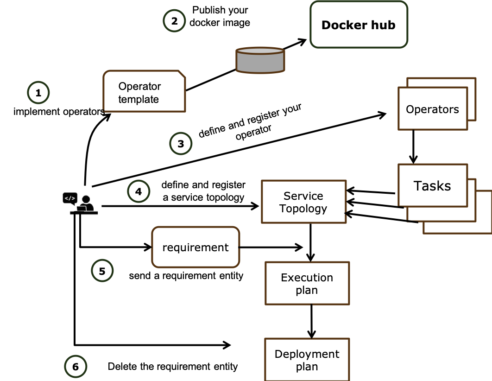

*****************************************
API ウォークスルー
*****************************************

FogFlow Discovery API
===================================

近くのブローカーを探す
-----------------------------------------------

外部アプリケーションまたは IoT デバイスの場合、FogFlow Discovery から必要な唯一のインターフェースは、自身の場所に基づいて近くのブローカーを見つけることです。その後、それらは割り当てられた近くのブローカーと対話する必要があるだけです。

**POST /ngsi9/discoverContextAvailability**

==============   ===============
パラメーター     説明
==============   ===============
latitude         場所 (location) の緯度
longitude        場所 (location)の緯度
limit            予想されるブローカーの数
==============   ===============

以下の例を確認してください。

.. note:: JavaScript のコード例では、ライブラリ ngsiclient.js が必要です。application/device/powerpanel のコード リポジトリを参照してください。

.. tabs::

   .. group-tab:: curl

        .. code-block:: console 

            curl -iX POST \
              'http://localhost:80/ngsi9/discoverContextAvailability' \
              -H 'Content-Type: application/json' \
              -d '
                {
                   "entities":[
                      {
                         "type":"IoTBroker",
                         "isPattern":true
                      }
                   ],
                   "restriction":{
                      "scopes":[
                         {
                            "scopeType":"nearby",
                            "scopeValue":{
                               "latitude":35.692221,
                               "longitude":139.709059,
                               "limit":1
                            }
                         }
                      ]
                   }
                } '            

   .. code-tab:: javascript

        const NGSI = require('./ngsi/ngsiclient.js');
        
        var discoveryURL = "http://localhost:80/ngsi9";
        var myLocation = {
                "latitude": 35.692221,
                "longitude": 139.709059
            };
        
        // find out the nearby IoT Broker according to my location
        var discovery = new NGSI.NGSI9Client(discoveryURL)
        discovery.findNearbyIoTBroker(myLocation, 1).then( function(brokers) {
            console.log('-------nearbybroker----------');    
            console.log(brokers);    
            console.log('------------end-----------');    
        }).catch(function(error) {
            console.log(error);
        });

  
       

FogFlow Broker API
===============================

.. figure:: https://img.shields.io/swagger/valid/2.0/https/raw.githubusercontent.com/OAI/OpenAPI-Specification/master/examples/v2.0/json/petstore-expanded.json.svg
  :target: https://app.swaggerhub.com/apis/fogflow/broker/1.0.0

.. note:: Cloud Broker へのアクセスにはポート 80 を使用しますが、Edge Broker の場合、デフォルトのポートは 8070 です。

コンテキストの作成/アップデート
-----------------------------------------------

.. note:: コンテキスト エンティティを作成またはアップデートするのと同じ API です。コンテキスト アップデートの場合、既存のエンティティがない場合は、新しいエンティティが作成されます。

**POST /ngsi10/updateContext**

==============   ===============
パラメーター     説明
==============   ===============
latitude         場所 (location) の緯度
longitude        場所 (location)の緯度
limit            予想されるブローカーの数
==============   ===============

例: 

.. tabs::

   .. group-tab:: curl

        .. code-block:: console 

            curl -iX POST \
              'http://localhost:80/ngsi10/updateContext' \
              -H 'Content-Type: application/json' \
              -d '
                {
                    "contextElements": [
                        {
                            "entityId": {
                                "id": "Device.temp001",
                                "type": "Temperature",
                                "isPattern": false
                            },
                            "attributes": [
                            {
                              "name": "temp",
                              "type": "integer",
                              "value": 10
                            }
                            ],
                            "domainMetadata": [
                            {
                                "name": "location",
                                "type": "point",
                                "value": {
                                    "latitude": 49.406393,
                                    "longitude": 8.684208
                                }
                            },{
                                "name": "city",
                                "type": "string",
                                "value": "Heidelberg"                             
                            }
                            ]
                        }
                    ],
                    "updateAction": "UPDATE"
                }'          

   .. code-tab:: javascript

        const NGSI = require('./ngsi/ngsiclient.js');
        var brokerURL = "http://localhost:80/ngsi10"
    
        var ngsi10client = new NGSI.NGSI10Client(brokerURL);
    
        var profile = {
                "type": "PowerPanel",
                "id": "01"};
        
        var ctxObj = {};
        ctxObj.entityId = {
            id: 'Device.' + profile.type + '.' + profile.id,
            type: profile.type,
            isPattern: false
        };
        
        ctxObj.attributes = {};
        
        var degree = Math.floor((Math.random() * 100) + 1);        
        ctxObj.attributes.usage = {
            type: 'integer',
            value: degree
        };   
        ctxObj.attributes.shop = {
            type: 'string',
            value: profile.id
        };       
        ctxObj.attributes.iconURL = {
            type: 'string',
            value: profile.iconURL
        };                   
        
        ctxObj.metadata = {};
        
        ctxObj.metadata.location = {
            type: 'point',
            value: profile.location
        };    
       
        ngsi10client.updateContext(ctxObj).then( function(data) {
            console.log(data);
        }).catch(function(error) {
            console.log('failed to update context');
        }); 

GET を介したコンテキストのクエリ
-----------------------------------------------

ID でコンテキスト エンティティを取得
^^^^^^^^^^^^^^^^^^^^^^^^^^^^^^^^^^^^^^^^^^^

**GET /ngsi10/entity/#eid**

==============   ===============
パラメーター     説明
==============   ===============
eid              エンティティ ID
==============   ===============

例: 

.. code-block:: console 

   curl http://localhost:80/ngsi10/entity/Device.temp001

特定のコンテキスト エンティティの特定の属性を取得
^^^^^^^^^^^^^^^^^^^^^^^^^^^^^^^^^^^^^^^^^^^^^^^^^^^^^^^^^^^^^^^^^^^^^^^^^^^^^^^^^^^^^^

**GET /ngsi10/entity/#eid/#attr**

==============   ===============
パラメーター     説明
==============   ===============
eid              エンティティ ID
attr             フェッチする属性名を指定
==============   ===============

例: 

.. code-block:: console 

   curl http://localhost:80/ngsi10/entity/Device.temp001/temp

単一のブローカー上のすべてのコンテキスト エンティティを確認
^^^^^^^^^^^^^^^^^^^^^^^^^^^^^^^^^^^^^^^^^^^^^^^^^^^^^^^^^^^^^^^^^^^^^^^^^^^^^^^^^^^^^^

**GET /ngsi10/entity**

例: 

.. code-block:: console 

    curl http://localhost:80/ngsi10/entity

POST を介してコンテキストをクエリ
-----------------------------------------------

**POST /ngsi10/queryContext**

==============   ===============
パラメーター     説明
==============   ===============
entityId         特定のエンティティ ID、ID pattern、またはタイプを定義できるエンティティ フィルターを指定
restriction      スコープのリストと各スコープは、ドメイン メタデータに基づいてフィルターを定義
==============   ===============

エンティティ ID のパターンによるコンテキストのクエリ
^^^^^^^^^^^^^^^^^^^^^^^^^^^^^^^^^^^^^^^^^^^^^^^^^^^^^^^^^^^^^^^^^^^^^^^^^^^^^^^^^^^^^^

.. tabs::

   .. group-tab:: curl

        .. code-block:: console 

            curl -X POST 'http://localhost:80/ngsi10/queryContext' \
              -H 'Content-Type: application/json' \
              -d '{"entities":[{"id":"Device.*","isPattern":true}]}'          

   .. code-tab:: javascript

        const NGSI = require('./ngsi/ngsiclient.js');
        var brokerURL = "http://localhost:80/ngsi10"    
        var ngsi10client = new NGSI.NGSI10Client(brokerURL);
        
        var queryReq = {}
        queryReq.entities = [{id:'Device.*', isPattern: true}];           
        
        ngsi10client.queryContext(queryReq).then( function(deviceList) {
            console.log(deviceList);
        }).catch(function(error) {
            console.log(error);
            console.log('failed to query context');
        });          

エンティティ タイプによるコンテキストのクエリ
^^^^^^^^^^^^^^^^^^^^^^^^^^^^^^^^^^^^^^^^^^^^^^^^^^^^^^^^^^^^^^^^^^^^^^^^^^^^^^^^^^^^^^

.. tabs::

   .. group-tab:: curl

        .. code-block:: console 

            curl -X POST 'http://localhost:80/ngsi10/queryContext' \
              -H 'Content-Type: application/json' \
              -d '{"entities":[{"type":"Temperature","isPattern":true}]}'          

   .. code-tab:: javascript

        const NGSI = require('./ngsi/ngsiclient.js');
        var brokerURL = "http://localhost:80/ngsi10"    
        var ngsi10client = new NGSI.NGSI10Client(brokerURL);
        
        var queryReq = {}
        queryReq.entities = [{type:'Temperature', isPattern: true}];           
        
        ngsi10client.queryContext(queryReq).then( function(deviceList) {
            console.log(deviceList);
        }).catch(function(error) {
            console.log(error);
            console.log('failed to query context');
        });          

ジオスコープ (geo-scope) によるコンテキストのクエリ (サークル)
^^^^^^^^^^^^^^^^^^^^^^^^^^^^^^^^^^^^^^^^^^^^^^^^^^^^^^^^^^^^^^^^^^^^^^^^^^^^^^^^^^^^^^

.. tabs::

   .. group-tab:: curl

        .. code-block:: console 

            curl -X POST 'http://localhost:80/ngsi10/queryContext' \
              -H 'Content-Type: application/json' \
              -d '{
                    "entities": [{
                        "id": ".*",
                        "isPattern": true
                    }],
                    "restriction": {
                        "scopes": [{
                            "scopeType": "circle",
                            "scopeValue": {
                               "centerLatitude": 49.406393,
                               "centerLongitude": 8.684208,
                               "radius": 10.0
                            }
                        }]
                    }
                  }'
                  

   .. code-tab:: javascript

        const NGSI = require('./ngsi/ngsiclient.js');
        var brokerURL = "http://localhost:80/ngsi10"    
        var ngsi10client = new NGSI.NGSI10Client(brokerURL);
        
        var queryReq = {}
        queryReq.entities = [{type:'.*', isPattern: true}];  
        queryReq.restriction = {scopes: [{
                            "scopeType": "circle",
                            "scopeValue": {
                               "centerLatitude": 49.406393,
                               "centerLongitude": 8.684208,
                               "radius": 10.0
                            }
                        }]};
        
        ngsi10client.queryContext(queryReq).then( function(deviceList) {
            console.log(deviceList);
        }).catch(function(error) {
            console.log(error);
            console.log('failed to query context');
        });    

ジオスコープ (geo-scope) によるコンテキストのクエリ (ポリゴン)
^^^^^^^^^^^^^^^^^^^^^^^^^^^^^^^^^^^^^^^^^^^^^^^^^^^^^^^^^^^^^^^^^^^^^^^^^^^^^^^^^^^^^^

.. tabs::

   .. group-tab:: curl

        .. code-block:: console 

            curl -X POST 'http://localhost:80/ngsi10/queryContext' \
              -H 'Content-Type: application/json' \
              -d '{
               "entities":[
                  {
                     "id":".*",
                     "isPattern":true
                  }
               ],
               "restriction":{
                  "scopes":[
                     {
                        "scopeType":"polygon",
                        "scopeValue":{
                           "vertices":[
                              {
                                 "latitude":34.4069096565206,
                                 "longitude":135.84594726562503
                              },
                              {
                                 "latitude":37.18657859524883,
                                 "longitude":135.84594726562503
                              },
                              {
                                 "latitude":37.18657859524883,
                                 "longitude":141.51489257812503
                              },
                              {
                                 "latitude":34.4069096565206,
                                 "longitude":141.51489257812503
                              },
                              {
                                 "latitude":34.4069096565206,
                                 "longitude":135.84594726562503
                              }
                           ]
                        }
                    }]
                }
            }'
                  

   .. code-tab:: javascript

        const NGSI = require('./ngsi/ngsiclient.js');
        var brokerURL = "http://localhost:80/ngsi10"    
        var ngsi10client = new NGSI.NGSI10Client(brokerURL);
        
        var queryReq = {}
        queryReq.entities = [{type:'.*', isPattern: true}];  
        queryReq.restriction = {
               "scopes":[
                  {
                     "scopeType":"polygon",
                     "scopeValue":{
                        "vertices":[
                           {
                              "latitude":34.4069096565206,
                              "longitude":135.84594726562503
                           },
                           {
                              "latitude":37.18657859524883,
                              "longitude":135.84594726562503
                           },
                           {
                              "latitude":37.18657859524883,
                              "longitude":141.51489257812503
                           },
                           {
                              "latitude":34.4069096565206,
                              "longitude":141.51489257812503
                           },
                           {
                              "latitude":34.4069096565206,
                              "longitude":135.84594726562503
                           }
                        ]
                     }
                  }
               ]
            }
                    
        ngsi10client.queryContext(queryReq).then( function(deviceList) {
            console.log(deviceList);
        }).catch(function(error) {
            console.log(error);
            console.log('failed to query context');
        });    

ドメイン メタデータ値のフィルターを使用したコンテキストのクエリ
^^^^^^^^^^^^^^^^^^^^^^^^^^^^^^^^^^^^^^^^^^^^^^^^^^^^^^^^^^^^^^^^^^^^^^^^^^^^^^^^^^^^^^

.. note:: 条件ステートメント (conditional statement) は、コンテキスト エンティティのドメイン メタデータでのみ定義できます。当面は、特定の属性値に基づいてエンティティを除外することはサポートされていません。

.. tabs::

   .. group-tab:: curl

        .. code-block:: console 

            curl -X POST 'http://localhost:80/ngsi10/queryContext' \
              -H 'Content-Type: application/json' \
              -d '{
                    "entities": [{
                        "id": ".*",
                        "isPattern": true
                    }],
                    "restriction": {
                        "scopes": [{
                            "scopeType": "stringQuery",
                            "scopeValue":"city=Heidelberg" 
                        }]
                    }
                  }'
                  

   .. code-tab:: javascript

        const NGSI = require('./ngsi/ngsiclient.js');
        var brokerURL = "http://localhost:80/ngsi10"    
        var ngsi10client = new NGSI.NGSI10Client(brokerURL);
        
        var queryReq = {}
        queryReq.entities = [{type:'.*', isPattern: true}];  
        queryReq.restriction = {scopes: [{
                            "scopeType": "stringQuery",
                            "scopeValue":"city=Heidelberg" 
                        }]};        
        
        ngsi10client.queryContext(queryReq).then( function(deviceList) {
            console.log(deviceList);
        }).catch(function(error) {
            console.log(error);
            console.log('failed to query context');
        });    

複数のフィルターを使用したコンテキストのクエリ
^^^^^^^^^^^^^^^^^^^^^^^^^^^^^^^^^^^^^^^^^^^^^^^^^^^^^^^^^^^^^^^^^^^^^^^^^^^^^^^^^^^^^^

.. tabs::

   .. group-tab:: curl

        .. code-block:: console 

            curl -X POST 'http://localhost:80/ngsi10/queryContext' \
              -H 'Content-Type: application/json' \
              -d '{
                    "entities": [{
                        "id": ".*",
                        "isPattern": true
                    }],
                    "restriction": {
                        "scopes": [{
                            "scopeType": "circle",
                            "scopeValue": {
                               "centerLatitude": 49.406393,
                               "centerLongitude": 8.684208,
                               "radius": 10.0
                            } 
                        }, {
                            "scopeType": "stringQuery",
                            "scopeValue":"city=Heidelberg" 
                        }]
                    }
                  }'
                  

   .. code-tab:: javascript

        const NGSI = require('./ngsi/ngsiclient.js');
        var brokerURL = "http://localhost:80/ngsi10"    
        var ngsi10client = new NGSI.NGSI10Client(brokerURL);
        
        var queryReq = {}
        queryReq.entities = [{type:'.*', isPattern: true}];  
        queryReq.restriction = {scopes: [{
                            "scopeType": "circle",
                            "scopeValue": {
                               "centerLatitude": 49.406393,
                               "centerLongitude": 8.684208,
                               "radius": 10.0
                            } 
                        }, {
                            "scopeType": "stringQuery",
                            "scopeValue":"city=Heidelberg" 
                        }]};          
        
        ngsi10client.queryContext(queryReq).then( function(deviceList) {
            console.log(deviceList);
        }).catch(function(error) {
            console.log(error);
            console.log('failed to query context');
        });    

コンテキストを削除
-----------------------------------------------

ID で特定のコンテキスト エンティティを削除
^^^^^^^^^^^^^^^^^^^^^^^^^^^^^^^^^^^^^^^^^^^^^^^^^^^^^^^^^^^^^^^^^^^^^^^^^^^^^^^^^^^^^^

**DELETE /ngsi10/entity/#eid**

==============   ===============
パラメーター     説明
==============   ===============
eid              エンティティ ID
==============   ===============

例: 

.. code-block:: console 

    curl -iX DELETE http://localhost:80/ngsi10/entity/Device.temp001

コンテキストをサブスクライブ
-----------------------------------------------

**POST /ngsi10/subscribeContext**

==============   ===============
パラメーター     説明
==============   ===============
entityId         特定のエンティティ ID、ID pattern、またはタイプを定義できるエンティティ フィルターを指定
restriction      スコープのリストと各スコープは、ドメイン メタデータに基づいてフィルターを定義
reference        ノーティフィケーションを受信する宛先
==============   ===============

エンティティ ID のパターンによるコンテキストのサブスクライブ
^^^^^^^^^^^^^^^^^^^^^^^^^^^^^^^^^^^^^^^^^^^^^^^^^^^^^^^^^^^^^^^^^^^^^^^^^^^^^^^^^^^^^^

.. tabs::

   .. group-tab:: curl

        .. code-block:: console 

            curl -X POST 'http://localhost:80/ngsi10/subscribeContext' \
              -H 'Content-Type: application/json' \
              -d '{
                    "entities":[{"id":"Device.*","isPattern":true}],
                    "reference": "http://localhost:8066"
                }'          

   .. code-tab:: javascript

        const NGSI = require('./ngsi/ngsiclient.js');
        var brokerURL = "http://localhost:80/ngsi10"    
        var ngsi10client = new NGSI.NGSI10Client(brokerURL);
        var mySubscriptionId;
        
        var subscribeReq = {}
        subscribeReq.entities = [{id:'Device.*', isPattern: true}];           
        
        ngsi10client.subscribeContext(subscribeReq).then( function(subscriptionId) {		
            console.log("subscription id = " + subscriptionId);   
    		mySubscriptionId = subscriptionId;
        }).catch(function(error) {
            console.log('failed to subscribe context');
        });

エンティティ タイプによるコンテキストのサブスクライブ
^^^^^^^^^^^^^^^^^^^^^^^^^^^^^^^^^^^^^^^^^^^^^^^^^^^^^^^^^^^^^^^^^^^^^^^^^^^^^^^^^^^^^^

.. tabs::

   .. group-tab:: curl

        .. code-block:: console 

            curl -X POST 'http://localhost:80/ngsi10/subscribeContext' \
              -H 'Content-Type: application/json' \
              -d '{
                    "entities":[{"type":"Temperature","isPattern":true}]
                    "reference": "http://localhost:8066"                    
                  }'          

   .. code-tab:: javascript

        const NGSI = require('./ngsi/ngsiclient.js');
        var brokerURL = "http://localhost:80/ngsi10"    
        var ngsi10client = new NGSI.NGSI10Client(brokerURL);
        
        var subscribeReq = {}
        subscribeReq.entities = [{type:'Temperature', isPattern: true}];           
        
        ngsi10client.subscribeContext(subscribeReq).then( function(subscriptionId) {		
            console.log("subscription id = " + subscriptionId);   
    		mySubscriptionId = subscriptionId;
        }).catch(function(error) {
            console.log('failed to subscribe context');
        });       

ジオスコープ (geo-scope) によるコンテキストのサブスクライブ
^^^^^^^^^^^^^^^^^^^^^^^^^^^^^^^^^^^^^^^^^^^^^^^^^^^^^^^^^^^^^^^^^^^^^^^^^^^^^^^^^^^^^^

.. tabs::

   .. group-tab:: curl

        .. code-block:: console 

            curl -X POST 'http://localhost:80/ngsi10/subscribeContext' \
              -H 'Content-Type: application/json' \
              -d '{
                    "entities": [{
                        "id": ".*",
                        "isPattern": true
                    }],
                    "reference": "http://localhost:8066",                    
                    "restriction": {
                        "scopes": [{
                            "scopeType": "circle",
                            "scopeValue": {
                               "centerLatitude": 49.406393,
                               "centerLongitude": 8.684208,
                               "radius": 10.0
                            }
                        }]
                    }
                  }'
                  

   .. code-tab:: javascript

        const NGSI = require('./ngsi/ngsiclient.js');
        var brokerURL = "http://localhost:80/ngsi10"    
        var ngsi10client = new NGSI.NGSI10Client(brokerURL);
        
        var subscribeReq = {}
        subscribeReq.entities = [{type:'.*', isPattern: true}];  
        subscribeReq.restriction = {scopes: [{
                            "scopeType": "circle",
                            "scopeValue": {
                               "centerLatitude": 49.406393,
                               "centerLongitude": 8.684208,
                               "radius": 10.0
                            }
                        }]};
        
        ngsi10client.subscribeContext(subscribeReq).then( function(subscriptionId) {		
            console.log("subscription id = " + subscriptionId);   
    		mySubscriptionId = subscriptionId;
        }).catch(function(error) {
            console.log('failed to subscribe context');
        });   

ドメイン メタデータ値のフィルターを使用してコンテキストをサブスクライブ
^^^^^^^^^^^^^^^^^^^^^^^^^^^^^^^^^^^^^^^^^^^^^^^^^^^^^^^^^^^^^^^^^^^^^^^^^^^^^^^^^^^^^^

.. note:: 条件ステートメント (conditional statement) は、コンテキスト エンティティのドメイン メタデータでのみ定義できます。当面は、特定の属性値に基づいてエンティティを除外することはサポートされていません。

.. tabs::

   .. group-tab:: curl

        .. code-block:: console 

            curl -X POST 'http://localhost:80/ngsi10/subscribeContext' \
              -H 'Content-Type: application/json' \
              -d '{
                    "entities": [{
                        "id": ".*",
                        "isPattern": true
                    }],
                    "reference": "http://localhost:8066",                    
                    "restriction": {
                        "scopes": [{
                            "scopeType": "stringQuery",
                            "scopeValue":"city=Heidelberg" 
                        }]
                    }
                  }'
                  

   .. code-tab:: javascript

        const NGSI = require('./ngsi/ngsiclient.js');
        var brokerURL = "http://localhost:80/ngsi10"    
        var ngsi10client = new NGSI.NGSI10Client(brokerURL);
        
        var subscribeReq = {}
        subscribeReq.entities = [{type:'.*', isPattern: true}];  
        subscribeReq.restriction = {scopes: [{
                            "scopeType": "stringQuery",
                            "scopeValue":"city=Heidelberg" 
                        }]};        
        
        ngsi10client.subscribeContext(subscribeReq).then( function(subscriptionId) {		
            console.log("subscription id = " + subscriptionId);   
    		mySubscriptionId = subscriptionId;
        }).catch(function(error) {
            console.log('failed to subscribe context');
        });      

複数のフィルターでコンテキストをサブスクライブ
^^^^^^^^^^^^^^^^^^^^^^^^^^^^^^^^^^^^^^^^^^^^^^^^^^^^^^^^^^^^^^^^^^^^^^^^^^^^^^^^^^^^^^

.. tabs::

   .. group-tab:: curl

        .. code-block:: console 

            curl -X POST 'http://localhost:80/ngsi10/subscribeContext' \
              -H 'Content-Type: application/json' \
              -d '{
                    "entities": [{
                        "id": ".*",
                        "isPattern": true
                    }],
                    "reference": "http://localhost:8066", 
                    "restriction": {
                        "scopes": [{
                            "scopeType": "circle",
                            "scopeValue": {
                               "centerLatitude": 49.406393,
                               "centerLongitude": 8.684208,
                               "radius": 10.0
                            } 
                        }, {
                            "scopeType": "stringQuery",
                            "scopeValue":"city=Heidelberg" 
                        }]
                    }
                  }'
                  

   .. code-tab:: javascript

        const NGSI = require('./ngsi/ngsiclient.js');
        var brokerURL = "http://localhost:80/ngsi10"    
        var ngsi10client = new NGSI.NGSI10Client(brokerURL);
        
        var subscribeReq = {}
        subscribeReq.entities = [{type:'.*', isPattern: true}];  
        subscribeReq.restriction = {scopes: [{
                            "scopeType": "circle",
                            "scopeValue": {
                               "centerLatitude": 49.406393,
                               "centerLongitude": 8.684208,
                               "radius": 10.0
                            } 
                        }, {
                            "scopeType": "stringQuery",
                            "scopeValue":"city=Heidelberg" 
                        }]};          
        
        // use the IP and Port number your receiver is listening
        subscribeReq.reference =  'http://' + agentIP + ':' + agentPort;  
        
        
        ngsi10client.subscribeContext(subscribeReq).then( function(subscriptionId) {		
            console.log("subscription id = " + subscriptionId);   
    		mySubscriptionId = subscriptionId;
        }).catch(function(error) {
            console.log('failed to subscribe context');
        });   

サブスクリプション ID でサブスクリプションをキャンセル
^^^^^^^^^^^^^^^^^^^^^^^^^^^^^^^^^^^^^^^^^^^^^^^^^^^^^^^^^^^^^^^^^^^^^^^^^^^^^^^^^^^^^^

**DELETE /ngsi10/subscription/#sid**

==============   ===============
パラメーター     説明
==============   ===============
sid              サブスクリプションの発行時に作成されるサブスクリプション ID
==============   ===============

curl -iX DELETE http://localhost:80/ngsi10/subscription/#sid

FogFlow Service Orchestrator APIs
=========================================

FogFlow での IoT サービスの全体的な開発プロセスを次の図に示します。フォグ ファンクションの開発では、ステップ4と5が組み合わされます。つまり、フォグ ファンクションがサブミットされると、FogFlow エディターによってデフォルトの要件が発行されます。

オペレーターを実装
-----------------------------------------------

設計されたサービス トポロジーを定義する前に、サービス トポロジーで使用されるすべてのオペレーターは、ユーザーまたは FogFlow システムの他のプロバイダーによって提供される必要があります。

* `nodejs-based`_  (Node.js ベース)

* `python-based`_  (Python ベース)

.. _`nodejs-based`: https://github.com/smartfog/fogflow/tree/master/application/template/javascript
.. _`python-based`: https://github.com/smartfog/fogflow/tree/master/application/template/python

.. note:: 現在、2つのテンプレートが提供されています。1つは Node.js ベースの実装用で、もう1つは Python ベースの実装用です。

オペレーターを公開 (Publish the operator)
-----------------------------------------------

オペレーターのイメージは、パブリック Docker レジストリーまたはプライベート Docker レジストリーに公開できます。Docker レジストリーを使用しない場合は、オペレーターの Docker イメージがすべてのエッジ ノードで構築されていることを確認する必要があります。現在、FogFlow worker は、タスク インスタンスを起動するコマンドを受信すると、最初にローカル ストレージから必要な Docker イメージを検索します。見つからない場合は、Docker レジストリーに必要な Docker イメージ (FogFlow worker の構成に応じたパブリック イメージまたはプライベート イメージ) のフェッチを開始します。

誰かがイメージを公開したい場合は、次の docker コマンドを使用できます。

.. code-block:: console   
	
	docker push  [the name of your image]

.. note:: このステップは、docker コマンドのみで実行されます。

オペレーターの定義と登録
-----------------------------------------------

構築された NGSI アップデート メッセージをクラウドにデプロイされた IoT Broker に送信することで、オペレーターの Docker イメージを登録することもできます。

これは、オペレーターの Docker イメージを登録するための JavaScript ベースのコード例です。このコード例では、JavaScript ベースのライブラリを使用してFogFlow IoT Broker とやり取りしています。ライブラリは GitHub コード リポジトリ (designer/public/lib/ngsi) から見つけることができ、ngsiclient.js は Web ページに含まれている必要があります。

.. code-block:: javascript

    var image = {
        name: "counter",
        tag: "latest",
        hwType: "X86",
        osType: "Linux",
        operatorName: "counter",
        prefetched: false
    };

    //register a new docker image
    var newImageObject = {};

    newImageObject.entityId = {
        id : image.name + ':' + image.tag, 
        type: 'DockerImage',
        isPattern: false
    };

    newImageObject.attributes = {};   
    newImageObject.attributes.image = {type: 'string', value: image.name};        
    newImageObject.attributes.tag = {type: 'string', value: image.tag};    
    newImageObject.attributes.hwType = {type: 'string', value: image.hwType};      
    newImageObject.attributes.osType = {type: 'string', value: image.osType};          
    newImageObject.attributes.operator = {type: 'string', value: image.operatorName};      
    newImageObject.attributes.prefetched = {type: 'boolean', value: image.prefetched};                      
    
    newImageObject.metadata = {};    
    newImageObject.metadata.operator = {
        type: 'string',
        value: image.operatorName
    };               
    
    // assume the config.brokerURL is the IP of cloud IoT Broker
    var client = new NGSI10Client(config.brokerURL);    
    client.updateContext(newImageObject).then( function(data) {
        console.log(data);
    }).catch( function(error) {
        console.log('failed to register the new device object');
    });        

サービス トポロジーを定義して登録
-----------------------------------------------

通常、サービス トポロジーは、FogFlow トポロジー エディタを介して定義および登録できます。ただし、独自のコードで定義および登録することもできます。

サービス トポロジーを登録するには、構築された NGSI アップデート メッセージをコードでクラウドにデプロイされた IoT Broker に送信する必要があります。

これは、オペレーターの Docker イメージを登録するための JavaScript ベースのコード例です。このコード例では、JavaScript ベースのライブラリを使用して FogFlow IoT Broker とやり取りします。ライブラリは、GitHub コード リポジトリ (designer/public/lib/ngsi) から見つけることができます。ngsiclient.js を Web ページに含める必要があります。

.. code-block:: javascript

    // the json object that represent the structure of your service topology
    // when using the FogFlow topology editor, this is generated by the editor
    var topology = {  
       "description":"detect anomaly events from time series data points",
       "name":"anomaly-detection",
       "priority": {
            "exclusive": false,
            "level": 100
       },
       "trigger": "on-demand",   
       "tasks":[  
          {  
             "name":"AnomalyDetector",
             "operator":"anomaly",
             "groupBy":"shop",
             "input_streams":[  
                {  
                      "type": "PowerPanel",
                    "shuffling": "unicast",
                      "scoped": true
                },
                {  
                      "type": "Rule",
                    "shuffling": "broadcast",
                      "scoped": false               
                }                       
             ],
             "output_streams":[  
                {  
                   "type":"Anomaly"
                }
             ]
          },
          {  
             "name":"Counter",
             "operator":"counter",
             "groupBy":"*",
             "input_streams":[  
                {  
                   "type":"Anomaly",
                   "shuffling": "unicast",
                   "scoped": true               
                }           
             ],
             "output_streams":[  
                {  
                   "type":"Stat"
                }
             ]
          }          
       ]
    }
    
    //submit it to FogFlow via NGSI Update
    var topologyCtxObj = {};
    
    topologyCtxObj.entityId = {
        id : 'Topology.' + topology.name, 
        type: topology.name,
        isPattern: false
    };
    
    topologyCtxObj.attributes = {};   
    topologyCtxObj.attributes.status = {type: 'string', value: 'enabled'};
    topologyCtxObj.attributes.template = {type: 'object', value: topology};    
    
    // assume the config.brokerURL is the IP of cloud IoT Broker
    var client = new NGSI10Client(config.brokerURL);    

    // send NGSI10 update    
    client.updateContext(topologyCtxObj).then( function(data) {
        console.log(data);                
    }).catch( function(error) {
        console.log('failed to submit the topology');
    });    

サービス トポロジーをトリガーする要件エンティティを作成
----------------------------------------------------------------------------

これは、カスタマイズされた要件エンティティ (requirement entity) を FogFlow に送信することによってサービス トポロジーをトリガーする JavaScript ベースのコード例です。

.. code-block:: javascript

    var rid = 'Requirement.' + uuid();    
   
    var requirementCtxObj = {};    
    requirementCtxObj.entityId = {
        id : rid, 
        type: 'Requirement',
        isPattern: false
    };
    
    var restriction = { scopes:[{scopeType: geoscope.type, scopeValue: geoscope.value}]};
                
    requirementCtxObj.attributes = {};   
    requirementCtxObj.attributes.output = {type: 'string', value: 'Stat'};
    requirementCtxObj.attributes.scheduler = {type: 'string', value: 'closest_first'};    
    requirementCtxObj.attributes.restriction = {type: 'object', value: restriction};    
                        
    requirementCtxObj.metadata = {};               
    requirementCtxObj.metadata.topology = {type: 'string', value: curTopology.entityId.id};
    
    console.log(requirementCtxObj);
            
    // assume the config.brokerURL is the IP of cloud IoT Broker
    var client = new NGSI10Client(config.brokerURL);                
    client.updateContext(requirementCtxObj).then( function(data) {
        console.log(data);
    }).catch( function(error) {
        console.log('failed to send a requirement');
    });    

要件エンティティを削除して、サービス トポロジーを終了
---------------------------------------------------------------

これは、要件エンティティ (requirement entity) を削除してサービス トポロジーを終了する JavaScript ベースのコード例です。

.. code-block:: javascript

    var rid = [the id of your created requirement entity];    
            
    // 
    var client = new NGSI10Client(config.brokerURL);                
    client.deleteContext(rid).then( function(data) {
        console.log(data);
    }).catch( function(error) {
        console.log('failed to send a requirement');
    });    

NGSI-LD でサポートされている APIs
============================

次の図は、現在のスコープ内の APIs を使用して、FogFlow での NGSI-LD API サポートの目標を達成する方法の概要を示しています。API サポートには、エンティティの作成、登録、サブスクリプション、およびノーティフィケーションが含まれます。

.. figure:: ../../en/source/figures/ngsild_architecture.png

Entities API
------------
FogFlow との対話の目的で、IoT デバイスは、特定のコンテキストに従って解決されるエンティティ作成要求でブローカーにアプローチします。ブローカーはさらに、作成されたエンティティに対応して、登録要求を FogFlow Discovery に転送します。

.. note:: Cloud broker へのアクセスにはポート80を使用しますが、Edge broker の場合、デフォルトのポートは8070です。ローカルホストは、FogFlow をホストするシステムのコア サービス IP です。

**POST /ngsi-ld/v1/entities**

**a. Link ヘッダーにコンテキストがある NGSI-LD コンテキスト エンティティを作成**
^^^^^^^^^^^^^^^^^^^^^^^^^^^^^^^^^^^^^^^^^^^^^^^^^^^^^^^^^^^^^^^^^^^^^^^^^^^^^^^^^

=============     ===========================================================
キー              バリュー
=============     ===========================================================
Content-Type      application/json
Accept            application/ld+json
Link              <{{link}}>; rel="https://uri.etsi.org/ngsi-ld/v1/ngsi-ld-core-context.jsonld"; 
                  type="application/ld+json"
=============     ===========================================================

**リクエスト**

.. code-block:: console

   curl -iX POST \
     'http://localhost:80/ngsi-ld/v1/entities/' \
      -H 'Content-Type: application/json' \
      -H 'Accept: application/ld+json' \
      -H 'Link: <{{link}}>; rel="https://uri.etsi.org/ngsi-ld/v1/ngsi-ld-core-context.jsonld"; type="application/ld+json"' \
      -d '
        {
	      "id": "urn:ngsi-ld:Vehicle:A100",
	      "type": "Vehicle",
	      "brandName": {
		             "type": "Property",
		             "value": "Mercedes"
	       },
	       "isParked": {
		             "type": "Relationship",
		             "object": "urn:ngsi-ld:OffStreetParking:Downtown1",
		             "observedAt": "2017-07-29T12:00:04",
		             "providedBy": {
			                     "type": "Relationship",
			                     "object": "urn:ngsi-ld:Person:Bob"
		              }
	        },
	        "speed": {
		           "type": "Property",
		           "value": 80
	         },
	        "createdAt": "2017-07-29T12:00:04",
	        "location": {
		               "type": "GeoProperty",
		               "value": {
			                 "type": "Point",
			                 "coordinates": [-8.5, 41.2]
		               }
	        }   
           }'

**b. Link  ヘッダーにコンテキストがあり、リクエスト ペイロードがすでに展開されている新しい NGSI-LD コンテキスト エンティティを作成**
^^^^^^^^^^^^^^^^^^^^^^^^^^^^^^^^^^^^^^^^^^^^^^^^^^^^^^^^^^^^^^^^^^^^^^^^^^^^^^^^^^^^^^^^^^^^^^^^^^^^^^^^^^^^^^^^^^^^^^^^^^^^^^^^^^^^^

=============     ======================================
キー              バリュー
=============     ======================================
Content-Type      application/json
Accept            application/ld+json
=============     ======================================

**リクエスト**

.. code-block:: console

      curl -iX POST \
     'http://localhost:80/ngsi-ld/v1/entities/' \
      -H 'Content-Type: application/json' \
      -H 'Accept: application/ld+json' \
      -d'
       {
                  "http://example.org/vehicle/brandName": [
                  {
                       "@type": [
                                   "http://uri.etsi.org/ngsi-ld/Property"
                        ],
                        "http://uri.etsi.org/ngsi-ld/hasValue": [
                                 {
                                      "@value": "Mercedes"
                                 }
                           ]
                     }
               ],
                 "http://uri.etsi.org/ngsi-ld/createdAt": [
                  {
                       "@type": "http://uri.etsi.org/ngsi-ld/DateTime",
                       "@value": "2017-07-29T12:00:04"
                   }
               ],
                 "@id": "urn:ngsi-ld:Vehicle:A8866",
                 "http://example.org/common/isParked": [
                  {
                             "http://uri.etsi.org/ngsi-ld/hasObject": [
                              {
                                      "@id": "urn:ngsi-ld:OffStreetParking:Downtown1"
                               }
                            ],
                             "http://uri.etsi.org/ngsi-ld/observedAt": [
                              {
                                     "@type": "http://uri.etsi.org/ngsi-ld/DateTime",
                                     "@value": "2017-07-29T12:00:04"
                               }
                            ],
                              "http://example.org/common/providedBy": [
                               {
                                        "http://uri.etsi.org/ngsi-ld/hasObject": [
                                        {
                                                "@id": "urn:ngsi-ld:Person:Bob"
                                        }
                                     ],
                                     "@type": [
                                                 "http://uri.etsi.org/ngsi-ld/Relationship"
                                       ]
                                }
                             ],
                               "@type": [
                                           "http://uri.etsi.org/ngsi-ld/Relationship"
                                 ]
                       }
                 ],
                  "http://uri.etsi.org/ngsi-ld/location": [
                   {
                             "@type": [
                                         "http://uri.etsi.org/ngsi-ld/GeoProperty"
                               ],
                             "http://uri.etsi.org/ngsi-ld/hasValue": [
                              {
                                    "@value": "{ \"type\":\"Point\", \"coordinates\":[ -8.5, 41.2 ] }"
                               }
                             ]
                    }
                 ],
                  "http://example.org/vehicle/speed": [
                   {
                            "@type": [
                                        "http://uri.etsi.org/ngsi-ld/Property"
                             ],
                             "http://uri.etsi.org/ngsi-ld/hasValue": [
                              {
                                    "@value": 80
                               } 
                             ]
                     }
                 ],
                  "@type": [
                             "http://example.org/vehicle/Vehicle"
                 ]

        }'

**c. 既存のエンティティに追加の属性を追加**
^^^^^^^^^^^^^^^^^^^^^^^^^^^^^^^^^^^^^^^^^^^^^^^^^^^^^^^^^^^^^^^^^

**POST /ngsi-ld/v1/entities/**

=============     ======================================
キー              バリュー
=============     ======================================
Content-Type      application/json
Accept            application/ld+json
=============     ======================================

**リクエスト**

.. code-block:: console

       curl -iX POST \
       'http://localhost:80/ngsi-ld/v1/entities/' \
       -H 'Content-Type: application/json' \
       -H 'Accept: application/ld+json' \
       -H 'Link: <{{link}}>; rel="https://uri.etsi.org/ngsi-ld/v1/ngsi-ld-core-context.jsonld"; type="application/ld+json"' \
       -d'
        {
             "id": ""urn:ngsi-ld:Vehicle:A100",
             "type": "Vehicle",
             ""brandName1"": {
	     "brandName1": {
		                 "type": "Property",
		                 "value": "BMW"
	      }
        }'

**d. 既存のエンティティの特定の属性を更新**
^^^^^^^^^^^^^^^^^^^^^^^^^^^^^^^^^^^^^^^^^^^^^^^^^^^^^^^^^^^^

**PATCH /ngsi-ld/v1/entities/**

=============     ======================================
キー              バリュー
=============     ======================================
Content-Type      application/json
Accept            application/ld+json
=============     ======================================

**リクエスト**

.. code-block:: console

        curl -iX POST \
        'http://localhost:80/ngsi-ld/v1/entities/' \
        -H 'Content-Type: application/json' \
        -H 'Accept: application/ld+json' \
        -H 'Link: <{{link}}>; rel="https://uri.etsi.org/ngsi-ld/v1/ngsi-ld-core-context.jsonld"; type="application/ld+json"' \
         -d'
         {
               "id": ""urn:ngsi-ld:Vehicle:A100",
               "type": "Vehicle",

               "brandName": {
		                  "type": "Property",
		                  "value": "AUDI"
	        }
         }'

**e. NGSI-LD コンテキスト エンティティを削除**
^^^^^^^^^^^^^^^^^^^^^^^^^^^^^^^^^^^^^^^^^^^^^^

**DELETE /ngsi-ld/v1/entities/#eid**

==============   ============================
パラメーター     説明
==============   ============================
eid              エンティティ ID
==============   ============================

**例:**

.. code-block:: console

   curl -iX DELETE http://localhost:80/ngsi-ld/v1/entities/urn:ngsi-ld:Vehicle:A100  -H 'Content-Type: application/json' -H 'Accept: application/ld+json'

**f. NGSI-LD コンテキスト エンティティの属性を削除**
^^^^^^^^^^^^^^^^^^^^^^^^^^^^^^^^^^^^^^^^^^^^^^^^^^^^^^^^^^^^^

**DELETE /ngsi-ld/v1/entities/#eid/attrs/#attrName**

==============   ============================
パラメーター     説明
==============   ============================
eid              エンティティ ID
attrName         属性名
==============   ============================

**例:**

.. code-block:: console

   curl -iX DELETE http://localhost:80/ngsi-ld/v1/entities/urn:ngsi-ld:Vehicle:A100/attrs/brandName1

**g. 特定のエンティティを取得**
^^^^^^^^^^^^^^^^^^^^^^^^^^^^^^^^^^^^^^^

**GET /ngsi-ld/v1/entities/#eid**

==============   ============================
パラメーター     説明
==============   ============================
eid              エンティティ ID
==============   ============================

**例:**

.. code-block:: console

   curl http://localhost:80/ngsi-ld/v1/entities/urn:ngsi-ld:Vehicle:A4569

サブスクリプション API
-------------------

新しいサブスクリプションは、サブスクライバーによって発行され、ブローカーに転送され、そこでサブスクライバーの詳細がノーティフィケーション目的で保存されます。ブローカーは FogFlowDiscovery へのリクエストを開始します。ここで、これは新しいサブスクリプションとして登録され、対応するデータの可用性を探します。データを受信すると、サブスクライブしているブローカーに情報が返されます。

**a. リンク ヘッダーのコンテキストで新しいサブスクリプションを作成**
^^^^^^^^^^^^^^^^^^^^^^^^^^^^^^^^^^^^^^^^^^^^^^^^^^^^^^^^^^^^^^^^^^^^^^

**POST /ngsi-ld/v1/subscriptions**

**ヘッダー フォーマット**

=============     ===========================================================
キー              バリュー
=============     ===========================================================
Content-Type      application/ld+json
Link              <{{link}}>; rel="https://uri.etsi.org/ngsi-ld/v1/ngsi-ld-core-context.jsonld"; 
                  type="application/ld+json"
=============     ===========================================================

**リクエスト**   

.. code-block:: console

   curl -iX POST\
     'http://localhost:80/ngsi-ld/v1/subscriptions/' \
      -H 'Content-Type: application/ld+json' \
      -H 'Link: <{{link}}>; rel="https://uri.etsi.org/ngsi-ld/v1/ngsi-ld-core-context.jsonld"; type="application/ld+json"' \
      -d '
       {
		"type": "Subscription",
		"id"  : "urn:ngsi-ld:Subscription:71",
		"entities": [{
				"id": "urn:ngsi-ld:Vehicle:71",
				"type": "Vehicle"
		}],
		"watchedAttributes": ["brandName"],
		"notification": {
				"attributes": ["brandName"],
				"format": "keyValues",
				"endpoint": {
						"uri": "http://my.endpoint.org/notify",
						"accept": "application/json"
				  }
		}
	 }'

**b. すべてのサブスクリプションを取得**
^^^^^^^^^^^^^^^^^^^^^^^^^^^^^^^^^^^^^^^^^^^

**GET /ngsi-ld/v1/subscriptions**

**例:**

.. code-block:: console

   curl http://localhost:80/ngsi-ld/v1/subscriptions/ -H 'Accept: application/ld+json'

**c. サブスクリプション ID に基づいて特定のサブスクリプションを取得**
^^^^^^^^^^^^^^^^^^^^^^^^^^^^^^^^^^^^^^^^^^^^^^^^^^^^^^^^^^^^^^^^^^^^^^^^

**GET /ngsi-ld/v1/subscriptions/#sid**

==============   ============================
パラメーター     説明
==============   ============================
sid              サブスクリプション ID
==============   ============================	

**例:** 

.. code-block:: console

   curl http://localhost:80/ngsi-ld/v1/subscriptions/urn:ngsi-ld:Subscription:71
   
**d. サブスクリプション ID に基づいて特定のサブスクリプションを削除**
^^^^^^^^^^^^^^^^^^^^^^^^^^^^^^^^^^^^^^^^^^^^^^^^^^^^^^^^^^^^^^^^^^^^

**DELETE /ngsi-ld/v1/subscriptions/#sid**

==============   ============================
パラメーター     説明
==============   ============================
sid              サブスクリプション ID
==============   ============================

**例:**

.. code-block:: console

   curl -iX DELETE http://localhost:80/ngsi-ld/v1/subscriptions/urn:ngsi-ld:Subscription
