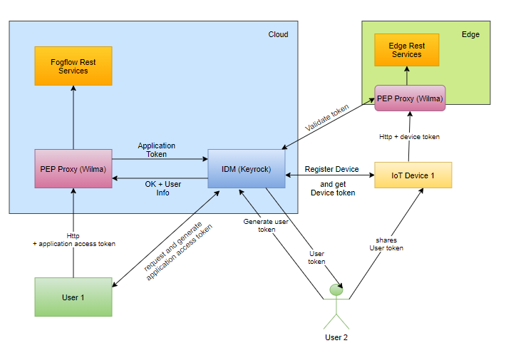

*****************************************************************
セキュリティ
*****************************************************************

HTTPS ベースの通信
=================================

クラウド エッジ通信を保護
------------------------------------------

FogFlow クラウド ノードと FogFlow エッジ ノード間の通信を保護するために、FogFlow は、主にクラウド ノードとエッジ ノード間、または2つのエッジ ノード間のデータ交換のために、NGSI9 および NGSI10 通信に HTTPS を使用するように構成できます。また、RabbitMQ で TLS を有効にすることで、トポロジー マスターとワーカー間の制御チャネルを保護できます。1つの FogFlow クラウド ノードと1つの FogFlow エッジ ノード間のデータ交換を保護するための導入手順です。

DNS サーバーを構成
-----------------------------

次の図に示すように、HTTPS ベースの通信をサポートするように FogFlow を設定するには、FogFlow クラウド ノードと FogFlow エッジ ノードに独自のドメイン名が必要です。これは、署名された証明書をドメイン名に関連付ける必要があるためです。したがって、クラウド ノードとエッジ ノードの両方のドメイン名を解決するには、DNS サービスを使用する必要があります。
たとえば、`freeDNS`_ をこの目的に使用できます。

.. _`freeDNS`: https://freedns.afraid.org

.. figure:: ../../en/source/figures/https-setup.png

.. important:: 

        クラウド ノードとエッジ ノードのドメイン名が適切に解決され、正しい IP アドレスが表示されることを確認してください。
	

FogFlow クラウド ノードを設定
------------------------------------

必要なすべてのスクリプトを取得
--------------------------------------------

以下のように docker-compose ファイルと構成ファイルをダウンロードします。

.. code-block:: console    

	# download the script that can fetch all required files
	wget https://raw.githubusercontent.com/smartfog/fogflow/master/docker/core/https/fetch.sh
	
	# make this script executable
	chmod +x fetch.sh

	# run this script to fetch all required files
	./fetch.sh

構成ファイルを変更
--------------------------------------------

.. code-block:: console    
	
	{
	    "coreservice_ip": "cloudnode.fogflow.io",   #change this to the domain name of your own cloud node 
	    "external_hostip": "cloudnode.fogflow.io",  #change this to the domain name of your own cloud node 
		...
	}

キーファイルと証明書ファイルを生成
--------------------------------------------

.. code-block:: console    

	# make this script executable
	chmod +x key4cloudnode.sh

	# run this script to fetch all required files
	./key4cloudnode.sh  cloudnode.fogflow.io

クラウド ノードで FogFlow コンポーネントを起動
-----------------------------------------------

.. code-block:: console    

	docker-compose up -d 

セットアップを検証
--------------------------------------------

.. code-block:: console    

    docker ps 

	CONTAINER ID      IMAGE                       COMMAND                  CREATED             STATUS              PORTS                                                 NAMES
	90868b310608      nginx:latest            "nginx -g 'daemon of…"   5 seconds ago       Up 3 seconds        0.0.0.0:80->80/tcp                                       fogflow_nginx_1
	d4fd1aee2655      fogflow/worker          "/worker"                6 seconds ago       Up 2 seconds                                                                 fogflow_cloud_worker_1
	428e69bf5998      fogflow/master          "/master"                6 seconds ago       Up 4 seconds        0.0.0.0:1060->1060/tcp                               fogflow_master_1
	9da1124a43b4      fogflow/designer        "node main.js"           7 seconds ago       Up 5 seconds        0.0.0.0:1030->1030/tcp, 0.0.0.0:8080->8080/tcp       fogflow_designer_1
	bb8e25e5a75d      fogflow/broker          "/broker"                9 seconds ago       Up 7 seconds        0.0.0.0:8070->8070/tcp                               fogflow_cloud_broker_1
	7f3ce330c204      rabbitmq:3              "docker-entrypoint.s…"   10 seconds ago      Up 6 seconds        4369/tcp, 5671/tcp, 25672/tcp, 0.0.0.0:5672->5672/tcp     fogflow_rabbitmq_1
	9e95c55a1eb7      fogflow/discovery       "/discovery"             10 seconds ago      Up 8 seconds        0.0.0.0:8090->8090/tcp                               fogflow_discovery_1
        399958d8d88a      grafana/grafana:6.5.0   "/run.sh"                29 seconds ago      Up 27 seconds       0.0.0.0:3003->3000/tcp                               fogflow_grafana_1
        9f99315a1a1d      fogflow/elasticsearch:7.5.1 "/usr/local/bin/dock…" 32 seconds ago    Up 29 seconds       0.0.0.0:9200->9200/tcp, 0.0.0.0:9300->9300/tcp       fogflow_elasticsearch_1
        57eac616a67e      fogflow/metricbeat:7.6.0 "/usr/local/bin/dock…"   32 seconds ago     Up 29 seconds                                                                  fogflow_metricbeat_1
	

FogFlow エッジ ノードを設定
-------------------------------------

必要なすべてのスクリプトを取得
--------------------------------------------

以下のように docker-compose ファイルと構成ファイルをダウンロードします。

.. code-block:: console    

	# download the script that can fetch all required files
	wget https://raw.githubusercontent.com/smartfog/fogflow/master/docker/edge/https/fetch.sh
	
	# make this script executable
	chmod +x fetch.sh

	# run this script to fetch all required files
	./fetch.sh

構成ファイルを変更
--------------------------------------------

.. code-block:: console    
	
	{
	    "coreservice_ip": "cloudnode.fogflow.io",   #change this to the domain name of your own cloud node 
	    "external_hostip": "edgenode1.fogflow.io",  #change this to the domain name of your own edge node 
		...
	}

キーファイルと証明書ファイルを生成
--------------------------------------------

.. code-block:: console    

	# make this script executable
	chmod +x key4edgenode.sh

	# run this script to fetch all required files
	./key4edgenode.sh  edgenode1.fogflow.io

エッジ ノードで FogFlow コンポーネントを開始
------------------------------------------------

.. code-block:: console    

	docker-compose up -d 

セットアップを検証
--------------------------------------------

.. code-block:: console    

	docker ps 

	CONTAINER ID        IMAGE               COMMAND             CREATED              STATUS              PORTS                                      NAMES
	16af186fb54e        fogflow/worker      "/worker"           About a minute ago   Up About a minute                                              https_edge_worker_1
	195bb8e44f5b        fogflow/broker      "/broker"           About a minute ago   Up About a minute   0.0.0.0:80->80/tcp, 0.0.0.0:443->443/tcp   https_edge_broker_1
	

FogFlow ダッシュボードを介してシステム ステータスを確認
------------------------------------------------------

FogFlow ダッシュボードを Web ブラウザーで開いて、次の URL を介して現在のシステム ステータスを確認できます: https://cloudnode.fogflow.io/index.html

.. important:: 

        クラウド ノードのドメイン名が適切に解決できることを確認してください。

        自己署名 SSL 証明書が使用されている場合、ブラウザの警告表示は、証明書が信頼されるべきではないことを示しています。この警告を超えて進むと、https 経由で FogFlow ダッシュボードの Web ページを表示できます。

ID 管理 (Identity Management) を使用した安全な FogFlow
=======================================================

ID 管理 (IdM) は、いくつかの認証トークンを確立された ID に関連付けることにより、アプリケーションまたはシステムにアクセスできる個人またはグループを識別、認証するためのプロセスです。IdM は、ユーザーまたはアプリケーションに関するデータを制御するタスクです。このチュートリアルでは、FogFlow Designer のセキュリティ実装と安全な Cloud-Edge 通信について説明およびテストします。

用語
---------------

**Keyrock**: `Keyrock`_ は、ID 管理を担当する FIWARE コンポーネントです。Keyrock は、サービスとアプリケーションを保護するために、OAuth2 ベースの認証と承認のセキュリティを追加する機能も提供します。

**PEP Proxy Wilma**: `PEP Proxy Wilma`_ は、ID 管理のパフォーマンスを向上させる FIWARE Generic Enabler です。Keyrock と組み合わせて、FIWARE Generic Enabler によって公開されているエンドポイントへのアクセスを保護します。Wilma はリクエストをリッスンし、Keyrock から認証して、限られた期間キャッシュに保存します。新しいリクエストが到着すると、Wilma は最初にキャッシュをチェックインし、許可が保存されている場合は直接認証します。それ以外の場合は、認証のためにリクエストを Keyrock に送信します。

.. _`Keyrock`: https://fiware-idm.readthedocs.io/en/latest/
.. _`PEP Proxy Wilma`: https://fiware-pep-proxy.readthedocs.io/en/latest/

セキュリティ アーキテクチャ
------------------------

IDMとのクラウドとエッジの相互作用
------------------------------------

**FogFlow クラウド ノード フロー:**

1. アーキテクチャ図のように、PEP Proxy は FogFlow Designer に代わって最初に Keyrock に登録します。詳細な説明は、このチュートリアルの以下 (`below`_) のトピックに記載されています。

2. ユーザーは、Reaquest ヘッダーの PEP Proxy のアクセス トークンを使用して、PEP Proxy のプロキシ経由で Designer にアクセスできます。

.. _`below`: https://fogflow.readthedocs.io/en/latest/https.html#setup-security-components-on-cloud-node

**FogFlow エッジ ノードフロー:**

1. エッジノードに代わって、PEP Procy の1つのインスタンスが Keyrock に事前登録され、エッジは oauth 資格情報を使用して PEP Proxy の詳細をフェッチします。詳細な説明>は、このチュートリアルの以下のトピックに記載されています。ここ `here`_ をクリックして参照してください

2. 認証後、エッジ ノードは FogFlow クラウド ノードと通信できるようになります。

3. すべてのデバイスは、Keyrock に登録されている各 IoT デバイスに代わって生成されたアクセス トークンを使用して、自身を登録するか、FogFlow エッジノードと通信できます

.. _`here`: https://fogflow.readthedocs.io/en/latest/https.html#setup-components-on-edge

インストール
------------------

.. code-block:: console

        # the docker-compose file to start security components on the cloud node
	wget https://raw.githubusercontent.com/smartfog/fogflow/master/docker/core/http/docker-compose.idm.yml

	# the configuration file used by IdM
	wget https://raw.githubusercontent.com/smartfog/fogflow/master/docker/core/http/idm_config.js

        # the configuration file used by PEP Proxy
        wget https://raw.githubusercontent.com/smartfog/fogflow/master/docker/core/http/pep_config.js

IP構成を変更
-------------------------------------------------------------

設定ファイルは、以下の場所でユーザー自身の環境に応じた IP アドレスで変更する必要があります。

- docker-compose.idm.yml ファイルの PEP Proxy ホスト ポートとコンテナー ポートを変更します。

- 環境に応じて、以下の場所で IdM 構成ファイルを変更します。

.. code-block:: console

        
        config.port = 3000;
        config.host = "http://<IdM IP>:" + config.port;

        config.database = {
            host: "localhost",
            password: "idm",
            username: "root",
            database: "idm",
            dialect: "mysql",
            port: undefined
        };

すべてのセキュリティ コンポーネントを起動します:

.. code-block:: console

        docker-compose -f docker-compose.idm.yml up -d

        #Check all the containers are Up and Running using "docker ps -a"
         docker ps -a
	 

クラウド ノードにセキュリティ コンポーネントをセットアップ
-------------------------------------------------

以下は、ID 管理のコンポーネント間の通信をセットアップするために実行する必要のある手順です。

**ステップ1**: Keyrock Identity Management を使用してPEP Proxy 自体を認証します。

.. figure:: ../../en/source/figures/keyrock_Account_Portal.png

Keyrock (http://180.179.214.135:3000/idm/) アカウントにユーザー資格情報 (電子メールとパスワード) でログインします。
    例: admin@test.com および 1234.
    
ログイン後、“Applications”、”FogFLow PEP” の順にクリックします。
"PEP Proxy" リンクをクリックして、Application ID、PEP Proxy のユーザー名、および PEP Proxy のパスワードを取得します。

注意: Application ID、PEP Proxy のユーザー名、および PEP Proxy のパスワードは、‘Register PEP Proxy’ ボタンをクリックすると生成されます。

Designer を保護するために PEP Proxy を設定するには、pep_config ファイル内で以下を変更します。アプリケーションの登録中に、Keyrock ダッシュボードから PEP Proxy 資格情報を取得します。

.. code-block:: console

        config.pep_port = process.env.PEP_PROXY_PORT || 80;
        config.idm = {
          host: process.env.PEP_PROXY_IDM_HOST || '180.179.214.135',
          port: process.env.PEP_PROXY_IDM_PORT || 3000,
          ssl: toBoolean(process.env.PEP_PROXY_IDM_SSL_ENABLED, false),
        };
        config.app = {
          host: process.env.PEP_PROXY_APP_HOST || '180.179.214.135',
          port: process.env.PEP_PROXY_APP_PORT || ’80’,
          ssl: toBoolean(process.env.PEP_PROXY_APP_SSL_ENABLED, false), // Use true if the app server listens in https
        };

        config.pep = {
          app_id: process.env.PEP_PROXY_APP_ID || '9b51b184-808c-498c-8aac-74ffedc1ee72',
          username: process.env.PEP_PROXY_USERNAME || 'pep_proxy_4abf36da-0936-46f9-a7f5-ac7edb7c86b6',
          password: process.env.PEP_PASSWORD || 'pep_proxy_fb4955df-79fb-4dd7-8968-e8e60e4d6159',
          token: {
              secret: process.env.PEP_TOKEN_SECRET || '', // Secret must be configured in order validate a jwt
          },
          trusted_apps: [],
        };

上記の変更後、PEP Proxy コンテナーを再起動します。

**Application Access Tokenを生成**

**ステップ2**: Keyrock IDM に、アプリケーション アクセス トークン と リフレッシュ トークンを生成するように要求します。

1. 以下のスクリーンショットに従って、HTTP リクエストのヘッダー、ペイロード、および承認フィールドを設定します。

2. "Send" ボタンをクリックして、application access-token を取得します。

.. figure:: ../../en/source/figures/detailDescriptionofSampleRequest.png

注意: ‘Oauth2 Credentials’ の下の Keyrock ダッシュボードから Client ID および Client Secret を取得します。

クラウド セキュリティの実装の流れは、下図からわかります。

.. figure:: ../../en/source/figures/architectureDiagram.png

以下は、上記のアーキテクチャ図に関連するいくつかのポイントです:

1. Keyrock のアプリケーションとしてデザイナー用の PEP Proxy を登録します。

2. Keyrock はアクセス トークンを PEP Proxy に送信します。

3. そのトークンを使用して、ユーザーはエンティティの作成リクエストをデザイナーに送信します。

4. Designer は認証のためにトークンを Keyrock に送信します。

5. エンティティ作成リクエストは FogFlow に転送されます。

**token_access を使用したエンティティ登録**

.. code-block:: console

        curl -iX POST   'http://<Cloud_Public_IP>:<PEP_Host-port>/ngsi10/updateContext'  -H 'X-Auth-Token: <token>'  -H 'Content-Type: application/json' 
     -d '
      {
        "contextElements": [
          {
           "entityId": {
              "id": "Temperature100",
              "type": "Temperature",
              "isPattern": false
          },
           "attributes": [
              {
              "name": "temp",
              "type": "float",
              "value": 34
              }
            ],
           "domainMetadata": [
             {
              "name": "location",
              "type": "point",
              "value": {
                "latitude": 49.406393,
                "longitude": 8.684208
               }
             }
            ],
         "updateAction": "UPDATE"
         }
       ]
      }'

Edge でコンポーネントをセットアップ
-----------------------------------

FogFlow エッジノードには、主にエッジ ブローカーとエッジ ワーカーが含まれます。Iot デバイスとエッジノード間の FogFlow エッジ通信を保護するために、PEP Proxy が使用されています。Auth Token を作成するには、最初に IoT デバイスを Keyrock に登録します。そのため、スクリプトはエッジノードの開始時に呼び出し、Keyrock を使用してPEP Proxy をインスタンス化し、Keyrock API を使用して PEP Proxy が機能するように構成ファイルをセットアップします。スクリプトは次の手順を実行します。

**前提条件**

エッジをセットアップする前に、2つのコマンドをインストールする必要があります:

1. curl

2. jq

スクリプトのインストール
------------------------

以下のスクリプトは、エッジ ノードを設定するためにダウンロードする必要があります。

.. code-block:: console    
         
	#download the deployment scripts
	wget https://raw.githubusercontent.com/smartfog/fogflow/development/docker/edge/http/start.sh
	wget https://raw.githubusercontent.com/smartfog/fogflow/development/docker/edge/http/stop.sh 
        wget https://raw.githubusercontent.com/smartfog/fogflow/development/docker/edge/http/script.sh
        wget https://raw.githubusercontent.com/smartfog/fogflow/development/docker/edge/http/oauth_config.js
	wget https://raw.githubusercontent.com/smartfog/fogflow/development/docker/edge/http/pep-config.js

        #make them executable
        chmod +x script.sh start.sh stop.sh

IP構成を変更
-------------------------------------------------------------

構成ファイルで次のものを変更します:

* oauth_config.js を変更し、PEP Proxy の構成設定を取得するために必要な IdM IP、エッジ IP を追加します

**エッジ ノード コンポーネントを開始**
 
.. code-block:: console    

      #start components in the same script
      ./start.sh 

FogFlow edge-IoT デバイスを保護するために、通信 認証トークンが各 IoT デバイスに代わって使用されています。認証トークンを作成するには、

* KeyrockにIoTデバイスを登録する必要があります

* スクリプトはエッジ ノードの開始時に呼び出され、Keyrock API を使用してそのエッジ ノードに代わって Keyrock で PEP Proxy を構成します

Note: start.sh スクリプトは、Application ID, Application Secret, PEP Proxy ID, PEP Proxy Secret, Authorization code, IDM Token およびコンソール上の Access token を返します。今後の使用のためにこれらを保存してください。

**FogFlow との IoT デバイスの相互作用**

.. figure:: figures/architectureDiagram1.png

**図に示すリクエストのフロー:**

**ステップ 1** : ユーザーは自分の資格情報を使用して IDMに リクエストを送信し、そのユーザーに固有の ユーザー アクセス トークン (User Access Token) を生成します。このために、ユーザーは自分のユーザー名とパスワードとともにスクリプトを使用できます。

.. code-block:: console

        ./user_token_generation.sh admin@test.com 1234

Note: たとえば、上記のスニペットでは、管理者のユーザー名は "admin@test.com"、パスワードは "1234" です

**ステップ 2** : スクリプトは、以下に示すようにユーザー アクセス トークンを返します

.. figure:: figures/user_token.png

**ステップ 3** : ユーザーは自分のアクセス トークン (つまり、ユーザー アクセス トークン) を IoT デバイスと共有します

**ステップ 4** : 次に、スクリプトへの引数として渡された ユーザー アクセス トークンを使用して IoT デバイスが登録されます

.. code-block:: console

        ./device_token_generation.sh f9ffa629-9aff-4c98-ac57-1caa2917fed2

Note: たとえば、上記のスニペットでは、"f9ffa629-9aff-4c98-ac57-1caa2917fed2" がユーザーアクセストークンです

**ステップ 5** : スクリプトは、以下に示すように、デバイス アクセス トークンとデバイス資格情報 (ID とパスワード) を返します

.. figure:: figures/device_token.png

**ステップ  6** : これで、上記のデバイス アクセス トークンを使用して、IoT デバイスは PEP Proxy ポートに Fogflow 固有のリクエストを行うことでエッジノードと対話できます

curl リクエストを使用して Keyrock に IoT デバイスを登録
------------------------------------------------------

IoT デバイスを登録するリクエストの例を以下に示します

.. code-block:: console

   curl --include \
     --request POST \
     --header "Content-Type: application/json" \
     --header "X-Auth-token: <token-generated-from-script>" \
  'http://keyrock/v1/applications/6e396def-3fa9-4ff9-84eb-266c13e93964/iot_agents'

Note: 後で利用するために、デバイス ID とデバイス パスワードを保存してください

.. figure:: figures/keyrock_iot.png

登録された IoT センサーごとに認証トークンを生成するリクエストの例を以下に示します。

.. code-block:: console

    curl -iX POST \
     'http://<IDM_IP>:3000/oauth2/token' \
     -H 'Accept: application/json' \
     -H 'Authorization: Basic <code-generated-from-script>' \
     -H 'Content-Type: application/x-www-form-urlencoded' \
     --data "username=iot_sensor_02bc0f75-07b5-411a-8792-4381df9a1c7f&password=iot_sensor_277bc253-5a2f-491f-abaa-c7b4e1599d6e&grant_type=password"

Note: 後で利用するために、アクセス トークンを保存してください

.. figure:: figures/keyrock_token.png

curl リクエストを使用してエッジ ノードにデバイスを登録
------------------------------------------------------

登録デバイスのペイロードの例を以下に示します。

.. code-block:: console
 

     Curl -iX POST 'http://<Application_IP>:<Application_Port>/NGSI9/registerContext' -H 'Content-Type: application/json' -H 'fiware-service: openiot' -H 'X-Auth-token: <token-generated-for-IoT-device>' -H 'fiware-servicepath: /' -d '
      {
          "contextRegistrations": [
              {
                  "entities": [
                      {
                          "type": "Lamp",
                          "isPattern": "false",
                          "id": "Lamp.0020"
                      }
                  ], 
                  "attributes": [
                      {
                          "name": "on",
                          "type": "command"
                      },
                      {
                          "name": "off",
                          "type": "command"
                      }
                  ],
                  "providingApplication": "http://0.0.0.0:8888"
              }
          ],
        "duration": "P1Y"
      }'

**エッジ ノード コンポーネントの停止**

* 以下のスクリプトを使用して、ブローカーおよびワーカーであるエッジ コンポーネントを停止します

.. code-block:: console

       #stop all components in the same script
       ./stop.sh
