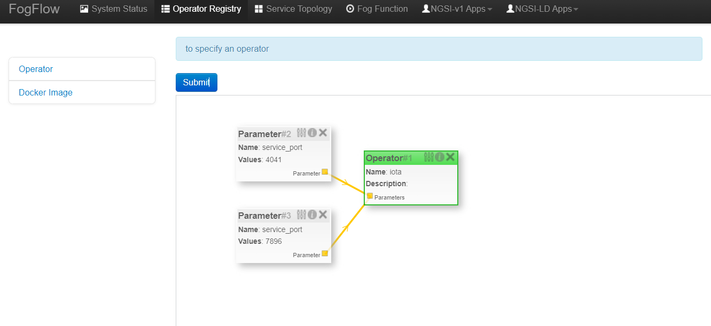
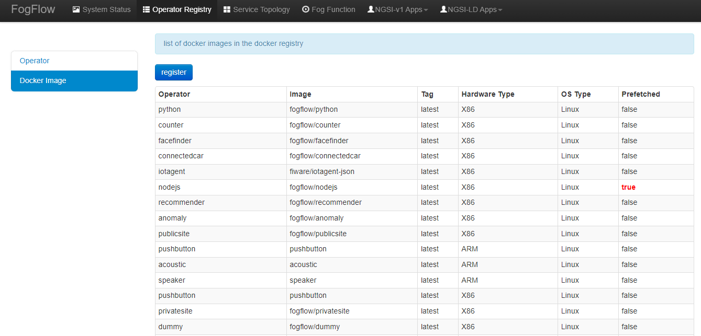
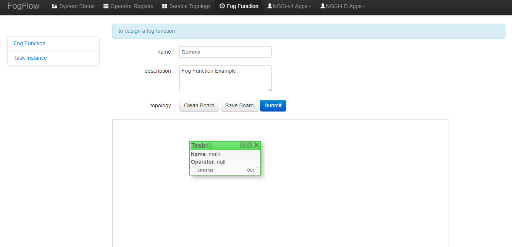
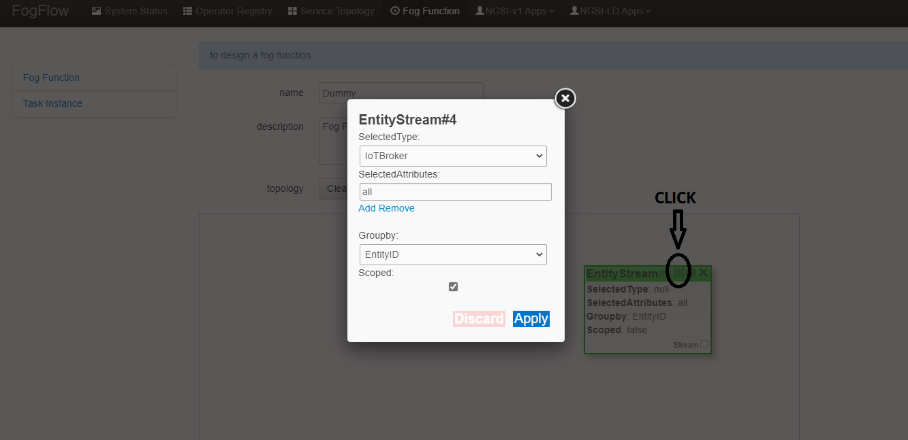
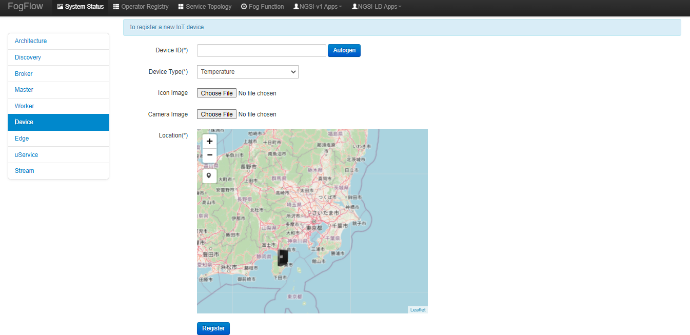

************************************************************
インテント ベースのプログラミング (Intent-Based Programming)
************************************************************

現在、次の2つのプログラミング モデルが FogFlow によって提供されており、さまざまなタイプのワークロード パターンをサポートしています。

  1. **Fog Function** (フォグ ファンクション)
  
  2. **Service Topology** (サービス トポロジー)

フォグ ファンクション (Fog Function)
======================================

フォグ ファンクションを定義してトリガー
------------------------------------

FogFlow は、サーバーレス エッジ コンピューティングを可能にします。つまり、開発者はいわゆるフォグ ファンクションを定義して送信でき、残りは FogFlow によって自動的に実行されます。

-  入力データが利用可能になったときに送信されたフォグ ファンクションをトリガーします。
-  定義された粒度に従って、作成するインスタンスの数を決定します。
-  作成したインスタンスをデプロイする場所を決定します。

上記のテキストのインスタンスは、その中で処理ロジックを実行するタスク インスタンスを指し、この処理ロジックは FogFlow のオペレーターによって提供されます。事前にユーザー登録が必要です。オペレーターの例の実装については、次のセクションで説明します。

タスク オペレーターの登録
--------------------------------------------------------

オペレーター コードは、Docker イメージの形式である必要があり、Docker Hub で使用できる必要があります。FogFlow へのオペレーターのレジストレーションは、次の2つの方法のいずれかで行うことができます。

.. note:: 各オペレーターは一意の名前を持っている必要がありますが、同じオペレーターを複数の Docker イメージに関連付けることができます。各イメージは、1つの特定のハードウェアまたはオペレーティング システム用ですが、同じデータ処理ロジックを実装するためのものです。実行時に、FogFlow は、エッジ ノードの実行環境に基づいて、エッジ ノードでスケジュールされたタスクを実行するための適切な Docker イメージを選択します。

FogFlow Task Designer から登録
----------------------------------------

FogFlow にオペレーターを登録するには2つのステップがあります。

**オペレーターを登録して、** オペレーターの名前と必要な入力パラメーターを定義します。このコンテキストでは、オペレーターはいくつかのパラメーターを持つ名前付き要素に他なりません。次の図は、登録されているすべてのオペレーターとそのパラメーター数のリストを示しています。

.. image:: ../../en/source/figures/operator-list.png
   
"register" ボタンをクリックすると、下にデザイン エリアが表示され、オペレーターを作成してパラメーターを追加できます。オペレーター アプリケーションのポートを定義するには、"service_port" を使用し、その値として有効なポート番号を指定します。アプリケーションは、このポートを介して外部からアクセスできます。

**Docker イメージを登録し、オペレーターを選択して、** Docker イメージを定義し、すでに登録されているオペレーターをそれに関連付けます。

次の図は、登録されているすべての Docker イメージのリストと各イメージの重要な情報を示しています。

"register" ボタンをクリックすると、以下のようなフォームが表示されます。必要事項をご記入の上、"register" ボタンをクリックしてご登録ください。フォームは次のように説明されます。

* Image: オペレーターの Docker イメージの名前
* Tag: タグは、オペレーターの Docker イメージを公開するために使用されます。デフォルトでは "latest" です。
* Hardware Type: x86 または ARM (Raspberry Pi など) を含む、Docker イメージがサポートするハードウェア タイプ。
* OS Type: Docker イメージがサポートするオペレーティングシステム タイプ。現在、これは Linux のみに限定されています。
* Operator: オペレーター名。一意である必要があり、サービス トポロジーを定義するときに使用されます。
* Prefetched: これがチェックされている場合、すべてのエッジ ノードがこの Docker イメージのフェッチを事前に開始することを意味します。それ以外の場合、オペレーターの Docker イメージは、エッジ ノードがこのオペレーターに関連付けられたスケジュールされたタスクを実行する必要がある場合にのみ、オンデマンドでフェッチされます。

.. important::
    
    Docker イメージの名前は、`Docker Hub`_ に公開されている名前と一致している必要があることに注意してください。デフォルトでは、FogFlow は、オペレーター用に Docker Hub に登録されている名前を使用して、必要な Docker イメージをフェッチします。

.. _`Docker Hub`: https://github.com/smartfog/fogflow/tree/master/application/operator/anomaly

.. image:: ../../en/source/figures/dockerimage-registry.png

NGSI アップデートを送信してプログラムで登録
----------------------------------------------------------

構築された NGSI アップデート メッセージの Docker イメージをクラウドにデプロイされた IoT Broker に送信することで、オペレーターを登録することもできます。

オペレーターとそのオペレーターの Docker イメージを登録するための curl と JavaScript ベースのコード例を次に示します。

.. note:: JavaScript コード例では、JavaScript ベースのライブラリを使用して FogFlow IoT Broker とやり取りします。これは、ライブラリで GitHub コード リポジトリ (designer/public/lib/ngsi) から見つけることができます。これは、Web ページの ngsiclient.js に含まれている必要があります。

.. note:: curl の場合は、Clould IoT Broker がローカルホストのポート 8070 で実行されていることを前提としています。

.. tabs::

   .. group-tab:: Curl

        .. code-block:: console 

		curl -iX POST \
		  'http://localhost:8070/ngsi10/updateContext' \
	  	-H 'Content-Type: application/json' \
	  	-d '		
	     	{
			"contextElements": [
			{ 
				"entityId":{ 
					"id":"counter",
					"type":"Operator"
				},
				"attributes":[ 
				{
					"name":"designboard",
					"type":"object",
					"value":{ 
				 	}
				},
				{ 
					"name":"operator",
					"type":"object",
					"value":{ 
						"description":"",
						"name":"counter",
						"parameters":[ 
				
						]
				 	}
				}
				],
				"domainMetadata":[ 
				{ 
					"name":"location",
					"type":"global",
					"value":"global"
				}
				]
			},
			{ 
				   "entityId":{ 
					  "id":"fogflow/counter.latest",
					  "type":"DockerImage"
				   },
				   "attributes":[ 
					  { 
						 "name":"image",
						 "type":"string",
						 "value":"fogflow/counter"
					  },
					  { 
						 "name":"tag",
						 "type":"string",
						 "value":"latest"
					  },
					  { 
						 "name":"hwType",
						 "type":"string",
						 "value":"X86"
					  },
					  { 
						 "name":"osType",
						 "type":"string",
						 "value":"Linux"
					  },
					  { 
						 "name":"operator",
						 "type":"string",
						 "value":"counter"
					  },
					  { 
						 "name":"prefetched",
						 "type":"boolean",
						 "value":false
					  }
				   ],
				   "domainMetadata":[ 
					  { 
						 "name":"operator",
						 "type":"string",
						 "value":"counter"
					  },
					  { 
						 "name":"location",
						 "type":"global",
						 "value":"global"
					  }
				   ]
				}
			],
	        "updateAction": "UPDATE"
		}'

   .. group-tab:: Javascript

        .. code-block:: Javascript 

		name = "counter"

		//register a new operator
		var newOperatorObject = {};

		newOperatorObject.entityId = {
			id : name,
			type: 'Operator',
			isPattern: false
		};

		newOperatorObject.attributes = [];

		newOperatorObject.attributes.designboard = {type: 'object', value: {}};

		var operatorValue = {}
		operatorValue = {description: "Description here...", name: name, parameters: []};
		newOperatorObject.attributes.operator = {type: 'object', value: operatorValue};

		newOperatorObject.metadata = [];
		newOperatorObject.metadata.location = {type: 'global', value: 'global'};

		// assume the config.brokerURL is the IP of cloud IoT Broker
		var client = new NGSI10Client(config.brokerURL);
		client.updateContext(newOperatorObject).then( function(data) {
			console.log(data);
		}).catch( function(error) {
			console.log('failed to register the new Operator object');
		});

		image = {}

		image = {
			name: "fogflow/counter",
			tag: "latest",
			hwType: "X86",
			osType: "Linux",
			operator: "counter",
			prefetched: false
		};

		newImageObject = {};

		newImageObject.entityId = {
			id : image.name + '.' + image.tag,
			type: 'DockerImage',
			isPattern: false
		};

		newImageObject.attributes = [];
		newImageObject.attributes.image = {type: 'string', value: image.name};
		newImageObject.attributes.tag = {type: 'string', value: image.tag};
		newImageObject.attributes.hwType = {type: 'string', value: image.hwType};
		newImageObject.attributes.osType = {type: 'string', value: image.osType};
		newImageObject.attributes.operator = {type: 'string', value: image.operator};
		newImageObject.attributes.prefetched = {type: 'boolean', value: image.prefetched};

		newImageObject.metadata = [];
		newImageObject.metadata.operator = {type: 'string', value: image.operator};
		newImageObject.metadata.location = {type: 'global', value: 'global'};

		client.updateContext(newImageObject).then( function(data) {
			console.log(data);
		}).catch( function(error) {
			console.log('failed to register the new Docker Image object');
		});

FogFlow ダッシュボードを使用して、パラメーターを持つオペレーターを作成することをお勧めします。ただし、ユーザーが curl を使用したい場合は、上のイメージに示されているパラメーターを使用したオペレーター登録の例について、以下を参照できます。その後、ユーザーはこのオペレーターを使用する Docker イメージを登録できます。

ここでの x 変数と y 変数は、単にデザイナー ボードの座標です。ユーザーが指定しない場合、デフォルトでは、すべての要素ブロックが平面の原点に配置されます。

.. code-block:: curl

	curl -iX POST \
		  'http://localhost:8070/ngsi10/updateContext' \
	  	-H 'Content-Type: application/json' \
	  	-d '		
	     	{
			"contextElements": [
				{ 
				   "entityId":{ 
				      "id":"iota",
				      "type":"Operator"
				   },
				   "attributes":[ 
				      { 
				         "name":"designboard",
				         "type":"object",
				         "value":{ 
				            "blocks":[ 
				               { 
				                  "id":1,
				                  "module":null,
				                  "type":"Parameter",
				                  "values":{ 
				                     "name":"service_port",
				                     "values":[ 
				                        "4041"
				                     ]
				                  },
				                  "x":-425,
				                  "y":-158
				               },
				               { 
				                  "id":2,
				                  "module":null,
				                  "type":"Parameter",
				                  "values":{ 
				                    "name":"service_port",
 				                    "values":[ 
				                        "7896"
				                     ]
				                  },
				                  "x":-393,
				                  "y":-51
				               },
				               { 
				                  "id":3,
				                  "module":null,
				                  "type":"Operator",
				                  "values":{ 
				                     "description":"",
				                     "name":"iota"
				                  },
				                  "x":-186,
				                  "y":-69
				               }
				            ],
				            "edges":[ 
				               { 
				                  "block1":2,
				                  "block2":3,
				                  "connector1":[ 
				                     "parameter",
				                     "output"
				                  ],
				                  "connector2":[ 
				                     "parameters",
				                     "input"
				                  ],
				                  "id":1
				               },
				               { 
				                  "block1":1,
				                  "block2":3,
				                  "connector1":[ 
				                     "parameter",
				                     "output"
				                  ],
				                  "connector2":[ 
				                     "parameters",
				                     "input"
				                  ],
				                  "id":2
				               }
				            ]
				         }
				      },
				      { 
				         "name":"operator",
				         "type":"object",
				         "value":{ 
				            "description":"",
				            "name":"iota",
				            "parameters":[ 
				               { 
				                  "name":"service_port",
				                  "values":[ 
				                     "7896"
				                  ]
				               },
				               { 
				                  "name":"service_port",
				                  "values":[ 
				                     "4041"
 				                 ]
				               }
				            ]
				         }
				      }
				   ],
				   "domainMetadata":[ 
				      { 
				         "name":"location",
				         "type":"global",
				         "value":"global"
				      }
				   ]
				}
			],
	        "updateAction": "UPDATE"
		}'

"Dummy" フォグ ファンクションを定義
-----------------------------------------------

次の手順は、FogFlow Task Designer が提供する Web ポータルを使用して、単純な "dummy" フォグ ファンクションを定義およびテストする方法を示しています。"Dummy" オペレーターは、デフォルトですでに FogFlow に登録されています。

FogFlow エディターからフォグ ファンクションを作成
-------------------------------------------------

タスク デザインボード上でマウスを右クリックすると、メニューがポップアップ表示されます。

.. image:: ../../en/source/figures/fog-function-create-new.png

表示されるメニューには、次の項目が含まれます:

-  **Task**: フォグ ファンクション名と処理ロジック（またはオペレーター）を定義するために使用されます。タスクには入力ストリームと出力ストリームがあります。
-  **EntityStream**: 入力データストリームとして、フォグ ファンクション タスクとリンクできる入力データ要素です。

ポップアップ メニューから "Task" をクリックすると、以下に示すように、タスク要素がデザインボードに配置されます。

次の図に示すように、右上隅にある "configuration" ボタンをクリックして、タスクの構成を開始します。タスクの名前を指定し、事前登録されたオペレーターのリストからオペレーターを選択してください。

.. image:: ../../en/source/figures/fog-function-configure-task-element.png

ポップアップ メニューから "EntityStream" をクリックして、デザインボードに "EntityStream" 要素を配置してください。

.. image:: ../../en/source/figures/fog-function-add-entityStream-element.png

次のものが含まれています:

	* Selected Type: 可用性がフォグ ファンクションをトリガーする入力ストリームのエンティティ タイプを定義するために使用されます。
	* Selected Attributes: 選択されたエンティティ タイプについて、フォグ ファンクションに必要なエンティティ属性。"all" は、すべてのエンティティ属性を取得することを意味します。
	* Group By: このフォグ ファンクションの粒度を定義する、選択したエンティティ属性の1つである必要があります。
	* Scoped: エンティティ データが場所固有であるかどうかを示します。True は、場所固有のデータがエンティティに記録されていることを示し、False は、ブロードキャストされたデータの場合に使用されます。たとえば、特定の場所ではなく、すべての場所に当てはまるルールまたはしきい値データです。
 
.. note:: 粒度 (granularity) は、このフォグ ファンクションのインスタンスの数を決定します。原則として、定義されたフォグ ファンクションのタスク インスタンスの数は、使用可能な入力データについて、選択されたエンティティ属性の一意の値の総数に等しくなります。また、各インスタンスは、特定の属性値を持つすべての入力エンティティを処理するように割り当てられます。

この例では、粒度は "id" で定義されています。これは、FogFlow が個々のエンティティ Id ごとに新しいタスク インスタンスを作成することを意味します。

以下に示すように、構成ボタンをクリックして EntityStream を構成します。この例では、"dummy" フォグ ファンクションの入力データのエンティティ タイプとして "Temperature" を選択します。

タスクには複数の EntityStream が存在する可能性があり、ここに示すように、それらをタスクに接続する必要があります。

.. image:: ../../en/source/figures/fog-function-connect-elements.png 

独自のファンクションのコードを提供
-----------------------------------------
    
現在、FogFlow を使用すると、開発者は登録済みのオペレーター内で独自のファンクション コードを指定できます。サンプル オペレーターについては、ダミー オペレーター コード (|dummy operator code|) を参照してください。

.. |dummy operator code| raw:: html

    <a href="https://github.com/smartfog/fogflow/tree/master/application/operator/dummy" target="_blank">dummy operator code</a>

   
.. code-block:: javascript

    exports.handler = function(contextEntity, publish, query, subscribe) {
        console.log("enter into the user-defined fog function");
        
        var entityID = contextEntity.entityId.id;
    
        if (contextEntity == null) {
            return;
        }
        if (contextEntity.attributes == null) {
            return;
        }
    
        var updateEntity = {};
        updateEntity.entityId = {
            id: "Stream.result." + entityID,
            type: 'result',
            isPattern: false
        };
        updateEntity.attributes = {};
        updateEntity.attributes.city = {
            type: 'string',
            value: 'Heidelberg'
        };
    
        updateEntity.metadata = {};
        updateEntity.metadata.location = {
            type: 'point',
            value: {
                'latitude': 33.0,
                'longitude': -1.0
            }
        };

        console.log("publish: ", updateEntity);        
        publish(updateEntity);        
    };

上記の JavaScript コード例は、フォグ ファンクションの実装と見なすことができます。
この例のフォグ ファンクションは、"publish" コールバック ファンクションを呼び出すことによって固定エンティティを単純に書き込みます。

フォグ ファンクションの入力パラメーターは、次のように事前定義され、固定されています:

-  **contextEntity**: 受信したエンティティ データを表します。
-  **publish**: 生成された結果を FogFlow システムに公開するためのコールバック ファンクション
-  **query**: オプション。これは、独自の内部ファンクション ロジックが FogFlow コンテキスト管理システムから追加のエンティティ データをクエリする必要がある場合にのみ使用されます。
-  **subscribe**: オプション。これは、独自の内部ファンクション ロジックが FogFlow コンテキスト管理システムから追加のエンティティ データをサブスクライブする必要がある場合にのみ使用されます。

.. important::

    コールバック ファンクションの *クエリ* と *サブスクライブ* の場合、"extra" とは、フォグ ファンクションのアノテーションの入力として定義されていないエンティティ データを意味します。

    フォグ ファンクションの実装の JavaScript ベースのテンプレート (`Javascript-based template for fog function`_) も FogFlow リポジトリで提供されています。フォグ ファンクションについては、JavaScript ベースのテンプレートを参照してください

.. _`Javascript-based template for fog function`: https://github.com/smartfog/fogflow/tree/master/application/template/javascript

    Java と Python のテンプレートもリポジトリにあります。

    これらの3つのコールバック ファンクションを使用する方法を示すいくつかの例を次に示します。

- *publish* の使用例: 
	.. code-block:: javascript
	
	    var updateEntity = {};
	    updateEntity.entityId = {
	           id: "Stream.Temperature.0001",
	           type: 'Temperature',
	           isPattern: false
	    };            
	    updateEntity.attributes = {};     
	    updateEntity.attributes.city = {type: 'string', value: 'Heidelberg'};                
	    
	    updateEntity.metadata = {};    
	    updateEntity.metadata.location = {
	        type: 'point',
	        value: {'latitude': 33.0, 'longitude': -1.0}
	    };        
	       
	    publish(updateEntity);    
    
- *query* の使用例: 
	.. code-block:: javascript
	
	    var queryReq = {}
	    queryReq.entities = [{type:'Temperature', isPattern: true}];    
	    var handleQueryResult = function(entityList) {
	        for(var i=0; i<entityList.length; i++) {
	            var entity = entityList[i];
	            console.log(entity);   
	        }
	    }  
	    
	    query(queryReq, handleQueryResult);

- *subscribe* の使用例: 
	.. code-block:: javascript
	
	    var subscribeCtxReq = {};    
	    subscribeCtxReq.entities = [{type: 'Temperature', isPattern: true}];
	    subscribeCtxReq.attributes = ['avg'];        
	    
	    subscribe(subscribeCtxReq);     
    

フォグ ファンクションをサブミット
-----------------------------
    
"Submit"  ボタンをクリックすると、注釈付きのフォグ ファンクションが FogFlow にサブミットされます。

.. image:: ../../en/source/figures/fog-function-submit.png

"dummy" フォグ ファンクションをトリガー
--------------------------------------------

定義された "dummy" フォグ ファンクションは、必要な入力データが利用可能な場合にのみトリガーされます。次のコマンドを使用して、 "Temperature" センサー エンティティを作成して ファンクションをトリガーできます。次の必要な情報を入力してください。

-  **Device ID**: 一意のエンティティ ID を指定します。
-  **Device Type**: エンティティ タイプとして "Temperature" を使用します。
-  **Location**: 地図上に場所を配置します。

デバイスプロファイルが登録されると、新しい "Temperature" センサーエンティティが作成され、"dummy" フォグ ファンクションが自動的にトリガーされます。

.. image:: ../../en/source/figures/fog-function-triggering-device.png

フォグ ファンクションをトリガーするもう1つの方法は、NGSI エンティティのアップデートを送信して、"Temperature" センサー エンティティを作成することです。次のコマンドを実行して、FogFlow Broker に POST リクエストを発行できます。

.. code-block:: console 

    curl -iX POST \
      'http://localhost:8080/ngsi10/updateContext' \
      -H 'Content-Type: application/json' \
      -d '
    {
        "contextElements": [
            {
                "entityId": {
                    "id": "Device.temp001",
                    "type": "Temperature",
                    "isPattern": false
                },
                "attributes": [
                {
                  "name": "temp",
                  "type": "integer",
                  "value": 10
                }
                ],
                "domainMetadata": [
                {
                    "name": "location",
                    "type": "point",
                    "value": {
                        "latitude": 49.406393,
                        "longitude": 8.684208
                    }
                }
                ]
            }
        ],
        "updateAction": "UPDATE"
    }'

以下の方法でフォグ ファンクションが作動しているか確認してください。

- 次の図に示すように、このフォグ ファンクションのタスク インスタンスを確認してください
	.. image:: ../../en/source/figures/fog-function-task-running.png

- 次の図に示すように、実行中のタスク インスタンスによって生成された結果を確認します
	.. image:: ../../en/source/figures/fog-function-streams.png

サービス トポロジー (Service Topology)
====================================

サービス トポロジーを定義してトリガー
----------------------------------------

FogFlow では、サービス トポロジーは複数のオペレーターのグラフとして定義されます。サービス トポロジー内の各オペレーターには、同じトポロジー内の他のタスクへの依存関係を示す入力と出力の注釈が付けられます。**フォグ ファンクションとは異なり、サービス トポロジーは、カスタマイズされた "intent" オブジェクトによってオンデマンドでトリガーされます。**

次のセクションでは、開発者がサービス トポロジーを定義およびテストする方法を簡単な例で説明します。

異常検出のユースケース
---------------------------------------

このユース ケース スタディは、小売店が異常なエネルギー消費をリアルタイムで検出するためのものです。次の図に示すように、小売会社にはさまざまな場所に多数のショップが分散しています。ショップごとに、ショップ内のすべての電源パネルからの電力消費を監視するために Raspberry Pi デバイス (エッジ ノード) が展開されます。エッジで異常な電力使用が検出されると、ショップのアラーム メカニズムがトリガーされ、ショップの所有者に通知されます。さらに、検出されたイベントは、情報集約のためにクラウドに報告されます。集約された情報は、ダッシュボード サービスを介してシステム オペレーターに提示されます。さらに、システム オペレータは、異常検出のルールを動的に更新できます。

.. figure:: ../../en/source/figures/retails.png

* Anomaly Detector (異常検出器): このオペレーターは、小売店の電源パネルから収集されたデータに基づいて異常イベントを検出します。2種類の入力があります:

        * オペレーターによって提供および更新される検出ルール。検出ルールの入力ストリームタイプは ``broadcast`` に関連付けられています。つまり、このオペレーターのすべてのタスク インスタンスでルールが必要です。このオペレーターの粒度は ``shopID`` に基づいています。つまり、ショップごとに専用のタスク インスタンスが作成および構成されます。
        * 電源パネルからのセンサーデータ

* Counter (カウンター): このオペレーターは、各都市 (each city) のすべてのショップの異常イベントの総数をカウントします。したがって、そのタスクの粒度は ``city`` です。その入力ストリーム タイプは、前のオペレーター (異常検出器) の出力ストリーム タイプです。

結果コンシューマー (result consumers) には2つのタイプがあります:

(1)  クラウド内のダッシュボード サービス。グローバル スコープのカウンター オペレーターによって生成された最終的な集計結果をサブスクライブします。
(2)  各ショップのアラーム。小売店のローカル エッジ ノードで異常検出タスクによって生成された異常イベントをサブスクライブします。

.. figure:: ../../en/source/figures/retail-flow.png

サービス トポロジーに必要なオペレーター機能を実装
-----------------------------------------------------------------------

設計されたサービス トポロジーを定義する前に、サービス トポロジーで使用されるすべてのオペレーターは、ユーザーまたは FogFlow システムの他のプロバイダーによって提供される必要があります。この特定のユースケースでは、anomaly_detector と counter の2つのオペレーターを実装する必要があります。コード リポジトリで提供されている例を参照してください。

* `anomaly_detector`_  (異常検出器)

* `counter`_  (カウンター)

.. _`anomaly_detector`: https://github.com/smartfog/fogflow/tree/master/application/operator/anomaly
.. _`counter`: https://github.com/smartfog/fogflow/tree/master/application/operator/counter

サービス トポロジーを指定
-----------------------------------
サービス トポロジーで使用されるタスクが実装および登録されていると仮定すると、サービス トポロジーを指定する方法は2つあります。

FogFlow トポロジー エディタの使用
----------------------------------

最初の方法は、FogFlow エディターを使用してサービス トポロジーを指定することです。

.. figure:: ../../en/source/figures/retail-topology-1.png

図のように、以下の重要な情報を提供する必要があります。

#. 以下を含むトポロジー プロファイルを定義します
    * topology name：トポロジーの一意の名前。
    * service description：このサービスの内容を説明するテキスト。

#. サービス トポロジー内のデータ処理フローのグラフを描画します
    デザインボードのどこかを右クリックすると、メニューがポップアップ表示されます。次に、タスクまたは入力ストリームのいずれかを選択するか、シャッフルして、意図したデザインに従ってデータ処理フローを定義できます。

#. 以下を含む、データ フロー内の各要素のプロファイルを定義します。
    上の図に示すように、構成ボタンをクリックすると、データ処理フローの各要素のプロファイルの指定を開始できます。

    タスク プロファイルを指定するには、次の情報が必要です。

    * name: タスクの名前。
    * operator: このタスクのデータ処理ロジックを実装する演算子の名前。リストから表示できるように、事前にオペレーターを登録してください。
    * entity type of output streams: 生成された出力ストリームのエンティティ タイプを指定します。
    
    EntityStream プロファイルを指定するには、次の情報が必要です。

    * SelectedType: タスクによって入力ストリームとして選択されるエンティティ タイプを定義するために使用されます。
    * SelectedAttributes: タスクの状態を変更するために考慮される選択されたエンティティ タイプの1つまたは複数の属性を定義するために使用されます。
    * Groupby: このタスクのインスタンスをその場でいくつ作成するかを決定します。現在、以下のケースが含まれています。
	
        *  このタスク用に作成するインスタンスが1つしかない場合は、"groupby" = "all" を使用してください。
        *  入力ストリームのエンティティ ID ごとに1つのインスタンスを作成する必要がある場合は、ユーザー "groupby" = "entityID" を使用してください。
        *  特定のコンテキスト メタデータの一意の値ごとに1つのインスタンスを作成する必要がある場合は、この登録済みコンテキスト メタデータの名前を使用してください。
    
    * Scoped: エンティティ データが場所固有であるかどうかを示します。True は、場所固有のデータがエンティティに記録されていることを示し、False は、ブロードキャストされたデータの場合に使用されます。たとえば、特定の場所ではなく、すべての場所に当てはまるルールまたはしきい値データです。

    シャッフル要素 (Shuffling element) は、タスクの出力がシャッフル要素の入力であり、同じものがシャッフルによって入力として別のタスクに転送されるように、2つのタスク間のコネクタとして機能します。

NGSI Updateを使用して作成
-------------------------------------

もう1つの方法は、構築された NGSI アップデート メッセージをクラウドにデプロイされた IoT Broker に送信することにより、サービス トポロジーを登録することです。

上の画像に示されているサービス トポロジーを登録するための curl と JavaScript ベースのコードを次に示します。ユーザーは、上記のサービス トポロジー、つまり異常検出を参照して、このコードを理解できます。

.. note:: JavaScript のコード例では、JavaScript ベースのライブラリを使用して FogFlow IoT Broker とやり取りします。ライブラリは、GitHub コード リポジトリ(designer/public/lib/ngsi) から見つけることができます。Web ページに ngsiclient.js を含める必要があります。

.. note:: curl の場合は、Cloud IoT Broker がローカルホストのポート 8070 で実行されていることを前提としています。

.. tabs::

   .. group-tab:: curl

        .. code-block:: console 

		curl -iX POST \
			'http://localhost:8070/ngsi10/updateContext' \
			-H 'Content-Type: application/json' \
			-d '
			{
				"contextElements": [
				{ 
					"entityId":{ 
						"id":"Topology.anomaly-detection",
						"type":"Topology"
					},
					"attributes":[ 
					{ 
						"name":"status",
						"type":"string",
						"value":"enabled"
					},
					{ 
						"name":"designboard",
						"type":"object",
						"value":{ 
							"blocks":[ 
							{ 
								"id":1,
								"module":null,
								"type":"Task",
								"values":{ 
									"name":"Counting",
									"operator":"counter",
									"outputs":[ 
										"Stat"
									]
								},
								"x":202,
								"y":-146
							},
							{ 
								"id":2,
								"module":null,
								"type":"Task",
								"values":{ 
									"name":"Detector",
									"operator":"anomaly",
									"outputs":[ 
										"Anomaly"
									]
								},
								"x":-194,
								"y":-134
							},
							{ 
								"id":3,
								"module":null,
								"type":"Shuffle",
								"values":{ 
									"groupby":"ALL",
									"selectedattributes":[ 
										"all"
									]
								},
								"x":4,
								"y":-18
							},
							{ 
								"id":4,
								"module":null,
								"type":"EntityStream",
								"values":{ 
									"groupby":"EntityID",
									"scoped":true,
									"selectedattributes":[ 
										"all"
									],
									"selectedtype":"PowerPanel"
								},
								"x":-447,
								"y":-179
							},
							{ 
								"id":5,
								"module":null,
								"type":"EntityStream",
								"values":{ 
									"groupby":"ALL",
									"scoped":false,
									"selectedattributes":[ 
										"all"
									],
									"selectedtype":"Rule"
								},
								"x":-438,
								"y":-5
							}
							],
							"edges":[ 
							{ 
								"block1":3,
								"block2":1,
								"connector1":[ 
									"stream",
									"output"
								],
								"connector2":[ 
									"streams",
									"input"
								],
								"id":2
							},
							{ 
								"block1":2,
								"block2":3,
								"connector1":[ 
									"outputs",
									"output",
									 0
								],
								"connector2":[ 
									"in",
									"input"
								],
								"id":3
							},
							{ 
								"block1":4,
								"block2":2,
								"connector1":[ 
									"stream",
									"output"
								],
								"connector2":[ 
									"streams",
									"input"
								],
								"id":4
							},
							{ 
								"block1":5,
								"block2":2,
								"connector1":[ 
									"stream",
									"output"
								],
								"connector2":[ 
									"streams",
									"input"
									],
								"id":5
							}
							]
						}
					},
					{ 
						"name":"template",
						"type":"object",
						"value":{ 
							"description":"detect anomaly events in shops",
							"name":"anomaly-detection",
							"tasks":[ 
							{ 
								"input_streams":[ 
								{ 
									"groupby":"ALL",
									"scoped":true,
									"selected_attributes":[ 

									],
									"selected_type":"Anomaly"
								}
								],
								"name":"Counting",
								"operator":"counter",
								"output_streams":[ 
								{ 
									"entity_type":"Stat"
								}
								]
							},
							{ 
								"input_streams":[ 
								{ 
									"groupby":"EntityID",
									"scoped":true,
									"selected_attributes":[ 

									],
									"selected_type":"PowerPanel"
								},
								{ 
									"groupby":"ALL",
									"scoped":false,
									"selected_attributes":[ 

									],
									"selected_type":"Rule"
								}
								],
								"name":"Detector",
								"operator":"anomaly",
								"output_streams":[ 
								{ 
									"entity_type":"Anomaly"
								}
								]
							}
							]
						}
					}
					],
					"domainMetadata":[ 
					{ 
						"name":"location",
						"type":"global",
						"value":"global"
					}
					]
				}	
			],
			"updateAction": "UPDATE"
		}'
		

   .. code-tab:: javascript

		// the json object that represent the structure of your service topology
		// when using the FogFlow topology editor, this is generated by the editor
		var topology = {
			"name":"template",
			"type":"object",
			"value":{
				"description":"detect anomaly events in shops",
				"name":"anomaly-detection",
				"tasks":[
				{
					"input_streams":[
					{
						"groupby":"ALL",
						"scoped":true,
						"selected_attributes":[

						],
						"selected_type":"Anomaly"
					}
					],
					"name":"Counting",
					"operator":"counter",
					"output_streams":[
					{
						"entity_type":"Stat"
					}
					]
				},
				{
					"input_streams":[
					{
						"groupby":"EntityID",
						"scoped":true,
						"selected_attributes":[

						],
						"selected_type":"PowerPanel"
					},
					{
						"groupby":"ALL",
						"scoped":false,
						"selected_attributes":[

						],
						"selected_type":"Rule"
					}
					],
					"name":"Detector",
					"operator":"anomaly",
					"output_streams":[
					{
						"entity_type":"Anomaly"
					}
					]
				}
				]
			}
		}

        	var design = {
			"name":"designboard",
			"type":"object",
			"value":{
				"blocks":[
				{
					"id":1,
					"module":null,
					"type":"Task",
					"values":{
						"name":"Counting",
						"operator":"counter",
						"outputs":[
							"Stat"
						]
					},
					"x":202,
					"y":-146
				},
				{
					"id":2,
					"module":null,
					"type":"Task",
					"values":{
						"name":"Detector",
						"operator":"anomaly",
						"outputs":[
							"Anomaly"
						]
					},
					"x":-194,
					"y":-134
				},
				{
					"id":3,
					"module":null,
					"type":"Shuffle",
					"values":{
						"groupby":"ALL",
						"selectedattributes":[
							"all"
						]
					},
					"x":4,
					"y":-18
				},
				{
					"id":4,
					"module":null,
					"type":"EntityStream",
					"values":{
						"groupby":"EntityID",
						"scoped":true,
						"selectedattributes":[
							"all"
						],
						"selectedtype":"PowerPanel"
					},
					"x":-447,
					"y":-179
				},
				{
					"id":5,
					"module":null,
					"type":"EntityStream",
					"values":{
						"groupby":"ALL",
						"scoped":false,
						"selectedattributes":[
							"all"
						],
						"selectedtype":"Rule"
					},
					"x":-438,
					"y":-5
				}
				],
				"edges":[
				{
					"block1":3,
					"block2":1,
					"connector1":[
						"stream",
						"output"
					],
					"connector2":[
						"streams",
						"input"
					],
					"id":2
				},
				{
					"block1":2,
					"block2":3,
					"connector1":[
						"outputs",
						"output",
						0
					],
					"connector2":[
						"in",
						"input"
					],
					"id":3
				},
				{
					"block1":4,
					"block2":2,
					"connector1":[
						"stream",
						"output"
					],
					"connector2":[
						"streams",
						"input"
					],
					"id":4
				},
				{
					"block1":5,
					"block2":2,
					"connector1":[
						"stream",
						"output"
					],
					"connector2":[
						"streams",
						"input"
					],
					"id":5
				}
				]
			}
		}

		//submit it to FogFlow via NGSI Update
		var topologyCtxObj = {};

		topologyCtxObj.entityId = {
			id : 'Topology.' + topology.value.name,
			type: 'Topology',
			isPattern: false
		};

		topologyCtxObj.attributes = {};
		topologyCtxObj.attributes.status = {type: 'string', value: 'enabled'};
		topologyCtxObj.attributes.designboard = design;
		topologyCtxObj.attributes.template = topology;

		// assume the config.brokerURL is the IP of cloud IoT Broker
		var client = new NGSI10Client(config.brokerURL);

		// send NGSI10 update
		client.updateContext(topologyCtxObj).then( function(data) {
			console.log(data);
		}).catch( function(error) {
			console.log('failed to submit the topology');
		});    
	

インテント (Intent) を送信してサービス トポロジーをトリガー
------------------------------------------------------------------------------

開発者が指定されたサービス トポロジーと実装されたオペレーターを送信すると、次の2つの手順でサービス データ処理ロジックをトリガーできます:

* サービス トポロジーを個別のタスクに分割する高レベルのインテント オブジェクトを送信します。
* そのサービス トポロジーのタスクに入力ストリームを提供します。

インテント オブジェクトは、次のプロパティを持つ FogFlow ダッシュボードを使用して送信されます。

* Topology: インテント オブジェクトの対象となるトポロジーを指定します。
* Priority: トポロジー内のすべてのタスクの優先度レベルを定義します。これは、リソースをタスクに割り当てる方法を決定するためにエッジ ノードによって使用されます。
* Resource Usage: トポロジーがエッジ ノードのリソースをどのように使用できるかを定義します。排他的な方法で共有するということは、トポロジーが他のトポロジーのタスクとリソースを共有しないことを意味します。もう1つの方法は包括的です。
* Objective: 最大スループット、最小遅延、最小コストをワーカーでのタスク割り当てに設定できます。ただし、この機能はまだ完全にはサポートされていないため、現時点では "None" に設定できます。
* Geoscope: 入力ストリームを選択する必要がある定義済みの地理的領域です。グローバル ジオスコープとカスタム ジオスコープを設定できます。

.. figure:: ../../en/source/figures/intent-registry.png

FogFlow トポロジー マスターは、サービス トポロジーに含まれるタスクの入力ストリームを待機します。インテント オブジェクトのスコープ内にあるコンテキスト データが受信されるとすぐに、最も近いワーカーでタスクが開始されます。

Anomaly-Detector (異常検出器) ユースケースの入力ストリームを送信するための curl の例を次に示します。PowerPanel (電源パネル) とルール データが必要です。

.. note:: ユーザーは、|Simulated Powerpanel Devices| (シミュレートされた電源パネル デバイス) を使用して電源パネルデータを送信することもできます。

.. |Simulated Powerpanel Devices| raw:: html

    <a href="https://github.com/smartfog/fogflow/tree/544ebe782467dd81d5565e35e2827589b90e9601/application/device/powerpanel" target="_blank">Simulated Powerpanel Devices</a>

.. note:: curl の場合は、Cloud IoT Broker がローカルホストのポート 8070 で実行されていることを前提としています。

.. code-block:: console

		curl -iX POST \
		  'http://localhost:8070/ngsi10/updateContext' \
	  	-H 'Content-Type: application/json' \
	  	-d '		
	     	{
			"contextElements": [
	            	{ 
			   "entityId":{ 
			      "id":"Device.PowerPanel.01",
			      "type":"PowerPanel"
			   },
			   "attributes":[ 
			      { 
				 "name":"usage",
				 "type":"integer",
				 "value":4
			      },
			      { 
				 "name":"shop",
				 "type":"string",
				 "value":"01"
			      },
			      { 
				 "name":"iconURL",
				 "type":"string",
				 "value":"/img/shop.png"
			      }
			   ],
			   "domainMetadata":[ 
			      { 
				 "name":"location",
				 "type":"point",
				 "value":{ 
				    "latitude":35.7,
				    "longitude":138
				 }
			      },
			      { 
				 "name":"shop",
				 "type":"string",
				 "value":"01"
			      }
			   ]
			} ],
	        	"updateAction": "UPDATE"
		}'
		
		
.. code-block:: console

		curl -iX POST \
		  'http://localhost:8070/ngsi10/updateContext' \
	  	-H 'Content-Type: application/json' \
	  	-d '		
	     	{
			"contextElements": [
	            	{ 
			   "entityId":{ 
			      "id":"Stream.Rule.01",
			      "type":"Rule"
			   },
			   "attributes":[ 
			      { 
				 "name":"threshold",
				 "type":"integer",
				 "value":30
			      }
			   ]
			}],
	        	"updateAction": "UPDATE"
		}'
