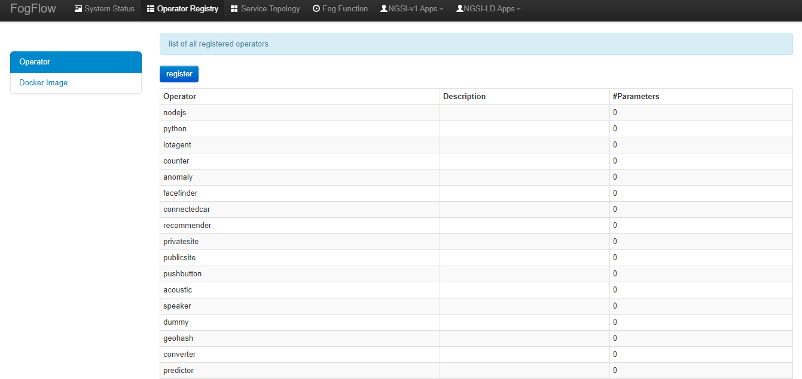
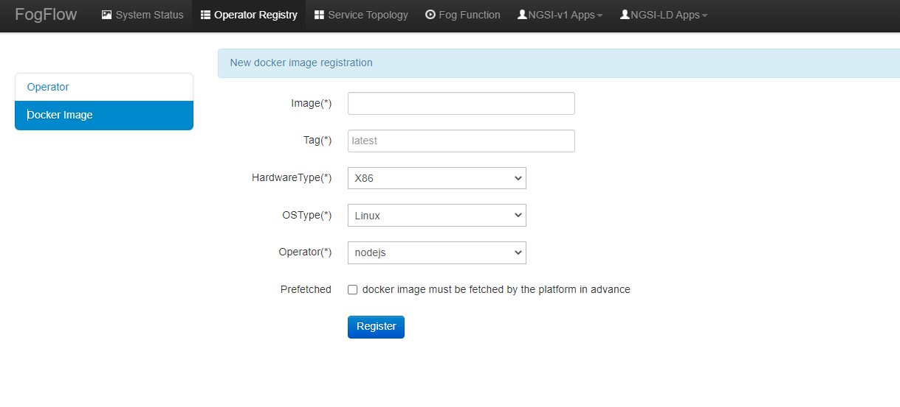
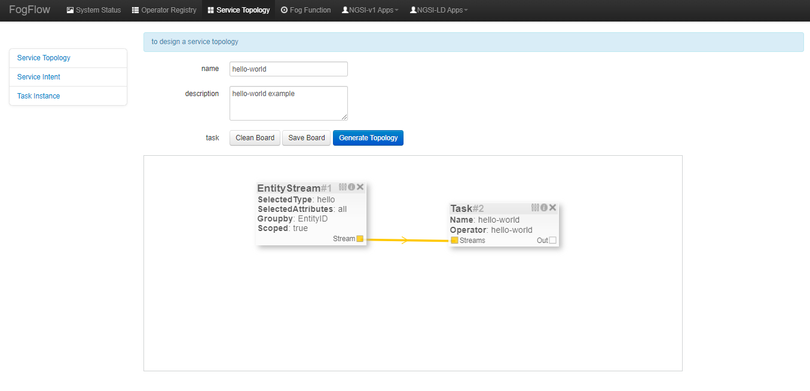

インテント モデル (Intent Model)
================================

次の図に示すように、インテント オブジェクト (Intent object) は基本的にこれらのプロパティで構成されます。

- サービス トポロジー (Serivce topology) は、インテント オブジェクトがトリガーされる計算ロジックを指定します。

- Geoscope は、入力ストリームを選択する必要がある地理的な場所として定義されます。ジオスコープはグローバル値として選択できるだけでなく、カスタム ジオスコープを設定することもできます。

- サービス レベル オブジェクト (Service Level Object - SLO) は、最大スループット、最小遅延、最小コストの目標であり、ワーカーでのタスク割り当てに設定できます。ただし、この機能はまだ完全にはサポートされていないため、ユーザーはこれを無視できます。今のところ "None" に設定できます。

- リソース使用量は、トポロジーがエッジ ノードのリソースをどのように使用できるかを定義します。それは排他的または包括的のいずれかです。排他的な方法では、トポロジーが他のトポロジーのタスクとリソースを共有しないことを意味します。一方、包括的トポロジーは、他のトポロジーのタスクとリソースを共有します。

.. figure:: ../../en/source/figures/intent_model.png

3つの重要な要素
=====================

IoT サービスをプログラムするための3つの重要な要素は、次の図に示されています。

.. figure:: ../../en/source/figures/key_elements.png

FogFlow では、複数のオペレーターがサービス トポロジーとして定義されるグラフを形成します。サービス トポロジー内の各オペレーターには、同じトポロジー内の他のタスクへの依存関係を示す入力と出力の注釈が付けられます。サービス トポロジーでは、さまざまなオペレーターを簡単に構成して、わずか数分でサービス ロジックを形成できます。その後、実行時に、サービス ユーザーによって定義された高レベルのデータ使用インテント (data usage intent) に基づいて、データ処理フローを自動的にトリガーできます。サービス ユーザーは、データ プロデューサーまたは結果コンシューマー (result consumers) のいずれかになります。

サービス トポロジーの "Hello-World" の例
===================================================

タスク オペレーターの登録
----------------------------------------------

**オペレーターを登録** して、オペレーターの名前と必要な入力パラメーターを定義します。 このコンテキストでは、オペレーターはいくつかのパラメーターを持つ名前付き要素に他なりません。
次の図は、登録されているすべてのオペレーターとそのパラメーター数のリストを示しています。

"register" ボタンをクリックすると、下にデザイン エリアが表示され、オペレーターを作成してパラメーターを追加できます。オペレーター "Hello-World" の名前を追加し、オペレーターの説明を追加します (オプションです)。パラメーター名を追加します。ここでは、hello と記述され、値がデフォルトとして設定されています。

.. figure:: ../../en/source/figures/register_operator3.png

**Docker イメージを登録し、オペレーターを選択して、** Docker イメージを定義し、すでに登録されているオペレーターをそれに関連付けます。

次の図は、登録されているすべての Docker イメージのリストと各イメージの重要な情報を示しています。

.. figure:: ../../en/source/figures/docker_image1.png

"register" ボタンをクリックすると、以下のようなフォームが表示されます。必要事項をご記入の上、"register" ボタンをクリックして登録してください。フォームは次のように説明されます。

* Image: オペレーター のDocker イメージの名前
* Tag: タグは、オペレーターのDockerイメージを公開するために使用されます。デフォルトでは "latest" です。
* Hardware Type: x86 または ARM (Raspberry Pi など) を含む、Docker イメージがサポートするハードウェア タイプです。
* OS Type: Docker イメージがサポートするオペレーティングシステム タイプ。現在、これは Linux のみに限定されています。
* Operator:  オペレーター名。一意である必要があり、サービス トポロジーを定義するときに使用されます。
* Prefetched: これがチェックされている場合、すべてのエッジ ノードがこの Docker イメージのフェッチを事前に開始することを意味します。それ以外の場合、オペレーターの Docker イメージは、エッジ ノードがこのオペレーターに関連付けられたスケジュールされたタスクを実行する必要がある場合にのみ、オンデマンドでフェッチされます。

.. important::
    
    Docker イメージの名前は、`Docker Hub`_ に公開されている名前と一致している必要があることに注意してください。デフォルトでは、FogFlow は、オペレーター用に Docker Hub に登録されている名前を使用して、必要な Docker イメージをフェッチします。
    
.. _`Docker Hub`: https://github.com/smartfog/fogflow/tree/master/application/operator/anomaly
    
    

"Hello-World" のサービストポロジーを定義してトリガー
------------------------------------------------------------

FogFlow Topology Editor を使用してサービス トポロジーを定義します。

図のように、以下の重要な情報を提供する必要があります。

#. 以下を含むトポロジー プロファイルを定義します。

    * topology name: トポロジーの一意の名前。
    * service description: このサービスの内容を説明するテキスト。

#. サービス トポロジー内のデータ処理フローのグラフを描画します。
    デザインボードのどこかを右クリックすると、メニューがポップアップ表示され、タスクまたは入力ストリームの選択を開始するか、データ処理フローを定義するためにシャッフルすることができます。

   
タスク プロファイルを指定するには、次の情報が必要です。
	
    * name: タスクの名前
    * operator: このタスクのデータ処理ロジックを実装するオペレーターの名前。リストから表示できるように、オペレーターを事前に登録する必要があります。
    * entity type of output streams: 生成された出力ストリームのエンティティ タイプを指定します。
    
    EntityStream プロファイルを指定するには、次の情報が必要です。

    * SelectedType：タスクによって入力ストリームとして選択されるエンティティ タイプを定義するために使用されます。

    * SelectedAttributes：タスクの状態を変更するために、選択されたエンティティ タイプのどの属性が考慮されるかを定義するために使用されます。

    * Groupby：このタスクのインスタンスをその場でいくつ作成するかを決定します。現在、以下のケースが含まれています。

        *  このタスク用に作成するインスタンスが1つしかない場合は、"groupby" = "all" を使用してください。
        *  入力ストリームのエンティティ ID ごとに1つのインスタンスを作成する必要がある場合は、"lgroupby" = "entityID" を使用してください。
        *  特定のコンテキスト メタデータの一意の値ごとに1つのインスタンスを作成する必要がある場合は、この登録済みコンテキスト メタデータの名前を使用してください
    
    
* Scoped: エンティティ データが場所固有 (location-specific) であるかどうかを示します。True は、場所固有のデータがエンティティに記録されていることを示し、False は、ブロードキャストされたデータの場合に使用されます。たとえば、特定の場所ではなく、すべての場所に当てはまるルールまたはしきい値データです。

    シャッフル要素 (Shuffling element) は、タスクの出力がシャッフル要素の入力であり、同じものがシャッフルによって入力として別のタスクに転送されるように、2つのタスク間のコネクタとして機能します。
    
    
    
インテントを送信してサービス トポロジーをトリガー
------------------------------------------------------------------------------

開発者が指定されたサービス トポロジーと実装されたオペレーターを送信すると、次の2つの手順でサービス データ処理ロジックをトリガーできます:

* サービス トポロジーを個別のタスクに分割する高レベルのインテント オブジェクトを送信します。0
* そのサービス トポロジーのタスクに入力ストリームを提供します。

インテント オブジェクトは、次のプロパティを持つ FogFlow ダッシュボードを使用して送信されます。

* Topology: インテント オブジェクトの対象となるトポロジーを指定します。
* Priority: トポロジー内のすべてのタスクの優先度レベルを定義します。これは、リソースをタスクに割り当てる方法を決定するためにエッジ ノードによって使用されます。
* Resource Usage: トポロジーがエッジ ノードのリソースをどのように使用できるかを定義します。排他的な方法で共有するということは、トポロジーが他のトポロジーのタスクとリソースを共有しないことを意味します。もう1つの方法は包括的です。
* Objective: 最大スループット、最小遅延、最小コストをワーカーでのタスク割り当てに設定できます。ただし、この機能はまだ完全にはサポートされていないため、現時点では "None" に設定できます。
* Geoscope: 入力ストリームを選択する必要がある定義済みの地理的領域 (defined geographical area) です。グローバル ジオスコープとカスタム ジオスコープを設定できます。

.. figure:: ../../en/source/figures/intent.png

FogFlow トポロジー マスターは、サービストポロジーに含まれるタスクの入力ストリームを待機します。インテント オブジェクト (Intent object) のスコープ内にあるコンテキスト データが受信されるとすぐに、最も近いワーカーでタスクが開始されます。
