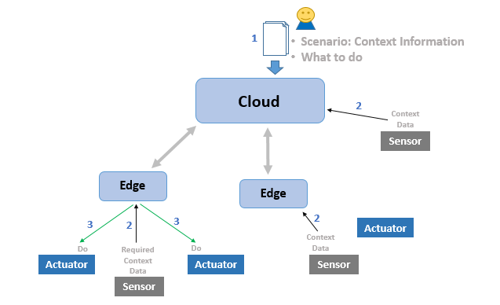

今日、スマートシティ、スマートインダストリー、およびコネクテッドカー向けの IoT インフラストラクチャ プロバイダーは、
さまざまな IoT サービス、特に低遅延を必要とするサービスをサポートするための地理分散インフラストラクチャを管理するために、
多くの複雑さと高い運用コストに直面しています。FogFlow は、クラウドとエッジ上で IoT サービスを動的に調整する分散実行
フレームワークであり、内部帯域幅の消費を削減し、低遅延と高速応答時間を提供します。

FogFlow は、高いスケーラビリティと信頼性を備えた自動化および最適化された IoT サービス オーケストレーションを提供する
ことにより、インフラストラクチャ プロバイダーが運用コストを大幅に削減するのを支援します。FogFlow は、サービス開発者と
システム インテグレーターが、開発コストを抑えて市場投入までの時間を短縮して IoT サービスを迅速に実現するためのインテント ベースのプログラミング モデル (Intent-based programming model) と開発ツールも提供します。

FogFlow システムの全体的なアーキテクチャ ビューを下の図に示します。インフラストラクチャ リソースは、クラウド、
エッジ ノード、センサー デバイス、およびアクチュエーターとして垂直に分割されます。データ分析などの計算集約型タスクは
クラウド サーバーで実行できますが、ストリーム処理などの一部のタスクはエッジ ノード (IoT ゲートウェイや計算機能を備えた
エンドポイント デバイスなど) に効果的に移動できます。センサーは、(さまざまなセンサー デバイスによって観測された)
観測データをエッジ ノードに存在するブローカーと共有し、エッジ ノードはロジックに基づいてこのデータを計算し、
アクチュエーターに応答を送信します。

モチベーション
===============================

FogFlow は IoT エッジ コンピューティング フレームワークであり、次の懸念に対処するように設計されています:

- クラウドのみのソリューションのコストは高すぎて、1000を超える地理分散デバイスで大規模なIoTシステムを実行できません。

- 多くの IoT サービスでは、エンド ツー エンドのレイテンシが10ミリ秒未満などの高速な応答時間が必要です。

- サービス プロバイダーは、クラウド エッジ環境で IoT サービスを迅速に設計および展開するために、非常に複雑でコストに直面しています。ビジネス需要は時間とともに急速に変化しており、サービス プロバイダーは、共有クラウド エッジ インフラストラクチャ上で新しいサービスを速いスピードで試してリリースする必要があります。

- 地理的に分散した ICT インフラストラクチャ上で IoT サービスを迅速に設計および展開するためのプログラミング モデルの欠如。

- さまざまなアプリケーション間でデータと派生した結果を共有および再利用するための相互運用性とオープン性の欠如。

FogFlow を使用すると、サービス プロバイダーは、最小限の開発労力で IoT サービスを簡単にプログラムでき、また、市場投入までの時間を短縮して新しい IoT サービスをリリースできます。一方、IoT プラットフォームのオペレーターにとって、FogFlow は、低運用コストと最適化された QoS を使用して、クラウドとエッジ上で遅延の影響を受けやすいIoT サービスをシームレスにサーバー化するのに役立ちます。

ハイレベル ビュー
===============================

FogFlow の独自の機能はコンテキスト駆動型 (**context-driven**) です。つまり、FogFlow は、次の3種類のコンテキストに基づいて、クラウドとエッジ上で動的なデータ処理フローを調整できます。

- System context: 時間の経過とともに変化する利用可能なリソース
    クラウド エッジ環境のリソースは本質的に地理的に分散しており、時間の経過とともに動的に変化します。
    クラウドコンピューティングと比較して、このようなクラウド エッジ環境のリソースはより **異質** で **動的** です。

- Data context: 生のセンサーデータと中間データの両方を含む、利用可能なデータの構造と登録されたメタデータ
    標準化され統合されたデータモデルと通信インターフェイス、
    つまり **NGSI** に基づいて、FogFlow は、データタイプ、属性、登録されたメタデータ、リレーション、および地理的位置など、
    システム内のセンサーおよびデータ処理タスクによって生成されたすべてのデータのコンテンツを表示できます。

- Usage context: すべての異なるタイプのユーザー (開発者、サービス コンシューマー、データ プロバイダー) によって定義され、達成したいことを指定する高レベルのインテント (high level intents)
    たとえば、サービス コンシューマーの場合、どのジオスコープ内のどのタイプの QoS でどのタイプの結果が期待されるかを
    指定できます。データ プロバイダーの場合、データを誰がどのように利用するかを指定できます。FogFlow では、実行時に
    ユーザーが定義できる目標を達成するために、オーケストレーションの決定が行われます。これらの新機能を有効にするために、
    より高度なアルゴリズムに取り組んでいます。

これらの3種類のコンテキストを活用することで、FogFlow はよりインテリジェントで自動的な方法で IoT サービスを調整できます。

.. image:: ../../en/source/figures/highlevelview.png

技術的メリット
===============================

次の図に示すように、FogFlow は、IoT サービスプロバイダーに標準ベースのデータ中心のエッジプログラミング モデルを提供し、
さまざまなビジネス需要に対応するサービスを簡単かつ迅速に実現します。FogFlow は、データ駆動型で最適化されたサービス
オーケストレーション メカニズムにより、インフラストラクチャ プロバイダーが都市規模の IoT サービスの数千のクラウド ノードと
エッジ ノードを自動的かつ効率的に管理して、最適化されたパフォーマンスを実現できるようにします。したがって、スマートシティや
スマートファクトリーなどの大規模な IoT プロジェクトでは、FogFlow は開発と運用のコストを節約し、生産性を向上させ、
市場投入までの時間を短縮し、スケーラビリティと信頼性を向上させることができます。

.. figure:: ../../en/source/figures/benefit.png

差別化
===============================

EdgeX、Azure IoT Edge、Amazon Greengrass などの他の既存の IoT エッジ コンピューティング フレームワークと比較して。
FogFlow には、次の図に示す次の固有の機能があります

- FogFlow のサービス オーケストレーションは、生のイベントやトピックではなく、コンテキストによって駆動されます。
    この機能は、すべてのブローカーで利用可能なエンティティ データの更新の概要を提供する新しいレイヤー、つまり
    IoT Discovery を導入する設計によって実現されます。イベントまたはトピックベースのオーケストレーションと比較して、
    FogFlow のコンテキスト ベースのオーケストレーションはより柔軟で軽量です。これは、FogFlow のオーケストレーションの
    決定が、関連するすべてのデータ ストリームを読み取ることなく、集約されたコンテキストに基づいて行うことができるため
    です。一方、FogFlow は、ユーザーが定義した高レベルの意図を考慮して、QoS を向上させるために最適化された
    オーケストレーションの決定を行います。

- FogFlow サービスとアプリケーションは、個々のエッジ ノードの観点からではなく、すべてのクラウド ノードとエッジ ノードのグローバルビューに対して設計されています。
    この設計原則により、必要な開発作業と管理オーバーヘッドを大幅に簡素化できます。特に、FogFlow は、クラウドとエッジ間、
    または異なるエッジ ノード間のタスク調整方法の詳細を知らなくても、すべてのクラウド ノードとエッジ ノード間でシームレスに
    実行できる分散アプリケーションをサポートできます。実行されます。ただし、他のほとんどの IoT エッジ コンピューティング
    フレームワークでは、サービスまたはアプリケーションはエッジごとに設計されており、実際には分散サービスまたは
    アプリケーションではありません。これらのサービスまたはアプリケーションはクラウドまたは一部のエッジで実行できますが、
    分散ファションのクラウド ノードとエッジ ノード上で実行することはできません。

.. figure:: ../../en/source/figures/comparison1.png

より詳細な区別は、次の表にまとめられています。

.. figure:: ../../en/source/figures/comparison2.png
