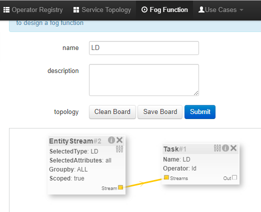

*****************************************
FogFlow を Scorpio Broker と統合
*****************************************

NGSI-LD アダプターは、FogFlow エコシステムがリンクト データをユーザーに提供できるように構築されています。`Scorpio Broker`_  は、NGSI-LD 仕様の最初のリファレンス実装で、FogFlow からリンクト データを受信するためにここで使用されています。

.. _`Scorpio Broker`: https://scorpio.readthedocs.io/en/latest/

次の図は、FogFlow からの NGSIv1 データを Scorpio Broker への NGSI-LD  データに変換する際に NGSI-LD アダプターがどのように機能するかを示しています。

.. figure:: ../../en/source/figures/ngsi-ld-adapter.png

1. ユーザーがサブスクリプション要求をアダプターに送信します。
2. 次に、アダプターはこの要求を FogFlow Broker に転送して、要求で指定されたコンテキスト データをサブスクライブします。
3. コンテキスト データの更新は FogFlow Broker で受信されます。
4. アダプターは、サブスクライブされたデータについて FogFlow Broker から通知を受け取ります。
5. アダプターは、受信したデータを NGSI-LD データ形式に変換し、Scorpio Broker に転送します。

NGSI-LD アダプターの実行
===============================================

**前提条件:**

* FogFlow は、少なくとも1つのノードで稼働している必要があります。
* Scorpio Broker が稼働している必要があります。

NGSI-LD アダプターは、以下に示すように FogFlow ダッシュボードを使用して FogFlow エコシステムで実行できます。

**オペレーターの登録:** FogFlow ダッシュボードのオペレーター レジストリーの "Operator" に移動します。以下に示すように、パラメーター要素を使用して新しいオペレーターを登録します。
   
   Name: service_port ; Value: 8888
   
   (この(`this`_) チュートリアルでは、ユーザーがすでに "REGISTER YOUR TASK OPERATORS" を完了していることを前提としています。)

.. _`this`: https://fogflow.readthedocs.io/en/latest/intent_based_program.html
   
**Docker イメージの登録:** オペレーター レジストリーの "DockerImage" に移動し、イメージ fogflow/ngsildadapter:latest を登録します。ドロップダウンからオペレーターを選択して、上記のオペレーターに関連付けます。ユーザーは、 `build`_ ファイルを編集して実行することにより、NGSI-LD アダプターのイメージをビルドすることもできます。

.. _`build`: https://github.com/smartfog/fogflow/blob/document-update/application/operator/NGSI-LD-Adapter/build

次の図に示すように、**フォグ ファンクションを登録** します。"SelectedType" で、このフォグ ファンクションをトリガーするために使用されるコンテキスト データのエンティティ タイプ ("LD" など) を指定します。ステップ#1 で登録したオペレーターをフォグ ファンクションのオペレーターとして選択します。

エンティティ タイプが "LD" (またはステップ#3で SelectedType として指定されているもの) として FogFlow Broker にアップデート要求を送信することにより、**フォグ ファンクションをトリガー** します。ロケーション メタデータとともに、属性に fogflowIP と ngbIP を含める必要があります。リクエストの例を以下に示します:

.. code-block:: console

    curl -iX POST \
      'http://<Fogflow-Broker-IP>:8070/ngsi10/updateContext' \
      -H 'Content-Type: application/json' \
      -d '
      {
        "contextElements": [
        {
            "entityId": {
            "id": "LD001",
            "type": "LD",
            "isPattern": false
            },
            "attributes": [
                 {
                     "name": "fogflowIP",
                     "type": "string",
                     "value": "<IP>"
                 },
                 {
                     "name": "ngbIP",
                     "type": "string",
                     "value": "<IP>"
                 }
             ],
             "domainMetadata": [
                 {
                     "name": "location",
                     "type": "point",
                     "value": {
                                  "latitude": 52,
                                  "longitude": 67
                     }
                 }
             ]
        }
        ],
        "updateAction": "UPDATE"
       }'

NGSI-LD アダプター タスクが作成され、ポート8888でリッスンします。ユーザーは、クラウド ノードまたはエッジ ノードのいずれか、上記のリクエストのメタデータで提供された場所に最も近い場所で実行されているタスクにタスクを一覧表示できます。

NGSI-LD アダプターの使用
===============================================

コンテキスト データ変換にNGSI-LD アダプターを使用するには、以下の手順に従います。

NGSI-LD アダプターに **サブスクリプション リクエストを送信** すると、同じリクエストが FogFlow Broker に転送されます。これは、FogFlow Broker へのアクセスがユーザーに直接利用できないためです。例のサブスクリプションリクエストは以下のとおりです:

.. code-block:: console

    curl -iX POST \
      'http://<LD-Adapter-Host-IP>:8888/subscribeContext' \
      -H 'Content-Type: application/json' \
      -d '
    {
      "entities": [
        {
          "id": "Temperature.*",
          "type": "Temperature",
          "isPattern": true
        }
      ],
      "attributes": [
        "temp"
      ],
      "restriction": {
        "scopes": [
          {
            "scopeType": "circle",
            "scopeValue": {
              "centerLatitude": 49.406393,
              "centerLongitude": 8.684208,
              "radius": 2000
            }
          }
        ]
      },
      "reference": "http://<LD-Adapter-Host-IP>:8888"
    }'

上記のサブスクリプションで定義されたタイプと属性のエンティティを使用して、FogFlow Broker に **アップデート リクエストを送信** します。リクエストの例を以下に示します:

.. code-block:: console

    curl -iX POST \
      'http://<Fogflow-Broker-IP>:8070/ngsi10/updateContext' \
      -H 'Content-Type: application/json' \
      -d '
      {
        "contextElements": [
          {
            "entityId": {
              "id": "Temperature001",
              "type": "Temperature",
              "isPattern": false
            },
            "attributes": [
              {
                "name": "temp",
                "type": "float",
                "value": 34
              }
            ],
            "domainMetadata": [
              {
              "name": "location",
              "type": "point",
              "value": {
                "latitude": 49.406393,
                "longitude": 8.684208
                }
              }
             ]
          }
        ],
        "updateAction": "UPDATE"
      }'

次の URL にアクセスして、NGSI-LD 形式のエンティティが Scorpio Broker で更新されているかどうかを確認します:  http://<Scorpio-Broker-IP:Port>/ngsi-ld/v1/entities?type=http://example.org/Temperature

次のコード ブロックは、変換されたコンテキスト データを示しています。

.. code-block:: console

    {"@context": ["https://schema.lab.fiware.org/ld/context", "https://uri.etsi.org/ngsi-ld/v1/ngsi-ld-core-context.jsonld",
    {"Temperature": "http://example.org/Temperature", "temp": "http://example.org/temp"}], "type": "Temperature", 
    "id": "urn:ngsi-ld:Temperature001", "temp": {"type": "Property", "value": 34}, "location": {"type": "GeoProperty", 
    "value": "{\"type\": \"point\", \"coordinates\": [49.406393, 8.684208]}"}}
