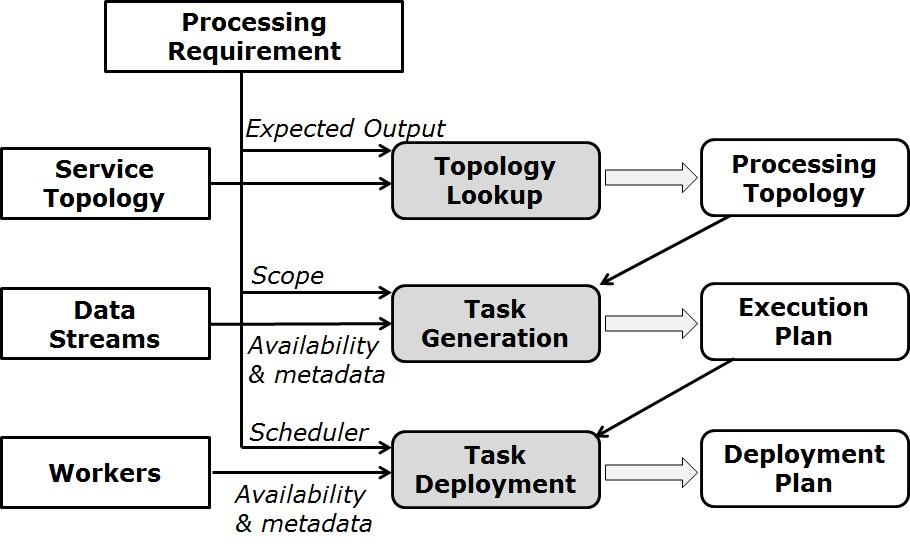

動的サービス オーケストレーション
================================

特定の処理要件に対して、トポロジー マスターは次の手順を実行して、クラウドとエッジ上でタスクを動的に調整します。

トポロジー ルックアップ
--------------------- 

期待される出力を生成するために、要求されたサービス トポロジーを反復処理して、処理ツリーを見つけます。この抽出された処理ツリーは、タスクの生成にさらに使用される、要求された処理トポロジーを表します。

タスクの生成
----------------

最初に IoT Discovery にクエリを実行して、利用可能なすべての入力ストリームを検出し、次にこの検出とサービス トポロジーの宣言型ヒントに基づいて実行プランを導き出します。実行プランには、適切な入力ストリームと出力ストリームで適切に構成されたすべての生成されたタスクと、ワーカーがタスクをインスタンス化するためのパラメーターが含まれています。

タスクの展開
----------------

指定されたスケジューリング方法を実行して、生成されたタスクを、使用可能な計算機能に従って地理的に分散されたワーカーに割り当てます。導出された割り当て結果は、展開計画を表します。展開計画を実行するために、TM は各タスクをタスクに割り当てられたワーカーに送信してから、タスクのステータスを監視します。各ワーカーは割り当てられたタスクを受け取り、Docker コンテナーでそれらをインスタンス化します。一方、ワーカーは近くの IoT Broker と通信して、起動されたタスク インスタンスが入力ストリームと出力ストリームを確立するのを支援します。
