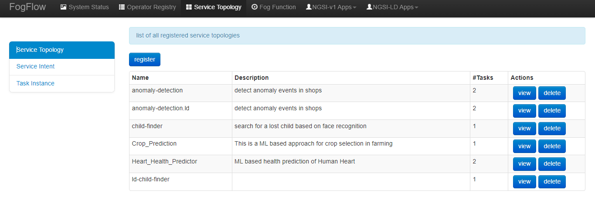

.. _cloud-setup:

*****************************************
システム セットアップ
*****************************************

前提条件
=================

FogFlow を起動するための前提条件のコマンドは次のとおりです:

1. docker

2. docker-compose

Ubuntu 16.04 の場合、docker-ce と docker-compose をインストールする必要があります。

Docker CE をインストールするには、`Install Docker CE`_ を参照してください。必要なバージョン > 18.03.1-ce です。

.. important:: 
	**また、ユーザーが sudo なしで Docker コマンドを実行できるようにしてください。**

Docker Compose をインストールするには、`Install Docker Compose`_ を参照してください。必要なバージョン> 2.4.2 です。

.. _`Install Docker CE`: https://www.digitalocean.com/community/tutorials/how-to-install-and-use-docker-on-ubuntu-16-04
.. _`Install Docker Compose`: https://www.digitalocean.com/community/tutorials/how-to-install-docker-compose-on-ubuntu-16-04

FogFlow クラウド ノードを起動
=============================

必要なすべてのスクリプトを取得
---------------------------------

以下のように docker-compose ファイルと構成ファイルをダウンロードします。

.. code-block:: console    

	# the docker-compose file to start all FogFlow components on the cloud node
	wget https://raw.githubusercontent.com/smartfog/fogflow/master/release/3.2/cloud/docker-compose.yml

	# the configuration file used by all FogFlow components
	wget https://raw.githubusercontent.com/smartfog/fogflow/master/release/3.2/cloud/config.json

	# the configuration file used by the nginx proxy
	wget https://raw.githubusercontent.com/smartfog/fogflow/master/release/3.2/cloud/nginx.conf
	

IP 構成を変更
---------------------------------------------

ご使用の環境に応じて、config.json で以下の IP アドレスを変更する必要があります。

- **my_hostip**: FogFlow クラウド ノードの IP とこの IP アドレスは、FogFlow エッジ ノードからアクセス可能である必要があります。これには "127.0.0.1" を使用しないでください。

- **site_id**: 各 FogFlow ノード (クラウド ノードまたはエッジ ノード) は、システム内で自身を識別するために一意の文字列ベースの ID を持っている必要があります。

- **physical_location**: FogFlow ノードの地理的位置。

- **worker.capacity**: FogFlow ノードが呼び出すことができる Docker コンテナーの最大数を意味します。

Elasticsearch と Metricbeat の IP 構成を変更
---------------------------------------------------------------------------

ご使用の環境に応じて、docker-compose.yml の次の IP アドレスを変更する必要があります。

- **output.elasticsearch.hosts**: metricbeat が csv 形式でデータを共有する elasticsearch のホストの場所です。

また、ご使用の環境に応じて、metricbeat.docker.yml の次の IP アドレスを変更する必要があります。

- **name**: Grafana metric ダッシュボードのエッジ ノードからのクラウド ノードの一意性に付けられた名前です。IP アドレスの代わりに任意の名前を指定できます。

- **hosts**: Elasticsearch データベースのホストの場所であり、metricbeat がメトリックデータを共有します。

.. important:: 

        **my_hostip** の IP アドレスとして "127.0.0.1" を使用しないでください。これらは Docker コンテナ内で実行中のタスクによって使用されます。
	
	**Firewall rules:** external_ip を介して FogFlow Web ポータルにアクセスできるようにします。次のポートも開いている必要があります: TCP の場合は80 および 5672

FogFlow Cloud Node ですべてのコンポーネントを起動
------------------------------------------------------

すべての FogFlow コンポーネントの Docker イメージをプルし、FogFlow システムを起動します。

.. code-block:: console    

    # if you already download the docker images of FogFlow components, this command can fetch the updated images
	docker-compose pull  

	docker-compose up -d

セットアップを検証
----------------------------------

FogFlow クラウド ノードが正しく開始されているかどうかを確認するには、次の2つの方法があります:

- "docker ps -a" を使用して、すべてのコンテナーが稼働していることを確認します。

.. code-block:: console    

	docker ps -a
	
	CONTAINER ID      IMAGE                       COMMAND                  CREATED             STATUS              PORTS                                                 NAMES
	90868b310608      nginx:latest            "nginx -g 'daemon of…"   5 seconds ago       Up 3 seconds        0.0.0.0:80->80/tcp                                       fogflow_nginx_1
	d4fd1aee2655      fogflow/worker          "/worker"                6 seconds ago       Up 2 seconds                                                                 fogflow_cloud_worker_1
	428e69bf5998      fogflow/master          "/master"                6 seconds ago       Up 4 seconds        0.0.0.0:1060->1060/tcp                               fogflow_master_1
	9da1124a43b4      fogflow/designer        "node main.js"           7 seconds ago       Up 5 seconds        0.0.0.0:1030->1030/tcp, 0.0.0.0:8080->8080/tcp       fogflow_designer_1
	bb8e25e5a75d      fogflow/broker          "/broker"                9 seconds ago       Up 7 seconds        0.0.0.0:8070->8070/tcp                               fogflow_cloud_broker_1
	7f3ce330c204      rabbitmq:3              "docker-entrypoint.s…"   10 seconds ago      Up 6 seconds        4369/tcp, 5671/tcp, 25672/tcp, 0.0.0.0:5672->5672/tcp     fogflow_rabbitmq_1
	9e95c55a1eb7      fogflow/discovery       "/discovery"             10 seconds ago      Up 8 seconds        0.0.0.0:8090->8090/tcp                               fogflow_discovery_1
        399958d8d88a      grafana/grafana:6.5.0   "/run.sh"                29 seconds ago      Up 27 seconds       0.0.0.0:3003->3000/tcp                               fogflow_grafana_1
        9f99315a1a1d      fogflow/elasticsearch:7.5.1 "/usr/local/bin/dock…" 32 seconds ago    Up 29 seconds       0.0.0.0:9200->9200/tcp, 0.0.0.0:9300->9300/tcp       fogflow_elasticsearch_1
        57eac616a67e      fogflow/metricbeat:7.6.0 "/usr/local/bin/dock…"   32 seconds ago     Up 29 seconds                                                                  fogflow_metricbeat_1
	
	
.. important:: 

        不足しているコンテナーがある場合は、"docker ps -a" を実行して、FogFlow コンポーネントが何らかの問題で終了していないかどうかを確認できます。ある場合は、"docker logs [container ID]" を実行して、出力ログをさらに確認できます。

- FogFlow DashBoard からシステム ステータスを確認します。

Web ブラウザで FogFlow ダッシュボードを開くと、次の URL を介して現在のシステム ステータスを確認できます: http://<coreservice_ip>/index.html

.. important:: 

        FogFlow クラウド ノードがゲートウェイの背後にある場合は、ゲートウェイ IP から coreservice_ip へのマッピングを作成してから、ゲートウェイ IP を介して FogFlow ダッシュボードにアクセスする必要があります。
        FogFlow クラウド ノードが AzureCloud、Google Cloud、Amazon Cloud などのパブリッククラウド内の VM である場合は、VM のパブリック IP を介して FogFlow ダッシュボードにアクセスする必要があります。

FogFlow ダッシュボードにアクセスできるようになると、次の Web ページが表示されます:

.. figure:: ../../en/source/figures/dashboard.png

Grafana ダッシュボードで Elasticsearch を構成
-------------------------------------------------------------

Grafana ダッシュボードは Web ブラウザーからアクセスでき、URL: http://<output.elasticsearch.hosts>:3003/ を介して現在のシステム ステータスを確認できます。Grafana ログインのデフォルトのユーザー名とパスワードは、それぞれ admin と admin です。

- Grafana に正常にログインしたら、ホームダッシュボードの "Create your first data source" をクリックして、データソースを設定します。

- Add Data Sourch ページから Elasticsearch を選択します。これで、下の図と同じページの Data Sources/Elasticsearch が表示されます。

.. figure:: ../../en/source/figures/Elastic_config.png

1. データソースに名前を付けます。
2. HTTP の詳細で、elasticsearch とポートの URL に言及します。URL には HTTP を含める必要があります。
3. Access で Server(default) を選択します。URL は、Grafana バックエンド/サーバーからアクセスできる必要があります。
4. Elasticsearch の詳細で、Time フィールド名に @timestamp を入力します。ここで、時間フィールドのデフォルトを Elasticsearch インデックスの名前で指定できます。インデックス名またはワイルドカードには時間パターンを使用します。
5. Elasticsearch バージョンを選択します。

次に、"Save & Test" ボタンをクリックします。

Metricbeat を設定
---------------------------------------------

- 以下のように、metricbeat.docker.yml ファイルの Elasticsearch の詳細を変更します:

.. code-block:: json

        name: "<155.54.239.141_cloud>"
        metricbeat.modules:
        - module: docker
          #Docker module parameters that has to be monitored based on user requirement, example as below
          metricsets: ["cpu","memory","network"]
          hosts: ["unix:///var/run/docker.sock"]
          period: 10s
          enabled: true
        - module: system
          #System module parameters that has to be monitored based on user requirement, example as below
          metricsets: ["cpu","load","memory","network"]
          period: 10s

        output.elasticsearch:
          hosts: '155.54.239.141:9200'
	  
	  
既存の IoT サービスを試す
-------------------------------------

FogFlow クラウド ノードがセットアップされると、FogFlow エッジ ノードを実行せずに既存の IoT サービスを試すことができます。たとえば、次のような簡単なフォグ ファンクションを試すことができます。

- 上部のナビゲーター バーにある "Operator Registry" をクリックして、事前定義されたオペレーターの初期化をトリガーします。

最初に "Operator Registry" をクリックすると、事前定義されたオペレーターのリストが FogFlow システムに登録されます。2回クリックすると、次の図に示すように、更新されたリストが表示されます。

.. figure:: ../../en/source/figures/operator-list.png

- 上部のナビゲーター バーで "Service Topology" をクリックして、事前定義されたサービス トポロジーの初期化をトリガーします。

最初に "Service Topology" をクリックすると、事前定義されたトポロジーのリストが FogFlow システムに登録されます。2回クリックすると、次の図に示すように、更新されたリストが表示されます。

- 上部のナビゲーターバーの "Fog Function" をクリックして、事前定義されたフォグ ファンクションの初期化をトリガーします。

最初に "Fog Function" をクリックすると、事前定義されたファンクションのリストが FogFlow システムに登録されます。2回クリックすると、次の図に示すように、更新されたリストが表示されます。

.. figure:: ../../en/source/figures/function-list.png

- フォグ ファンクションをトリガーする IoT デバイス エンティティを作成します。

デバイス登録ページ (device registration pag) からデバイス エンティティを登録できます:

1) "System Status" をクリックします。
2) "Device" をクリックします。
3) "Add" をクリックします。

次に、次のデバイス登録ページが表示されます。

.. figure:: ../../en/source/figures/device-registration.png

- フォグ ファンクションがトリガーされているかどうかを確認します

システム管理 (System Management) の "Task" の下にタスクが作成されているかどうかを確認します。

.. figure:: ../../en/source/figures/fog-function-task-running.png

システム管理の "Stream" の下にストリームが作成されているかどうかを確認します。

.. figure:: ../../en/source/figures/fog-function-streams.png

FogFlow エッジ ノードを開始
==========================

通常、FogFlow エッジ ノードは、Worker、IoT Broker、およびシステム監視エージェントの metricbeat をデプロイする必要があります。
エッジ ノードの Edge IoT Broker は、同じエッジ ノードで起動されたすべてのタスク インスタンス間のデータ フローを確立できます。
ただし、この Edge IoT Broker はオプションです。特に、エッジ ノードが非常に制約のあるデバイスであり、データに依存せずにいくつかのタスクしかサポートできない場合はそうです。

FogFlow エッジ ノードを開始する手順は次のとおりです:

Docker Engine をインストール
----------------------------

Docker CE と Docker Compose をインストールするには、Respberry Pi へのDocker CE と Docker Compose のインストール (`Install Docker CE and Docker Compose on Respberry Pi`_)を参照してください。

.. _`Install Docker CE and Docker Compose on Respberry Pi`: https://withblue.ink/2019/07/13/yes-you-can-run-docker-on-raspbian.html

.. note:: FogFlow のすべてのタスク インスタンスは Docker コンテナー内で起動されるため、Docker エンジンを各エッジ ノードにインストールする必要があります。

デプロイメント スクリプトをダウンロード
-------------------------------------------------

.. code-block:: console    
         
	#download the deployment scripts
	wget https://raw.githubusercontent.com/smartfog/fogflow/master/docker/edge/http/start.sh
	wget https://raw.githubusercontent.com/smartfog/fogflow/master/docker/edge/http/stop.sh 
	wget https://raw.githubusercontent.com/smartfog/fogflow/master/docker/edge/http/metricbeat.docker.yml
	
	#make them executable
	chmod +x start.sh  stop.sh       

デフォルトの構成ファイルをダウンロード
-------------------------------------------------

.. code-block:: console   
         	
	#download the configuration file          
	wget https://raw.githubusercontent.com/smartfog/fogflow/master/docker/edge/http/config.json

構成ファイルを変更
-------------------------------------------------

簡単なテストにはデフォルト設定を使用できますが、ご使用の環境に応じて次のアドレスを変更する必要があります:
        
- **coreservice_ip**: クラウド ノードで実行されている FogFlow コア サービスのアクセス可能な IP アドレスです。 クラウド部分の構成を参照してください。
- **external_hostip**: これは外部 IP アドレスであり、Cloud Broker がアクセスできます。エッジ ノードが NAT の背後にある場合に役立ちます。
- **my_hostip** は、デフォルトの Docker ブリッジの IP であり、ホストの "docker0" ネットワーク インターフェイスです。
- **site_id**: エッジ ノードのユーザー定義 ID です。そのノードの Broekr IDs とWorker IDs は、この Site ID に従って形成されます。
- **container_autoremove**: タスクに関連付けられたコンテナーが、その処理が完了すると削除されるように構成するために使用されます。
- **start_actual_task**: 最小限の労力を実行する代わりに、タスクの開始または終了、または実行中のタスクの維持に必要なすべてのアクティビティをタスク構成とともに含めるように FogFlow Worker を構成します。True に保つことをお勧めします。
- **capacity**: FogFlow ノードが呼び出すことができる Docker コンテナーの最大数です。ユーザーは、ノードでのリソースの可用性を考慮して制限を設定できます。

.. code-block:: json

    //you can see the following part in the default configuration file
    { 
        "coreservice_ip": "155.54.239.141", 
        "external_hostip": "35.234.116.177", 
        "my_hostip": "172.17.0.1", 
        
	
	"site_id": "002",
	
	
	"worker": {
        "container_autoremove": false,
        "start_actual_task": true,
        "capacity": 4
	}
	
	
    } 

Metricbeat 構成ファイルを変更
-----------------------------------------------------------

使用する環境に応じて、start.sh の次のアドレスを変更する必要があります;

- **output.elasticsearch.hosts**: これは、metricbeat がメトリックデータを共有する elasticsearch ホストの IP アドレスです。

- 以下のように、metricbeat.docker.yml ファイルの Elasticsearch の詳細を変更します。

.. code-block:: json

        name: "<155.54.239.141/edge02>"
        metricbeat.modules:
        - module: docker
          #Docker module parameters to monitor based on user requirement,example as below
          metricsets: ["cpu","memory","network"]
          hosts: ["unix:///var/run/docker.sock"]
          period: 10s
          enabled: true
        - module: system
          #System module parameters to monitor based on user requirement, example as below
          metricsets: ["cpu","load","memory","network"]
          period: 10s

        output.elasticsearch:
          hosts: '155.54.239.141:9200'
	  

エッジ ノード コンポーネントを開始
-------------------------------------------------

.. note:: エッジ ノードが ARM ベースの場合、コマンド パラメーターとして arm を追加してください。

.. code-block:: console    

      #start both components in the same script
      ./start.sh 
    
      #if the edge node is ARM-basd, please attach arm as the command parameter
      #./start.sh  arm
      

エッジ ノード コンポーネントの停止
-------------------------------------------------

.. code-block:: console    

	#stop both components in the same script
	./stop.sh 
